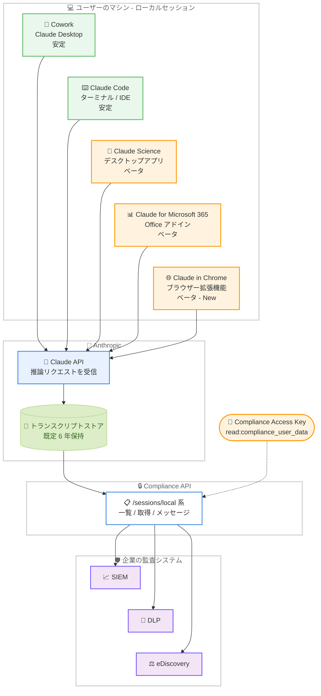

# Compliance API のローカルセッションエンドポイントが Claude in Chrome セッションに対応 (ベータ)

## メタデータ

| 項目 | 内容 |
|------|------|
| 発表日 | 2026-09-18 |
| ソース | Claude Developer Platform Release Notes |
| カテゴリ | Claude API / エンタープライズ / コンプライアンス |
| 公式リンク | https://platform.claude.com/docs/en/release-notes/overview |

## 概要

Anthropic は 2026 年 9 月 18 日、Claude Developer Platform のリリースノートで、Compliance API のローカルセッションエンドポイントが Claude in Chrome セッションのトランスクリプトも返すようになったことを発表した。対象は Claude in Chrome ブラウザー拡張機能の組み込みチャットで、レスポンス上は `product_surface` 値 `claude_in_chrome` で識別される。

この機能は Claude Enterprise 組織向けのベータとして提供され、既存の Compliance Access Key と `read:compliance_user_data` スコープでそのまま利用できる。新しいキー、スコープ、設定、クライアントの更新はいずれも不要である。

これにより、Compliance API のローカルセッション監査は Cowork / Claude Code (安定)、Claude Science / Claude for Microsoft 365 (ベータ) に続き、「ブラウザー内での Claude 利用」という新しい業務領域へカバレッジを広げたことになる。

## 詳細

### 背景

Compliance API のセッションエンドポイントは、Claude Enterprise 組織のユーザーが Claude アプリやエージェントで実行したセッションのトランスクリプトを、eDiscovery エクスポートや DLP 連携のために提供する仕組みである。カバレッジは以下のように段階的に拡大されてきた。

| 日付 | 変更内容 |
|------|---------|
| 2026-08-11 | ローカルセッションエンドポイント (`/v1/compliance/apps/sessions/local` 系) がベータ追加。Cowork (Claude Desktop) と Claude Code に対応 |
| 2026-08-26 | Cowork / Claude Code セッションが GA。Claude Science (`claude_science`) と Claude for Microsoft 365 (`office_agents` 系) がベータ追加 |
| 2026-09-18 | **Claude in Chrome (`claude_in_chrome`) がベータ追加** (今回) |

詳細は [Compliance API ローカルセッション対応 (2026-08-11)](2026-08-11-compliance-api-local-sessions.md) および [Compliance API セッションエンドポイント GA (2026-08-26)](2026-08-26-compliance-api-sessions-ga.md) のレポートを参照。

Claude in Chrome は、Chrome ブラウザー上で Claude がページの閲覧やフォーム入力などを行えるブラウザー拡張機能である。エンタープライズ環境では、ユーザーが業務システムや社内 Web アプリを扱う場面で利用されるため、監査証跡の取得は Cowork や Claude Code と同様に重要な要件となる。今回の対応により、この領域が Compliance API のカバレッジに含まれた。

### 主な変更点

#### Claude in Chrome セッションのトランスクリプト取得 (ベータ)

公式ドキュメントのプロダクト対応表に Claude in Chrome の行が追加され、以下の構成となった。

| プロダクトと実行場所 | エンドポイントファミリー | `product_surface` | 提供状態 |
|--------------------|----------------------|-------------------|---------|
| Cowork (Claude Desktop、ユーザーのマシン上) | ローカル | `cowork` | 安定 |
| Claude Code (ターミナル / Claude Desktop / IDE 拡張、ユーザーのマシン上) | ローカル | `claude_code` | 安定 |
| Claude Science デスクトップアプリ (ユーザーのマシン上) | ローカル | `claude_science` | ベータ |
| Claude for Microsoft 365 (Excel、PowerPoint、Word、Outlook のアドイン) | ローカル | `office_agents/excel` など | ベータ |
| **Claude in Chrome (ブラウザー拡張機能の組み込みチャット、ユーザーのマシン上)** | **ローカル** | **`claude_in_chrome`** | **ベータ** |
| Cowork (claude.ai Web / モバイル開始、Anthropic 管理のクラウド環境) | リモート | `cowork_remote` | 安定 |

公式ドキュメントは対象を「the browser extension's built-in chat」(ブラウザー拡張機能の組み込みチャット) と明記している。既存の 3 つのローカルセッションエンドポイントがそのまま Claude in Chrome セッションを返す。

| エンドポイント | 役割 |
|---------------|------|
| `GET /v1/compliance/apps/sessions/local` | セッションメタデータの一覧 |
| `GET /v1/compliance/apps/sessions/local/{session_id}` | 単一セッションのメタデータ取得 |
| `GET /v1/compliance/apps/sessions/local/{session_id}/messages` | セッションのトランスクリプト取得 |

#### 追加設定は不要

公式ドキュメントは「no new key, scope, setting, or client update is required」と明記している。既存の Compliance Access Key (`read:compliance_user_data` スコープ) を使ったインテグレーションであれば、Claude in Chrome セッションは一覧とトランスクリプトに自動的に現れる。

### 技術的な詳細

#### キャプチャの仕組みと範囲

ローカルセッションの共通仕様どおり、Anthropic は各会話をリクエストが Claude API に到達した時点でサーバーサイドに記録する。デバイスへのインストールは不要で、クライアントが Claude API に送信するリクエスト以外は収集されない。

この仕組みは Claude in Chrome において特に重要な意味を持つ。公式ドキュメントは「Local session transcripts show what Claude was asked to do and what it returned, not what happened on the device」と明記しており、以下のように整理できる。

- トランスクリプトに現れるのは「Claude への依頼内容」と「Claude が返した内容」である
- ブラウザー上の操作 (ページ閲覧、クリック、フォーム入力など) は、トランスクリプト内のツール呼び出しとツール結果を通じて見える範囲に限られる
- API に到達しなかった活動 (たとえばセッションが送信しなかったページ内容) はキャプチャされない
- 画像やスクリーンショットなどのバイナリブロックは返らず、`[image content not shown]` のようなプレースホルダーに置き換えられる

つまり、Claude in Chrome のトランスクリプトは「ブラウザーの完全な操作ログ」ではなく「Claude とのやり取りの記録」である。ブラウザー操作そのものの網羅的な監視が必要な場合は、別のエンドポイント監視手段との併用を検討する必要がある。

#### セッションオブジェクトの形式

Claude in Chrome セッションは他のローカルセッションと同じ `compliance_local_session` オブジェクトとして返る。

- `id` は `clls_` 接頭辞。不透明な文字列として扱う
- `product_surface` が `claude_in_chrome` になる
- `created_at` はセッション内で保持されている最古の推論呼び出し、`updated_at` は最後の呼び出しのタイムスタンプ (いずれも UTC)
- `status` はなく、可視性は保持期間で決まる
- `user.id` は常に設定され、アカウント削除後も残る

#### 一覧のフィルターとポーリング (変更なし)

一覧エンドポイントの仕様に変更はない。組織 / ユーザーフィルターはなく、`created_at.gte` / `created_at.lt` / `updated_at.gte` (RFC 3339、UTC オフセット必須) で時間範囲を絞り込む。`product_surface` によるサーバーサイドフィルターはないため、Claude in Chrome セッションのみを対象としたい場合はクライアント側で振り分ける。

増分エクスポートは既存のベストプラクティスがそのまま適用される。各実行の `updated_at.gte` を前回実行の開始時刻より数分前に設定してオーバーラップさせ、セッションとメッセージを `id` で重複排除する。

#### キャプチャされないケース (変更なし)

以下は他のローカルセッションと同様に対象外である。

- HIPAA readiness を有効化した組織のローカルセッション (データが一切収集されない)
- ゼロデータ保持 (ZDR) が適用されるセッション (一覧から除外され、取得 / メッセージエンドポイントは 404 を返す)
- キャプチャは Claude Enterprise アカウントでサインインしている間の利用に適用される

#### 保持期間 (変更なし)

キャプチャされたローカルセッションコンテンツは既定でキャプチャから 6 年間保存される。組織が有限のカスタム会話保持期間を設定している場合はその期間 (複数ある場合は最短) が適用される。セッションエンドポイントは読み取り専用であり、API 経由での削除はできない。

## 開発者への影響

### 対象

- **コンプライアンス / eDiscovery 担当者**: ブラウザー上での Claude 利用を証跡として取得する必要がある担当者
- **セキュリティチーム**: SIEM や DLP にセッショントランスクリプトを取り込み、Web アプリ上の機微情報 (顧客データ、社内システムの内容など) を扱うセッションを監視する担当者
- **Compliance API のインテグレーション実装者**: `product_surface` の振り分けロジックを保守する開発者
- **Claude Enterprise 管理者**: Claude in Chrome の組織展開に際して、監査カバレッジを整理する管理者

### 必要なアクション

1. **新しい `product_surface` 値への対応**: `claude_in_chrome` をハンドラーに追加する。前方互換の原則どおり、未知の値もそのまま通過させる実装を維持する
2. **既存インテグレーションの確認**: 追加設定は不要だが、既存のエクスポートパイプラインに Claude in Chrome セッションが流入し始めるため、ダッシュボードや集計の分類を確認する
3. **カバレッジの限界の周知**: トランスクリプトは Claude API に到達したリクエストの記録であり、ブラウザー操作の完全なログではないことを、監査要件の関係者に共有する
4. **機微情報の取り扱い**: Web ページの内容がツール結果としてトランスクリプトに含まれる場合があり、URL、認証情報、個人データはマスクされない。トランスクリプト自体を機微情報として扱う
5. **ベータであることの考慮**: Claude in Chrome のカバレッジはベータであり、仕様が変わる可能性がある。本番の監査要件に組み込む場合はその前提を明示する

### 移行ガイド (該当する場合)

既存のローカルセッションインテグレーションへの破壊的変更はない。エンドポイント URL、認証、フィルター、ページング、レスポンス形式はすべて従来どおりで、`product_surface` に新しい値 `claude_in_chrome` が現れるのみである。2026 年 8 月 26 日時点のドキュメントが推奨する前方互換なハンドラー (未知の `product_surface` 値の通過) を実装済みであれば、コード変更なしで動作する。

## コード例

### Claude in Chrome セッションの一覧取得

```bash
# ローカルセッション一覧。product_surface のサーバーサイドフィルターはないため
# クライアント側で claude_in_chrome を振り分ける
curl --fail-with-body -sS -G \
  "https://api.anthropic.com/v1/compliance/apps/sessions/local" \
  --header "x-api-key: $ANTHROPIC_COMPLIANCE_ACCESS_KEY" \
  --header "anthropic-version: 2023-06-01" \
  --data-urlencode "created_at.gte=2026-09-18T00:00:00Z" \
  --data-urlencode "limit=500"
```

### `product_surface` 別の振り分け (claude_in_chrome を追加)

```python
# claude_in_chrome を含めて振り分ける。未知の値はそのまま通過させる (前方互換)
def classify_session(session: dict) -> str:
    surface = session.get("product_surface")
    if surface is None:
        return "unknown"
    if surface == "cowork":
        return "cowork_desktop"
    if surface == "claude_code":
        return "claude_code"
    if surface == "claude_science":
        return "claude_science"  # ベータ
    if surface == "claude_in_chrome":
        return "claude_in_chrome"  # ベータ。ブラウザー拡張機能の組み込みチャット
    if surface == "office_agents" or surface.startswith("office_agents/"):
        return "microsoft_365"  # ベータ
    return f"unrecognized:{surface}"  # 落とさずに通過させる
```

### Claude in Chrome セッションのトランスクリプト取得

```bash
# メッセージエンドポイント。limit は既定 100、最大 1,000
# 画像などのバイナリブロックはプレースホルダーに置き換えられる
session_id="clls_01HxKpLmNoPqRsTuVwXyZaBc"

curl --fail-with-body -sS -G \
  "https://api.anthropic.com/v1/compliance/apps/sessions/local/$session_id/messages" \
  --header "x-api-key: $ANTHROPIC_COMPLIANCE_ACCESS_KEY" \
  --header "anthropic-version: 2023-06-01" \
  --data-urlencode "limit=1000" \
  --data-urlencode "tool_use_input_max_bytes=-1" \
  --data-urlencode "tool_result_max_bytes=-1"
```

## アーキテクチャ図



## 関連リンク

- [Claude Developer Platform Release Notes](https://platform.claude.com/docs/en/release-notes/overview)
- [Retrieve session transcripts](https://platform.claude.com/docs/en/manage-claude/compliance-sessions)
- [Retrieve local sessions](https://platform.claude.com/docs/en/manage-claude/compliance-sessions#retrieve-local-sessions)
- [Retrieve a local session transcript](https://platform.claude.com/docs/en/manage-claude/compliance-sessions#retrieve-a-local-session-transcript)
- [Set up the Compliance API](https://platform.claude.com/docs/en/manage-claude/compliance-api-access)
- [Compliance API errors](https://platform.claude.com/docs/en/manage-claude/compliance-errors)
- [Compliance API FAQ](https://platform.claude.com/docs/en/manage-claude/compliance-faq#data-coverage-and-retention)
- [Compliance API reference](https://platform.claude.com/docs/en/api/compliance/apps)
- [API and data retention](https://platform.claude.com/docs/en/manage-claude/api-and-data-retention)
- [関連レポート: Compliance API ローカルセッション対応 (2026-08-11)](2026-08-11-compliance-api-local-sessions.md)
- [関連レポート: Compliance API セッションエンドポイント GA (2026-08-26)](2026-08-26-compliance-api-sessions-ga.md)

## まとめ

2026 年 9 月 18 日の発表は、Compliance API のローカルセッション監査を「ブラウザー内での Claude 利用」に広げるものである。

- **Claude in Chrome セッションが監査カバレッジに加わった**: ブラウザー拡張機能の組み込みチャットのトランスクリプトが、既存の 3 つのローカルセッションエンドポイントから `product_surface` 値 `claude_in_chrome` として取得できる。Claude Enterprise 組織向けのベータ提供である
- **追加設定は一切不要である**: 既存の Compliance Access Key と `read:compliance_user_data` スコープでそのまま利用できる。前方互換なハンドラーを実装済みであれば、コード変更なしで新しいセッションが流入する
- **トランスクリプトは Claude とのやり取りの記録である**: キャプチャはリクエストが Claude API に到達した時点でサーバーサイドに行われ、ブラウザー操作そのものは対象外である。API に到達しなかったページ内容は含まれず、画像はプレースホルダーに置き換えられる。ブラウザー操作の完全な監視が必要な場合は別手段との併用を検討する
- **カバレッジ拡大のパターンが確立した**: 2026 年 8 月 11 日のベータ開始以降、Cowork / Claude Code の GA (8 月 26 日)、Claude Science / Microsoft 365 の追加 (同日)、Claude in Chrome の追加 (今回) と、約 1 か月で対象プロダクトが 5 つに拡大した。ドキュメントは「カバレッジ拡大に伴い新しい `product_surface` 値が追加される」と明記しており、未知の値を通過させる前方互換な実装の維持が引き続き要点となる
