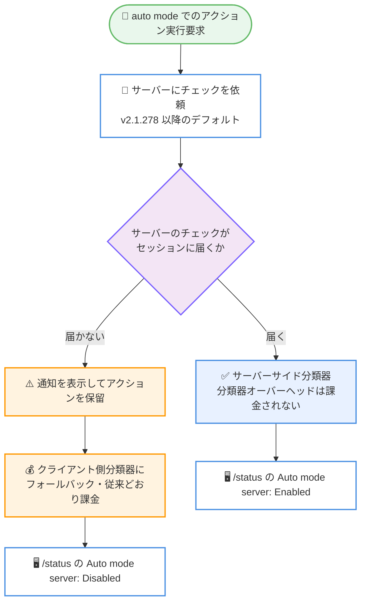

# Claude Code v2.1.278: auto mode 分類器がサーバーサイド実行をデフォルト化し分類器オーバーヘッドが課金対象外に

## メタデータ

| 項目 | 内容 |
|------|------|
| 発表日 | 2026-09-19 (npm 公開日時: 2026-09-19 01:48 UTC) |
| ソース | Claude Code Changelog |
| カテゴリ | Claude Code / CLI アップデート |
| 公式リンク | https://github.com/anthropics/claude-code/blob/main/CHANGELOG.md |

## 概要

Claude Code v2.1.278 がリリースされた。本バージョンでは、auto mode の安全性分類器の実行方法が変更され、Claude API ユーザーおよび Enterprise ユーザー、ならびに Bedrock、Vertex、Foundry、ゲートウェイ上のセッションで、サーバーサイド分類器がデフォルトになった。サーバーが分類チェックを実行する場合、分類器のオーバーヘッドは課金されない。

あわせて `/status` コマンドに `Auto mode server` 行が追加され、現在のセッションの auto mode 分類器がサーバー上で実行されているかどうかを確認できるようになった。

## 詳細

### 背景

auto mode では、シェルコマンドやネットワークリクエストなどのアクションを実行する前に、分類器が安全性チェックを実行する。従来、この分類器リクエストはクライアント (Claude Code) 側で実行され、トークン使用量として課金されていた。

公式ドキュメント (auto mode classifier billing) によると、v2.1.278 以降の Claude Code は、サーバーサイドチェックが有効な環境では、セッション自身のモデルリクエストの一部としてサーバーにチェックを依頼し、サーバーがチェックを実行した場合は課金しない。

### 主な変更点

本バージョンの変更点は以下のとおり。

1. **auto mode のサーバーサイド分類器がデフォルトに**: Claude API・Enterprise ユーザー、および Bedrock、Vertex、Foundry、ゲートウェイ上の auto mode が、サーバーサイド分類器をデフォルトで使用するように変更された。サーバーがチェックを実行する場合、分類器オーバーヘッドは課金されない
2. **オプトアウト用の環境変数**: Bedrock、Vertex、Foundry、ゲートウェイでは `CLAUDE_CODE_AUTO_MODE_SERVER=0` を設定することでオプトアウトできる
3. **課金されるフォールバック時の警告表示**: サーバーのチェックがセッションに届かず、従来どおり課金されるクライアント側分類器にフォールバックする場合、警告 (通知) が表示される
4. **`/status` に `Auto mode server` 行を追加**: セッションの auto mode 分類器がサーバー上で実行されているかどうかを表示する。サーバーのチェックがセッションのアクションを判定している間は `Enabled`、フォールバック後は `Disabled` と表示される

### 技術的な詳細

公式ドキュメントで確認できた動作の詳細は以下のとおり。

- **通知の表示条件**: サーバーのチェックがセッションに届かなくなった後、最初にチェック対象となるアクションの実行前にアクションを保留し、次の通知を表示する。

  ```text
  We're changing auto mode to no longer charge for classifier requests in Claude Code. However, this session isn't eligible.
  ```

  Enter キーで続行すると、保留中のアクションとそのセッションの残りは、従来どおり課金される Claude Code 自身の分類器リクエストを使用する。Esc または Ctrl+C でキャンセルすると、保留中のアクションは実行されず現在のターンが停止する (セッションは auto mode のまま)。

- **通知が表示される対象**: サーバーサイドチェックは Enterprise プランと Claude API を使用するアカウント、および Claude Platform on AWS、Amazon Bedrock、Google Cloud の Agent Platform、Microsoft Foundry でデフォルトで要求される。実際にチェックが実行されるかは、各プラットフォームやリージョンのロールアウト状況に依存する。Pro、Max、Team プランではこの通知は表示されない
- **フォールバックの主な原因**: Claude Code と API の間にある LLM ゲートウェイやプロキシが、リクエストヘッダーを削除・書き換えたり、認識しないリクエストフィールド (`safeguards` など) を破棄したり、レスポンスのキー (`safeguard_results` など) を削除したりすると、サーバーのチェックがセッションに届かなくなる。ゲートウェイを特定できた場合、通知にはその名前が表示され、確認 (acknowledge) するとそのマシンでは 24 時間再表示されない
- **オプトアウト**: ゲートウェイがサーバーのチェックを提供できないことが分かっている場合、セッション開始前に `CLAUDE_CODE_AUTO_MODE_SERVER=0` を設定すると、分類器リクエストは常に Claude Code 自身のものとなり (従来どおり課金)、通知は表示されない。この変数は Anthropic API への直接接続では読み取られない。また、`CLAUDE_CODE_AUTO_MODE_SERVER` 未設定時に `CLAUDE_CODE_DISABLE_EXPERIMENTAL_BETAS=1` を設定した場合も、サーバーのチェックは無効になる。なお、`CLAUDE_CODE_AUTO_MODE_SERVER` は一時的な設定であり、将来のリリースで削除される可能性がある
- **非対話モードでの挙動**: `-p` を使用する非対話モードでは通知テキストを stderr に出力し、`stream-json` 出力では `system` 警告メッセージとして出力される。Agent SDK アプリケーションはメッセージストリームからこれを読み取れる

### 分類器実行フローの概要



## 開発者への影響

### 対象

- Claude API または Enterprise プランで Claude Code の auto mode を使用しているユーザー
- Amazon Bedrock、Google Cloud の Agent Platform (Vertex)、Microsoft Foundry、LLM ゲートウェイ経由で Claude Code を使用しているユーザー
- LLM ゲートウェイやプロキシを運用している管理者

### コスト面への影響

- **課金の削減**: サーバーが分類チェックを実行する環境では、auto mode の分類器オーバーヘッドが課金されなくなる。追加の設定なしで v2.1.278 以降に適用される
- **フォールバック時は従来どおり課金**: サーバーのチェックがセッションに届かない場合 (ゲートウェイによるヘッダー・フィールドの改変、プラットフォームやリージョンの未対応など) は、従来どおり Claude Code 自身の分類器リクエストがトークン使用量として課金される。この場合は事前に通知が表示されるため、意図しない課金に気付ける
- **Pro、Max、Team プラン**: これらのプランでは通知は表示されない

### 必要なアクション

- **一般ユーザー**: 特別な対応は不要。auto mode 使用中に `/status` の `Auto mode server` 行で、分類器がサーバー上で実行されているか確認できる
- **ゲートウェイ運用者**: サーバーサイドチェックを利用するには、`safeguards` リクエストフィールドや `safeguard_results` レスポンスフィールドを含め、リクエスト・レスポンスを改変せずにパススルーする必要がある。詳細はゲートウェイ互換性ガイドを参照
- **サーバーサイドチェックを利用できない環境**: ゲートウェイがチェックを提供できないことが分かっている場合は、以下を設定してオプトアウトできる。

  ```bash
  export CLAUDE_CODE_AUTO_MODE_SERVER=0
  ```

## 関連リンク

- [Claude Code Changelog (v2.1.278)](https://github.com/anthropics/claude-code/blob/main/CHANGELOG.md)
- [Auto mode classifier request charges (公式ドキュメント)](https://code.claude.com/docs/en/auto-mode-classifier-billing)
- [Permission modes (auto mode)](https://code.claude.com/docs/en/permission-modes)
- [LLM gateway protocol (feature pass-through)](https://code.claude.com/docs/en/llm-gateway-protocol)

## まとめ

Claude Code v2.1.278 は、auto mode の安全性分類器をサーバーサイド実行にデフォルトで切り替え、分類器オーバーヘッドの課金をなくすコスト面で重要なアップデートである。対象は Claude API・Enterprise ユーザーおよび Bedrock、Vertex、Foundry、ゲートウェイ上のセッションで、サーバーのチェックが届かない場合は通知の上で従来どおり課金されるフォールバックに切り替わる。`/status` の `Auto mode server` 行と `CLAUDE_CODE_AUTO_MODE_SERVER=0` により、状態の確認とオプトアウトが可能になっている。
