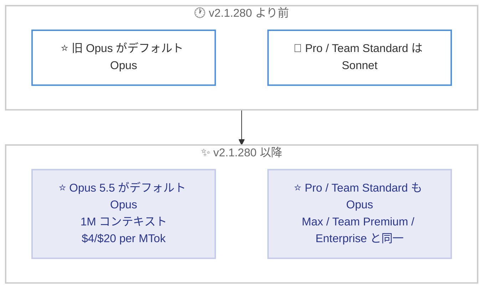

# Claude Code v2.1.280: Claude Opus 5.5 がデフォルトの Opus モデルに、auto mode の安全チェックやダイアログ操作など多数の修正

## メタデータ

| 項目 | 内容 |
|------|------|
| 発表日 | 2026-09-22 (npm 公開日時: 2026-09-22 15:44 UTC) |
| ソース | Claude Code Changelog |
| カテゴリ | Claude Code / CLI アップデート |
| 公式リンク | https://github.com/anthropics/claude-code/blob/main/CHANGELOG.md |

## 概要

Claude Code v2.1.280 がリリースされた。本バージョンの最大の変更点は、新モデル Claude Opus 5.5 (`claude-opus-5-5`) の追加と、それがデフォルトの Opus モデルになったことである。Opus 5.5 は 1M トークンのコンテキストウィンドウを持ち、料金は入力 $4 / 出力 $20 per MTok、キャッシュ読み取りは $0.20/MTok となっている。あわせて、Pro および Team Standard プランのデフォルトモデルが Sonnet から Opus に変更され、Max、Team Premium、Enterprise と同じになった。

機能面では、フルスクリーンモードでのマウス操作の拡充、MCP ツール説明の文字数上限を変更する環境変数 `CLAUDE_CODE_MAX_MCP_DESCRIPTION_LENGTH` の追加、OpenTelemetry イベントの拡充が行われた。また、auto mode の安全チェックの再試行動作、ダイアログのキー操作、バックグラウンドサブエージェント関連など、非常に多くの修正が含まれている。

## 詳細

### 背景

Claude Code は頻繁なリリースサイクルで更新されており、v2.1.280 は 2026-09-19 の v2.1.278 (auto mode 分類器のサーバーサイド実行のデフォルト化) に続くリリースである。本バージョンは新モデルの導入というモデルレイヤーの大きな変更に加え、CLI 本体、VS Code 拡張、Claude Code on the web、Claude Tag (Slack 連携)、セルフホストランナーまで広範囲にわたる修正・改善を含む大型アップデートとなっている。

### 主な変更点

#### 1. Claude Opus 5.5 がデフォルトの Opus モデルに

Changelog によると、Claude Opus 5.5 (`claude-opus-5-5`) が追加され、デフォルトの Opus モデルになった。主な仕様は以下のとおり。

| 項目 | 内容 |
|------|------|
| モデル ID | `claude-opus-5-5` |
| コンテキストウィンドウ | 1M トークン |
| 入力料金 | $4/MTok |
| 出力料金 | $20/MTok |
| キャッシュ読み取り料金 | $0.20/MTok |

あわせて、モデル関連では以下の変更も行われている。

- **Pro / Team Standard プランのデフォルトモデルが Opus に**: 従来の Sonnet から変更され、Max、Team Premium、Enterprise プランと同じになった
- **effort レベルの引き継ぎ動作の変更**: `/effort` がモデルごとの設定になる前に保存された effort レベルは、Opus 5.5 のような新しくリリースされたモデルには適用されなくなった。ユーザーがレベルを選択するまで、新モデルはデフォルトの effort で動作する
- **旧モデルの effort 優先順位の変更**: Opus 4.7、Opus 4.8、Fable 5 が、`-p` や Agent SDK、プロジェクト設定・管理設定・`--settings` の `effortLevel`、モデルごとのレベル指定よりも自身のリリース時デフォルト effort を優先する動作をやめた

#### 2. 新機能

- **フルスクリーンモードのマウス操作拡充**: マウスホイールで `/skills` リストをスクロールでき、`/plugin` 内のスキルの状態オプションをクリックで変更できるようになった
- **`CLAUDE_CODE_MAX_MCP_DESCRIPTION_LENGTH` の追加**: MCP ツールの説明とサーバー指示に適用される 2,048 文字の上限を、セッション内のすべての MCP サーバーに対して変更できる環境変数が追加された
- **OpenTelemetry イベントの拡充**: `hook_execution_complete` イベントに、フックの出力サイズと、サイズ超過によりファイルに保存された出力の数が追加された

#### 3. auto mode / パーミッション関連の修正

- **安全チェック拒否時の無限再試行を修正**: 安全チェックがレビューを拒否した際に auto mode が同じアクションを何度も再試行していた問題を修正。アクションは一度だけ拒否され、再試行しても解決しない旨が示されるようになった
- **安全チェック無応答時の連続拒否を修正**: 安全チェックが応答を返さない場合に auto mode が休みなくアクションを拒否し続けていた問題を修正。再試行はバックオフし、10 回連続で応答がない場合はメッセージを表示してターンを停止する
- **シンボリックリンク経由の書き込み判定を修正**: シンボリックリンクされたパスへの書き込みが、ツリー内の表記で判定されていた問題を修正。プロンプトには書き込みが実際に着地する場所が表示され、`acceptEdits`、allow ルール、auto mode はツリー外に着地する書き込みを承認しなくなった
- **`PermissionRequest` フックの変更**: agent タイプのフックはリクエストの許可・拒否に関与できないため実行されなくなり、command または http フックを案内するエラーが表示される

#### 4. キー操作・ダイアログ関連の修正

- `/model`、`/config`、`/permissions` など多くのダイアログで、Ctrl+C または Ctrl+D を 2 回押すとダイアログを閉じる代わりに Claude Code 自体が終了してしまう問題を修正
- ダイアログ内で単独の `n` が閉じる操作、`y` が確定操作として扱われていた動作を修正。Enter と Esc で確定・キャンセルする (従来の動作は `keybindings.json` で `y`/`n` を `confirm:yes`/`confirm:no` に割り当てて復元可能)
- ダイアログのテキストフィールドで、キーバインディングが設定されたキーの文字・数字・Space の入力が失われる問題を修正
- `/config` の設定リストや `/model` などの選択リストで Home / End キーが機能しない問題、`/skills` メニューの PgUp/PgDn が先頭・末尾で折り返す問題、`/config` リストで Tab が設定値を無断で変更する問題を修正
- ターミナルウィンドウを前面に出すだけのクリックが、ポインタ下の項目まで反応させていた問題を修正
- フルスクリーンモードで `ctrl+l` / `cmd+k` がトランスクリプトをクリアする動作 (v2.1.260 で追加) を取り消し、画面の再描画に戻した

#### 5. バックグラウンドサブエージェント・セッション関連の修正

- ヘッドレスおよび SDK セッションで、ターン終了間際のバックグラウンドサブエージェントに送ったメッセージが暗黙に失われる問題を修正
- サブエージェントのレポートが読まれる前に呼び出し元の会話がコンパクトされると、完了レポートが失われる問題を修正
- LSP プラグインが有効な場合に、バックグラウンドサブエージェントが LSP ツールを使用できない問題を修正
- バックグラウンドシェルタスクが、一致なしの grep のような無害な非ゼロ終了を失敗として報告する問題を修正
- 未完了のバックグラウンドエージェント・シェル・ワークフローを持つセッションを再開した際に、入力前にモデルターンが勝手に開始される問題を修正
- バックグラウンドサブエージェント実行中に Ctrl+C を 3〜4 回押さないと終了できなかった問題を修正 (2 回で終了)

#### 6. 安定性・API エラー関連の修正

- すべてのターンで「role 'system' must precede an 'assistant' message」という API エラーが発生する問題を修正
- advisor 有効時に、それをサポートしないプロキシ・ゲートウェイ経由で API Error 400 が発生し続ける問題を修正 (リクエストは advisor なしで再試行される)
- 保存履歴に不正な形式の通知やシステムメッセージが含まれる場合に、セッションが失敗・クラッシュする複数の問題を修正
- 長時間のフルスクリーンセッションが「unrecoverable interface error」で終了する原因の 1 つ (破損したキャッシュメッセージリスト) を修正し、再構築するようにした
- ホストアプリ (Claude Desktop、VS Code、SDK) からの作業中のモデル切り替えが、次のプロンプトでキャッシュミスを引き起こす問題を修正
- 再開されたフォークサブエージェントがツールリストを再構築してプロンプトキャッシュを壊していた問題を修正

#### 7. その他の修正・改善 (抜粋)

- **プラグイン / スキル**: ブランチ・タグ追跡のプラグイン更新後も `installed_plugins.json` がインストール時のコミットを保持する問題、`manifest.json` の記載により `~/.claude/skills/` のスキルが `.trash/` に移動される問題などを修正。予約されたマーケットプレイス名を模倣する名前のマーケットプレイスは追加時に拒否される
- **UI 改善**: `/permissions` のフォーカス復帰とタブ切り替え、`/artifacts` と `/workflows` リストのスクロールバー表示、言語名のないコードブロックのインラインコード風の色付け、`@` ファイル候補のランキング改善など
- **入力処理**: Windows ターミナルでの不可視文字除去後のプロンプト行の乱れを修正。ペルシャ語・アラビア語がラテン文字や数字に接尾辞を付けるために使うゼロ幅非接合子が、不可視文字クリーンアップで除去される問題も修正
- **音声入力**: Ctrl+C で音声入力が停止しない (マイクが録音を続ける) 問題などを修正
- **VS Code 拡張**: `/status`、`/sandbox`、`/chrome`、`/export`、`/plan` などのダイアログ・コマンドを追加。800 文字超のペーストのマーキング、プラン承認カードでの auto mode オプション表示なども改善
- **Claude Code on the web**: GitHub Enterprise Server リポジトリでのトークン自動更新、期限切れの承認プロンプトが拒否として記録される問題の修正など
- **Claude Tag (Slack)**: Slack ネイティブの Working インジケーターと Stop ボタンの追加、スケジュールされたルーチンが Enterprise Grid 参加前接続のワークスペースで実行されない問題の修正など
- **セルフホストランナー / Windows**: `--configure-git` 下でのライフサイクルフックコミットの署名失敗、`--retire-at` 直前に終了したターンの完了シグナル喪失、Windows のバックグラウンドクリーンアップがシンボリックリンク・ジャンクションを削除する問題などを修正

### 技術的な詳細

MCP ツール説明の上限変更は、環境変数で指定する。

```bash
# MCP ツール説明とサーバー指示の上限をデフォルトの 2,048 文字から変更
export CLAUDE_CODE_MAX_MCP_DESCRIPTION_LENGTH=4096
claude
```

この設定はセッション内のすべての MCP サーバーに適用される。説明の長いツールを持つ MCP サーバーで、説明が切り詰められて Claude がツールの使い方を誤解するケースへの対処として利用できる。

### モデルレイヤーの変更概要



## 開発者への影響

### 対象

- Claude Code CLI を使用しているすべてのユーザー
- Pro / Team Standard プランのユーザー (デフォルトモデルが Sonnet から Opus に変更)
- auto mode を使用しているユーザー (安全チェックの再試行動作が改善)
- MCP サーバーを利用・開発しているユーザー
- バックグラウンドサブエージェントやヘッドレス / SDK セッションを利用しているユーザー
- VS Code 拡張、Claude Code on the web、Claude Tag (Slack)、セルフホストランナーの利用者

### 必要なアクション

- **モデルの確認**: Opus 5.5 がデフォルトの Opus モデルになったため、`/model` で現在使用中のモデルを確認する。特定のモデルバージョンに固定したい場合は、明示的にモデル ID を指定する
- **Pro / Team Standard プランのユーザー**: デフォルトモデルが Opus に変わったため、従来どおり Sonnet を使用したい場合は `/model` で選択し直す
- **effort レベルの再設定**: `/effort` がモデルごとの設定になる前に保存した effort レベルは Opus 5.5 に引き継がれない。必要に応じて新モデルで effort レベルを選択する
- **`y`/`n` キー操作に依存していたユーザー**: ダイアログでの `y`/`n` による確定・キャンセルは無効化された。復元するには `keybindings.json` で `y`/`n` を `confirm:yes`/`confirm:no` に割り当てる
- **MCP ツール説明が切り詰められる場合**: `CLAUDE_CODE_MAX_MCP_DESCRIPTION_LENGTH` で上限を調整する

### 移行ガイド (該当する場合)

破壊的変更は基本的にないが、以下の動作変更に注意が必要である。

- ダイアログでの `y`/`n` キーの動作変更 (前述のとおり `keybindings.json` で復元可能)
- フルスクリーンモードの `ctrl+l` / `cmd+k` がトランスクリプトのクリアから画面再描画に戻った
- シンボリックリンク経由でツリー外に着地する書き込みは、`acceptEdits` や allow ルール、auto mode では承認されなくなった

## 関連リンク

- [Claude Code Changelog (v2.1.280)](https://github.com/anthropics/claude-code/blob/main/CHANGELOG.md)
- [Claude Code 公式ドキュメント](https://code.claude.com/docs)
- [Model configuration (モデル設定)](https://code.claude.com/docs/en/model-config)
- [Claude Code settings (環境変数)](https://code.claude.com/docs/en/settings)

## まとめ

Claude Code v2.1.280 は、1M コンテキストと $4/$20 per MTok の料金を備えた Claude Opus 5.5 をデフォルトの Opus モデルとして導入し、Pro / Team Standard プランのデフォルトモデルも Opus に統一した、モデルレイヤーで重要なリリースである。加えて、auto mode の安全チェック再試行の改善、シンボリックリンク経由の書き込み判定の厳格化、ダイアログのキー操作の整理、バックグラウンドサブエージェントやセッション安定性に関する多数の修正が含まれ、CLI 本体から VS Code 拡張、Slack 連携、セルフホストランナーまで広範囲の品質向上が図られている。
