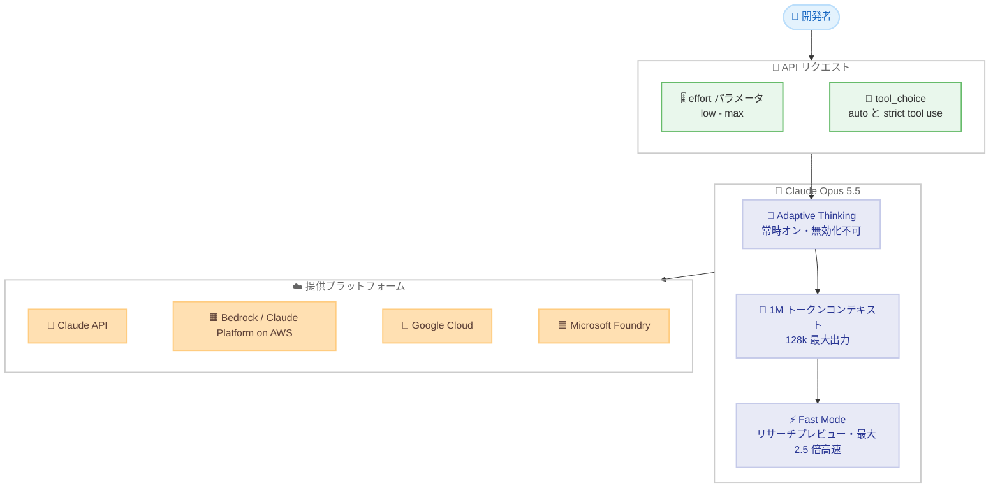

# Claude Opus 5.5 発表: Fable 5.1 同等の性能を 40% 低いコストで実現

## メタデータ

| 項目 | 内容 |
|------|------|
| 発表日 | 2026-09-22 |
| ソース | Anthropic News / Claude API Release Notes |
| カテゴリ | 新モデル |
| 公式リンク | https://www.anthropic.com/claude-opus-5-5 |

## 概要

Anthropic は 2026 年 9 月 22 日、Claude 5.5 ファミリー初のモデルとなる **Claude Opus 5.5** (モデル ID: `claude-opus-5-5`) を発表した。ほとんどの作業で Claude Fable 5.1 と同等の性能を発揮しながら、実行コストは Opus 5 より 40% 低い。長時間のエージェント的コーディングおよびナレッジワーク向けに設計されており、1M トークンのコンテキストウィンドウ (デフォルト)、128k の最大出力トークン、常時オンの adaptive thinking を備える。

価格は入力 $4 / 出力 $20 (100 万トークンあたり) と Opus 5 ($5/$25) から 20% 引き下げられ、キャッシュ読み取りは $0.20/MTok と 60% 削減された。Claude API、Amazon Bedrock、Claude Platform on AWS、Google Cloud、Microsoft Foundry で即日利用可能。

## 詳細

### 背景

Opus 5.5 は、フロンティアモデルの性能を大幅に低いコストで提供することを目指した Claude 5.5 ファミリーの最初のモデルである。METR や Frontier Design による外部評価を経てリリースされた。Anthropic によると、ベンチマーク上は Claude Fable 5.1 を上回るスコアを示すものの、実際の差は「スコアが示すよりも小さい」と注記されており、位置付けとしては Fable 5.1 同等の性能をより低コストで実現するモデルとなる。Sonnet 5.5 と Haiku 5.5 は数週間以内に公開予定。

### 主な変更点

**ベンチマーク結果** (adaptive thinking at max effort で実施)。

| ベンチマーク | Opus 5.5 | Fable 5.1 | Opus 5 | GPT-6 Astra |
|--------------|----------|-----------|--------|-------------|
| Terminal-Bench 4.0 | 66.4% | 55.8% | 52.3% | 57.9% |
| FrontierCode v1.1 | 54.4% | 50.3% | 48.0% | 53.3% |
| CursorBench 4.0 | 57.8% | 51.8% | 46.6% | — |
| GDPval-AA v2.1 (Elo) | 1846 | 1735 | 1708 | 1542 |
| AutomationBench | 40.0% | 31.4% | 26.9% | 41.4% |
| Humanity's Last Exam | 67.7% | 65.6% | 63.6% | 57.2% |
| Terminal-Bench-Science 0.1 | 58.7% | 52.6% | 29.0% | 64.6% |
| OSWorld 2.0 | 81.8% | 80.7% | 74.0% | — |
| Chartography | 89.0% | 88.4% | 83.4% | — |

**性能面のハイライト**。

- **コーディング**: 20 万行のコードベース監査を 3 時間未満で完了 (Opus 5 は 20 時間超)。HAProxy の C から Rust への移植を 9.5 時間で完了 (Fable 5.1 は 12 時間、コストは 51% 減)
- **調査・分析**: 収益報告レポートテストで 18 回中 16 回が品質基準をクリア (Fable 5.1 と Opus 5 は 0 回)
- **コミュニケーション**: 重要情報を冒頭に配置し、より自然で明瞭な文章に改善
- **速度**: 出力生成は Opus 5 より 30% 以上高速

**価格** (100 万トークンあたり)。

| 項目 | Opus 5.5 | Opus 5 | 変化 |
|------|----------|--------|------|
| 入力 | $4 | $5 | 20% 減 |
| 出力 | $20 | $25 | 20% 減 |
| キャッシュ読み取り | $0.20 | $0.50 | 60% 減 |
| キャッシュ書き込み | $5 | — | — |

**安全性**。

- 約 2,000 シナリオの自動行動監査で過去最高スコアを記録
- 封じ込め境界の回避試行が Opus 5 / Mythos 5.1 比で約 85% 減
- プロンプトインジェクション耐性は Gray Swan のテストで Fable 5.1 と同率最低の攻撃成功率
- 生物学・サイバーセキュリティ分野では Fable 5.1 と同等のセーフガードを適用 (Life Sciences Verification Program、Cyber Verification Program 経由でアクセス可能)
- 蒸留対策の preserved thinking、EU AI Act 準拠のウォーターマーク、ゼロデータ保持に対応

### 技術的な詳細

**adaptive thinking は常時オン**。Opus 5.5 では thinking を無効化できない。`thinking: disabled` および `thinking: enabled` を指定すると 400 エラーが返る。thinking フィールドを省略し、`effort` パラメータ (low から max) で推論の深さを制御する。

**tool_choice の制約**。`tool_choice` の `any` と `tool` は 400 エラーとなる。`auto` と strict tool use を使用する。

**computer use のツールセット変更**。Claude API と Google Cloud では `computer_toolset_20260801` が必須となり、旧来の `computer_20251124` は 400 エラーとなる (Bedrock では引き続き動作)。

**fast mode (リサーチプレビュー)**。Claude API 上で利用可能。入力 $8 / 出力 $40 (100 万トークンあたり) で、最大 2.5 倍の速度を実現する。Claude Code と Claude Platform でも利用できる。

**利用上限の拡大**。Pro / Max / Team / Enterprise プランで 5 時間の利用上限が引き上げられ、レート制限リセットの保存機能も追加された。

## 開発者への影響

### 対象

- Claude API、Amazon Bedrock、Claude Platform on AWS、Google Cloud、Microsoft Foundry で Opus 系モデルを利用している開発者
- 長時間のエージェント的コーディングやナレッジワークの自動化に取り組むチーム
- Opus 5 のコストがボトルネックとなっていたユースケース

### 必要なアクション

1. モデル ID を `claude-opus-5-5` に更新する
2. `thinking` フィールドを削除し、`effort` パラメータでの制御に切り替える
3. `tool_choice` に `any` または `tool` を指定している場合は `auto` と strict tool use に移行する
4. computer use を利用している場合、Claude API / Google Cloud では `computer_toolset_20260801` に更新する

### 移行ガイド (該当する場合)

| 項目 | Opus 5 | Opus 5.5 |
|------|--------|----------|
| thinking の指定 | `thinking: enabled/disabled` | フィールドを省略し `effort` で制御 |
| tool_choice | `auto` / `any` / `tool` | `auto` と strict tool use のみ |
| computer use | `computer_20251124` | `computer_toolset_20260801` (Bedrock は旧版も可) |
| コンテキストウィンドウ | — | 1M トークン (デフォルト) |
| 最大出力トークン | — | 128k |

## コード例

```python
import anthropic

client = anthropic.Anthropic()

# thinking フィールドは省略し、effort パラメータで推論の深さを制御する
message = client.messages.create(
    model="claude-opus-5-5",
    max_tokens=128000,
    effort="high",  # low / medium / high / max
    tool_choice={"type": "auto"},  # any と tool は 400 エラー
    messages=[
        {
            "role": "user",
            "content": "リポジトリ全体を監査し、セキュリティ上の問題を報告してください。",
        }
    ],
)

print(message.content)
```

## アーキテクチャ図 (該当する場合)



## 関連リンク

- [Claude Opus 5.5 発表 (Anthropic News)](https://www.anthropic.com/claude-opus-5-5)
- [Claude API Release Notes](https://platform.claude.com/docs/en/release-notes/overview)
- [Claude Developer Platform](https://platform.claude.com/)

## まとめ

Claude Opus 5.5 は、Claude Fable 5.1 と同等の性能を Opus 5 比 40% 低いコストで提供する、コスト効率を重視したフロンティアモデルである。価格の引き下げ (入力 $4 / 出力 $20)、キャッシュ読み取り 60% 減、30% 以上の高速化により、長時間のエージェント的コーディングやナレッジワークの実運用コストを大幅に削減できる。一方で、thinking の常時オン化、`tool_choice` の制約、computer use ツールセットの更新など API 仕様の変更があるため、Opus 5 からの移行時には上記の必要なアクションを確認することを推奨する。
