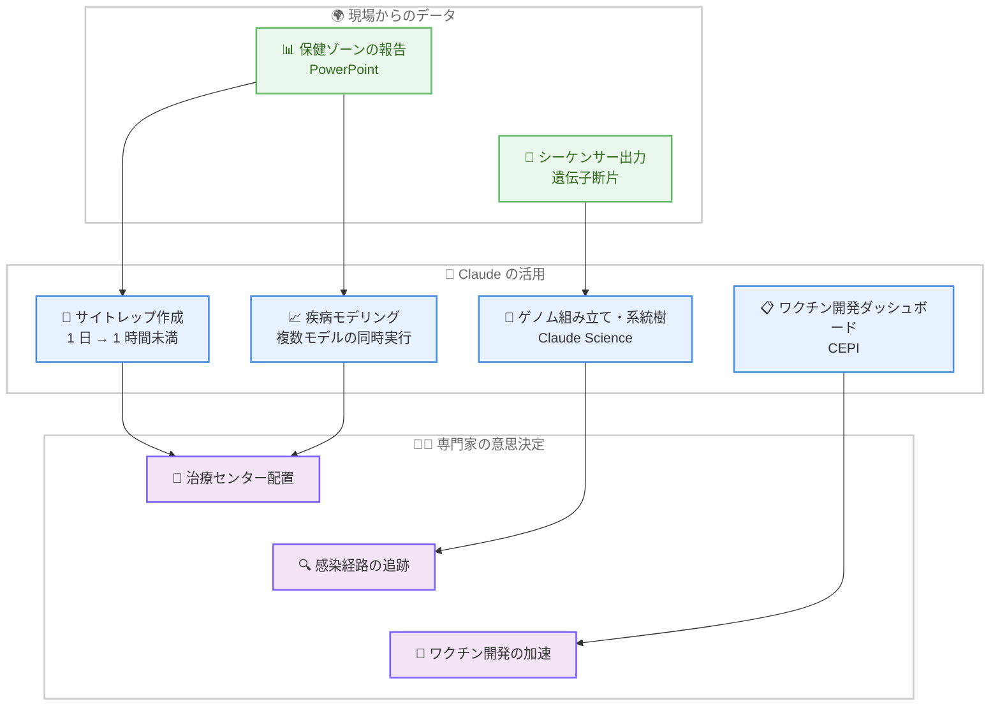

# The Situation Report: エボラ出血熱対応の最前線で活用される Claude

## メタデータ

| 項目 | 内容 |
|------|------|
| 発表日 | 2026-09-22 |
| ソース | Anthropic Features |
| カテゴリ | 活用事例 / グローバルヘルス / Claude for Science |
| 公式リンク | https://www.anthropic.com/features/ebola-response |

## 概要

Anthropic は 2026 年 9 月 22 日、コンゴ民主共和国 (DRC) 東部で拡大するエボラ出血熱アウトブレイクへの対応において、世界の保健機関が Claude をどのように活用しているかを紹介する特集記事「The Situation Report」を公開した。今回のアウトブレイクは、承認済みワクチンが存在しない希少株であるブンディブギョ・エボラウイルス (BDBV) によるもので、2026 年 5 月に確認され、5 月 17 日には「国際的に懸念される緊急事態」が宣言された。

記事では、CEPI (感染症流行対策イノベーション連合)、WHO AFRO (WHO アフリカ地域事務局)、INRB (コンゴ民主共和国国立生物医学研究所) の 3 組織が、状況報告書 (サイトレップ) の作成、疾病モデリング、ワクチン開発の調整、バイオインフォマティクス解析に Claude を活用している事例が紹介されている。Anthropic 側は Beneficial Deployments チームと Applied AI チームがこの取り組みに協力している。

## 詳細

### 背景

今回のアウトブレイクの状況は深刻である。記事が引用する 2026 年 9 月 19 日付のサイトレップによると、被害状況は以下のとおりである。

- **累計**: 確定 7,672 例、死亡 3,699 例 (致死率 48.2%)、隔離中 886 人、回復 1,879 人
- **直近 24 時間**: 新規確定 58 例 (イトゥリ 38、北キヴ 14、オー・ウエレ 5、チョポ 1)、死亡 23 例、回復 15 例
- **拡大範囲**: 7 州、167 保健ゾーン中 63 ゾーン。震源地はイトゥリ州で全症例の 77.1% を占める
- **医療体制の逼迫**: 北キヴ州の治療病床占有率は 94.7% に達し、ブテンボとカトワには空床がない

BDBV には承認済みワクチンが存在しないため、感染経路の追跡、リソース配分の最適化、ワクチン開発の加速が対応の鍵となっている。1976 年にエボラウイルスを共同発見した INRB 所長のジャン=ジャック・ムイエンベ博士は、50 年にわたりこの闘いを続けてきたと語り、「エボラに勝つには、先週どこにあったかではなく、今日どこにあるかを知ることだ」という趣旨を述べている。

### 主な活用事例

#### 1. サイトレップ作成の高速化 (WHO AFRO)

セネガル・ダカールに緊急対応拠点を置く WHO AFRO は、年間約 100 件の公衆衛生イベントに対応している。同組織の Tendai Muza 氏は、同僚の Tamayi Mlanda 氏、Gianni-Ferrari Donkor Muza 氏とともに、サイトレップ作成を自動化する Claude スキルを構築した。このスキルは以下の処理を行う。

- 各保健ゾーンから送られる PowerPoint ファイルから症例データと検査データを抽出する
- 前日のデータと照合し、トレンドの変化を検出・説明する
- 報告内容を要約する

この結果、**従来は丸一日かかっていたサイトレップ作成が 1 時間未満に短縮**された。

#### 2. 疾病モデリングと予測 (WHO AFRO)

WHO AFRO の Paul Ouma 氏によると、従来は時間の制約から疾病モデルを 1 つしか運用できなかったが、Claude の活用により複数のモデルを同時に実行できるようになった。モデリング結果は、治療センターの設置場所の判断などリソース配分の意思決定に活用されている。

#### 3. ワクチン開発の調整 (CEPI)

パートナーシップを主導する CEPI は、複数チームにまたがるワクチン開発作業を追跡するダッシュボードを Claude で構築した。多要素にわたるデータを整理し、提案の比較を短時間で行えるようになった。CEPI の R&D データイノベーションリードである Polina Brangel 氏は、どの血清サンプルを分析すべきかといった決定は Claude ではなく専門家の科学的判断によるものだと強調し、「プレッシャー下で働くチームに AI がどこで実用的な違いを生めるかをリアルタイムで学ぶ機会だった」という趣旨を述べている。

#### 4. バイオインフォマティクス解析 (INRB / Claude Science)

INRB のラボでは、Claude Science を通じて、シーケンサーが生成する数百万の遺伝子断片からゲノムを組み立て、ウイルスの系統樹を構築する作業を自然言語で指示できるようになった。この解析は以下に活用されている。

- 感染経路の追跡
- 流行規模の推定
- 新変異株の特定

#### 5. 他の疾患への応用

エボラ対応で培われた手法は、蚊が媒介するチクングニア熱のアウトブレイク対応にも応用されている。具体的には、人・場所・時間別の記録である「ラインリスト」のクリーニングと検証に Claude が使用されている。

### 活用の全体像

## 影響

### 対象

- **グローバルヘルス分野の組織**: 公衆衛生の緊急対応において、報告書作成やデータ統合といった時間のかかる作業を AI で短縮できることが実証された
- **科学研究者**: Claude Science によるバイオインフォマティクス解析の自然言語操作は、専門のエンジニアリソースが限られる現場のラボでも高度な解析を可能にする
- **非営利団体**: グローバルヘルスの最前線で活動する非営利団体は Claude for Nonprofits を利用できる

### 意義と留意点

本事例は、AI が専門家の判断を代替するのではなく、専門家がより多くの時間を判断そのものに使えるようにする「時間の創出」に価値があることを示している。CEPI の Brangel 氏が強調するとおり、科学的判断は引き続き専門家が担い、Claude はデータの抽出・照合・整理・要約といった作業を高速化する役割を果たしている。

### 今後の展望

- WHO AFRO は過去の疾病データベースを統合し、次のアウトブレイク対応に過去の知見を活かすことを計画している。従来は危機の最中にこうした統合作業を行う時間がなかった
- イトゥリ州ではアウトブレイクの鈍化という有望な兆候があるが、封じ込めにはまだ時間がかかる見込みである
- Anthropic は Claude Science クレジットによる科学者支援を継続的に拡大している

## 関連リンク

- [公式記事: The Situation Report](https://www.anthropic.com/features/ebola-response)
- [Anthropic News](https://www.anthropic.com/news)

## まとめ

本特集は、エボラ出血熱という一刻を争う公衆衛生危機の現場で、Claude が実用的な成果を上げていることを具体的な数値とともに示した事例である。サイトレップ作成が丸一日から 1 時間未満に短縮されたことで、対応チームは「今日ウイルスがどこにあるか」をほぼリアルタイムで把握できるようになり、疾病モデリングの多重化やゲノム解析の民主化と合わせて、限られたリソースの配分を証拠に基づいて行う体制が強化された。

同時に、意思決定はあくまで専門家の科学的判断に委ねられており、AI は判断材料を迅速に整えるための道具として位置づけられている点が重要である。チクングニア熱対応への応用や過去の疾病データベースの統合計画が示すとおり、この取り組みは単一のアウトブレイク対応にとどまらず、将来の公衆衛生危機への備えを強化するモデルケースとなりうる。
