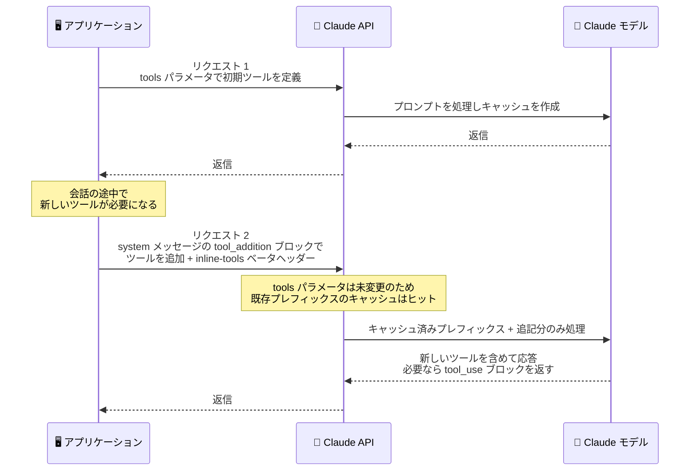

# Claude API inline tools (ベータ): 会話途中の system メッセージ内でツールを定義できる `tool_addition` ブロック

## メタデータ

| 項目 | 内容 |
|------|------|
| 発表日 | 2026-09-22 |
| ソース | Claude API Release Notes |
| カテゴリ | API |
| 公式リンク | https://platform.claude.com/docs/en/release-notes/overview |

## 概要

Claude API の Messages API で、会話途中の system メッセージ内でツールを定義できる inline tools がベータ提供開始された。`anthropic-beta: inline-tools-2026-09-15` ヘッダーを付与すると、メッセージ履歴中の system メッセージに `tool_addition` ブロックを含めることで、ツールの追加、既存ツールのスキーマ変更、サーバーツールのバージョン更新を実行できる。

最大の特徴は、トップレベルの `tools` パラメータを編集する必要がなく、プロンプトキャッシュを無効化しない点にある。さらに `mcp-client-2026-09-15` ヘッダーを併用すると、MCP ツールセットの定義と、`mcp_tool_listing` ブロックによるツールリストの固定にも対応する。

## 詳細

### 背景

従来、ツールはリクエストのトップレベルの `tools` パラメータで宣言する必要があった。公式ドキュメントによると、API は `tools` パラメータのツール定義からツール使用のための特別なシステムプロンプトを構築するため、ツール定義はプロンプトの先頭部分に組み込まれる。

一方、プロンプトキャッシュはリクエスト先頭からの前方一致で機能し、キャッシュ階層の最上位に `tools` が位置する。このため、会話の途中でツールを追加したり定義を変更したりすると、`tools` 以降のキャッシュ全体が無効化され、長い会話履歴を持つエージェントでは大きなコストとレイテンシの増加につながっていた。

会話の進行に応じてツールセットが変化するユースケース、たとえば MCP サーバーから動的に取得したツールを組み込むエージェントや、タスクの段階に応じてツールを解放するワークフローでは、この制約が課題となっていた。inline tools はこの課題に対応する仕組みとして導入された。

### 主な変更点

- **system メッセージ内でのツール定義**: 会話途中の system メッセージに `tool_addition` ブロックを含めることで、ツールを定義できる
- **ベータヘッダー**: 利用には `anthropic-beta: inline-tools-2026-09-15` ヘッダーの付与が必要
- **3 種類の操作に対応**: `tool_addition` ブロックで、新規ツールの追加、既存ツールのスキーマ変更、サーバーツールのバージョン更新を実行できる
- **`tools` パラメータの編集が不要**: ツールの変更をメッセージ履歴への追記として表現できるため、トップレベルの `tools` パラメータを書き換える必要がない
- **プロンプトキャッシュを維持**: ツールの追加・変更がプロンプトキャッシュを無効化しない
- **MCP 連携**: `mcp-client-2026-09-15` ヘッダーを併用すると、MCP ツールセットの定義と、`mcp_tool_listing` ブロックによるツールリストの固定に対応する

### 技術的な詳細

**キャッシュが維持される仕組み**: プロンプトキャッシュは前方一致ベースであるため、既存のプレフィックスの後ろに新しいコンテンツを追記する限りキャッシュは有効に保たれる。`tool_addition` ブロックは会話履歴の途中 (system メッセージ内) に追記されるコンテンツブロックであり、プロンプト先頭の `tools` パラメータ由来の定義部分を書き換えない。このため、それまでの会話履歴に対するキャッシュヒットを維持したままツールセットを拡張できる。

**スキーマ変更とバージョン更新**: `tool_addition` ブロックは新規追加だけでなく、既存ツールのスキーマ変更にも使用できる。また、`web_search` などの日付バージョン付きの型で宣言するサーバーツールについて、バージョン更新にも対応する。

**MCP ツールリストの固定**: `mcp-client-2026-09-15` ヘッダーとの併用時は、MCP ツールセットを inline で定義できるほか、`mcp_tool_listing` ブロックによってツールリストを固定 (pin) できる。MCP サーバー側のツールリストが変動しても、会話内で参照するツールセットを安定させられる。

## 開発者への影響

### 対象

- 長時間動作するエージェントで、会話の進行に応じてツールを動的に追加・変更したい開発者
- プロンプトキャッシュを活用しており、ツールセット変更によるキャッシュ無効化のコストを避けたい開発者
- MCP サーバーのツールを Messages API で利用しており、ツールリストの変動を制御したい開発者

### 必要なアクション

- inline tools を利用するリクエストに `anthropic-beta: inline-tools-2026-09-15` ヘッダーを付与する
- 会話途中でツールを追加・変更する場合は、`tools` パラメータの編集ではなく、system メッセージ内の `tool_addition` ブロックとして履歴に追記する
- MCP ツールセットの inline 定義や `mcp_tool_listing` によるリスト固定を使う場合は、`anthropic-beta: mcp-client-2026-09-15` ヘッダーも併せて付与する

### 移行ガイド (該当する場合)

既存のトップレベル `tools` パラメータによるツール定義は引き続き利用できる。会話開始時点で確定しているツールは従来どおり `tools` パラメータで宣言し、会話途中で発生するツールの追加・スキーマ変更・サーバーツールのバージョン更新のみを `tool_addition` ブロックで表現する使い分けが基本となる。ベータ機能のため、仕様は今後変更される可能性がある。

## コード例

会話途中の system メッセージで新しいツールを追加するリクエストの例。

```bash
curl https://api.anthropic.com/v1/messages \
  -H "x-api-key: $ANTHROPIC_API_KEY" \
  -H "anthropic-version: 2023-06-01" \
  -H "anthropic-beta: inline-tools-2026-09-15" \
  -H "content-type: application/json" \
  -d '{
    "model": "claude-opus-5",
    "max_tokens": 1024,
    "tools": [
      {
        "name": "get_weather",
        "description": "Get the current weather in a given location.",
        "input_schema": {
          "type": "object",
          "properties": {
            "location": {"type": "string", "description": "City and state, e.g. San Francisco, CA"}
          },
          "required": ["location"]
        }
      }
    ],
    "messages": [
      {"role": "user", "content": "サンフランシスコの天気を教えてください。"},
      {"role": "assistant", "content": "サンフランシスコは現在 15 度で、所々曇りです。"},
      {
        "role": "system",
        "content": [
          {
            "type": "tool_addition",
            "tool": {
              "name": "get_forecast",
              "description": "Get the multi-day weather forecast for a given location.",
              "input_schema": {
                "type": "object",
                "properties": {
                  "location": {"type": "string", "description": "City and state, e.g. San Francisco, CA"},
                  "days": {"type": "integer", "description": "Number of days to forecast"}
                },
                "required": ["location"]
              }
            }
          }
        ]
      },
      {"role": "user", "content": "今後 3 日間の予報もお願いします。"}
    ]
  }'
```

`tools` パラメータは会話開始時のまま変更されないため、それまでの履歴に対するプロンプトキャッシュは有効に保たれる。

## アーキテクチャ図

会話途中でのツール追加とプロンプトキャッシュ維持の流れ。



## 関連リンク

- [Claude API Release Notes](https://platform.claude.com/docs/en/release-notes/overview)
- [Tool use with Claude](https://platform.claude.com/docs/en/agents-and-tools/tool-use/overview)
- [Define tools](https://platform.claude.com/docs/en/agents-and-tools/tool-use/define-tools)
- [Prompt caching](https://platform.claude.com/docs/en/build-with-claude/prompt-caching)
- [MCP connector](https://platform.claude.com/docs/en/agents-and-tools/mcp-connector)

## まとめ

inline tools ベータは、これまでリクエスト先頭の `tools` パラメータに固定されていたツール定義を、会話履歴の一部として動的に扱えるようにする機能拡張である。ツールの追加・スキーマ変更・サーバーツールのバージョン更新を `tool_addition` ブロックの追記として表現できるため、プロンプトキャッシュを無効化せずにツールセットを進化させられる。長時間動作するエージェントや MCP 連携アプリケーションにとって、コストとレイテンシを抑えながら柔軟なツール管理を実現する重要な選択肢となる。利用には `anthropic-beta: inline-tools-2026-09-15` ヘッダーが必要で、MCP ツールセット定義と `mcp_tool_listing` によるリスト固定には `mcp-client-2026-09-15` ヘッダーの併用が必要となる。
