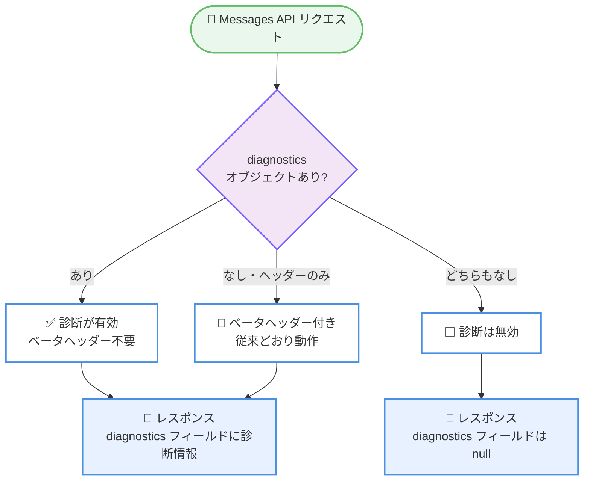

# Cache Diagnostics が正式版に: ベータヘッダー `cache-diagnosis-2026-04-07` が不要に

## メタデータ

| 項目 | 内容 |
|------|------|
| 発表日 | 2026-09-23 |
| ソース | Claude Developer Platform Release Notes |
| カテゴリ | API アップデート |
| 公式リンク | https://platform.claude.com/docs/en/release-notes/overview |

## 概要

Claude API の Cache Diagnostics (キャッシュ診断) 機能がベータを卒業し、正式版として提供開始された。これまで必要だったベータヘッダー `cache-diagnosis-2026-04-07` は不要になり、Messages API リクエストに `diagnostics` オブジェクトを含めるだけでオプトインできる。

あわせてレスポンス仕様も更新され、`POST /v1/messages` のレスポンスには常に `diagnostics` フィールドが含まれるようになった。リクエストで `diagnostics` オブジェクトを指定しなかった場合、このフィールドは `null` となる。既存のベータヘッダーを送信し続けているリクエストは、従来どおり動作する。

## 詳細

### 背景

Cache Diagnostics は、名称から、プロンプトキャッシュの動作状況を診断するための機能と考えられる。プロンプトキャッシュはリクエスト先頭からの前方一致で機能するため、意図せずキャッシュが無効化されるとコストとレイテンシに影響する。キャッシュの挙動を可視化する診断情報は、こうした問題の切り分けに役立つと考えられる。

本機能はこれまで、ベータヘッダー `cache-diagnosis-2026-04-07` を付与した場合のみ利用できるベータ機能だった。ヘッダー名の日付から、2026 年 4 月 7 日にベータ提供が開始されたと考えられる。今回の発表により、ベータ期間を経て正式版 (GA) へ移行した。

なお、診断情報として具体的にどのような内容が返されるかは、公式ドキュメントでの確認が必要である。

### 主な変更点

- **ベータヘッダーが不要に**: `cache-diagnosis-2026-04-07` ベータヘッダーを付与しなくても Cache Diagnostics を利用できるようになった
- **`diagnostics` オブジェクトによるオプトイン**: Messages API リクエストに `diagnostics` オブジェクトを含めることで機能を有効化する
- **後方互換性の維持**: ベータヘッダーを送信し続けている既存のリクエストは、従来どおり動作する
- **レスポンスに `diagnostics` フィールドが常時含まれる**: `POST /v1/messages` のレスポンスには常に `diagnostics` フィールドが含まれる。リクエストで `diagnostics` オブジェクトを指定しなかった場合は `null` となる

### 技術的な詳細

**オプトイン方式**: 正式版でも機能は自動有効ではなく、オプトイン方式を採用している。診断情報を取得したいリクエストにのみ `diagnostics` オブジェクトを含めればよい。

**レスポンススキーマの変更**: 今回の変更で、`POST /v1/messages` のレスポンスに `diagnostics` フィールドが常に含まれるようになった点は、レスポンスの構造変化として注意が必要である。オプトインしていないリクエストでは値が `null` となるため、レスポンスを厳密なスキーマで検証している場合は、このフィールドの存在を考慮する必要があると考えられる。

**移行パス**: ベータヘッダーを送信するリクエストは引き続き動作するため、即時の対応は不要である。段階的にヘッダーを削除して正式版の指定方法へ移行できる。

## 開発者への影響

### 対象

- ベータヘッダー `cache-diagnosis-2026-04-07` を使用して Cache Diagnostics を利用中の開発者
- プロンプトキャッシュのヒット状況を可視化・デバッグしたい開発者
- `POST /v1/messages` のレスポンスを厳密なスキーマで検証しているアプリケーションの開発者

### 必要なアクション

- **新規利用者**: ベータヘッダーは不要。Messages API リクエストに `diagnostics` オブジェクトを含めるだけで診断情報を取得できる
- **既存のベータ利用者**: 即時の対応は不要 (ヘッダー付きリクエストは従来どおり動作)。任意のタイミングで `cache-diagnosis-2026-04-07` ヘッダーを削除できる
- **レスポンスを厳密に検証している場合**: レスポンスに常に含まれるようになった `diagnostics` フィールド (未指定時は `null`) に対応しているか確認する

### 移行ガイド (該当する場合)

1. リクエストから `anthropic-beta: cache-diagnosis-2026-04-07` ヘッダーを削除する
2. 診断情報が必要なリクエストに `diagnostics` オブジェクトが含まれていることを確認する
3. レスポンスの `diagnostics` フィールドを参照する処理が、オプトインしていないリクエストで `null` を受け取っても問題ないことを確認する

## コード例

Messages API リクエストで `diagnostics` オブジェクトを含めてオプトインする例。ベータヘッダーは不要となった。

```bash
curl https://api.anthropic.com/v1/messages \
  -H "x-api-key: $ANTHROPIC_API_KEY" \
  -H "anthropic-version: 2023-06-01" \
  -H "content-type: application/json" \
  -d '{
    "model": "claude-sonnet-4-5",
    "max_tokens": 1024,
    "diagnostics": {},
    "messages": [
      {"role": "user", "content": "こんにちは"}
    ]
  }'
```

`diagnostics` オブジェクトに指定できる詳細なフィールドについては、公式ドキュメントでの確認が必要である。オプトインしたリクエストのレスポンスには診断情報を持つ `diagnostics` フィールドが含まれ、オプトインしなかった場合は `diagnostics: null` が返される。

## アーキテクチャ図

ベータヘッダー方式と正式版のオプトイン方式の関係。



## 関連リンク

- [Claude Developer Platform Release Notes](https://platform.claude.com/docs/en/release-notes/overview)

## まとめ

Cache Diagnostics の正式版移行により、ベータヘッダー `cache-diagnosis-2026-04-07` なしで、Messages API リクエストの `diagnostics` オブジェクトによるオプトインだけで診断機能を利用できるようになった。既存のベータヘッダー付きリクエストは従来どおり動作するため、移行は任意のタイミングで実施できる。一方、`POST /v1/messages` のレスポンスに `diagnostics` フィールドが常に含まれるようになった点 (未指定時は `null`) は、レスポンスを厳密に検証しているアプリケーションでは確認しておきたい変更である。プロンプトキャッシュの挙動を安定的に可視化する手段が正式版として提供されたことは、キャッシュ活用によるコスト最適化に取り組む開発者にとって有用なアップデートといえる。
