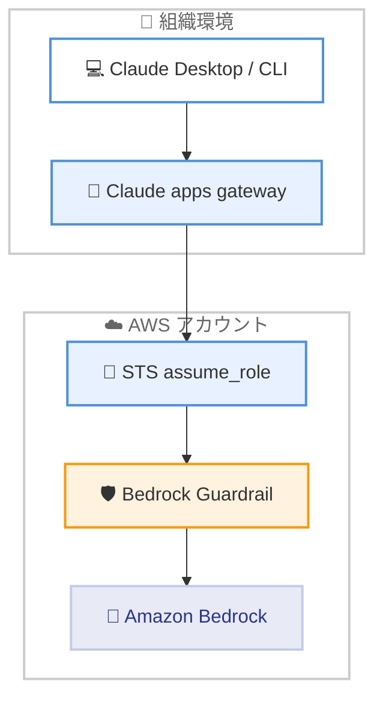

# Claude Code v2.1.281: Claude apps gateway の Bedrock 連携強化、attribution 無効化設定、セッション再開・ストリーム処理の大規模な信頼性改善

## メタデータ

| 項目 | 内容 |
|------|------|
| 発表日 | 2026-09-23 (npm レジストリの公開日時で確認) |
| ソース | Claude Code Changelog |
| カテゴリ | Claude Code / CLI アップデート |
| 公式リンク | https://github.com/anthropics/claude-code/blob/main/CHANGELOG.md |

## 概要

Claude Code v2.1.281 がリリースされた。約 176 項目におよぶ非常に大きなリリースで、新機能の追加に加えて、信頼性・セキュリティ・UI/UX の広範な改善が含まれている。

新機能では、Claude apps gateway の Bedrock upstream に対する `assume_role` (STS 経由の IAM ロール引き受け) と `guardrail` (Amazon Bedrock ガードレールの適用) の設定、コミット・PR の attribution をすべて非表示にする `"attribution": false` 設定、MCP の URL モード elicitation、`/insights` への auto mode 推奨機能などが追加された。修正面では、セッション再開時の履歴再送やプロンプトキャッシュ破損、プロキシ・ゲートウェイ経由のストリーム切断に関する多数の問題が解決され、危険な `rm` チェックの強化やパーミッションルールの NUL バイト処理といったセキュリティ関連の修正も行われている。

## 詳細

### 背景

Claude Code v2.1.281 は、Claude Opus 5.5 をデフォルトの Opus モデルとして導入した 2026-09-22 の v2.1.280 に続くリリースである。本バージョンは新モデルのような目玉機能こそないものの、エンタープライズ向けのゲートウェイ機能強化と、CLI 本体・VS Code 拡張・Claude Code on the web・Claude Tag (Slack 連携) にまたがる大量の品質改善を含む、過去最大級のメンテナンスリリースとなっている。

### 主な変更点

#### 1. Claude apps gateway の機能強化 (エンタープライズ向け)

Changelog によると、Claude apps gateway に以下の設定が追加された。

- **Bedrock upstream の `assume_role`**: ゲートウェイが STS を通じて引き受けた IAM ロールとして Bedrock を呼び出せるようになった。必要に応じて別の AWS アカウントのロールも利用でき、開発者ごとに個別のセッションを作成するオプションもある
- **Bedrock upstream の `guardrail: {id, version}`**: その upstream を経由するすべてのリクエストに Amazon Bedrock ガードレールを適用できる。設定する場合は、すべての Bedrock upstream に設定するか、まったく設定しないかのいずれかとする必要がある
- **`telemetry.resource_attributes`**: Claude Desktop および `/login` セッションのテレメトリに固定ラベルを付与できる
- **`desktop` ポリシーブロックの新キー対応**: `blockReadsOutsideWorkingDirectories` や `disableBypassPermissionsMode` など、新しい Claude Desktop のキーをサポート

また、`managedMcpServers` エントリの `envHelper` パスが `\??\` または `/??/` で始まる場合 (現行の Claude Desktop が実行を拒否するパス形式)、ゲートウェイは起動を拒否するようになった。

#### 2. 新機能

- **`"attribution": false` 設定**: `settings.json` でコミットと PR の attribution をすべて非表示にできるようになった。ただし、古い CLI バージョンはこの値を含む設定ファイル自体をスキップするため、複数バージョンで共有するファイルではオブジェクト形式を維持する必要がある
- **MCP URL モード elicitation**: 2026-07-28 プロトコル接続で、MCP サーバーが Claude Code にブラウザベースのフローを開くよう要求できるようになった。サーバーが完了を確認する手段を持たない場合、待機ダイアログは画面に残らない
- **`claude plugin validate` の MCP サーバーチェック**: ロード時に暗黙に破棄される `.mcp.json` エントリ、未宣言の `${user_config.*}` 参照、安全でない URL を報告するようになった
- **`/insights` の auto mode 推奨**: 最近のセッションで auto mode が処理できたはずのパーミッションプロンプト数を推定して表示する
- **フルスクリーンモードのスクロールバー**: `/skills`、`/mcp`、`/plugin` の Installed リストに、マウスオーバー時に表示されクリック・ドラッグ可能なスクロールバーが追加された

#### 3. セッション再開・プロンプトキャッシュの信頼性改善

セッションの再開とキャッシュに関する多数の修正が含まれている。

- 再開したセッションが過去のターンを変更された形で再送し (並列ツールコールのターン、再接続中の MCP ツールコール入力など)、API が会話の以前の推論を破棄する可能性があった問題を修正
- 非常に大きなセッションの再開時に、最後の数メッセージしか復元されないことがある問題を修正
- パーミッションプロンプト保留中の再起動後に再開したセッションが以前と異なる履歴を送信し、その時点からプロンプトキャッシュが壊れる問題を修正
- ツールコール中に終了したセッションの再開時、Claude がそのコールを認識し、結果は不明である旨が伝えられるようになった。手動再開時に隠れた「Continue」メッセージが追加されることもなくなった
- ツール検索がオフの状態 (プロキシやゲートウェイの背後など) で、MCP サーバーが会話中に切断したり再開後も接続中だったりするとプロンプトキャッシュが失われる問題を修正
- 新しいプロセスでセッションを再開した後の auto mode で、パーミッション分類器が以前のプロンプトキャッシュを再利用できるようになった
- 多数のファイルを読んだ長いセッションや、コンパクト済みの非常に長いセッションの再開時間を改善 (Agent SDK と Claude Desktop で特に顕著)

#### 4. プロキシ・ゲートウェイ経由のストリーム処理の修正

- プロキシやゲートウェイがストリームを正常終了の形で途中で閉じた場合に、レスポンスが警告なしに完了として表示されたり、重複したストリームイベントでツールコールが 2 回実行されたりする問題を修正
- プロキシがレスポンス途中でストリームイベントを落とした際の「Content block not found」エラーを修正。部分的なレスポンスは保持され、Web 検索は到着済みの結果を保持する
- ストリームの最終イベント前に接続が切れた場合に、空の完了レスポンスが 2 回リクエストされる問題を修正
- プロキシが末尾に usage のみのフレームを送信した際に stop reason が失われる問題を修正
- `CLAUDE_CODE_RETRY_WATCHDOG` セッションが、429/529 の待機後の最初の 5xx や切断で失敗する問題、5xx の長い `Retry-After` で上限なく黙ってスリープする問題を修正
- API リクエストの再試行中にセッションが「unrecoverable interface error」でクラッシュすることがある問題を修正
- モデルが解析不能なツールコールと出力上限による切り詰めを交互に繰り返した際に、`--max-turns` を無視して無限に再試行する問題を修正

#### 5. セキュリティ関連の修正

- **危険な `rm` チェックの強化**: `rm -rf "$(pwd)"` のようにコマンド置換の出力のみを対象とする再帰的 `rm` が、auto mode や `--dangerously-skip-permissions` モードで確認なしに実行されていた問題を修正。Bash の allow ルールがあっても確認を求めるようになった (`CLAUDE_CODE_DISABLE_SUBSTITUTION_RM_PROMPT=1` で無効化可能)。また、シェル変数に続くトップレベルディレクトリ名、作業ディレクトリ由来の変数、バックスラッシュのみのターゲットに対する削除も検出するようになった
- **パーミッションルールの NUL バイト処理**: NUL バイトを含むパーミッションルールがワイルドカードマッチに展開されていた問題を修正。そのようなルールは何にもマッチしなくなった
- **macOS の特殊パス経由の読み取り**: パーミッションダイアログと添付ファイルチェックが、承認前に macOS の `/.vol`、`/.nofollow`、`/.resolve` 配下のパス (ネットワークマウントに到達し得る) を読んでいた問題を修正
- **`claude --bg` の信頼確認**: ワークスペースの信頼プロンプトを通過していないディレクトリでバックグラウンドセッションとプロジェクトフックが開始されていた問題を修正。先に信頼を確認するか、非対話実行時は終了する
- **`--setting-sources` の伝播**: 生成されるセッション (teammates、`/bg`、`claude agents`、`--worktree --tmux`) に `--setting-sources` (SDK の `settingSources`) が転送されていなかった問題を修正
- **危険な `rm` プロンプトのタイムアウト**: `--dangerously-skip-permissions` と auto mode での危険な `rm` プロンプトは 2 分待機後にコマンドを拒否し、書き換えのヒントを提示するようになった。無人セッションが停止しないための変更である (`CLAUDE_CODE_DISABLE_DANGEROUS_RM_TIMEOUT=1` で無効化可能)

#### 6. UI/UX の改善

- **vim モードの多数の修正**: `dj`/`dk`/`dG`/`dgg` とその `c`/`y` 形が行の一部にしか作用しない問題、`1G` が最終行に移動する問題、`d0`/`c0`/`y0` が機能しない問題、スペースや空行・単語末尾での `cw` が次の単語まで変更する問題、ヒンディー語・ベンガル語などのスクリプトで単語移動が単語内で止まる問題などを修正
- **ダイアログ操作の統一**: `/memory`、`/hooks`、`/mcp`、`/export`、`/copy`、`/theme`、`/teleport` など残りのダイアログでも、Ctrl+C / Ctrl+D の 2 回押しがアプリ終了ではなくダイアログを閉じる動作になった。`/install-github-app`、`/desktop`、`/permissions` の auto mode 環境プロンプトなども標準のダイアログフレームとキーヒントを使用するようになった
- **リスト操作の統一**: `/workflows` と `/mcp` のリストがページング (PgUp/PgDn、Home/End)、`j`/`k`、マウス操作に対応。`/plugin` の詳細メニューなども Home/End と行クリックをサポート
- **一括入力キーの処理修正**: Remote Control などで一度に到着したキー入力 (矢印キー + Enter など) が直前の選択に作用していた問題を修正
- **表示改善**: `/skills` の各行がスキル名を先頭に表示、`/plugin` Installed リストの列揃え、`/diff` のスクロールバー表示と長いパスの折り返し防止、キューされたメッセージがスピナーの上に表示されるようになるなど
- **send now の動作変更**: Ctrl+Enter (または Ctrl+X Ctrl+S) の send now が、ターンをキャンセルする代わりに実行中のツールをバックグラウンドに移動するようになった

#### 7. 起動時間・パフォーマンスの改善

- MCP サーバーやプラグインが未設定の場合、対話型起動が managed-settings のネットワークリクエスト (約 80 ms、ネットワーク到達不能時は 17 秒以上) を待たなくなった
- git の読み取り、起動テレメトリ、Bedrock/Vertex のモデルアップグレードチェックが最初のフレーム表示前に実行されなくなった
- 3 MB を超える PDF の読み取り・@ メンション時に最大 2 分の遅延が発生する問題を修正

#### 8. VS Code / Claude Code on the web / Claude Tag の修正 (抜粋)

- **VS Code**: auto mode が課金対象の分類器リクエストにフォールバックする際の Continue/Stop プロンプトを追加。claude.ai/code セッションが履歴取得の失敗時に空または一部のみで開かれる問題、拡張ホスト再起動後にエディタタブの会話が沈黙する問題などを修正
- **Claude Code on the web**: コンポーザーのモデルメニューに Fast mode スイッチを追加 (プランと選択モデルが対応している場合)。PR がドラフトに変換された際の GitHub トリガールーチンが発火しない問題、GitHub 以外でホストされているリポジトリで機能しない Create PR ボタンが表示される問題などを修正
- **Claude Tag (Slack)**: Stop を押したユーザー名を示す行をスレッドに追加。スレッド内の返信に Claude が恒久的に応答しなくなるチャンネルの自動復旧、セッションクラッシュ後の返信遅延・喪失の自動再起動、組織で使用できないモデルへの切り替え提案の抑止などを修正

### 技術的な詳細

#### 自動化スクリプト・ラッパーへの影響 (セルフホストランナー)

セルフホストランナーは、システムプロンプトをコマンドライン引数ではなくプライベートファイルとして Claude Code に渡すようになった。これにより大きなプロンプトでの起動失敗が解消されるが、`--system-prompt` や `--append-system-prompt` を追加するラッパーや `command` フックは、`--system-prompt-file` / `--append-system-prompt-file` に切り替える必要がある。

#### auto mode 分類器の制御

サーバーサイドで分類器レビューが実行される環境では、読み取り専用およびサンドボックス化されたシェルコマンドもそのレビューを待ち、フラグが立った場合はブロックされるようになった。また、`CLAUDE_CODE_AUTO_MODE_SERVER` は直接の Anthropic API 接続にも適用されるようになった。

```bash
# サーバーサイドの auto mode 分類器をオプトアウト (ローカル分類器は使用量にカウントされる)
export CLAUDE_CODE_AUTO_MODE_SERVER=0

# オプトイン
export CLAUDE_CODE_AUTO_MODE_SERVER=1
```

#### attribution の無効化

```json
{
  "attribution": false
}
```

`settings.json` にこの設定を追加すると、コミットと PR の attribution がすべて非表示になる。古い CLI バージョンはこの値を含む設定ファイルをスキップするため、複数バージョンで共有するファイルではオブジェクト形式を維持する必要がある点に注意が必要である。

### Claude apps gateway の Bedrock 連携構成



## 開発者への影響

### 対象

- Claude Code CLI を使用しているすべてのユーザー
- Claude apps gateway を運用しているエンタープライズ管理者 (Bedrock upstream の `assume_role` / `guardrail` 設定)
- プロキシ・ゲートウェイ経由で Claude Code を利用しているユーザー (ストリーム処理の多数の修正)
- セッションの再開や長時間セッションを多用するユーザー
- auto mode / `--dangerously-skip-permissions` で無人実行しているユーザー
- MCP サーバー・プラグインの開発者 (`claude plugin validate` の検査強化、URL モード elicitation)
- セルフホストランナーでラッパーや `command` フックを使用しているユーザー
- VS Code 拡張、Claude Code on the web、Claude Tag (Slack) の利用者

### 必要なアクション

- **セルフホストランナーのラッパー更新**: `--system-prompt` / `--append-system-prompt` を追加するラッパーや `command` フックは、`--system-prompt-file` / `--append-system-prompt-file` に切り替える
- **attribution を無効化したい場合**: `settings.json` に `"attribution": false` を設定する。ただし、古い CLI バージョンと共有する設定ファイルではオブジェクト形式を維持する
- **Bedrock ガードレールを適用したい場合**: Claude apps gateway のすべての Bedrock upstream に `guardrail` を設定する (一部のみの設定は不可)
- **無人実行の動作確認**: 危険な `rm` プロンプトは 2 分後に自動拒否されるようになった。従来の待機動作に戻す場合は `CLAUDE_CODE_DISABLE_DANGEROUS_RM_TIMEOUT=1` を設定する
- **プラグイン開発者**: `claude plugin validate` を実行し、`.mcp.json` エントリの問題や `${CLAUDE_PLUGIN_ROOT}` の未クォートなどの新しい警告を確認する

### 移行ガイド (該当する場合)

破壊的変更は限定的だが、以下の動作変更に注意が必要である。

- セルフホストランナーでのシステムプロンプトの受け渡し方法の変更 (前述のとおりファイルベースのフラグへの移行が必要)
- send now (Ctrl+Enter) がターンのキャンセルではなく、実行中ツールのバックグラウンド移動になった
- サーバーサイド分類器の環境では、読み取り専用・サンドボックス化コマンドも auto mode のレビュー対象になった
- コマンド置換のみを対象とする再帰的 `rm` は、allow ルールがあっても確認を求めるようになった

## 関連リンク

- [Claude Code Changelog (v2.1.281)](https://github.com/anthropics/claude-code/blob/main/CHANGELOG.md)
- [Claude Code 公式ドキュメント](https://code.claude.com/docs)
- [Claude Code settings (設定と環境変数)](https://code.claude.com/docs/en/settings)
- [Amazon Bedrock で Claude Code を使用する](https://code.claude.com/docs/en/amazon-bedrock)

## まとめ

Claude Code v2.1.281 は、約 176 項目という過去最大級の変更を含むリリースである。Claude apps gateway の `assume_role` / `guardrail` による Bedrock 連携の強化はエンタープライズ利用における統制を大きく前進させ、`"attribution": false` や MCP URL モード elicitation などの新機能も追加された。同時に、セッション再開・プロンプトキャッシュ・プロキシ経由のストリーム処理といった長時間運用の信頼性に直結する修正、危険な `rm` チェックの強化などのセキュリティ改善、vim モードやダイアログ操作をはじめとする UI/UX の整理が広範囲に行われており、日常的に Claude Code を使用するすべてのユーザーに恩恵のある品質重視のアップデートとなっている。
