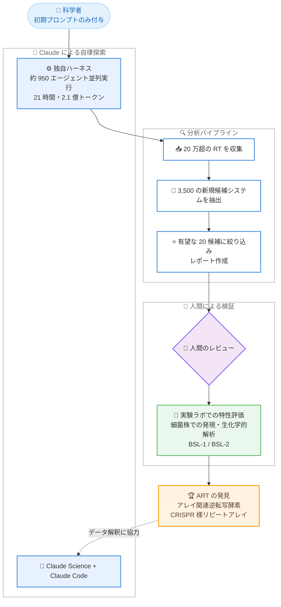

# Claude が CRISPR 様リピートを持つ新規酵素システム「ART」を自律的に発見

## メタデータ

| 項目 | 内容 |
|------|------|
| 発表日 | 2026-09-23 |
| ソース | Anthropic News |
| カテゴリ | 研究成果 / ライフサイエンス / AI エージェント |
| 公式リンク | https://www.anthropic.com/news/claude-discovers-novel-enzyme-system |

## 概要

Anthropic は 2026 年 9 月 23 日、Claude が科学者からの高レベルな指示のみで、CRISPR に似た特徴を持つ新規酵素システムを自律的に発見したと発表した。発見されたシステムは「ART (array-associated reverse transcriptases: アレイ関連逆転写酵素)」と命名され、主にバクテリオファージ (細菌に感染するウイルス) に存在する。早期段階の成果としてプレプリントが公開されている。

あわせて Anthropic は、生命科学の研究グループと実験ラボを新設したことも発表した。今回の発見は、AI エージェントと人間の科学者が研究の全工程で協働する新しい生物学研究の方法論を確立する取り組みの一環である。CRISPR ゲノム編集のパイオニアである Feng Zhang 氏 (MIT・Broad Institute 教授) がプレプリントをレビューし、AI エージェントが生物学的発見に貢献する興味深い例だとコメントしている。

## 詳細

### 背景

分子生物学の歴史的発見の多くは、分子機構の「異変」への気づきから始まっている。制限酵素、Taq ポリメラーゼ、CRISPR などはその代表例である。Anthropic は 2026 年春、異例なタンパク質の研究経験を持つ科学者で構成される研究グループを生命科学組織内に結成した。チームは CRISPR システムの進化・制御の理解や、細胞・遺伝子治療向け新規酵素の発見などの実績を持つ。

今回の取り組みでは、Claude が自律的に異常を検出し、生物学的発見につながる分析を推進できるかが検証された。人間の関与は、初期プロンプトの付与と実験室での検証作業に限定された。

### 発見の内容

ART は以下の 3 つの構成要素からなる新規酵素システムである。

1. **逆転写酵素 (RT)**: RNA を DNA に変換する酵素
2. **隣接するパートナー遺伝子**: 機能未知の付属タンパク質
3. **DNA リピート配列アレイ**: 等間隔に並んだ長い非コード DNA リピート配列

基盤となる RT 自体はジャンボファージで過去の研究により同定済みだったが、非コード DNA 配列のアレイと機能未知の付属タンパク質という特徴的な組み合わせに気づいたのは Claude が初とみられる。同様の特徴の組み合わせはこれまでごく少数のシステムでしか見つかっておらず、それらはすべてプログラム可能で、DNA の切断・コピー・貼り付けなどの操作を行う。ART の主要な機能はまだ不明であり、機能解明の実験が継続中である。

### 発見の手法

科学者が与えたのは「DNA 配列の巨大データベースから興味深い新規 RT を探す」という初期プロンプトのみである。探索には Claude Science、Claude Code、および複数の Claude セッションを並列実行する独自ハーネスが使用された。

- 約 950 の Claude エージェントが 21 時間、2 億 1,000 万トークンを使用して探索を実行
- エージェントは 20 万超の RT を収集し、3,500 の新規候補システムを抽出
- 最も有望な 20 候補に絞り込み、レポートを作成
- この種の分析は、専門家が行えば数週間から数か月かかる作業である

発見の瞬間、エージェントは生の DNA 配列を精査中にタンデムリピートアレイを発見し、「CRISPR 様のリピートアレイ?!」と驚きを報告した。その後、人間の科学者と同様に、リピートの数と間隔を計測し、既知の RT システムと比較し、文献を検索したうえで、新規システムであると確信してレポートを提出した。

### 実験による検証

候補が人間のレビューを通過すると、標準的な実験用細菌株でタンパク質を発現させ、生化学的・構造的な特性評価が行われた (データ解釈には Claude が協力)。初期実験では、ART アレイが個別の短い RNA のセットとして発現していることが確認され、CRISPR との類似性が示唆された。

実験作業はすべて人間の科学者が実施している。ラボはベイエリアに所在し、BSL-1 / BSL-2 レベルのみを扱い、ヒト感染性病原体は扱わない。

## アーキテクチャ図

## 開発者への影響

### 対象

- **生命科学分野の研究者**: 大規模な AI エージェント群による配列データベース探索が、専門家で数週間から数か月かかる分析を約 21 時間に短縮できることが実証された。Anthropic はゲノミクスやその他の分野で、他の科学者との協働によりこのアプローチを幅広い問題に拡張したい意向を示しており、研究テーマの提案を募集している
- **AI エージェント開発者**: Claude Science、Claude Code、並列実行ハーネスを組み合わせた大規模自律探索の構成 (約 950 エージェント、2 億 1,000 万トークン) は、科学分野以外の大規模探索タスクにも参考になる事例である
- **ゲノム編集・分子生物学の研究コミュニティ**: ART の機能はまだ不明だが、類似の特徴を持つ既知システムがすべてプログラム可能な DNA 操作を行うことから、新たなゲノム編集ツールにつながる可能性がある

### 必要なアクション

一般の開発者に必須のアクションはない。関心のある研究者には以下が推奨される。

- 公開されたプレプリントを確認し、ART システムの詳細を把握する
- 自身の研究分野で同様のエージェント型探索が適用できるか検討し、Anthropic への研究テーマ提案を検討する

### 移行ガイド (該当する場合)

該当なし。

## 関連リンク

- [公式発表: Claude discovers a novel enzyme system with CRISPR-like repeats](https://www.anthropic.com/news/claude-discovers-novel-enzyme-system)
- [Anthropic News](https://www.anthropic.com/news)
- [関連レポート: ライフサイエンス検証プログラム LSVP の発表](./2026-09-17-life-sciences-verification-program.md)

## まとめ

今回の発表は、AI が生物学的発見の「起点」となりうることを示した具体的な事例である。人間の関与を初期プロンプトと実験検証に限定したうえで、Claude が 20 万超の RT の収集、3,500 候補の抽出、文献との照合、新規性の判断までを自律的に実行し、CRISPR 様リピートアレイという異変への気づきから ART の発見に至った。制限酵素や CRISPR がそうであったように、分子機構の異変への気づきは新しい研究ツールの誕生につながってきた歴史があり、ART の機能解明の進展が注目される。

また、生成された仮説自体も研究対象となっており、テストに値する提案の特徴を Claude への指示に反映して「科学的センス」を学習させるという取り組みは、AI エージェントを科学研究に組み込む方法論として興味深い。同時期に発表された LSVP (ライフサイエンス検証プログラム) と合わせ、Anthropic が生命科学分野を安全性と研究推進の両面から本格的に強化していることがうかがえる。今後、ゲノミクスをはじめとする幅広い分野への展開が予定されており、AI 主導の科学的発見の動向として継続的な注視が推奨される。
