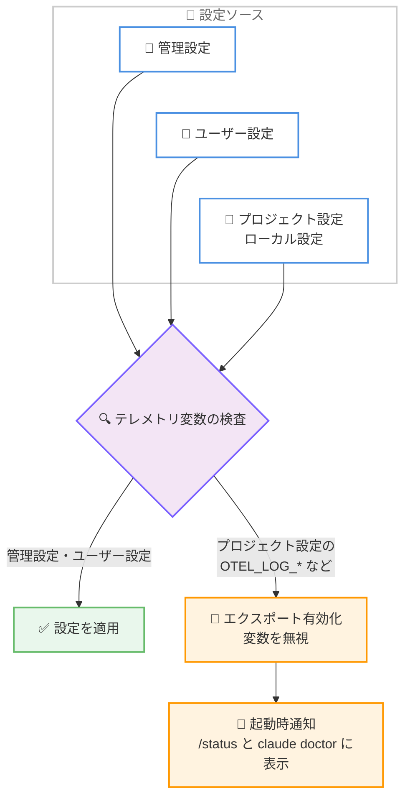

# Claude Code v2.1.282: maxProseWidth 設定、テレメトリ設定の可視化、セッション再開時の reasoning 消失修正を中心とした品質改善リリース

## メタデータ

| 項目 | 内容 |
|------|------|
| 発表日 | 2026-09-24 (npm レジストリの公開日時で確認) |
| ソース | Claude Code Changelog |
| カテゴリ | Claude Code / CLI アップデート |
| 公式リンク | https://github.com/anthropics/claude-code/blob/main/CHANGELOG.md |

## 概要

Claude Code v2.1.282 がリリースされた。86 項目の変更を含むリリースで、新機能の追加は少数にとどまり、大部分は信頼性・パーミッション管理・UI/UX に関する修正と改善で構成されている。

新機能では、ワイドターミナルで文章の折り返し幅を制限する `maxProseWidth` 設定、プロジェクト設定内で無視された、またはテレメトリを無効化したテレメトリ変数を起動時・`/status`・`claude doctor` で知らせる通知、`claude --chrome` を排他的な `managed-mcp.json` と併用可能にする `allowClaudeInChromeWithManagedMcp` 管理設定などが追加された。修正面では、Web 検索結果を含む履歴でのリクエスト全滅 (400 エラー)、`--continue` / `--resume` セッションでの extended thinking (reasoning) 消失に関する複数の問題、パーミッションルールや管理設定まわりの多数の不具合が解決されている。また、直接の Anthropic API 接続でテレメトリがオフの場合でも auto mode がサーバーサイド分類器をデフォルトで使用するようになる動作変更も含まれている。

## 詳細

### 背景

Claude Code v2.1.282 は、Claude apps gateway の Bedrock 連携強化などを含む大型リリースだった 2026-09-23 の v2.1.281 に続くリリースである。本バージョンは前バージョンの流れを引き継ぎ、セッション再開の信頼性、管理設定 (managed settings) の適用の厳密化、テレメトリ設定の透明性向上といった、運用品質に直結する改善を積み重ねている。

### 主な変更点

#### 1. 新機能 (Added)

- **`maxProseWidth` 設定**: ワイドターミナルで Claude の文章 (prose) の表示幅を制限できるようになった。テーブルとコードブロックは全幅を維持するため、可読性と情報量を両立できる
- **テレメトリ設定の可視化**: プロジェクトの設定ファイル内で無視されたテレメトリ変数、またはテレメトリをオフにした変数を、起動時の通知と `/status`、`claude doctor` のエントリで一覧表示するようになった
- **`allowClaudeInChromeWithManagedMcp` 管理設定**: 排他的な `managed-mcp.json` が構成されている環境でも `claude --chrome` を実行できるようにする管理設定が追加された。Chrome がブロックされた際のエラーメッセージにもこの設定名が表示されるようになった
- **Claude apps gateway の `store.readiness_grace_seconds`**: データベースフェイルオーバーなどの短時間の Postgres 停止中も `/readyz` が ready を維持できるようになった
- **`/feedback` ドラフトリストのスクロールバー**: フルスクリーンモードで、マウスオーバー時に表示されるスクロールバーが追加された

#### 2. セッション再開・extended thinking の信頼性改善

extended thinking (reasoning) の消失に関する修正が複数含まれている。

- 継続・再開したセッション (`--continue`、`--resume`) が過去のメッセージを変更された形で再送し、API が Claude の以前の reasoning を破棄する可能性があった問題をさらに修正
- Claude の作業中に `/model`、`/rename`、`/artifacts` などの即時実行スラッシュコマンドを使用すると、それ以前の extended thinking が失われる問題を修正
- 会話の途中で提供されていた組み込みツールを除外した `--tools` リストで再起動すると、継続・再開した会話が以前の extended thinking を失う問題を修正
- 「Invalid `data` in `redacted_thinking` block」という API エラーで毎ターン失敗するセッションについて、会話の thinking ブロックを破棄して 1 回再試行するようになった
- コンパクションの要約リクエストが拒否された場合に、フォールバックモデルで再試行するようになった
- 非常に大きなセッション (コンパクトされていないものを含む) の再開時間が改善された

#### 3. API リクエスト・認証まわりの修正

- **Web 検索結果による 400 エラーの修正**: API が復号できない Web 検索結果 (例: サードパーティゲートウェイ経由で応答されたターンのもの) を履歴に含む会話で、すべてのリクエストが 400 エラーで失敗する問題を修正
- thinking がオフかつ effort が high を超えるセッションで、安全性関連のモデル切り替え後にターンが「Effort 'xhigh' isn't available with thinking turned off」で失敗する問題を修正
- サインインのリフレッシュ中に別の Claude Code プロセスが終了・強制終了された後、最大 1 分間「another Claude Code process is refreshing it」というログインエラーでリクエストが失敗する問題を修正
- 別のウィンドウがサインインをリフレッシュしている間に開始されたセッション (複数の VS Code ウィンドウでよく発生) が、組織ポリシーの取得を再試行しない問題を修正
- Amazon Bedrock および Bedrock Mantle のセーフガードブロックメッセージにリクエスト ID とメッセージ ID が表示されるようになった
- Vertex AI で、Claude Code がまだ認識していないモデル (新しくリリースされたモデルなど) に対して Web 検索が提供されない問題を修正

#### 4. パーミッションルール・管理設定の修正

- **`:*` を含む Bash パーミッションルールの修正**: パターン中間に `:*` を含む Bash パーミッションルールが、`--allowedTools` では有効なのに設定ファイルではスキップされていた問題を修正。すべてのソースから機能するようになり、マッチ方法に関する起動時警告も表示される
- 管理設定の `disableClaudeAiConnectors` や `allowManagedPermissionRulesOnly` などの真偽値ロックキーで、値の型が誤っている場合にロックが無視されていた問題を修正。ロックが適用され、起動時にキー名が表示されるようになった
- 管理設定の `permissions`、`autoMode`、`worktree`、`attribution` について、ネストされた値が 1 つでも無効だとブロック全体が無視されていた問題を修正。残りの設定は適用されるようになった
- 管理設定 `allowManagedPermissionRulesOnly` の下で、リポジトリ・ユーザー・`--add-dir` のスキル、コマンド、および skills ディレクトリのプラグインマニフェストが `allowed-tools` を通じて自身のツールを事前承認できていた問題を修正
- リポジトリのシンボリックリンク経由で macOS の `/Network` や `/.vol` 形式のカーネルパスに到達する CLAUDE.md やルールが起動時に読み込まれる問題を修正
- リモートセッションのワーカー再起動時に、復元されたパーミッションプロンプトで承認したコマンドが 2 回実行される問題を修正
- Windows / WSL の管理設定について、存在するが無効・読み取り不能な管理者ポリシー (HKLM、`managed-settings.json`) がある場合、ユーザーが書き込み可能な HKCU や WSL の `/etc/claude-code` の適用を防ぐようになった

#### 5. 動作変更 (Changed)

- **auto mode のサーバーサイド分類器がデフォルトに**: 直接の Anthropic API 接続では、テレメトリがオフでもサーバーサイド分類器をデフォルトで使用するようになった (`CLAUDE_CODE_AUTO_MODE_SERVER=0` でオプトアウト可能)
- **テレメトリ関連変数の制限**: プロジェクト設定・ローカル設定に含まれる、エクスポートの有効化・エンドポイント設定・コンテンツキャプチャを行う OpenTelemetry 変数 (`CLAUDE_CODE_ENABLE_TELEMETRY` や `OTEL_LOG_*` など) を無視するようになった
- **`sandbox.excludedCommands` の制限**: 管理設定または `--settings` で `allowUnsandboxedCommands: false` が設定されている場合、または管理設定で `allowManagedDomainsOnly: true` の場合、プロジェクト設定・ローカル設定のエントリを無視するようになった
- **`anthropic-skills` / `claude-ai` 名前空間の保護**: `Skill(anthropic-skills:*)` および `Skill(claude-ai:*)` の allow ルールは claude.ai から同期されたスキルのみを対象とし、同名を名乗るだけのプラグインやスキルには適用されなくなった。これらの名前空間のスキルフォルダ、コマンドファイル、ワークフローコマンドは読み込まれなくなり、同名の MCP サーバーはスキル・プロンプトを一覧に表示しなくなった (ツールは引き続き動作)
- `ultracode` の視覚効果 (`/effort` とプロンプト入力) がプレーンなスタイルに変更され、dynamic-workflows のスピナーチップが削除された

#### 6. UI/UX・ターミナルの修正

- **ペースト処理の修正**: ターミナルのブラケットペーストモードがセッション中にリセットされた後、複数行テキストのペーストが行ごとに送信されてしまう問題を修正
- **vim モードの多数の修正**: `>>` が空行をインデントする問題、行の長さを超えるカウント付き `r` によるテキスト変更、`2J` が 1 行余分に結合する問題、最終行でのカウント付き操作 (`2dd`、`2>>`) の誤動作、`dd` / `dj` / `dG` や行単位 `p` / `P` 後のカーソル位置、`.` の繰り返し時にカウントが無視される問題などを修正
- **レンダリングの修正**: フルスクリーン開始時に最初のフレームの前に空白画面が点滅する問題、非フルスクリーンレンダラーでの行の乱れ、diff で CJK 文字や絵文字が折り返した際に最終列に残る古い文字などを修正
- **ツール入力バリデーションの改善**: 不明・欠落・型違いのパラメータが 1 つだけ報告されていたエラーメッセージが、同じ呼び出し内の他の無効なパラメータもすべて列挙するようになった
- **`/artifacts` の改善**: タイトルの列揃え、詳細の単語途中での切り詰め回避、PgUp/PgDn・Home/End・マウスホイール・クリックのサポートが追加された
- **`/skills` の操作性修正**: `/` 直後のキー入力が検索ボックスではなくスキルリストを動かす問題、入力中にターミナルカーソルがリストへ移動して IME 入力が乱れる問題を修正
- Bash と PowerShell がディスククォータの枯渇を「Exit code 1」の裏に隠し、一時領域に大きな出力ファイルを残す問題を修正
- `/install-github-app` がキャンセル後もブランチのプッシュと API キーシークレットの保存を続行する問題を修正。中断すると残りのステップは停止し、実行済みの内容が報告される
- プラグインのアンインストールが、設定ファイルの読み取り不能時などに成功を報告して保存済みオプションやシークレットを削除してしまう問題を修正

#### 7. VS Code / Cloud sessions / Claude Tag の修正 (抜粋)

- **VS Code**: 長い応答でパネルがストリームに追いつかなくなる問題 (更新のたびに応答全体を再パースしていた) を修正。ディクテーションのマイクボタンがスクロールバーを覆う問題、拡張ホスト再起動後にサインイン画面が沈黙する問題なども修正
- **Cloud sessions**: Settings › Connectors › GitHub に Claude GitHub App の状態表示を追加。GitHub 以外の Git サーバーでホストされたリポジトリ向けの「Open repository」「Open compare page」リンク、実行中のクラウドセッションへの別 GitHub オーナーのリポジトリ添付などが追加された。30 分オフセットのタイムゾーンで毎時ルーチンの次回実行時刻が 30 分ずれる問題も修正
- **Claude Tag (Slack)**: Enterprise Grid の組織全体インストールで自動参加チャンネルパターンが無視される問題、共有チャンネルで Claude が応答しない問題、リタイアしたモデルのスレッドが返信のたびにフォールバックする問題、クラウドワーカー再起動後にコスト・トークン合計が過大表示される問題などを修正

### 技術的な詳細

#### maxProseWidth の設定

`settings.json` で Claude の文章の表示幅を制限できる。テーブルとコードブロックには影響しない。

```json
{
  "maxProseWidth": 100
}
```

#### auto mode 分類器の制御

Changelog によると、直接の Anthropic API 接続では、テレメトリがオフの場合でもサーバーサイド分類器がデフォルトで使用されるようになった。

```bash
# サーバーサイドの auto mode 分類器をオプトアウト
export CLAUDE_CODE_AUTO_MODE_SERVER=0
```

#### テレメトリ設定の適用フロー

プロジェクト設定・ローカル設定によるテレメトリの有効化が制限され、無視された変数は起動時に可視化されるようになった。



## 開発者への影響

### 対象

- Claude Code CLI を使用しているすべてのユーザー
- `--continue` / `--resume` でセッションを再開するユーザー (extended thinking 消失の修正)
- サードパーティゲートウェイ経由で Web 検索を使用したことのあるユーザー (400 エラーの修正)
- 管理設定 (managed settings) やパーミッションルールを運用しているエンタープライズ管理者
- プロジェクト設定でテレメトリ変数を設定しているチーム (無視される変数の発生と起動時通知)
- auto mode を直接の Anthropic API 接続で使用しているユーザー (サーバーサイド分類器がデフォルト化)
- `anthropic-skills` / `claude-ai` という名前のプラグインや MCP サーバーを使用しているユーザー
- vim モード、ワイドターミナル、VS Code 拡張、Cloud sessions、Claude Tag (Slack) の利用者

### 必要なアクション

- **ワイドターミナルの利用者**: 文章の折り返し幅を制限したい場合は `settings.json` に `maxProseWidth` を設定する
- **テレメトリをプロジェクト設定で構成しているチーム**: `CLAUDE_CODE_ENABLE_TELEMETRY` や `OTEL_LOG_*` などの変数はプロジェクト設定・ローカル設定では無視されるようになった。起動時通知や `/status`、`claude doctor` で対象を確認し、必要に応じてユーザー設定または管理設定へ移動する
- **auto mode の分類器を変更したくない場合**: サーバーサイド分類器を使用しない場合は `CLAUDE_CODE_AUTO_MODE_SERVER=0` を設定する
- **`:*` を含む Bash パーミッションルールの利用者**: 設定ファイル内のルールが有効になったため、意図した動作か確認する。マッチ方法に関する起動時警告も参照する
- **`anthropic-skills` / `claude-ai` 名を使用している場合**: 同名の MCP サーバーはスキル・プロンプトを一覧表示しなくなったため、一覧表示が必要な場合は MCP 設定でサーバー名を変更する
- **管理設定の運用者**: 一部の値が無効な場合でも `permissions` などのブロックの残りが適用されるようになったため、これまで無効値によって全体が無視されていた環境では動作が変わる可能性がある。設定内容を再確認する

### 移行ガイド (該当する場合)

破壊的変更はないが、以下の動作変更に注意が必要である。

- プロジェクト設定・ローカル設定のテレメトリ有効化変数が無視されるようになった
- 直接の Anthropic API 接続で auto mode がサーバーサイド分類器をデフォルトで使用するようになった
- `anthropic-skills` / `claude-ai` 名前空間のスキル・コマンドが読み込まれなくなった
- `allowUnsandboxedCommands: false` などの管理設定下で、プロジェクト設定・ローカル設定の `sandbox.excludedCommands` が無視されるようになった

## 関連リンク

- [Claude Code Changelog (v2.1.282)](https://github.com/anthropics/claude-code/blob/main/CHANGELOG.md)
- [Claude Code 公式ドキュメント](https://code.claude.com/docs)
- [Claude Code settings (設定と環境変数)](https://code.claude.com/docs/en/settings)

## まとめ

Claude Code v2.1.282 は、86 項目の変更を含む品質重視のメンテナンスリリースである。`maxProseWidth` によるワイドターミナルでの可読性向上、テレメトリ設定の可視化と制限による透明性・統制の強化が新機能の中心となっている。修正面では、Web 検索結果を含む履歴での 400 エラーや、`--continue` / `--resume` セッションでの extended thinking 消失といった、日常利用に直結する問題が多数解決された。また、パーミッションルールと管理設定の適用の厳密化、`anthropic-skills` / `claude-ai` 名前空間の保護など、エンタープライズ環境でのガバナンスを固める変更も目立つ。大きな新機能はないものの、長時間セッションや組織運用の信頼性を着実に高めるアップデートといえる。
