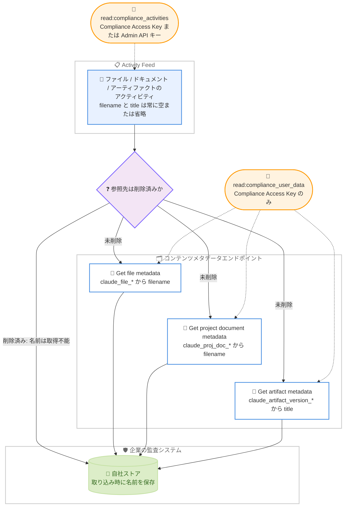

# Compliance API: Microsoft 365 ローカルセッションが GA、Activity Feed がファイル名・タイトルを非返却に

## メタデータ

| 項目 | 内容 |
|------|------|
| 発表日 | 2026-09-24 |
| ソース | Claude Developer Platform Release Notes |
| カテゴリ | Compliance API / エンタープライズ / コンプライアンス |
| 公式リンク | https://platform.claude.com/docs/en/release-notes/overview |

## 概要

Anthropic は 2026 年 9 月 24 日、Claude Developer Platform のリリースノートで Compliance API に関する 2 件の変更を公開した。

1 件目は、Compliance API のローカルセッションエンドポイントが、Excel、PowerPoint、Word、Outlook で動作する Claude for Microsoft 365 セッション (`product_surface` 値が `office_agents` で始まるもの) についてベータを卒業したことである。公式ドキュメントは「The local and remote session endpoints are stable for Cowork, Claude Code, and Claude for Microsoft 365 sessions」と明記しており、2026 年 8 月 26 日にベータ追加された Microsoft 365 カバレッジが約 1 か月で安定版に昇格した。

2 件目は、Compliance API の Activity Feed がファイル名、プロジェクトドキュメント名、アーティファクトタイトルを返さなくなったことである。ファイル、プロジェクトドキュメント、アーティファクトに関するアクティビティの `filename` および `title` フィールドは常に `null`、空文字列、または省略となり、この変更**以前に記録されたアクティビティにも遡って適用**される。名前やタイトルを参照するには、アクティビティ上の ID を `read:compliance_user_data` スコープ付きの Compliance Access Key でメタデータエンドポイントに渡して取得する。

なお、同日のリリースノートには refusal (拒否応答) の課金再開も含まれるが、これは別レポート ([refusal 課金対象の拡大](2026-09-24-refusal-billing-expansion.md)) で扱う。

## 詳細

### 背景

Compliance API のセッションエンドポイントは、Claude Enterprise 組織のユーザーが Claude アプリやエージェントで実行したセッションのトランスクリプトを、eDiscovery エクスポートや DLP 連携のために提供する仕組みである。ローカルセッションのカバレッジは以下のように段階的に拡大・安定化されてきた。

| 日付 | 変更内容 |
|------|---------|
| 2026-08-11 | ローカルセッションエンドポイントがベータ追加。Cowork (Claude Desktop) と Claude Code に対応 |
| 2026-08-26 | Cowork / Claude Code セッションが GA。Claude Science (`claude_science`) と Claude for Microsoft 365 (`office_agents` 系) がベータ追加 |
| 2026-09-18 | Claude in Chrome (`claude_in_chrome`) がベータ追加 |
| 2026-09-24 | **Claude for Microsoft 365 セッションがベータを卒業** (今回) |

詳細は [Compliance API セッションエンドポイント GA (2026-08-26)](2026-08-26-compliance-api-sessions-ga.md) および [Compliance API の Claude in Chrome 対応 (2026-09-18)](2026-09-18-compliance-api-claude-in-chrome.md) のレポートを参照。

一方、Activity Feed は組織全体の認証、チャット、ファイル、プロジェクト、管理、プラットフォームのアクティビティを新しい順に記録・返却するエンドポイントであり、発生から 1 分以内にクエリ可能、保持期間は 6 年である。今回の変更前は、ファイルやアーティファクトに関するアクティビティに `filename` や `title` が含まれていたが、この設計が改められた。ドキュメントには変更理由の記載はない。

### 主な変更点

#### 1. Claude for Microsoft 365 ローカルセッションのベータ卒業

リリースノートの原文は以下の通り。

> The Compliance API local session endpoints are out of beta for Claude for Microsoft 365 sessions in Excel, PowerPoint, Word, and Outlook (`product_surface` values beginning with `office_agents`).

これにより、公式ドキュメントのプロダクト対応状況は以下のように整理された。

| プロダクトと実行場所 | エンドポイントファミリー | `product_surface` | 提供状態 |
|--------------------|----------------------|-------------------|---------|
| Cowork (Claude Desktop、ユーザーのマシン上) | ローカル | `cowork` | 安定 |
| Claude Code (ターミナル / Claude Desktop / IDE 拡張、ユーザーのマシン上) | ローカル | `claude_code` | 安定 |
| **Claude for Microsoft 365 (Excel、PowerPoint、Word、Outlook のアドイン。Microsoft 365 のデスクトップ / Web アプリ内)** | **ローカル** | **`office_agents/excel`、`office_agents/powerpoint`、`office_agents/word`、`office_agents/outlook` (アプリを特定できない場合は `office_agents`)** | **安定 (今回)** |
| Claude Science デスクトップアプリ (ユーザーのマシン上) | ローカル | `claude_science` | ベータ |
| Claude in Chrome (ブラウザー拡張機能の組み込みチャット、ユーザーのマシン上) | ローカル | `claude_in_chrome` | ベータ |
| Cowork (claude.ai Web / モバイル開始、Anthropic 管理のクラウド環境) | リモート | `cowork_remote` | 安定 |

エンドポイント自体に変更はなく、既存の 3 つのローカルセッションエンドポイントがそのまま Microsoft 365 セッションを安定版として返す。

| エンドポイント | 役割 |
|---------------|------|
| `GET /v1/compliance/apps/sessions/local` | セッションメタデータの一覧 |
| `GET /v1/compliance/apps/sessions/local/{session_id}` | 単一セッションのメタデータ取得 |
| `GET /v1/compliance/apps/sessions/local/{session_id}/messages` | セッションのトランスクリプト取得 |

#### 2. Activity Feed のファイル名・タイトル非返却

リリースノートの原文は以下の通り。

> The Compliance API Activity Feed no longer returns file names, project document names, or artifact titles. The `filename` and `title` fields on file, project document, and artifact activities are now always empty or omitted, including on activities recorded before this change. To look up a name or title by the ID on the activity, use a Compliance Access Key with the `read:compliance_user_data` scope.

公式ドキュメント (Query the Activity Feed) では、この変更が以下のように明文化されている。

> Activities about a file, project document, or artifact do not include its name or title. As of September 24, 2026, the `filename` and `title` fields on these activities are always `null`, an empty string, or omitted, including on activities recorded before that date.

要点は以下の通り。

- **対象フィールド**: ファイル、プロジェクトドキュメント、アーティファクトに関するアクティビティの `filename` と `title`
- **返却値**: 常に `null`、空文字列、または省略のいずれか
- **遡及適用**: 2026 年 9 月 24 日より前に記録されたアクティビティにも適用される。過去のアクティビティを再取得しても名前は返らない
- **代替手段**: アクティビティ上の `claude_file_*`、`claude_proj_doc_*`、`claude_artifact_version_*` ID を、対応するメタデータエンドポイントに渡して名前やタイトルを取得する。この取得には `read:compliance_user_data` スコープ付きの Compliance Access Key が必要
- **取得できないケース**: ファイル、ドキュメント、アーティファクトが削除された後は名前やタイトルを取得できない。またアクティビティが該当 ID を持たない場合も取得できない

### 技術的な詳細

#### Microsoft 365 セッションの仕様 (ベータから継続)

GA に伴うエンドポイント仕様の変更は確認されていない。ベータ時点から明記されている以下の特性は引き続き有効である。

- `product_surface` はアプリ単位で分かれる: `office_agents/excel`、`office_agents/powerpoint`、`office_agents/word`、`office_agents/outlook`。アプリを特定できない場合は `office_agents` のみ
- アドイン内での会話削除は**クライアント側のみ**で行われ、API には反映されない。ローカルセッションに `deleted_at` フィールドはなく、保持期間が経過するまでセッションは一覧に残り続ける
- 認証は既存の Compliance Access Key と `read:compliance_user_data` スコープ。新しいキー、スコープ、設定、クライアントの更新は不要
- キャプチャは Claude Enterprise アカウントでサインインしている間の利用に適用され、HIPAA readiness 有効化組織のローカルセッションと ZDR 適用セッションは対象外
- 保持期間は既定 6 年。組織が有限のカスタム会話保持期間を設定している場合はその期間 (複数ある場合は最短) が適用される

#### 名前・タイトルを取得するメタデータエンドポイント

Activity Feed のアクティビティが持つ ID の種類に応じて、以下のメタデータエンドポイントで名前やタイトルを取得できる (Retrieve files and artifacts のドキュメントを参照)。

| アクティビティ上の ID | メタデータエンドポイント | 取得できる名前 |
|---------------------|------------------------|---------------|
| `claude_file_*` | Get file metadata (`GET /v1/compliance/apps/chats/files/{claude_file_id}`) | `filename` |
| `claude_proj_doc_*` | Get project document metadata | `filename` |
| `claude_artifact_version_*` | Get artifact metadata | `title` |

Get file metadata のレスポンスには `filename` (string or null) のほか、`mime_type`、`size_bytes`、`md5`、`created_at`、参照元の `claude_chat_ids` / `message_ids` が含まれる。プロジェクトドキュメントとアーティファクトのメタデータエンドポイントの正確な URL パスは API リファレンスを参照 (本レポートでは未確認)。

#### スコープとキー種別の違いに注意

今回の変更で、Activity Feed とメタデータエンドポイントの認可要件の違いが運用上重要になった。

| 操作 | 必要スコープ | Compliance Access Key | Admin API キー |
|------|-------------|----------------------|---------------|
| Activity Feed のクエリ | `read:compliance_activities` | 利用可 | 利用可 |
| ファイル / ドキュメント / アーティファクトのメタデータ取得 | `read:compliance_user_data` | 利用可 | **利用不可 (403 Forbidden)** |

公式ドキュメントによると、チャット、ファイル、プロジェクト関連のエンドポイントは Admin API キー (`sk-ant-admin01-...`) では利用できず 403 Forbidden が返る。つまり、**Admin API キーのみで Activity Feed を消費していたインテグレーションは、ファイル名やタイトルを一切解決できなくなる**。名前の解決が必要な場合は、`read:compliance_user_data` スコープ付きの Compliance Access Key (`sk-ant-api01-...`) の払い出しが必要である。

#### 削除済みコンテンツの名前は取得不能

ドキュメントは「You cannot look up a name or title after the file, document, or artifact is deleted, or when the activity has no such ID」と明記している。アクティビティ自体は 6 年間保持されるが、参照先のコンテンツが削除されると名前を解決する手段はなくなる。監査記録として名前が必要な場合は、アクティビティ取得時に名前解決まで行い、自社側に保存しておく設計が必要になる。

## 管理者・開発者への影響

### 対象

- **コンプライアンス / eDiscovery 担当者**: Microsoft 365 アドインでの作業内容を証跡として取得する担当者。および Activity Feed のファイル名を調査キーとして利用していた担当者
- **セキュリティチーム**: SIEM に Activity Feed を取り込み、ファイル名ベースの検知ルール (機微情報を含むファイル名のアラートなど) を運用しているチーム
- **Compliance API のインテグレーション実装者**: Activity Feed のパーサーと、名前解決のためのメタデータエンドポイント呼び出しを実装・保守する開発者
- **Claude Enterprise 管理者**: Claude for Microsoft 365 の本番展開と、Compliance Access Key のスコープ管理を行う管理者

### 必要なアクション

1. **Microsoft 365 監査の本番昇格の判断**: ローカルセッションエンドポイントが Microsoft 365 セッションについて安定版となったため、ベータを理由に見送っていた本番運用への組み込みを再評価する
2. **Activity Feed パーサーの確認**: `filename` / `title` フィールドに依存する処理 (表示、検索インデックス、検知ルール) を洗い出す。フィールドは `null`、空文字列、省略のいずれにもなり得るため、3 パターンすべてを許容する実装にする
3. **名前解決フローの追加**: 名前やタイトルが必要な場合は、アクティビティの `claude_file_*` / `claude_proj_doc_*` / `claude_artifact_version_*` ID をメタデータエンドポイントに渡して解決する。削除後は解決できないため、必要な名前はアクティビティ取り込み時に解決して自社側へ保存する
4. **キーとスコープの確認**: Admin API キーのみで Activity Feed を利用している場合、名前解決には `read:compliance_user_data` スコープ付き Compliance Access Key の追加払い出しが必要になる
5. **過去データへの影響の周知**: 変更は過去のアクティビティにも遡及するため、Activity Feed の再取得で過去の名前を復元することはできない。取り込み済みの自社側データが唯一の記録となる場合があることを関係者に共有する

### 移行ガイド (該当する場合)

- **Microsoft 365 セッション**: ベータからの破壊的変更は確認されていない。エンドポイント URL、認証、フィルター、ページング、レスポンス形式、`product_surface` 値はベータ時点と同じであり、コード変更は不要である
- **Activity Feed**: `filename` / `title` を参照している箇所を、ID ベースのメタデータ参照に置き換える。メタデータエンドポイントの呼び出しは Activity Feed とは別のスコープ (`read:compliance_user_data`) を要求するため、キー管理の見直しもあわせて行う

## コード例

### Microsoft 365 セッションの一覧取得 (安定版)

```bash
# ローカルセッション一覧。product_surface のサーバーサイドフィルターはないため
# クライアント側で office_agents 系を振り分ける
curl --fail-with-body -sS -G \
  "https://api.anthropic.com/v1/compliance/apps/sessions/local" \
  --header "x-api-key: $ANTHROPIC_COMPLIANCE_ACCESS_KEY" \
  --header "anthropic-version: 2023-06-01" \
  --data-urlencode "updated_at.gte=2026-09-24T00:00:00Z" \
  --data-urlencode "limit=500"
```

### ファイルアクティビティの取得と名前解決

```bash
# 1. Activity Feed からファイルアクティビティを取得する
#    filename フィールドは常に null / 空文字列 / 省略のいずれかになる
curl --fail-with-body -sS -G \
  "https://api.anthropic.com/v1/compliance/activities" \
  --header "x-api-key: $ANTHROPIC_COMPLIANCE_ACCESS_KEY" \
  --header "anthropic-version: 2023-06-01" \
  --data-urlencode "activity_types[]=claude_file_uploaded" \
  --data-urlencode "created_at.gte=2026-09-24T00:00:00Z"

# 2. アクティビティ上の claude_file_* ID でメタデータを取得し、filename を解決する
#    read:compliance_user_data スコープ付きの Compliance Access Key が必要
#    (Admin API キーでは 403 Forbidden となる)
file_id="claude_file_01UaT9wBcDfGhJkLmNpQrSv7"

curl --fail-with-body -sS \
  "https://api.anthropic.com/v1/compliance/apps/chats/files/$file_id" \
  --header "x-api-key: $ANTHROPIC_COMPLIANCE_ACCESS_KEY" \
  --header "anthropic-version: 2023-06-01"
```

### 名前解決を組み込んだ取り込み処理の考え方

```python
# filename / title は null、空文字列、省略のすべてを許容する
# 削除後は名前を解決できないため、取り込み時に解決して自社側へ保存する
def resolve_display_name(activity: dict, client) -> str | None:
    if file_id := activity.get("claude_file_id"):
        meta = client.get_file_metadata(file_id)  # 404 (削除済み) を許容する
        return meta.get("filename") if meta else None
    if doc_id := activity.get("claude_proj_doc_id"):
        meta = client.get_project_document_metadata(doc_id)
        return meta.get("filename") if meta else None
    if version_id := activity.get("claude_artifact_version_id"):
        meta = client.get_artifact_metadata(version_id)
        return meta.get("title") if meta else None
    return None  # 該当 ID を持たないアクティビティでは解決できない
```

## アーキテクチャ図



## 関連リンク

- [Claude Developer Platform Release Notes](https://platform.claude.com/docs/en/release-notes/overview)
- [The Compliance API](https://platform.claude.com/docs/en/manage-claude/compliance-api)
- [Retrieve local sessions](https://platform.claude.com/docs/en/manage-claude/compliance-sessions#retrieve-local-sessions)
- [Query the Activity Feed](https://platform.claude.com/docs/en/manage-claude/compliance-activity-feed)
- [Understand the Activity object](https://platform.claude.com/docs/en/manage-claude/compliance-activity-feed#understand-the-activity-object)
- [Retrieve files and artifacts](https://platform.claude.com/docs/en/manage-claude/compliance-content-data#retrieve-files-and-artifacts)
- [Get file metadata (API reference)](https://platform.claude.com/docs/en/api/compliance/apps/chats/files/retrieve)
- [Set up the Compliance API](https://platform.claude.com/docs/en/manage-claude/compliance-api-access)
- [Compliance API errors](https://platform.claude.com/docs/en/manage-claude/compliance-errors)
- [関連レポート: Compliance API セッションエンドポイント GA (2026-08-26)](2026-08-26-compliance-api-sessions-ga.md)
- [関連レポート: Compliance API の Claude in Chrome 対応 (2026-09-18)](2026-09-18-compliance-api-claude-in-chrome.md)
- [関連レポート: refusal 課金対象の拡大 (2026-09-24)](2026-09-24-refusal-billing-expansion.md)

## まとめ

2026 年 9 月 24 日の発表は、Compliance API の「カバレッジの安定化」と「Activity Feed のデータ最小化」という 2 つの方向の変更である。

- **Microsoft 365 セッションの監査が本番運用に組み込みやすくなった**: Excel、PowerPoint、Word、Outlook の Claude アドインセッション (`office_agents` 系) がベータを卒業し、Cowork / Claude Code と同じ安定版として扱えるようになった。エンドポイント、認証、`product_surface` 値に変更はなく、ベータ時点の実装はそのまま動作する
- **Activity Feed から名前情報が消え、過去分にも遡及する**: `filename` と `title` は常に空または省略となり、変更前に記録されたアクティビティを再取得しても名前は返らない。名前が必要な場合は ID からメタデータエンドポイントで解決する必要があり、削除済みコンテンツの名前は解決できない
- **キーとスコープの構成を見直す契機になる**: Activity Feed は Admin API キーでも呼べるが、名前解決に必要なメタデータエンドポイントは `read:compliance_user_data` スコープ付き Compliance Access Key でしか呼べない。Admin API キーのみのインテグレーションは、名前解決のためにキー構成の変更が必要になる
- **名前の保全は自社側の責務になった**: 監査記録としてファイル名やタイトルが必要な組織は、アクティビティ取り込み時に名前を解決して自社ストアへ保存するパイプラインを整備することが要点となる
