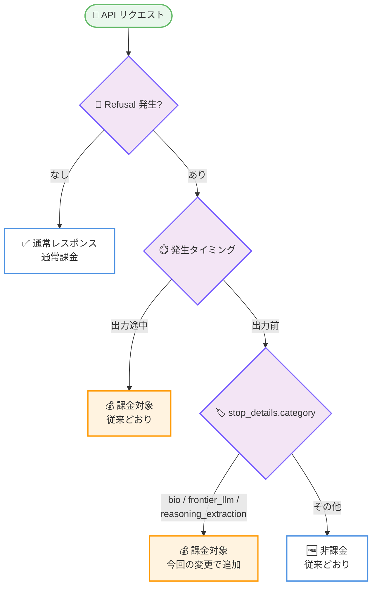

# Claude API アップデート: Refusal 課金対象の拡大 (特定カテゴリの出力前拒否も課金対象に)

## メタデータ

| 項目 | 内容 |
|------|------|
| 発表日 | 2026-09-24 |
| ソース | Claude Developer Platform Release Notes |
| カテゴリ | API アップデート / 課金 |
| 公式リンク | [Claude Developer Platform Release Notes](https://platform.claude.com/docs/en/release-notes/overview) |

## 概要

Anthropic は refusal (拒否) レスポンスの課金対象を拡大した。`stop_details.category` が `"bio"`、`"frontier_llm"`、`"reasoning_extraction"` のいずれかである場合、出力が生成される前に発生した拒否も課金対象となる。これらは誤検知 (false positive) の発生率が低いと計測されているカテゴリである。従来から課金対象であった出力途中 (mid-stream) の拒否に変更はなく、上記以外のカテゴリにおける出力前の拒否は引き続き非課金である。本変更はすべてのプラットフォームに適用される。

## 詳細

### 背景

Refusal 課金の仕組みは、これまで以下のように運用されてきた。

- **2026 年 6 月 2 日**: `stop_reason: "refusal"` を返し、出力を一切生成しなかったリクエストは課金対象外となった (詳細は [2026-06-02 のレポート](./2026-06-02-advisor-tool-max-tokens-refusal-billing.md) を参照)
- **Mid-stream refusal**: 出力の生成が始まった後に発生する拒否は、従来から課金対象であった

拒否の理由は、レスポンスの `stop_details.category` フィールドでカテゴリとして提供される。

### 主な変更点

#### 1. 特定カテゴリの出力前拒否が課金対象に

`stop_details.category` が以下のいずれかである場合、出力が生成される前に発生した拒否も課金対象となる。

- `"bio"`
- `"frontier_llm"`
- `"reasoning_extraction"`

リリースノートによると、これらは誤検知の発生率が低いと計測されているカテゴリである。

#### 2. 課金レート

新たに課金対象となる拒否は、他のリクエストと同様に、リクエストを実行したモデルのレートで課金される。

#### 3. 変更されない点

- **他カテゴリの出力前拒否**: 上記 3 カテゴリ以外の出力前拒否は、引き続き課金対象外
- **Mid-stream refusal**: 従来から課金対象であり、扱いに変更なし
- **Fallback credit**: 変更なし

#### 4. 適用範囲

本変更はすべてのプラットフォームに適用される。

### 技術的な詳細

#### 課金判定のフロー



#### 変更前後の比較

| 拒否の種類 | 変更前 | 変更後 |
|-----------|--------|--------|
| 出力前の拒否 (`bio` / `frontier_llm` / `reasoning_extraction`) | 非課金 | **課金対象** |
| 出力前の拒否 (その他のカテゴリ) | 非課金 | 非課金 |
| Mid-stream refusal | 課金対象 | 課金対象 |

## 開発者への影響

### 対象

- Claude API を利用するすべての開発者 (全プラットフォームに適用)
- 特に、拒否が発生しやすいワークロードを運用し、コストを管理している開発者

### 必要なアクション

1. **課金レポートの確認**: 出力前の拒否が課金される場合があるため、コスト集計のロジックやダッシュボードを確認する
2. **拒否ハンドリングの確認**: `stop_details.category` を記録し、どのカテゴリの拒否が発生しているかを把握する
3. **リトライロジックの見直し**: 課金対象カテゴリの拒否を無条件にリトライすると、コストが積み上がる可能性があるため注意する

### コスト影響

- `"bio"`、`"frontier_llm"`、`"reasoning_extraction"` カテゴリの拒否が頻発するワークロードでは、コストが増加する可能性がある
- 課金レートは、リクエストを実行したモデルの通常レートと同じ
- Fallback credit の扱いに変更はない

## コード例

```python
response = client.messages.create(...)

if response.stop_reason == "refusal":
    category = response.stop_details.category
    print(f"Refusal category: {category}")

    # bio / frontier_llm / reasoning_extraction は
    # 出力前の拒否でも課金対象となる
    billed_categories = {"bio", "frontier_llm", "reasoning_extraction"}
    if category in billed_categories:
        print("このリクエストは課金対象です")
```

## 関連リンク

- [Claude Developer Platform Release Notes](https://platform.claude.com/docs/en/release-notes/overview)
- 関連レポート: [Advisor Tool の max_tokens パラメータと Refusal 課金の廃止 (2026-06-02)](./2026-06-02-advisor-tool-max-tokens-refusal-billing.md)

## まとめ

誤検知率が低いと計測されている 3 つのカテゴリ (`bio`、`frontier_llm`、`reasoning_extraction`) について、出力前の拒否も課金対象となった。その他のカテゴリの出力前拒否は引き続き非課金であり、mid-stream refusal と fallback credit の扱いに変更はない。該当カテゴリの拒否が発生しうるワークロードを運用する開発者は、コスト管理とリトライロジックの見直しを推奨する。
