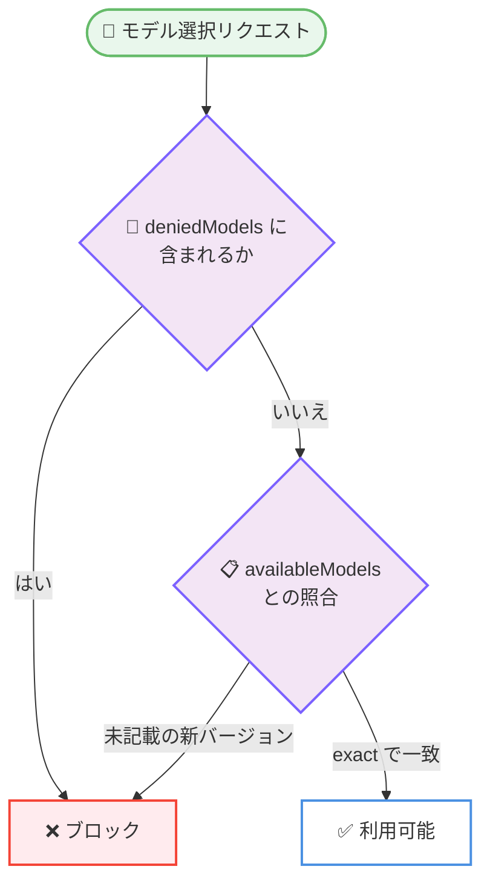

# Claude Code v2.1.283: モデル統制の managed 設定強化、/doctor prompt-audit の追加、MCP・プラグイン管理の広範な信頼性改善

## メタデータ

| 項目 | 内容 |
|------|------|
| 発表日 | 2026-09-25 |
| ソース | Claude Code Changelog |
| カテゴリ | Claude Code / CLI アップデート |
| 公式リンク | https://github.com/anthropics/claude-code/blob/main/CHANGELOG.md |

## 概要

Claude Code v2.1.283 がリリースされた。約 94 項目の変更を含むリリースで、エンタープライズ向けのモデル統制機能の強化と、MCP・プラグイン管理を中心とした広範な信頼性改善が特徴となっている。

新機能では、モデル利用を厳密に制御する `availableModelsMatch` と `deniedModels` の managed 設定、プロンプトエンジニアリングの古いパターンを検出する `/doctor prompt-audit`、LLM ゲートウェイ向けの `x-claude-code-prompt-id` ヒントヘッダー、Claude apps gateway の負荷テストモード (`load_test_mode`) と Amazon Bedrock Mantle エンドポイント向けの `mantle` upstream プロバイダーなどが追加された。修正面では、Windows の PowerShell ツールがドライブルートなどの削除を許してしまう問題や、大文字小文字のみが異なるプラグイン ID の誤削除といったセキュリティ・データ保全に関わる修正、MCP サーバーの接続・進捗通知・サインインに関する多数の修正が行われている。また、サードパーティプロバイダー利用時などのデフォルトパーミッションモードが auto mode になる動作変更や、v2.1.282 で導入された `claude-ai` 名の予約の取り消しも含まれている。

## 詳細

### 背景

Claude Code v2.1.283 は、約 176 項目の変更を含んだ 2026-09-23 の v2.1.281 に続く大型のメンテナンスリリースである。前バージョンで強化された Claude apps gateway と管理機能の流れを引き継ぎ、本バージョンでは組織管理者がモデルの利用可否をより厳密に制御できる managed 設定が追加された。同時に、MCP・プラグイン・キーバインディング・vim モードなど、日常利用に関わる修正が広範囲に行われている。

### 主な変更点

#### 1. モデル統制の managed 設定 (エンタープライズ向け)

組織管理者向けに、モデル利用を制御する 2 つの managed 設定が追加された。

- **`availableModelsMatch`**: `"exact"` を指定すると、`availableModels` のエントリはそこに記載されたモデルバージョンのみを許可する。新しいモデルがリリースされても、リストに追加されるまでブロックされたままになる
- **`deniedModels`**: 特定のモデルをブロックする設定。`availableModels` が許可しているモデルであってもブロックできる

これにより、組織は「許可リストの厳密一致」と「明示的な拒否リスト」を組み合わせて、利用可能なモデルを厳密に統制できるようになった。



#### 2. 新機能

- **`/doctor prompt-audit` (`/checkup prompt-audit` も可)**: CLAUDE.md ファイル、スキル、エージェント、コマンドを監査し、古いモデル向けに書かれたプロンプトパターンを検出する。あわせて、Claude Code の設定に対する `prompt-audit` も改善され、古いパス・古いコマンド・矛盾する指示ファイルがレポートの先頭に表示され、Claude Code がドキュメント化している thinking キーワードは保持されるようになった
- **`x-claude-code-prompt-id` ゲートウェイヒントヘッダー**: LLM ゲートウェイが 1 つのユーザープロンプトに対応するリクエスト群をグループ化できるようになった。`CLAUDE_CODE_GATEWAY_HINT_HEADERS=1` でオプトインする
- **OpenTelemetry の `tool.output` 拡張**: `OTEL_LOG_TOOL_CONTENT=1` のとき、MCP ツール、WebFetch、WebSearch の出力も `tool.output` スパンイベントに含まれるようになった
- **Claude apps gateway の `load_test_mode`**: オプトインの設定ブロックで、リクエストは構築・署名されるが upstream には送信されず、クライアントには定型の応答が返る。デプロイメントの負荷テストに利用できる
- **Claude apps gateway の `mantle` upstream プロバイダー**: Amazon Bedrock の Mantle エンドポイント向けプロバイダーが追加された
- **stream-json の `plugin_errors` に `path` を追加**: `--plugin-dir` のロード失敗エントリに、ロードできなかったディレクトリを示す `path` が含まれるようになった
- **フルスクリーンモードの click-to-expand**: 他のセッションからの切り詰められたメッセージをクリックで展開できるようになった

#### 3. セキュリティ・データ保全に関わる修正

- **Windows の PowerShell ツールの削除保護**: `cmd /c rd`、`rmdir`、`del`、`erase` により、`Remove-Item` が拒否するドライブルート、ホームフォルダーなどの削除が可能になっていた問題を修正
- **プラグインの誤削除の修正**: 大文字小文字のみが異なる ID を持つ 2 つのプラグインがインストールされている場合に、`claude plugin uninstall` が指定していない側のプラグインをオプションやシークレットごと削除してしまうことがある問題を修正 (指定した側にそのスコープの `enabledPlugins` エントリがない場合に発生)
- **managed `sandbox` 設定の fail-closed 化**: ネストされた値が 1 つ無効なだけで managed `sandbox` 設定全体が無視されていた問題を修正。無効な値は fail-closed となり、ブロックの残りの部分は引き続き適用される
- **サンドボックス内 git の認証情報**: サンドボックス化された `git` が credential helper にサンドボックスプロキシのログイン情報の保存を要求し、「failed to store」が表示される問題を修正

#### 4. MCP 関連の修正・改善

MCP サーバーの利用に関する修正が多数含まれている。

- 長時間実行のツールコールがバックグラウンドに移動した後、MCP の進捗通知が破棄されていた問題を修正。バックグラウンドタスクに最新の進捗が表示されるようになった
- セッション終了時に起動中だった stdio MCP サーバーが実行されたまま残る問題を修正
- ステートレスなリモート MCP サーバー (再デプロイ中のプロキシなど) からの一時的な HTTP 404 により、接続中と表示されたままそのサーバーがセッションの残りの間使用不能になる問題を修正
- 有効な URL を持たないサーバーへの MCP サインインが不明瞭な SDK エラーで失敗していた問題を修正。`/mcp` はそのようなサーバーに Authenticate を表示しなくなった
- `/context` が MCP サーバーの instructions をカウントしていなかった問題を修正。専用の行として表示され、合計にも含まれるようになった
- `/mcp` のツールリストを改善: 一度により多くのツールを表示し、ページキーとマウスでスクロールでき、組織がブロックしたツールには警告アイコンが付く
- MCP ツールが返す画像がファイルにも保存されるようになり、Bash や Read などのツールから開けるようになった
- MCP サーバーへのサインイン後に表示されるブラウザページが改善された (中央揃えレイアウト、ダークモード、新しいアートワーク)

#### 5. プラグイン管理の修正・改善

- `claude plugin validate` が、Claude Code がインストールできないプラグイン名・マーケットプレイス名を許容していた問題を修正。`marketplace.json` 内のそのような名前は検証エラーになる
- `claude plugin validate` が、`outputStyles`、`themes`、`monitors`、`lspServers` のパスが存在しない、またはプラグインディレクトリ外を指すプラグインを合格させていた問題を修正
- `claude plugin details` が、`plugin.json` で MCP サーバーを宣言しているプラグインに対して 0 servers と表示していた問題を修正
- `claude plugin marketplace remove` が、マーケットプレイスとともにアンインストールしたプラグインを列挙するようになった
- バージョンを宣言していないプラグインのキャッシュファイルが失われた場合に、インストール済みのコミットではなくソースの最新コミットで暗黙に復元されていた問題を修正
- ホームディレクトリや設定ディレクトリの移動後 (bind マウントされた devcontainer など) に、ユーザーがインストールしたプラグインとマーケットプレイスが「cache-miss」でロードに失敗する問題を修正
- `installed_plugins.json` に関する修正: 無効なプラグイン ID のレコードを含むファイルが再びロードできるようになり、読み取れないレコードを含む場合もファイルが書き換えられてレコードが失われることはなくなった。まったく読み取れない場合は、再構築前に内容が隣のファイルに保全され、`claude plugin list` がそのファイル名を案内する
- プラグインのロードに失敗した場合、Skill ツールはスキルを「未インストール」と呼ぶ代わりに、プラグインがロードできなかったことを伝えるようになった

#### 6. モデル選択・使用量に関する修正

- テレメトリ無効時に週次の Fable 上限が `/usage` と VS Code の使用量メーターに表示されなかった問題を修正
- `/model` が、プレーンな ID では拒否されるケースで、日付や `-v1:0` サフィックス付きの ID なら Sonnet 4.6 や Sonnet 5 の `[1m]` 指定を受け付けていた問題を修正
- `ANTHROPIC_DEFAULT_HAIKU_MODEL` で別のモデルを指定していても、`/model` ピッカーがハードコードされた Haiku のバージョンと価格を表示していた問題を修正
- モデルフォールバック中に開始された dynamic workflows が、設定されたモデルを再試行せず、すべてのエージェントをフォールバックモデルで実行していた問題を修正
- Haiku がセッションのメインモデルである場合に `DISABLE_PROMPT_CACHING_HAIKU` が効かなかった問題を修正
- テレメトリを `DISABLE_TELEMETRY` または `DO_NOT_TRACK` で無効にしていると、有料プランで Remote Control が使用できなかった問題を修正

#### 7. UI/UX の改善

- **`/tasks` の改善**: 各行にステータスアイコン・名前・情報が表示され、タスクが多くてもタイトルとキーヒントが画面に残り、ページングキー・マウスホイール・クリックに対応した
- **リスト操作の統一**: `/help`、`/hooks`、`/copy`、`/chrome`、`/memory`、`/ide`、`/release-notes`、`/rewind`、`/diff`、`/remote-env`、`/plugin` などのピッカーがページキー・マウスホイール・クリックに対応。`/skills` や `/artifacts` のような検索ボックス付きリストは、検索ボックスにフォーカスがある間はポインターを薄く描画する
- **コンパクションスピナーの改善**: タイマーがコンパクション開始時に始まり、パーセントバーの代わりにサマリーのトークン数がストリームに合わせてカウントされる
- **vim モードの修正**: `.` が Shift+Enter の改行を落とす問題、アクセント付き文字の内部にカーソルが残る問題、10,000 文字を超えるプロンプト recall 後のカーソル位置、`J` の結合時のスペーシングが Vim と異なる問題、最終行での `3J` や Visual モード `J` の挙動などを修正
- **キーバインディングの修正**: 組み込みのキーバインディングガイドの誤り (コードのタイムアウトを 1 秒と記載、`cmd` を `meta` の別名と記載) を修正。`keybindings.json` の `ctl+k` のような誤記に対してデバッグログで警告し修正を提案するようになった。`footer:openSelected` の再バインド後もフッターヒントが古い表示のままになる問題も修正
- **その他の修正**: スクリーンリーダーモードのパーミッションダイアログが引用されたコマンドやパスをダイアログ自体のテキストとして読み上げる問題、Warp ターミナルで markdown リンクがプレーンテキストになる問題、`claude mcp add` / `add-json` / `remove` が設定ファイルへの書き込み失敗時にも成功と報告する問題、素早く連続入力されたキーが古い状態に対して処理されることがある問題、クラウドセッションで返信の最初の数語の表示が遅れる問題などを修正

#### 8. パフォーマンスの改善

- 最初のレスポンスの終わりに実行されていたパターンコンパイル処理が、レスポンスのストリーム中に実行されるようになり、初回レスポンスのレイテンシが改善された
- 事前接続済みの API コネクションを再利用することで、初回リクエストのレイテンシが改善された
- `claude -p` と Claude Code Remote は対話型 UI をロードしなくなり、auto mode 分類器のルールと Artifact ツールは起動時ではなく初回使用時にロードされるようになった
- Artifact ツールの機能が未確認の claude.ai アカウント (初回実行時など) で、プロンプト表示が最大 1.5 秒のチェックを待たなくなった

#### 9. 動作変更

- **デフォルトパーミッションモードの変更**: サードパーティプロバイダー上、またはテレメトリ無効の対話型セッションは、パーミッションモードが未設定の場合 auto mode で開始されるようになった。`permissions.defaultMode` の設定は引き続き優先される
- **`claude-ai` 名の予約の取り消し**: v2.1.282 での予約が取り消され、この名前を持つスキル・コマンド・ワークフロー・MCP サーバーのスキルとプロンプトが再びロードされるようになった。`Skill(claude-ai:*)` ルールは通常のプレフィックスルールに戻った
- **Skill の deny ルールの拡張**: `Skill(anthropic-skills:<name>)` の deny ルールは、Claude Desktop がプラグインとして配信するスキルもブロックし、`Skill(skill:<name>)` の deny はスキルのエイリアスと表示名にもマッチするようになった
- **`--system-prompt` / `--append-system-prompt` の併用**: テキスト形式と `-file` 形式を同時に指定できるようになった。ファイルのテキストが先に配置される
- **`claude plugin eval` の git 要件**: git がインストールされている場合、git 2.31 以降が必須になった。古い git での実行はバージョンを明示したメッセージとともに拒否される
- **`/ultrareview` の起動ダイアログ**: ローカルブランチのレビューでは、追跡ファイルの未コミット変更がアップロードされる可能性がある旨を表示するようになった
- **`/model` ピッカーの表示**: Opus がすでに 1M コンテキストウィンドウを持つ環境では、Opus の行とデフォルトモデル名から「(1M context)」表記が削除された。ウィンドウ自体は変更されていない
- **プロンプト候補の頻度調整**: ターミナルのプロンプト候補は、20 回連続で未使用の場合に表示頻度が下がる。候補を使用すると元に戻る
- **Artifact の自動 watch**: 自動的に開始された watch は、アクティビティのない状態が 3.5 時間続くと終了する。公開または再度の watch で再開される
- **worktree のチェックアウト**: CA 証明書が `GIT_CONFIG_COUNT` 環境変数ペアとして git に渡されている場合に、証明書検証 (Git LFS ダウンロードなど) が失敗する問題を修正
- **auto-memory の修正**: git リポジトリのサブディレクトリで Claude Code を起動した場合に、Claude 自身の auto-memory ノートへの編集が機密ファイル書き込みとしてブロックされていた問題を修正
- **セルフホストランナーの git の変更**: ライフサイクルフックの git はリポジトリの Git LFS `pre-push` フックをスキップし、書き込み可能なシステム `core.hooksPath` を無視し、`--configure-git` なしではコミットに署名しなくなった。また、Anthropic 管理の git では `GIT_SSL_CAINFO` と `GIT_SSL_NO_VERIFY` の扱いが変わり、ランナー自身の git は Anthropic の git ルートを常に検証する

#### 10. VS Code / Cloud sessions / Claude Tag / Code Review の修正 (抜粋)

- **VS Code**: auto mode や bypass mode からの自動切り替えが失敗した後も、パーミッションモードインジケーターが Default と表示され続ける問題を修正 (切り替えは成功するまで再試行される)。Web からテレポートしたセッションが作業中に送信されたメッセージを失う問題、空のローカルコピーが原因で Web セッションがリストから隠れる問題、再オープンしたセッションのターン分割や巻き戻し済みターンの表示に関する問題なども修正
- **Cloud sessions**: GitHub アカウントで読み取り可能だがプッシュ権限のないプライベートリポジトリを、実行中のセッションに読み取り用として追加できるようになった。サーバー側の再起動からの復旧後に、完了済みのステップ (コメントやプッシュの重複投稿など) を再実行することがある問題も修正。新しいルーチンスケジュールは毎時数分過ぎがデフォルトとなり、正時ちょうどのルーチンは数分遅れて開始される可能性がある旨の注記が追加された
- **Claude Tag (Slack)**: Claude の Slack 検索を、追加済みのパブリックチャンネルに制限する「Channels Claude can search」管理者設定が追加された (組織・ワークスペース・チャンネル単位で設定可能)。Claude アカウント接続後のページに Back to Slack ボタンが追加されたほか、attach ルール経由のアクセスバンドル表示、大量の選択リポジトリを持つ GitHub App インストールでのリポジトリ検索、返信の重複投稿、Slack Connect 共有後のチャンネル ID 変更によるルーチン停止などの問題を修正
- **Code Review**: GitHub が pull request を返せなかった場合に「@claude review」が沈黙する問題を修正 (1 回再試行され、それでも失敗した場合はコメントで説明される)。何も検証できないまま時間制限で停止したレビューは incomplete と表示され、課金されず、1 回再試行されるようになった

### 技術的な詳細

#### ゲートウェイヒントヘッダーの有効化

LLM ゲートウェイを運用している場合、以下の環境変数でヒントヘッダーをオプトインすると、1 つのユーザープロンプトに対応するリクエスト群を `x-claude-code-prompt-id` でグループ化できる。

```bash
export CLAUDE_CODE_GATEWAY_HINT_HEADERS=1
```

#### OpenTelemetry でのツール出力の記録

```bash
# MCP ツール、WebFetch、WebSearch の出力も tool.output スパンイベントに含める
export OTEL_LOG_TOOL_CONTENT=1
```

#### プロンプト監査の実行

```bash
# CLAUDE.md、スキル、エージェント、コマンドを古いモデル向けの
# プロンプトパターンについて監査する
claude
> /doctor prompt-audit
```

## 開発者への影響

### 対象

- Claude Code CLI を使用しているすべてのユーザー
- モデル利用を統制したいエンタープライズ管理者 (`availableModelsMatch` / `deniedModels`)
- LLM ゲートウェイや Claude apps gateway を運用している管理者 (ヒントヘッダー、`load_test_mode`、`mantle` プロバイダー)
- MCP サーバー・プラグインの開発者および利用者 (接続・進捗・検証に関する多数の修正)
- サードパーティプロバイダー経由、またはテレメトリ無効で Claude Code を利用しているユーザー (デフォルトパーミッションモードの変更)
- Windows ユーザー (PowerShell ツールの削除保護)
- CLAUDE.md やスキルなどのプロンプト資産を運用しているユーザー (`/doctor prompt-audit`)
- VS Code 拡張、Cloud sessions、Claude Tag (Slack)、Code Review の利用者

### 必要なアクション

- **デフォルトパーミッションモードの確認**: サードパーティプロバイダー上、またはテレメトリ無効の環境では、パーミッションモード未設定の対話型セッションが auto mode で開始されるようになった。従来の動作を維持したい場合は `permissions.defaultMode` を明示的に設定する
- **モデル統制を厳密化したい場合**: managed 設定で `availableModelsMatch` に `"exact"` を指定するか、`deniedModels` でブロックするモデルを列挙する
- **プロンプト資産の監査**: `/doctor prompt-audit` を実行し、古いモデル向けに書かれたプロンプトパターン、古いパス、矛盾する指示ファイルを確認する
- **`claude plugin eval` を使用している場合**: git 2.31 以降が必要になったため、古い git を使用している環境ではアップグレードする
- **v2.1.282 で `claude-ai` 名の予約に対応した場合**: 予約は取り消されたため、`Skill(claude-ai:*)` ルールが通常のプレフィックスルールとして扱われることを確認する

### 移行ガイド (該当する場合)

破壊的変更は限定的だが、以下の動作変更に注意が必要である。

- サードパーティプロバイダー・テレメトリ無効環境でのデフォルトパーミッションモードが auto mode になった (`permissions.defaultMode` で上書き可能)
- `claude plugin eval` は git 2.31 以降を要求する
- `Skill(anthropic-skills:<name>)` / `Skill(skill:<name>)` の deny ルールのマッチ範囲が広がった
- 自動的に開始された Artifact の watch は 3.5 時間の無活動で終了する
- セルフホストランナーは `--configure-git` なしではコミットに署名しなくなった

## 関連リンク

- [Claude Code Changelog (v2.1.283)](https://github.com/anthropics/claude-code/blob/main/CHANGELOG.md)
- [Claude Code 公式ドキュメント](https://code.claude.com/docs)
- [Claude Code settings (設定と環境変数)](https://code.claude.com/docs/en/settings)
- [Claude Code のモニタリング (OpenTelemetry)](https://code.claude.com/docs/en/monitoring-usage)

## まとめ

Claude Code v2.1.283 は、約 94 項目の変更を含むメンテナンスリリースである。`availableModelsMatch` と `deniedModels` によるモデル統制の強化はエンタープライズ環境でのガバナンスを前進させ、`/doctor prompt-audit` はプロンプト資産をモデルの進化に追随させる実用的なツールとなる。Windows の PowerShell ツールの削除保護やプラグインの誤削除防止といった安全性の修正に加え、MCP サーバーの接続・進捗通知、プラグイン管理、リスト UI、初回レスポンスのレイテンシなど、日常的な利用体験に直結する改善が広範囲に行われている。サードパーティプロバイダーやテレメトリ無効環境でのデフォルトパーミッションモードの変更には注意が必要である。
