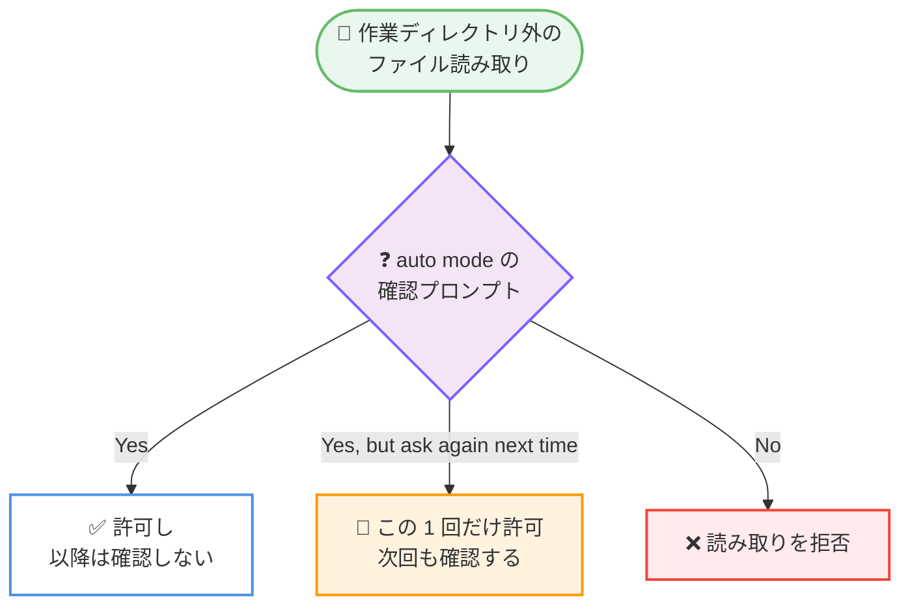
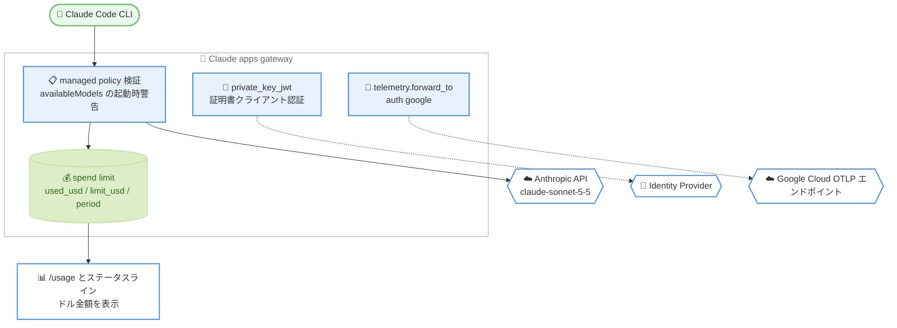

# Claude Code v2.1.284: Claude Sonnet 5.5 の追加とデフォルト化、auto mode の「次回も確認」応答、支出額のドル表示

## メタデータ

| 項目 | 内容 |
|------|------|
| 発表日 | 2026-09-28 |
| ソース | Claude Code Changelog |
| カテゴリ | Claude Code / CLI アップデート |
| 公式リンク | https://github.com/anthropics/claude-code/blob/main/CHANGELOG.md |

## 概要

Claude Code v2.1.284 がリリースされた。100 項目の変更を含むリリースで、最大の変更は Claude Sonnet 5.5 (`claude-sonnet-5-5`) の追加である。このモデルは Anthropic API 上のデフォルト Sonnet モデルとなり、1M コンテキストウィンドウと入力 $2 / 出力 $10 per MTok、キャッシュ読み取り $0.20/MTok という料金体系を持つ。

新機能では、auto mode が作業ディレクトリ外のファイルを読み取る前に表示する確認プロンプトに「Yes, but ask again next time」という選択肢が追加され、その 1 回だけを許可して以降も確認させる運用が可能になった。また、Claude apps gateway の支出上限が `/usage` とステータスラインでドル金額として表示されるようになり、ステータスラインの `rate_limits.spend_limit` には `used_usd`、`limit_usd`、`period` の 3 フィールドが追加された。`/effort` スライダーを操作するキーバインディングアクションや `/mcp reconnect all` の追加も含まれる。

修正面では、`ANTHROPIC_FOUNDRY_RESOURCE` が Foundry エンドポイントのホストへ未検証のまま補間されていた問題、および managed な `allowManagedPermissionRulesOnly` の下でプラグインが `allowed-tools` によって自身のツールを事前承認できていた問題という 2 件のセキュリティ関連修正が行われた。加えて、破損したレスポンスストリーム、thinking ブロック直後のサーバーエラー、コンパクション後も解消しない「Prompt is too long」といった信頼性に関わる修正が広範囲に入っている。

## 詳細

### 背景

Claude Code v2.1.284 は、約 94 項目の変更を含んだ 2026-09-25 の v2.1.283 に続くリリースである。v2.1.283 ではサードパーティプロバイダー上やテレメトリ無効環境に限って対話型セッションのデフォルトパーミッションモードが auto mode になったが、本バージョンではこの変更がすべてのプランとプロバイダーに拡大された。auto mode の確認プロンプトに新しい応答が追加されたのは、この既定化に伴って作業ディレクトリ外の読み取り確認に触れる機会が増えたことと整合している。

また、v2.1.283 で追加された managed 設定によるモデル統制の流れを引き継ぎ、本バージョンでは Claude apps gateway 側で managed policy の `availableModels` の設定ミスを起動時に警告する仕組みが加わった。同日には Claude Sonnet 5.5 の公式発表も行われており、Claude Code 側でもこのモデルが利用可能になっている。

### 主な変更点

#### 1. Claude Sonnet 5.5 の追加と Sonnet デフォルトモデル化

Claude Sonnet 5.5 (`claude-sonnet-5-5`) が追加され、Anthropic API 上のデフォルト Sonnet モデルになった。

| 項目 | 内容 |
|------|------|
| モデル ID | `claude-sonnet-5-5` |
| コンテキストウィンドウ | 1M トークン |
| 入力料金 | $2 / MTok |
| 出力料金 | $10 / MTok |
| キャッシュ読み取り | $0.20 / MTok |
| 位置づけ | Anthropic API 上のデフォルト Sonnet モデル |

Anthropic API を利用しているユーザーは、モデルを明示的に指定していない場合、Sonnet の選択が自動的に `claude-sonnet-5-5` へ切り替わる。

あわせて、Claude apps gateway 経由の Claude Desktop で 1M コンテキストの選択肢が表示されなかった問題も修正された。ゲートウェイが 1M 対応モデルを Desktop 向けに自動的にマークするようになっている。

#### 2. auto mode の読み取り確認に「次回も確認」応答を追加

auto mode が作業ディレクトリ外のファイルを読み取る前に表示するプロンプトに、「Yes, but ask again next time」という応答が追加された。この応答を選ぶと、その 1 回の読み取りだけが許可され、以降の読み取りについては再び確認される。

従来は許可すると以降の同種の読み取りも通るため、一時的に 1 ファイルだけ参照させたい場合でも承認範囲が広がっていた。新しい応答により、承認の粒度を 1 回単位に絞れるようになった。



#### 3. 支出額のドル表示とステータスラインのフィールド追加

Claude apps gateway の支出上限が、`/usage` とステータスラインでドル金額として表示されるようになった。表示例は「$271.40 / $500.00 spent this month」のような形式で、ゲートウェイがこのバージョン以降を実行している場合に有効になる。

あわせて、ステータスラインに渡される `rate_limits.spend_limit` に以下の 3 フィールドが追加された。

- **`used_usd`**: 期間内に使用した金額
- **`limit_usd`**: 期間内の上限額
- **`period`**: 集計期間

これにより、カスタムステータスラインを実装している場合でも、残額や消費率をドル建てで表示できるようになった。

#### 4. キーバインディングとコマンドの追加

- **`effortSlider:decreaseEffort` / `increaseEffort` / `toggleUltracode`**: 3 つのキーバインディングアクションが追加され、`/effort` スライダーの矢印キーと Tab キーを `keybindings.json` で再割り当てできるようになった
- **`/mcp reconnect all`**: 対話型ターミナルで、接続に失敗した、または認証が必要な MCP サーバーすべてを一度に再試行できるようになった
- **`/rate-limit-options`**: claude.ai のサブスクライバー向けに `/help` とコマンドメニューへ追加された。使用量上限の通知がこのコマンドに言及するため、通知から実際に見つけられるコマンドになった

#### 5. Claude apps gateway の管理機能強化

- **managed policy の起動時警告**: managed policy の `availableModels` が空の場合、または Claude Code が起動時に使用するモデルを含んでいないのに `model` も `enforceAvailableModels` も設定されていない場合に、起動時に警告が表示されるようになった
- **`telemetry.forward_to` の `auth: { google: {} }`**: テレメトリ転送先に Google の認証方式を指定できるようになり、ゲートウェイの Google Cloud 認証情報を使って Google Cloud の OTLP エンドポイントへ直接エクスポートできるようになった
- **`private_key_jwt` による証明書クライアント認証**: Claude apps gateway と ID プロバイダーの間で、証明書クライアント認証が利用できるようになった。クライアントシークレットの代わりに証明書資格情報を発行する ID プロバイダーに対応する
- **`431 Request Header Fields Too Large` の修正**: ID プロバイダーが多数のグループを列挙するサインインで、ゲートウェイがすべてのリクエストに `431` を返す問題を修正。リクエストヘッダーは 256 KiB まで受け付けるようになった

#### 6. セキュリティ・権限に関わる修正

- **`ANTHROPIC_FOUNDRY_RESOURCE` の検証追加**: この環境変数が Foundry エンドポイントのホストへ未検証のまま補間されていた問題を修正。プレーンなリソース名ではない値は拒否されるようになった
- **プラグインによる自己事前承認の制限**: managed な `allowManagedPermissionRulesOnly` の下で、マーケットプレイス、claude.ai、npm 由来のプラグインが `allowed-tools` によって自身のツールを事前承認できていた問題を修正。この事前承認を維持できるのは、Anthropic の公式ソース由来のプラグイン、または managed 設定が保証するソース由来のプラグインのみとなった
- **外部シンボリックリンクの承認**: プロジェクト外から `.claude/rules` へシンボリックリンクされたルールが、外部インポートの承認プロンプトを表示せずにスキップされていた問題を修正。プロジェクト外からシンボリックリンクされた `.claude` ディレクトリも同じ承認を求めるようになった
- **`claude mcp add` の誤った成功報告**: managed 設定が MCP サーバーをプラグインに制限している場合に、`claude mcp add` が成功を報告していた問題を修正。ロードされないサーバーを保存する代わりに、拒否して対処方法を案内するようになった
- **auto-memory の無害化**: `MEMORY.md` と recall されたメモリノートに含まれる不可視文字や Claude Code 自身のマークアップを模したタグが、Claude に届く前に無効化されるようになった
- **Workflow ツールのサンドボックス強化**: 非同期スクリプトフックが投げるエラーに対するサンドボックスの堅牢性が改善された
- **Artifact の公開制限**: ネットワーク共有上のファイル (`\\host\share` パスや `/net` の automount) は、`--add-dir` で追加したマップ済みネットワークドライブ上にある場合を除き、公開が拒否されるようになった

#### 7. 信頼性の修正 (ストリーム、リトライ、コンパクション)

- **破損したレスポンスストリームの扱い**: 「JSON Parse error」や「undefined is not an object」といった生のエラーが表示されたり、回答に「undefined」という単語が書き込まれたりする問題を修正。再試行、または中断されたレスポンスとして報告されるようになった
- **thinking ブロック直後のエラーのリトライ**: thinking ブロックの直後に到着した overloaded またはサーバーエラーが、再試行されずにターンをエラーで終了させていた問題を修正
- **コンパクション後も残る「Prompt is too long」**: コンパクション後のリクエストがまだ長すぎる場合に、直近の会話をより少なく残してもう一度コンパクションを行うようになった
- **モデル利用不可の通知**: セッションのモデルが利用できずフォールバックモデルも残っていない場合に、「is currently unavailable」だけの表示 (クラウドセッションでは「Something went wrong」) になっていた問題を修正。モデル利用不可の通知と Learn more リンクが表示されるようになった
- **Agent SDK の不正なブロック処理**: ユーザーメッセージに `source` が不正な画像が含まれる場合に Agent SDK セッションがクラッシュする問題、および不正なドキュメントブロック以降のすべてのターンが失敗する問題を修正。不正な画像は説明のためのメモに置き換えられる
- **再開セッションの MCP ツールコール**: 再開したセッションで、サーバーが接続中であるにもかかわらず MCP ツールコールが「No such tool available」で失敗する問題を修正。ツールコールはサーバーを最大 10 秒待つようになった
- **plan-usage エンドポイントのバックオフ**: レート制限やログイン拒否の後に `/usage`、`/extra-usage`、IDE の使用量ビューが繰り返し問い合わせていた問題を修正。再要求せずにバックオフするようになった
- **切断後のリトライ予算の共有**: レスポンス途中の接続切断後のリトライが、リクエストの他のリトライと 1 つの予算を共有するようになり、失敗し続けるリクエストが早く諦めるようになった

#### 8. 表示・入力周りの修正 (フルスクリーン、vim モード、ダイアログ)

- **フルスクリーンレンダリング**: transcript モードで `[` により会話をスクロールバックへ書き出す際に、セッションより上のターミナル出力が消去される問題を修正 (macOS と Linux)。スクロールアップ中に返信のストリームが完了すると、スクロール位置が前のメッセージや最下部へ飛ぶ問題も修正された
- **ダイアログのタブバー**: `/config` や `/plugin` などのタブバーが、狭いターミナルでタイトルとタブラベルを単語の途中で折り返す問題を修正。収まらないタブは単語ごと次の行へ移動する
- **`/model` ピッカー**: 最後のモデルまでスクロールした後もリストの下に「+1 model」と表示される問題を修正。カウントは表示行より下にあるモデルのみを対象とするようになった
- **キーバインディング**: `/keybindings` が、何も実行しないフッターアクションに対する Backspace と Delete のバインドを生成された `keybindings.json` へ書き込む問題を修正。再バインドしたエージェントパネルの閉じるキー (`footer:close`) が、閲覧中のエージェントの行で自身ではなく「x」を入力する問題も修正された
- **vim モード**: `.` が非常に速く入力されたテキスト (ssh や tmux 経由など) やブラケットペーストなしで貼り付けられたテキストを繰り返さない問題、`cw` の後に Esc を押すなど何も入力せずに変更を繰り返した後にプロンプトが INSERT モードのまま残る問題を修正。最終行での `dd` やプロンプト末尾での `yy` の後にカーソルが画像プレースホルダーの開き括弧に残り、`r` や `x` が画像を壊したり削除したりする問題も修正された
- **その他の入力修正**: shell モードで ↓ が非表示のバックグラウンドタスクピルを選択し、Backspace と Ctrl+U でプロンプトを編集できなくなる問題、ターミナルがフォーカスを取り戻した瞬間のキー入力が Remote Control 有効化プロンプトに安全遅延の再開前に応答してしまう問題、ホームディレクトリで起動した場合にレンダラー切り替えや更新の後に workspace trust ダイアログが再表示される問題を修正

#### 9. プラグイン関連の修正

- **Windows での Bash ツール失敗**: 多数のプラグインを有効にしている Windows 環境で Bash ツールが失敗する問題を修正。存在しないプラグインの `bin/` ディレクトリは PATH に追加されず、継承したエントリも二重に追加されなくなった
- **`sparsePaths` マーケットプレイス**: git 2.39 より前のバージョンで、`sparsePaths` を使うマーケットプレイスが空でクローンされ、動作していたローカルコピーを置き換えてしまい、更新のたびに「marketplace.json file is no longer present」で失敗する問題を修正
- **`/plugin` の configure 画面**: boolean のオプションが自由入力ではなく true / false の選択になり、number のオプションは無効な入力を拒否するようになった。←/→ はタブ切り替えではなくオプションフィールドの値を変更する
- **失敗したインストールの後片付け**: 依存関係のバージョン範囲を満たせず初回の `claude plugin install` が失敗した場合に、プラグインが有効なまま記録として残る問題を修正
- **`claude plugin marketplace add` の通知**: 同じ名前で別のソースから追加済みのマーケットプレイスを置き換える場合に、その旨と取り消し方法を伝えるようになった

#### 10. 動作変更

- **デフォルトパーミッションモードの全面 auto mode 化**: 対話型ターミナルと VS Code のセッションは、パーミッションモードが未設定の場合、すべてのプランとプロバイダーで auto mode で開始されるようになった。`permissions.defaultMode` の設定は引き続き優先される。v2.1.283 ではサードパーティプロバイダー上とテレメトリ無効環境に限定されていた変更が、本バージョンで全面適用された
- **Ultracode の独立トグル化**: Ultracode が `/effort` の独立したトグルになった (Tab、または `/effort ultracode [on|off]`)。xhigh の effort を強制しなくなり、どの effort レベルでも有効なまま維持される
- **セーフガード通知の改善**: Sonnet モデルのセーフガードがメッセージをフラグした際の通知が、理由を説明し、編集して再試行する選択肢を提示するようになった
- **安全関連のモデル切り替え**: `ANTHROPIC_DEFAULT_OPUS_MODEL` または `modelOverrides` で Opus モデルをピン留めしているセッションでは、Anthropic API 上でフラグの種類ごとに API 側が切り替え先のモデルを選ぶようになった。ピン留めしたモデルは使用されない
- **非対話の初回ターンでの MCP 待機**: `--allowedTools` または `mcp_tool` フックが名前を挙げた MCP サーバーについては、`CLAUDE_CODE_MCP_STARTUP_WAIT_MS` が `0` であっても接続を最大 2 秒待つようになった
- **`/recap` の中継拒否**: チャットスレッド (自分のものを含む)、ルーチン、webhook 経由で中継されて到着した `/recap` は、短い通知とともに辞退されるようになった。ターミナル、Claude アプリ、Remote Control、`-p`、SDK ホストから入力した場合は従来どおり動作する
- **`/artifacts` のフィルタタブ**: `/config` や `/plugin` と同じタブバーを使い、All、Mine、Shared という一語のラベルでタイトルの横に表示されるようになった

#### 11. その他の改善 (抜粋)

- **使用量上限待機の表示統合**: 上限の状態と、使用量クレジットの選択肢を含むカウントダウンが、プロンプトの下に 1 つのブロックとして表示されるようになった。上限のメッセージがカウントダウンを繰り返すこともなくなった
- **起動時間とメモリ使用量の改善**: 設定ファイルが実際に使用する部分だけを設定スキーマとして構築するようになった
- **リスト表示の整列**: `/tasks`、`/copy`、`/hooks` などで、名前の後の詳細が収まる場合は 1 つの列に揃い、収まらない場合は右端に配置されるようになった
- **フックのデバッグログ**: 失敗したフックが stdout にも書き込んでいた場合に stderr が欠落する問題、および出力のない失敗フックについて何も記録されない問題を修正。失敗したフックはステータスコードも記録するようになった
- **Elicitation フックの `block`**: Elicitation および ElicitationResult フックが返す `{"decision":"block"}` が無視されていた問題を修正。終了コード 2 と同様に MCP の elicitation を拒否するようになった
- **管理設定によるサインイン要求時の起動拒否メッセージ**: managed 設定が `forceLoginMethod` または `forceLoginOrgUUID` によるサインインを要求している一方で API キー、トークン、`apiKeyHelper` が設定されている場合に、使用中の資格情報、その設定場所、削除方法を示すようになった
- **`/loop` の可視ステータス**: 自己ペースモードのステータス更新が推論内にのみ書かれて表示されないことが多い問題を修正。各更新とループ停止時の結果が可視テキストとして書かれるようになった
- **Explore サブエージェントのモデル継承**: Claude Code が認識しないモデル ID (プロキシ経由のカスタムモデルなど) をセッションが使用している場合に、Explore サブエージェントが Anthropic API の Opus へ切り替わる問題を修正。そのモデルを継承するようになった
- **使用量上限の案内先**: すでに最上位の Max プランを利用しているユーザーに `/upgrade` を勧める警告を修正。警告と `/upgrade` 自体が、利用可能な場合は `/usage-credits` を案内するようになった
- **その他**: Claude in Chrome のツールをプレフィックスなしで呼んだ際の「No such tool available」エラーが呼ぶべきツール名を示すようになり、Monitor のイベント行は各イベントが出力した内容を表示するようになった。`/claude-api` の `hillclimb` は評価で測定できないほど小さな言い換えにラウンドを費やさなくなり、`/ultrareview` は macOS と Linux で Claude デスクトップアプリが作成した git worktree からでも作業ツリーをアップロードできるようになった。Linux で作業ディレクトリが書き込み拒否かつ読み取り拒否のディレクトリを含む場合にサンドボックス化された Bash コマンドが起動しない問題、Remote Control 経由で Claude アプリから送られた写真がプロンプトへ引き戻される際に失われる問題も修正された

#### 12. VS Code / Cloud sessions / Claude Tag / Code Review の修正 (抜粋)

- **VS Code**: 各プロンプトと応答の上に時刻を表示するオプション (Claude Code: Show Message Timestamps 設定、デフォルトはオフ) と、日付が変わる位置の日付行が追加された。Manage plugins の行にプラグインのロードエラーと注記が表示され、無効化・アンインストール・エラーのコピーを行うポップアップも追加された。Effort スライダーの下には Ultracode のオン / オフスイッチが追加され、モデルピルはどの effort レベルでも「· Ultracode」を表示する。修正としては、`/model` と Enter を入力するとモデルセレクターではなく使用方法のテキストがチャットに出力される問題、Vertex、Bedrock、Foundry で `/feedback` が送信後に拒否される問題 (レポートはターミナルと同様にローカルへ保存される)、他のエージェントやセッション、チャンネルからのメッセージがリロード後に消える問題、非 ASCII 文字・スペース・括弧を含むパスへのチャットリンクが開かない問題などが含まれる。`claudeCode.environmentVariables` 設定の `CLAUDE_CONFIG_DIR` は絶対パスの場合のみ適用され、チャットを継続するターミナルにも渡されるようになった
- **Cloud sessions**: オフライン時にルーチンの Edit と Duplicate のコントロールが「まだ読み込み中」と表示する問題を修正。オフラインであることを伝えるようになった
- **Claude Tag (Slack)**: スレッド、チャンネルのデフォルト、DM に対して「Opus (latest)」のようなモデルファミリーの選択肢が追加され、選択がそのファミリーの最新モデルに追随するようになった。分析の支出予測チャートには、組織全体の上限に計上される支出と上限の使用割合が追加された。修正・改善としては、GitHub Enterprise のホスト名にアンダースコアが含まれる場合に進捗カードとリンクプレビューがリポジトリと Create PR ボタンを省略する問題、環境が起動を拒否するチャンネルで Claude が沈黙する問題 (管理者への連絡を促す通知を 1 回投稿し、@メンションで再試行する)、Claude アカウントを接続していないユーザーへの非公開サインイン通知を @メンションごとに投稿する変更、Enterprise Grid での「Notify members now」の到達範囲拡大、オンデマンドランナーを使う self-hosted 環境での待機通知の明確化などがある
- **Code Review**: GitHub App の下で未提出のレビューが pull request に開いたままになっている場合に、Code Review が完成したレビューを投稿せずに諦める問題を修正。まず投稿を再試行するようになった

### 技術的な詳細

#### ステータスラインの `rate_limits.spend_limit`

ステータスラインへ渡される JSON に、支出上限のドル建てフィールドが追加された。カスタムステータスラインでは以下のような構造を参照できる。

```json
{
  "rate_limits": {
    "spend_limit": {
      "used_usd": 271.4,
      "limit_usd": 500.0,
      "period": "month"
    }
  }
}
```

#### Claude apps gateway のテレメトリ転送設定

`telemetry.forward_to` の転送先に `auth: { google: {} }` を指定すると、ゲートウェイの Google Cloud 認証情報を使って Google Cloud の OTLP エンドポイントへ直接テレメトリをエクスポートできる。

```json
{
  "telemetry": {
    "forward_to": [
      {
        "endpoint": "https://telemetry.googleapis.com/v1/traces",
        "auth": {
          "google": {}
        }
      }
    ]
  }
}
```

#### MCP サーバーの一括再接続

接続に失敗したサーバーや認証が必要なサーバーをまとめて再試行できる。

```bash
claude
> /mcp reconnect all
```

## 開発者への影響

### 対象

- Anthropic API 経由で Sonnet を利用しているすべてのユーザー (デフォルトモデルが `claude-sonnet-5-5` に変更)
- auto mode で Claude Code を利用しているユーザー (読み取り確認の新しい応答、全プランでの auto mode 既定化)
- Claude apps gateway を運用している管理者 (支出額表示、managed policy の起動時警告、`private_key_jwt`、テレメトリ転送)
- カスタムステータスラインを実装しているユーザー (`rate_limits.spend_limit` のフィールド追加)
- Microsoft Foundry 経由で Claude Code を利用しているユーザー (`ANTHROPIC_FOUNDRY_RESOURCE` の検証)
- managed `allowManagedPermissionRulesOnly` を適用している組織 (プラグインの自己事前承認の制限)
- Agent SDK を利用している開発者 (不正な画像・ドキュメントブロックの処理)
- MCP サーバー・プラグインの開発者および利用者
- キーバインディングをカスタマイズしているユーザー (`effortSlider:*` アクションの追加)
- VS Code 拡張、Cloud sessions、Claude Tag (Slack)、Code Review の利用者

### 必要なアクション

- **Sonnet のモデル指定の確認**: Anthropic API 上でモデルを明示していない場合、Sonnet の選択が `claude-sonnet-5-5` に切り替わる。特定バージョンに固定したい場合はモデル ID を明示的に指定する
- **パーミッションモードの確認**: すべてのプランとプロバイダーで対話型セッションが auto mode で開始されるようになった。従来の動作を維持したい場合は `permissions.defaultMode` を明示的に設定する
- **`ANTHROPIC_FOUNDRY_RESOURCE` の値の確認**: プレーンなリソース名以外の値を設定している場合は拒否されるため、リソース名のみを設定する形へ修正する
- **プラグインの権限設定の見直し**: managed `allowManagedPermissionRulesOnly` を適用している組織では、非公式ソース由来のプラグインが `allowed-tools` による事前承認を失う。必要なツールは managed 設定の permission ルールで明示する
- **ステータスラインの更新**: 支出上限をドル建てで表示したい場合は、`rate_limits.spend_limit` の `used_usd`、`limit_usd`、`period` を参照するようスクリプトを更新する。ゲートウェイ側も v2.1.284 以降である必要がある
- **Ultracode の利用方法の確認**: Ultracode は `/effort` の独立したトグルになったため、`/effort ultracode [on|off]` または Tab で切り替える

### 移行ガイド (該当する場合)

破壊的変更は限定的だが、以下の動作変更に注意が必要である。

- Anthropic API 上のデフォルト Sonnet モデルが `claude-sonnet-5-5` に変更された
- 対話型ターミナルと VS Code のセッションは、すべてのプランとプロバイダーで auto mode がデフォルトになった (`permissions.defaultMode` で上書き可能)
- `ANTHROPIC_FOUNDRY_RESOURCE` はプレーンなリソース名以外の値を拒否する
- managed `allowManagedPermissionRulesOnly` の下では、Anthropic 公式ソースまたは managed 設定が保証するソース以外のプラグインは `allowed-tools` による自己事前承認を行えない
- Ultracode は xhigh の effort を強制しなくなり、独立したトグルとして動作する
- `/recap` はチャットスレッド、ルーチン、webhook からの中継では実行されない
- Artifact の公開は、`--add-dir` で追加したマップ済みネットワークドライブ上にないネットワーク共有のファイルを拒否する
- `claudeCode.environmentVariables` の `CLAUDE_CONFIG_DIR` は絶対パスの場合のみ適用される

## コード例

`/effort` スライダーの操作キーを `keybindings.json` で再割り当てする例を示す。新しく追加された 3 つのアクションを任意のキーに割り当てられる。

```json
{
  "keybindings": [
    {
      "key": "ctrl+alt+down",
      "action": "effortSlider:decreaseEffort"
    },
    {
      "key": "ctrl+alt+up",
      "action": "effortSlider:increaseEffort"
    },
    {
      "key": "ctrl+alt+u",
      "action": "effortSlider:toggleUltracode"
    }
  ]
}
```

## アーキテクチャ図 (該当する場合)

Claude apps gateway に追加された支出額の可視化、managed policy の検証、証明書クライアント認証、テレメトリ転送の関係を示す。



## 関連リンク

- [Claude Code Changelog (v2.1.284)](https://github.com/anthropics/claude-code/blob/main/CHANGELOG.md)
- [Claude Sonnet 5.5 のレポート](./2026-09-28-claude-sonnet-5-5.md)
- [Claude Code v2.1.283 のレポート](./2026-09-25-claude-code-v2-1-283.md)
- [Claude Code 公式ドキュメント](https://code.claude.com/docs)
- [Claude Code settings (設定と環境変数)](https://code.claude.com/docs/en/settings)
- [Claude Code のキーバインディング](https://code.claude.com/docs/en/keybindings)
- [Claude Code のモニタリング (OpenTelemetry)](https://code.claude.com/docs/en/monitoring-usage)

## まとめ

Claude Code v2.1.284 は、100 項目の変更を含むリリースである。Claude Sonnet 5.5 の追加と Anthropic API 上での Sonnet デフォルトモデル化が最も影響の大きい変更で、1M コンテキストと入力 $2 / 出力 $10 per MTok という条件が標準の選択肢になった。auto mode の「Yes, but ask again next time」応答は、v2.1.283 から続く auto mode 既定化の流れに対して承認の粒度を細かくする実用的な追加であり、Claude apps gateway の支出額のドル表示とステータスラインの `used_usd` / `limit_usd` / `period` は、コストの可視化を日常のワークフローに組み込みやすくする。

セキュリティ面では、`ANTHROPIC_FOUNDRY_RESOURCE` の未検証補間の修正と、managed `allowManagedPermissionRulesOnly` 下でのプラグインによる自己事前承認の制限という 2 件が重要である。加えて、破損したレスポンスストリーム、thinking ブロック直後のサーバーエラーのリトライ、解消しない「Prompt is too long」への再コンパクション、再開セッションでの MCP ツールコールの最大 10 秒待機といった修正は、長時間のセッションや MCP を多用する環境での安定性を直接改善する。Sonnet のデフォルトモデル変更とパーミッションモードの全面 auto mode 化については、既存の設定への影響を確認しておくことを推奨する。
