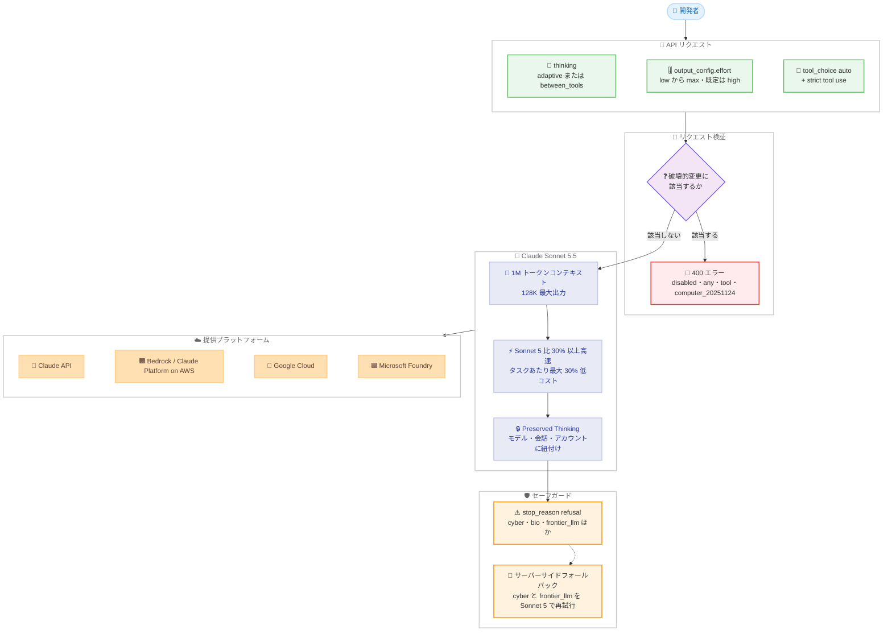

# Claude Sonnet 5.5 発表: 速度と知性の最適バランスを 30% 高速・最大 30% 低コストで実現

## メタデータ

| 項目 | 内容 |
|------|------|
| 発表日 | 2026-09-28 |
| ソース | Anthropic News / Claude API Release Notes |
| カテゴリ | 新モデル |
| 公式リンク | https://www.anthropic.com/claude-sonnet-5-5 |

## 概要

Anthropic は 2026 年 9 月 28 日、Claude 5.5 ファミリー 2 番目のモデルとなる **Claude Sonnet 5.5** (モデル ID: `claude-sonnet-5-5`) を発表した。公式発表では「速度と知性の最適な組み合わせ」と位置付けられ、Claude Opus 5.5 を補完する高速・低コストのモデルとして提供される。出力生成は Sonnet 5 より 30% 以上高速で、歴代の Sonnet で最速となる。

価格は入力 $2 / MTok、出力 $10 / MTok で Sonnet 5 の定価と同一だが、公式発表によると「必要なトークン数が大幅に少ない」ため、タスクあたりのコストは最大 30% 低くなる。コンテキストウィンドウは 1M トークン、最大出力は 128K トークン。Claude API、Amazon Bedrock、Claude Platform on AWS、Google Cloud、Microsoft Foundry で利用できる。

一方で、Claude API リリースノートは「Claude Sonnet 5 向けに書かれたコードは Claude Sonnet 5.5 で 5 つの形で壊れる可能性がある」と明記しており、移行時には破壊的変更への対応が必須となる。

## 詳細

### 背景

Sonnet 5.5 は、2026 年 9 月 22 日に発表された Claude Opus 5.5 に続く Claude 5.5 ファミリーの 2 番目のモデルである。公式発表では「Claude Opus 5.5 を補完する、より高速で低コストなモデル」と説明され、想定用途として「スコープが明確な日常業務、バグ修正、洗練されたドキュメント・スライド・スプレッドシートの作成」が挙げられている。

複雑で終わりが定まらない作業や、継続的な判断を要する作業については引き続き Opus 5.5 が優位とされる。ただしその差は小さく、GDPval-AA v2.1 では Sonnet 5.5 が Opus 5.5 の 2 ポイント下に位置する。Haiku 5.5 は「数週間以内」に公開予定と案内されている。

Claude Code でも v2.1.284 で対応が入り、changelog には「Claude Sonnet 5.5 を追加。Anthropic API 上でのデフォルト Sonnet モデルとなり、1M コンテキスト、$2/$10 per Mtok、キャッシュ読み取り $0.20/Mtok」と記載されている。

### 主な変更点

**ベンチマーク結果**: 以下は公式発表ページに掲載された数値である。

| ベンチマーク | Sonnet 5.5 | Sonnet 5 | Opus 5.5 | GPT-6 Sol |
|--------------|-----------|----------|----------|-----------|
| Terminal-Bench 4.0 | 70.6% | 10.3% | 66.4% | — |
| FrontierCode 1.1 Main | 46.2% | 42.4% | 54.4% | 49.3% |
| CursorBench 4.0 | 55.5% | 34.1% | 57.8% | — |
| GDPval-AA v2.1 (Elo) | 1844 | 1449 | 1846 | 1487 |
| AA-Briefcase v1.1 (Elo) | 1811 | 1359 | 1822 | 1483 |
| Humanity's Last Exam (ツール使用) | 64.5% | 54.9% | 67.7% | — |
| OSWorld 2.1 (部分評価) | 80.1% | 57.0% | 81.8% | — |
| Chartography (ツールなし) | 61.6% | 15.6% | 64.4% | 53.6% |

公式発表に記載された注記は以下のとおり。

- Opus 5.5 の Terminal-Bench 4.0 スコアは `xhigh` effort での測定値
- Sonnet 5.5 の FrontierCode スコアは `max` effort での測定値であり、コードレビューのサブエージェントが過剰にスコープを広げるため `xhigh` より低くなる
- GDPval-AA と AA-Briefcase はプレリリース環境で測定され、その後修正された structured outputs の不具合を含む
- 一部のベンチマークでは GPT-6 Sol ではなく GPT-5.6 Sol が比較対象となっているため、上表では「—」としている
- GPT-6 Sol のスコアは OpenAI の画像理解の修正より前の測定である可能性がある

**性能面のハイライト**: 主な項目は以下のとおり。

- **速度**: 出力生成は Sonnet 5 より 30% 以上高速で、歴代 Sonnet で最速
- **コスト効率**: 定価は Sonnet 5 と同一ながら、必要なトークン数が大幅に少ないためタスクあたり最大 30% 低コスト
- **低 effort での優位性**: 複数のベンチマークで、`low` および `medium` effort の Sonnet 5.5 が Sonnet 5 の最高スコアを、タスクあたり約 10 分の 1 のコストで上回る

**価格**: 100 万トークンあたりの単価は以下のとおり。

| 項目 | Sonnet 5.5 | Sonnet 5 | Opus 5.5 |
|------|-----------|----------|----------|
| 入力 | $2 | $2 | $4 |
| 出力 | $10 | $10 | $20 |
| 5 分キャッシュ書き込み | $2.50 | — | $5 |
| 1 時間キャッシュ書き込み | $4 | — | — |
| キャッシュ読み取り | $0.20 | — | $0.20 |
| Batch API | 入力・出力ともに 50% 割引 | — | — |

Sonnet 5 のキャッシュ単価は今回参照した公式ページに記載がないため、確認が必要である。公式発表ページは Sonnet 5.5 の定価が Sonnet 5 と同一である点のみを明示している。

**モデル仕様の比較**: 以下は Claude Sonnet 5.5 モデルページの比較表からの抜粋である。

| モデル | コンテキスト | 最大出力 | 価格 / MTok | レイテンシ | thinking | デフォルト effort | 知識カットオフ |
|--------|------------|---------|------------|-----------|----------|-----------------|--------------|
| Claude Fable 5.1 | 1M | 128K | $10 / $50 | 低速 | Adaptive (常時オン) | `high` | 2026 年 6 月 |
| Claude Opus 5.5 | 1M | 128K | $4 / $20 | 中速 | Adaptive (常時オン) | `medium` | 2026 年 6 月 |
| **Claude Sonnet 5.5** | 1M | 128K | $2 / $10 | 高速 | Adaptive | `high` | 2026 年 6 月 |
| Claude Haiku 4.5 | 200K | 64K | $1 / $5 | 最速 | Extended | — | 2025 年 2 月 |

**安全性**: 公式発表に記載された評価結果は以下のとおり。

- 約 1,850 シナリオの自動行動監査を実施し、ほとんどの指標で Sonnet 5 と同等以上のスコアを記録
- サンドボックス脱出の試行頻度は Opus 5.5 に近く、コンテナの制限を探る挙動は Anthropic のモデル中で最も少ない
- ユーザーの意図と衝突する目標の証拠は確認されなかったが、未発見の傾向が存在する可能性は残ると注記されている
- **サイバー**: Opus 系と同等のサイバーセーフガードを備えた初の Sonnet であり、高リスクのサイバータスクは可視的に Sonnet 5 へフォールバックする。正当なセキュリティ業務向けに Cyber Verification Program で段階的アクセスを提供
- **生物学**: Sonnet 5 と同じセーフガードを適用し、Life Sciences Verification Program を利用できる
- **蒸留対策**: 推論内容の抽出を防ぐ分類器を備えた初の Sonnet であり、preserved thinking を拡張して thinking を生成元アカウントに紐付ける
- ゼロデータ保持に対応

**拒否カテゴリとフォールバック**: Sonnet 5.5 は Sonnet 5 より多くのカテゴリで応答を拒否する。拒否時は `stop_reason: "refusal"` が返り、`stop_details` に以下のカテゴリが示される。

| カテゴリ | 内容 | サーバーサイドフォールバックの対象 |
|---------|------|------------------------------|
| `cyber` | マルウェアやエクスプロイト開発などサイバー面の危害につながる要求 | 対象 |
| `bio` | 危険な実験手法など生物学的な危害につながる要求 | 対象外 |
| `frontier_llm` | 競合する AI モデルの開発を助ける要求 | 対象 |
| `reasoning_extraction` | 内部推論を応答テキストに再現させる要求 | 対象外 |
| `general_harms` | その他の利用ポリシー領域。無害な作業でも該当する場合がある | 対象外 |

サーバーサイドフォールバック (`fallbacks: "default"`、ベータ、Claude API のみ) は `cyber` と `frontier_llm` の拒否を Sonnet 5 で再試行する。

### 技術的な詳細

**5 つの破壊的変更**: Claude API リリースノートは、Sonnet 5 向けのコードが壊れる 5 つのパターンを次のように挙げている。

1. 前段の thinking を無効化するには `"disabled"` ではなく `thinking: {"type": "between_tools"}` を送る (`high` effort 以下)
2. 強制ツール使用 (`tool_choice` の `any` と `tool`) は 400 エラーを返す
3. thinking ブロックはモデルと会話に紐付く
4. Claude API と Google Cloud では旧来の `computer_20251124` computer use ツールが受け付けられない
5. advisor ツールは Claude Opus 4.8、Claude Opus 4.7、Claude Sonnet 5 を advisor として拒否する

**`between_tools` の制約**: モデルページおよび移行ガイドによると、`between_tools` は最も低い thinking 設定であり、Sonnet 5.5 を提供する全プラットフォームでベータヘッダーなしに利用できる。`low`、`medium`、`high` の effort で受け付けられ、`xhigh` または `max` では 400 エラーとなる。`display`、`budget_tokens`、`block_binding` を同時に送ると 400 エラーになる。また `between_tools` では会話中に effort を変更できず、有効な effort と異なる値をメッセージ単位で指定すると 400 エラーとなる。サーバーサイドフォールバックで Sonnet 5 に切り替わった場合、そちらでは `thinking: {"type": "disabled"}` として実行される。

`disabled` を指定した場合のエラーメッセージは以下のとおり。

```text
"thinking.type.disabled" is not supported for this model. Use "thinking.type.between_tools" for the lowest thinking setting, or "thinking.type.adaptive" and "output_config.effort" to control thinking behavior.
```

**thinking ブロックのモデル間互換性**: Sonnet 5.5 は Claude Sonnet 5、Claude Opus 4.8、Claude Haiku 4.5 およびそれ以前のモデルの thinking ブロックを読み取れる。一方、Claude Opus 5、Claude Opus 5.5、Claude Fable 系、Claude Mythos 系のブロックは読み取れない。読み取れないブロックは API が破棄し、リクエストは 200 を返す。破棄されたブロックは課金されない。

**会話への署名とアカウント紐付け**: Sonnet 5.5 の各 thinking ブロックは、それ以前の会話全体に対しても署名される。2026 年 8 月 31 日 00:00 UTC 以降に作成されたアカウントでは、Claude API、Amazon Bedrock、Google Cloud でこの検証がデフォルトで適用される。対象アカウントで過去履歴を編集した後にブロックを再送すると 400 エラーとなるため、会話は追記のみ (append-only) に保つ必要がある。指示やツールの変更は mid-conversation system messages で行う。

さらに、Sonnet 5.5 が生成した thinking ブロックは生成元アカウント、またはそれに紐付いたアカウントでのみ有効である。リリースノートには「別のアカウントがこれらのブロックを送信した場合、API はモデルに渡す前にブロックを破棄し、リクエストは成功する」と記載されている。以前のモデルのブロックは影響を受けない。

**computer use のツールセット**: Claude API と Google Cloud では `computer_toolset_20260801` のみをサポートし、`computer_20251124` は 400 エラーとなる。`computer_20250124` はどのプラットフォームでも受け付けられない。

| 現在送信しているバージョン | 該当する移行元モデル | Claude API / Google Cloud での送信値 | Amazon Bedrock での送信値 |
|--------------------------|-------------------|--------------------------------|------------------------|
| `computer_20251124` | Claude Sonnet 5、Claude Sonnet 4.6 | `computer_toolset_20260801` | `computer_20251124` |
| `computer_20250124` | Claude Sonnet 4.5、Claude Haiku 4.5、Claude Sonnet 4 | `computer_toolset_20260801` | `computer_20251124` |

ツールセットへ移行する際は `fine-grained-tool-streaming-2025-05-14` ベータヘッダーを削除する。ツールセットのエントリと併用すると 400 エラーとなるため、必要なツールごとに `eager_input_streaming: true` を設定する。

**advisor ツールの対応モデル**: Sonnet 5.5 を executor とする場合、advisor には Claude Opus 5、Claude Opus 5.5、Claude Sonnet 5.5、Claude Fable 5、Claude Fable 5.1、Claude Mythos 5、Claude Mythos 5.1 のいずれかが必要である。Claude Opus 4.8、Claude Opus 4.7、Claude Opus 4.6、Claude Sonnet 5、Claude Sonnet 4.6 を advisor に指定すると 400 エラーとなる。助言は `advisor_redacted_result` ブロックとして暗号化されて返るため、応答内でテキストを読むことはできない。

**リクエストは失敗しないが応答形状が変わる変更**: ツール呼び出しの合間にモデルが書く 1-2 文を超えるメモは、進捗更新用の `thinking` ブロックとして返る。デフォルトの `display` では内容が空になる。短いコメントは従来どおり `text` ブロックとして返る。Sonnet 5 以前は合間のテキストがすべて `text` ブロックだったため、そのテキストをユーザーに表示していたアプリケーションはツール呼び出しの合間に無音になる。adaptive thinking では `display` を `"updates"` (ベータ、`thinking-display-updates-2026-08-18` ヘッダー) または `"summarized"` に設定する。`between_tools` では `display` を指定せずにテキストが返る。

**その他の変更**: 以下の項目が含まれる。

- **thinking のデフォルト**: `thinking` フィールドを省略したリクエストは adaptive thinking で動作する。`thinking.type` に指定できる値は `"adaptive"` と `"between_tools"` で、デフォルトの `display` は `"omitted"`
- **サンプリングパラメータ**: `temperature`、`top_p`、`top_k` にデフォルト以外の値を設定すると 400 エラーとなる
- **プロンプトキャッシュ**: キャッシュ可能な最小プロンプト長が 512 トークンとなり、Sonnet 5 / Sonnet 4.6 / Sonnet 4.5 の 1,024 トークンから引き下げられた
- **Batch API の拡張出力**: `output-300k-2026-03-24` ベータヘッダーにより最大 300K 出力トークンに対応
- **新機能**: mid-conversation system messages、会話中のツール変更、メッセージ単位の effort に対応 (`between_tools` では effort 変更は不可)
- **提供状況**: リタイアは 2027 年 9 月 28 日より前には実施しないと明記されている

**effort レベルの再調整**: Sonnet 5.5 の effort は `low`、`medium`、`high`、`xhigh`、`max` の 5 段階で、Claude API のデフォルトは `high` である。公式発表によると Claude Code と Claude アプリでのデフォルトは `medium` となる。移行ガイドは「レベルは再調整されており、同じレベルでも Sonnet 5 と同量の thinking を生成しない」と注記し、以下の指針を示している。

- エージェント的でもレイテンシ重視でもないワークロードは `high` から開始する
- エージェント的コーディングや多段のツール使用では、仕様が明確なタスクは `medium` から始め、難しい・長いタスクでは `high` に上げる
- チャットなどレイテンシ重視の用途では `medium` または `low` から始める

## 開発者への影響

### 対象

- Claude API、Amazon Bedrock、Claude Platform on AWS、Google Cloud、Microsoft Foundry で Sonnet 系モデルを利用している開発者
- スコープが明確な日常業務、バグ修正、ドキュメント・スライド・スプレッドシート生成を自動化しているチーム
- Sonnet 5 で `thinking: {"type": "disabled"}`、強制ツール使用、computer use、advisor ツールを利用しているコードベース
- Opus 5.5 のコストが見合わないユースケースで、性能を維持しつつ単価を下げたいチーム

### 必要なアクション

1. モデル ID を `claude-sonnet-5-5` に更新する。日付サフィックスは付かない
2. thinking を無効化していた箇所を `thinking: {"type": "between_tools"}` に置き換える。`high` effort 以下でのみ利用できる
3. `tool_choice` の `any` と `tool` を `auto` + strict tool use に置き換える。Amazon Bedrock では structured outputs が未提供のため `auto` のみを送り、ツール入力はコード側で検証する
4. 会話履歴を追記のみに保ち、thinking ブロックを未変更のまま返す。指示やツールの変更は mid-conversation system messages で行う
5. Claude API と Google Cloud の computer use を `computer_toolset_20260801` に移行し、`fine-grained-tool-streaming-2025-05-14` ヘッダーを削除する
6. advisor ツールを対応モデルと組み合わせ、助言が暗号化されて返ることを前提に実装する
7. 応答をブロックの `type` で読み、ツール呼び出しの合間のテキストを `thinking` ブロックから取得する
8. `stop_reason: "refusal"` を処理し、必要に応じてサーバーサイドフォールバックを設定する
9. effort スイープを再実行し、コストのベースラインを再測定する

### 移行ガイド (該当する場合)

**全体の対応表**: 主な差分は以下のとおり。

| 項目 | Sonnet 5 | Sonnet 5.5 |
|------|----------|-----------|
| モデル ID | `claude-sonnet-5` | `claude-sonnet-5-5` |
| thinking の無効化 | `thinking: {"type": "disabled"}` | `thinking: {"type": "between_tools"}` (`high` 以下) |
| `thinking.type` の許容値 | `"adaptive"` / `"disabled"` | `"adaptive"` / `"between_tools"` |
| 強制ツール使用 | `tool_choice` の `any` / `tool` を許容 | 400 エラー。`auto` + `strict: true` を使用 |
| thinking ブロック | モデル間の再利用が比較的緩い | モデルと会話に紐付き、アカウントにも紐付く |
| computer use | `computer_20251124` | `computer_toolset_20260801` (Bedrock は `computer_20251124`) |
| advisor ツール | Opus 4.8 / 4.7 / Sonnet 5 も指定可能 | 上記は 400 エラー。Opus 5 以降などを指定 |
| ツール呼び出し間のテキスト | `text` ブロック | 進捗更新の `thinking` ブロック |
| キャッシュ最小プロンプト長 | 1,024 トークン | 512 トークン |
| effort の段階 | 移行ガイドは再調整済みと注記 | `low` / `medium` / `high` / `xhigh` / `max`、既定は `high` |

**破壊的変更 1: thinking の無効化を `between_tools` に置き換える**

変更前 (Sonnet 5) は `disabled` を指定し、`xhigh` effort も併用できた。

```python
client.messages.create(
    model="claude-sonnet-5",
    max_tokens=16000,
    thinking={"type": "disabled"},
    output_config={"effort": "xhigh"},
    messages=[{"role": "user", "content": "..."}],
)
```

変更後 (Sonnet 5.5) は `between_tools` を指定する。`xhigh` と `max` は受け付けられないため、effort は `high` 以下にする。

```python
client.messages.create(
    model="claude-sonnet-5-5",
    max_tokens=16000,
    thinking={"type": "between_tools"},
    output_config={"effort": "high"},
    messages=[{"role": "user", "content": "..."}],
)
```

`xhigh` や `max` を使いたい場合は `thinking` フィールドを省略するか `thinking: {"type": "adaptive"}` を指定する。

**破壊的変更 2: 強制ツール使用を strict tool use に置き換える**

変更前 (Sonnet 5) は特定ツールの呼び出しを強制できた。

```python
client.messages.create(
    model="claude-sonnet-5",
    max_tokens=1024,
    tools=tools,
    tool_choice={"type": "tool", "name": "get_weather"},
    messages=[{"role": "user", "content": "What's the weather in Paris?"}],
)
```

変更後 (Sonnet 5.5) は `auto` と strict tool use を組み合わせる。

```python
client.messages.create(
    model="claude-sonnet-5-5",
    max_tokens=1024,
    # strict tool use: すべての呼び出しが input_schema に一致する
    tools=[{**tool, "strict": True} for tool in tools],
    tool_choice={"type": "auto"},
    messages=[
        {
            "role": "user",
            "content": "What's the weather in Paris? Use the get_weather tool.",
        }
    ],
)
```

`any` または `tool` を送った場合、token counting エンドポイントを含めて以下のエラーが返る。

```text
tool_choice: type "tool" and "any" are not supported for this model.
```

`auto` ではモデルがツールを呼ばずに回答することもあるため、ツールを使うべき場面をプロンプトで明示する。strict tool use は JSON Schema のサブセットのみをサポートし、すべてのオブジェクトに `additionalProperties: false` が必要である。strict ツールは 1 リクエストあたり最大 20 個で、MCP、computer use、browser use のツールセットエントリは `strict` を受け付けない。Amazon Bedrock では Sonnet 5.5 向けの structured outputs (strict tool use を含む) が提供されないため、`auto` のみを送り、入力はコード側で検証する。

**破壊的変更 3: thinking ブロックの紐付けに対応する**

読み取り可能なブロックはモデルによって異なる。

| thinking ブロックの生成元 | Sonnet 5.5 で読み取り可能か |
|------------------------|--------------------------|
| Claude Sonnet 5、Claude Opus 4.8、Claude Haiku 4.5 およびそれ以前 | 可能 |
| Claude Opus 5、Claude Opus 5.5 | 不可。API が破棄し、リクエストは 200 |
| Claude Fable 系、Claude Mythos 系 | 不可。API が破棄し、リクエストは 200 |

会話への署名により、2026 年 8 月 31 日 00:00 UTC 以降に作成されたアカウントでは履歴の編集後にブロックを再送すると 400 エラーとなる。

```python
# 非推奨: 過去のメッセージを編集してから thinking ブロックを再送する
messages[2]["content"] = "修正したユーザー指示"
messages.append(assistant_turn_with_thinking)  # 400 エラーになりうる

# 推奨: 会話は追記のみに保ち、指示の変更は mid-conversation system message で行う
messages.append({"role": "system", "content": "以降はテストコードも生成してください。"})
messages.append({"role": "user", "content": "続けてください。"})
```

加えて、Sonnet 5.5 の thinking ブロックは生成元アカウントまたは紐付いたアカウントでのみ有効である。別アカウントが送信した場合はモデルに渡る前に破棄され、リクエスト自体は成功する。エラーにならないため、セッション途中でアカウントを切り替える構成では推論の連続性が静かに失われる点に注意する。

**破壊的変更 4: computer use をツールセットに移行する**

```python
# 変更前 (Sonnet 5、Claude API)
tools = [{"type": "computer_20251124", "name": "computer",
          "display_width_px": 1024, "display_height_px": 768}]

# 変更後 (Sonnet 5.5、Claude API / Google Cloud)
tools = [{"type": "computer_toolset_20260801", "name": "computer",
          "display_width_px": 1024, "display_height_px": 768}]
```

`fine-grained-tool-streaming-2025-05-14` ベータヘッダーは削除し、必要なツールに `eager_input_streaming: true` を設定する。Amazon Bedrock では引き続き `computer_20251124` を送る。

**破壊的変更 5: advisor ツールの advisor を差し替える**

```python
# 変更前: Sonnet 5 を advisor に指定
tools = [{"type": "advisor", "name": "advisor", "advisor_model": "claude-sonnet-5"}]

# 変更後: Opus 5.5 など対応モデルを指定
tools = [{"type": "advisor", "name": "advisor", "advisor_model": "claude-opus-5-5"}]
```

助言は `advisor_redacted_result` ブロックとして暗号化されて返るため、応答テキストから内容を読み取る実装は見直す必要がある。なお `advisor_model` フィールドの正確な指定方法は今回参照した移行ガイドの抜粋に記載がないため、advisor ツールのドキュメントで確認が必要である。

## コード例

```python
import anthropic

client = anthropic.Anthropic()

# 前段の thinking を無効化する場合は between_tools を指定する。
# between_tools は low / medium / high の effort でのみ利用でき、
# xhigh と max では 400 エラーとなる。
message = client.messages.create(
    model="claude-sonnet-5-5",
    max_tokens=16000,
    thinking={"type": "between_tools"},
    output_config={"effort": "high"},
    # strict tool use: 強制ツール使用の代替
    tools=[
        {
            "name": "get_weather",
            "description": "指定都市の現在の天気を取得する",
            "input_schema": {
                "type": "object",
                "properties": {
                    "location": {
                        "type": "string",
                        "description": "都市名。例: San Francisco, CA",
                    }
                },
                "required": ["location"],
                "additionalProperties": False,
            },
            "strict": True,
        }
    ],
    tool_choice={"type": "auto"},
    messages=[
        {
            "role": "user",
            "content": "パリの天気を get_weather ツールで調べて要約してください。",
        }
    ],
)

# 応答は thinking ブロックから始まる場合があるため、type で判別する
for block in message.content:
    if block.type == "text":
        print(block.text)
    elif block.type == "thinking":
        print("[progress]", block.thinking)
    elif block.type == "tool_use":
        print("[tool]", block.name, block.input)

# 拒否された場合は stop_reason を確認する
if message.stop_reason == "refusal":
    print("refusal:", message.stop_details)
```

## アーキテクチャ図 (該当する場合)



## 関連リンク

- [Claude Sonnet 5.5 発表 (Anthropic News)](https://www.anthropic.com/claude-sonnet-5-5)
- [Claude Sonnet 5.5 モデルページ](https://platform.claude.com/docs/en/models/sonnet-5-5/overview)
- [What's new in Claude Sonnet 5.5](https://platform.claude.com/docs/en/models/sonnet-5-5/whats-new-sonnet-5-5)
- [Migrating to Claude Sonnet 5.5](https://platform.claude.com/docs/en/models/sonnet-5-5/migration-guide)
- [Prompting Claude Sonnet 5.5](https://platform.claude.com/docs/en/build-with-claude/prompt-engineering/prompting-claude-sonnet-5-5)
- [Preserved thinking](https://platform.claude.com/docs/en/build-with-claude/preserved-thinking)
- [Refusals and fallback](https://platform.claude.com/docs/en/build-with-claude/refusals-and-fallback)
- [Claude Sonnet 5.5 System Card](https://www.anthropic.com/document/claude-sonnet-5-5-system-card)
- [Claude API Release Notes](https://platform.claude.com/docs/en/release-notes/api)

## まとめ

Claude Sonnet 5.5 は、Sonnet 5 と同じ定価 (入力 $2 / 出力 $10) を維持しながら、出力生成を 30% 以上高速化し、必要トークン数の削減によってタスクあたり最大 30% 低コストを実現したモデルである。Terminal-Bench 4.0 では 70.6% と Opus 5.5 の 66.4% を上回り、GDPval-AA v2.1 でも Opus 5.5 の 2 ポイント下に迫る。1M トークンのコンテキスト、128K の最大出力、5 段階の effort により、日常的なコーディングやドキュメント生成を低コストで自動化できる。

一方、Sonnet 5 からの移行には 5 つの破壊的変更への対応が必須である。特に `thinking: {"type": "disabled"}` から `between_tools` への置き換えと、強制ツール使用から `auto` + strict tool use への移行は、多くの既存コードに影響する。さらに thinking ブロックがモデル・会話・アカウントに紐付くようになったため、会話履歴を追記のみに保つ設計が求められる。アカウントをまたいだ thinking ブロックの送信はエラーにならず静かに破棄される点も、運用時の注意事項として押さえておきたい。
