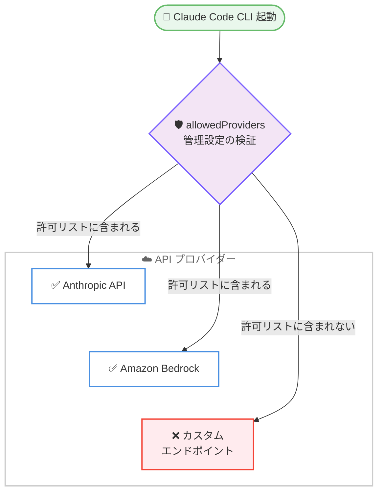
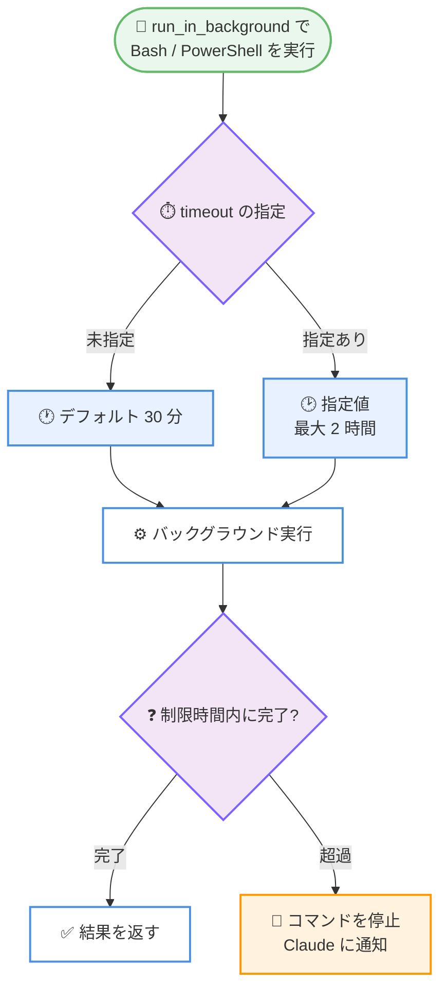

# Claude Code v2.1.285: claude --desktop、allowedProviders 管理設定、バックグラウンドコマンドの時間制限

## メタデータ

| 項目 | 内容 |
|------|------|
| 発表日 | 2026-09-29 |
| ソース | Claude Code Changelog |
| カテゴリ | Claude Code / CLI アップデート |
| 公式リンク | https://github.com/anthropics/claude-code/blob/main/CHANGELOG.md |

## 概要

Claude Code v2.1.285 がリリースされた。136 項目の変更を含む大型リリースで、新機能では `claude --desktop` により Claude デスクトップアプリをカレントディレクトリで開けるようになり、`--continue` / `--resume <id>` と組み合わせて既存セッションをデスクトップアプリで再開することもできる。管理面では、マシンが使用できる API プロバイダーを制限する `allowedProviders` 管理設定と、WebFetch ツールを無効化する `CLAUDE_CODE_DISABLE_WEB_FETCH` 環境変数が追加された。プラグイン周りでは `claude plugin configure <plugin>` コマンドと、`claude plugin install --config` での `<server>.<key>=<value>` 指定により、コマンドラインだけでプラグインとバンドルされた MCP サーバーの設定を完結できるようになった。

動作変更では、バックグラウンドで実行される Bash / PowerShell コマンドに時間制限が導入され、`run_in_background` 使用時の `timeout` がその上限として機能する (デフォルト 30 分、最大 2 時間)。また、カスタム `ANTHROPIC_BASE_URL` 経由のセッションでも、1M コンテキストウィンドウを持つモデル (Opus 4.7 以降、Sonnet 5 以降、Fable) で 1M コンテキストが使用されるようになった。

修正面では、ストリーミングが失敗し続けた際に API リクエストが最大 21 回リトライされていた問題が、非ストリーミングフォールバックがリクエストのリトライ予算を共有する形で解消された。このほか、Artifact ツール、`/ultrareview`、Remote Control、MCP、プラグインに関する広範な修正と、VSCode 拡張の 25 項目におよぶ変更が含まれる。

## 詳細

### 背景

Claude Code v2.1.285 は、Claude Sonnet 5.5 の追加と auto mode の全面既定化を含んだ 2026-09-28 の v2.1.284 に続くリリースである。v2.1.283 以降続いている managed 設定によるガバナンス強化の流れは本バージョンでも継続しており、`allowedProviders` によるプロバイダー制限、管理者が要求するサンドボックスをプロジェクト設定が弱められない変更、`disableWorkflows` の適用元による Code Review の実行可否の整理などが追加された。

また、v2.1.284 で導入された「切断後のリトライ予算の共有」に続き、本バージョンではストリーミング失敗時の非ストリーミングフォールバックにも同じ予算共有の考え方が適用され、失敗し続けるリクエストが長時間リトライを繰り返す問題への対処が一段落した形となる。

### 主な変更点

#### 1. claude --desktop の追加

`claude --desktop` により、Claude デスクトップアプリをカレントディレクトリで開けるようになった。`--continue` または `--resume <id>` と組み合わせると、既存のセッションをデスクトップアプリで開くことができる。

```bash
# カレントディレクトリでデスクトップアプリを開く
claude --desktop

# 直前のセッションをデスクトップアプリで再開
claude --desktop --continue

# 特定のセッションをデスクトップアプリで再開
claude --desktop --resume <session-id>
```

ターミナルで進めていた作業をデスクトップアプリの UI に引き継ぐ、といった行き来がコマンド 1 つで可能になる。

#### 2. allowedProviders 管理設定の追加

マシンが使用できる API プロバイダーを制限する `allowedProviders` 管理設定が追加された。制限対象として指定できるのは以下のプロバイダーである。

- Anthropic API
- カスタムエンドポイント
- Amazon Bedrock
- Mantle
- Vertex AI
- Microsoft Foundry
- Claude Platform on AWS
- Cloud gateway

managed 設定で許可するプロバイダーを列挙することで、組織のマシンが承認されていないエンドポイントへ接続することを防止できる。データの経路を特定のクラウドプロバイダーやゲートウェイに限定したい組織にとって重要な統制ポイントとなる。



#### 3. プラグイン設定の強化

プラグインの設定をコマンドラインだけで完結できるようになった。

- **`claude plugin configure <plugin>`**: プラグインのオプションと未設定の項目を表示する。`--values-stdin` を付けると、標準入力から読み取った新しい値を保存できる
- **`claude plugin install --config` の `<server>.<key>=<value>`**: プラグインにバンドルされた `.mcpb` MCP サーバー自身の設定をインストール時に指定できるようになり、`/plugin` → Configure を開かずにサーバーを起動できる

あわせて、設定が必要な `.mcpb` MCP サーバーをプラグインが黙ってスキップしていた問題も修正され、`/plugin`、インストールメッセージ、`claude plugin install` がその旨を伝えて Configure を案内するようになった。CI やプロビジョニングスクリプトからプラグインを設定込みで導入する場合に、対話的な操作が不要になる。

#### 4. CLAUDE_CODE_DISABLE_WEB_FETCH 環境変数

WebFetch ツールを無効化する `CLAUDE_CODE_DISABLE_WEB_FETCH` 環境変数が追加された。外部 URL の取得を許可したくない環境で、ツール自体をオフにできる。

WebFetch 関連では、動作変更も加わっている。Team および Enterprise のセッション、またはサインインプランを判別できないセッションでは、起動時に組織ポリシーをロードできなかった場合、ポリシーがロードされるまで WebFetch を保留するようになった。また、レート制限されたドメイン安全性チェックが、ネットワークエラーやエンタープライズポリシーによるブロックとして誤報告されていた問題も修正された。

#### 5. バックグラウンド Bash / PowerShell コマンドの時間制限

バックグラウンドで実行される Bash および PowerShell コマンドが、時間制限の経過後に停止されるようになった。`run_in_background` を使用した場合の `timeout` パラメータがこの上限として機能し、デフォルトは 30 分、最大 2 時間である。コマンドが停止されると Claude に通知される。

従来はバックグラウンドコマンドが際限なく実行され続ける可能性があったが、この変更により、放置されたデーモンや終了しないウォッチャーがセッション終了後もリソースを消費し続けることを防げる。長時間かかるビルドやテストをバックグラウンドで実行する場合は、`timeout` を明示的に指定して最大 2 時間まで延長できる。

関連する修正として、同期フックが起動したバックグラウンドプロセス (例: `some-daemon &`) が出力を開いたままにしていると Claude Code がハングする問題も修正され、フック自身のプロセスが終了すればフックは完了するようになった。

#### 6. カスタム ANTHROPIC_BASE_URL での 1M コンテキストウィンドウ

カスタム `ANTHROPIC_BASE_URL` を設定したセッションでも、1M コンテキストウィンドウを持つモデル (Opus 4.7 以降、Sonnet 5 以降、Fable) で 1M コンテキストが使用されるようになった。従来は独自のゲートウェイやプロキシを経由すると 1M コンテキストの恩恵を受けられなかったが、この制限が解消された。

ゲートウェイ側が 200K で停止する場合は、`/autocompact 200k` を実行してコンパクションのしきい値を戻すことで対処できる。

#### 7. ストリーミング失敗時のリトライ回数の共有化

ストリーミングが失敗し続けた場合に、失敗した API リクエストが最大 21 回リトライされる問題が修正された。非ストリーミングフォールバックが新しいリトライセットを取得するのではなく、元のリクエストのリトライ予算を共有するようになったため、失敗し続けるリクエストは早く諦めるようになった。

関連して、API の出力コンテンツフィルターによってブロックされたレスポンスが、フィルターのエラーを即座に表示する代わりに再送・リトライされ、数分かかることがあった問題も修正されている。また、タイムアウトした非ストリーミングフォールバックリクエストの再送回数を制限する `CLAUDE_CODE_NONSTREAMING_TIMEOUT_RETRIES` 環境変数も追加された。

#### 8. その他の新機能・修正 (抜粋)

- **`claude -p` とサブエージェント**: `CLAUDE_CODE_FORK_SUBAGENT=1` でサブエージェント自身の Agent 呼び出しがフォアグラウンドで実行され、子の結果を受け取れるようになった。fork したサブエージェントは親のパーミッションモード (plan mode や `dontAsk` mode) を引き継ぎ、plan mode を抜けられなくなった。`--permission-prompt-tool` 使用時に、バックグラウンドサブエージェントの権限リクエストが自動拒否されずにプロンプトツールへ送られるようになった
- **managed 設定ファイルの読み取りエラー**: OS が managed 設定ファイルの読み取りを拒否した場合に Claude Code が起動を拒否していた問題を修正。警告を表示してそのファイルのポリシーなしで起動する。それ以外の読み取りエラーやパース不能なファイルは、引き続きすべてのセッションを停止させる
- **認証・セキュリティ**: `ANTHROPIC_AUTH_TOKEN` で Anthropic API に認証するセッションが組織のポリシーをロードしない問題、`@` を含む URL パスワードの一部 (または `%40` と書かれた場合は全部) が redact 済みログに表示される問題、クラッシュしたプロセスが残したログインリフレッシュロックを 2 つのセッションが同時に回復する際の稀な認証失敗を修正。ブラウザが成功を表示した後もサインインが永久に待機し得た問題も修正された
- **サンドボックスと権限**: `python3 -c` や `node -e` などのインラインスクリプトが `=` を含むだけで毎回承認を求められていた問題を修正。PowerShell ツールのコマンドパーサーが起動に失敗した場合 (メモリ不足時など) に deny / ask ルールがスキップされ、その失敗が以降のチェックにキャッシュされていた問題も修正された
- **Artifact ツール**: 会話の巻き戻し (Esc Esc) 後の publish が、巻き戻されたターンでしか読んでいないファイルの新しい内容を上書きする問題、`Artifact` の allow ルールが作業ディレクトリ外のファイルを確認なしで publish させていた問題、一時的なサーバーエラーのリトライ後に成功済みの publish を競合として誤報告する問題などを修正
- **`/ultrareview`**: git worktree の per-worktree 設定、コロンを含む資格情報ファイル名、WSL 上のファイル名、シンボリック参照のブランチなど、アップロード周りの多数の修正。macOS と Linux では git 2.31 以降が必要になった
- **MCP**: `claude mcp list` が WebSocket サーバーを表示しない問題、`type` フィールドを省略した stdio サーバーの詳細が `claude mcp get` で表示されない問題、SDK と `-p` セッションでセッション中に追加した MCP サーバーをオフにしてもツールが残る問題を修正。`claude mcp get` はプラグイン提供の stdio サーバーのコマンド・引数・環境変数の値を隠すようになった
- **Remote Control**: メッセージ添付ファイルのダウンロード失敗が最大 2 回リトライされるようになり、メッセージの既読タイミングが Claude の着手時に変更され、ターミナル終了時にキュー内のメッセージが失われず次回の再開時に届くようになった

#### 9. 改善 (抜粋)

- **Claude in Chrome**: ネイティブホストがコンピューター名を報告するようになり、接続されたブラウザを「Browser 1」「Browser 2」ではなくコンピューター名でラベル付けできるようになった
- **Bedrock / Vertex AI のモデルフォールバック**: 管理者がデフォルトモデルへのアクセスを削除した場合に、失敗する代わりに同じティアの古い利用可能モデルへ切り替わるようになった。利用できないモデルは最大 1 日記憶され、起動のたびに再チェックされなくなった
- **`/resume` の実行中セッション対応**: バックグラウンドで実行中のセッションに対する `/resume` と `claude --resume` が、拒否する代わりにそのセッションを開くようになった。`claude --resume <id> "prompt"` で与えたプロンプトは次のターンとして送信される
- **サブエージェントの効率化**: auto mode のサブエージェントは、レポートを呼び出し元へ返した時点で実行を終了するようになり、誰にも届かない余分なターンを消費しなくなった
- **SDK の liveness**: 非ストリーミングフォールバックリクエスト中も、partial messages が有効なら 30 秒ごとに `ping` ストリームイベントが送信されるようになった (Anthropic API、Claude Platform on AWS、ゲートウェイ)
- **パフォーマンス**: 多数の permission deny ルールと MCP ツールが設定されている場合のターンごとの性能、長いセッションで ctrl+o transcript ビューを離れる際の応答性が改善された。フルスクリーンモード外の長いセッションで発生していた最大 1 秒の一時フリーズも修正された

#### 10. 動作変更 (抜粋)

- **サンドボックス設定の保護**: プロジェクト設定は、管理者が要求するサンドボックスを弱めたり無効化したり、managed の deny リストの背後にあるプロキシを置き換えたり、厳格な allowlist を拡張したり、managed の読み取り拒否を再度開いたりできなくなった
- **auto mode の適用拡大**: `claude -p` と Python Agent SDK のセッションも、サードパーティプロバイダー上またはテレメトリ無効環境でパーミッションモード未設定の場合、対話型セッションと同様に auto mode で開始されるようになった。`--permission-mode` は引き続き優先される
- **`disableWorkflows` と Code Review**: Code Review の pull request レビューと `/ultrareview` は、`disableWorkflows` が有効でも実行されるようになった。ただし、レビューを実行するマシン自身の管理者 (MDM または managed-settings ファイル) が設定している場合を除く
- **MCP ツールの遅延ロード**: `_meta['anthropic/alwaysLoad']` を false に設定したツールは、サーバー側が `alwaysLoad` に設定されていても遅延されたままになる
- **予約サーバー名**: クラウドセッションと self-hosted ランナーでは MCP サーバー名 `widgets` (および `widgets_` のような近い綴り) が予約され、自前のサーバーはロードされなくなった
- **auto-memory の制限**: バックグラウンドセッションや Claude Code 自身のツールが開始したセッションからは、auto-memory をオンにできなくなった (オフにすることは可能)
- **Windows の環境変数**: プロジェクト設定とローカル設定の `env` では `ALLUSERSPROFILE`、`SystemDrive`、`CommonProgramFiles` 系の変数を設定できなくなった。必要な場合はユーザー設定または managed 設定で行う
- **`/tasks` の整理**: Claude Code が自身のために実行するバックグラウンド作業は「System tasks」という 1 行に折りたたまれ、Enter で展開できるようになった

#### 11. VSCode 拡張の変更 (25 項目)

VSCode 拡張には 3 件の追加、20 件の修正、1 件の改善、1 件の変更が含まれる。

**追加:**

- ウィンドウのリロードで中断され返信が来ないメッセージの下に注記を表示
- Manage plugins にプラグインオプションのフォームを追加。オプションを持つプラグインのインストール時に未設定項目を尋ね、行のギアアイコンから後で変更できる
- オンデマンド診断ツールにより、パネル内の Claude がファイル編集直後に限らず、いつでも Problems パネルの現在のエラーと警告を読めるようになった

**主な修正:**

- スラッシュコマンド入力後の Enter が、ファジーマッチで選ばれた無関係なメニュー項目を実行する、または何もしない問題
- 長いセッション中に開いているエージェントの transcript が新しいメッセージを失う問題、多数のエージェント実行時に会話が消える問題、長いセッションが古い行をトリムする際にチャットパネルが停止する問題
- Claude の作業中に送信したメッセージがセッション再オープン後に消える問題、Past conversations を開くとライブの会話が保存済みコピーに置き換わる問題
- 別のウィンドウやアプリで開いている会話を警告なしに二重に開いていた問題 (確認するようになった)
- エディタが自動保存に応答しない場合に、すべての Read / Write / Edit が 10 分間停止した後スキップされる問題
- Manage plugins からのアンインストールが誤ったインストールを削除する、またはプロジェクト用にインストールされたプラグインで失敗する問題
- `/rename`、SessionStart フック、claude.ai でセッション名を変更した後もエディタタブが古い名前のままになる問題

**変更**: Manage plugins ダイアログは、プロジェクト共有の `.claude/settings.json` が有効化しているプラグインをオフにしたり、マーケットプレイスを削除したりする前に確認するようになった。

#### 12. Cloud sessions / Claude Tag / Code Review

- **Cloud sessions**: ルーチンの Run now が開始前に拒否された場合に内部エラーテキストを表示する問題を修正。クラウド環境の変数として設定された `MCP_DISCOVERY_CACHE=1` は、コネクタのツールリストのみをセッション再起動後に再利用し、その他の MCP サーバーはキャッシュされず起動時に接続するようになった
- **Claude Tag (Slack)**: Enterprise プランの Standard または Usage-Based Chat シートで Cowork を持つメンバーが、Claude Code を含むシートなしで Claude と DM できるようになった。管理設定とチャンネルの Configure ページが組織で使用できないモデルを提示していた問題も修正された
- **Code Review**: 「Add a repository」ダイアログの組織メニューが一部の GitHub 組織しか表示しなかった問題を修正 (スクロールで追加読み込み)。リポジトリの REVIEW.md が適用されなかった場合 (非常に大きな pull request や REVIEW.md がシンボリックリンクの場合など) に、check run がその旨を伝えるようになった

### 技術的な詳細

#### バックグラウンドコマンドの時間制限

`run_in_background` 付きの Bash / PowerShell コマンドの `timeout` は、バックグラウンド実行の上限時間として機能する。

| 項目 | 値 |
|------|-----|
| デフォルト | 30 分 |
| 最大 | 2 時間 |
| 停止時の動作 | Claude に通知される |

#### 環境変数の追加

| 環境変数 | 説明 |
|----------|------|
| `CLAUDE_CODE_DISABLE_WEB_FETCH` | WebFetch ツールを無効化する |
| `CLAUDE_CODE_NONSTREAMING_TIMEOUT_RETRIES` | タイムアウトした非ストリーミングフォールバックリクエストの再送回数を制限する |

#### 1M コンテキストウィンドウの対象モデル

カスタム `ANTHROPIC_BASE_URL` 経由でも 1M コンテキストが使用されるモデルは以下のとおり。

- Opus 4.7 以降
- Sonnet 5 以降
- Fable

ゲートウェイが 200K で停止する場合は `/autocompact 200k` を実行する。

## 開発者への影響

### 対象

- Claude デスクトップアプリと Claude Code を併用しているユーザー (`claude --desktop`)
- managed 設定で組織のマシンを統制している管理者 (`allowedProviders`、サンドボックス設定の保護、managed 設定ファイルの読み取りエラー時の動作)
- プラグインを CI やスクリプトから導入・設定する開発者 (`claude plugin configure`、`--config` の `<server>.<key>=<value>`)
- 外部 URL の取得を制限したい環境の管理者 (`CLAUDE_CODE_DISABLE_WEB_FETCH`)
- 長時間のバックグラウンドコマンドを利用しているユーザー (時間制限の導入)
- カスタム `ANTHROPIC_BASE_URL` やゲートウェイを経由して Claude Code を利用しているユーザー (1M コンテキスト)
- Agent SDK / `claude -p` を利用している開発者 (auto mode の適用拡大、fork サブエージェント、`setModel`、`ping` イベント)
- Bedrock / Vertex AI / Mantle を利用しているユーザー (モデルフォールバック、SigV4 の Host ヘッダー、起動時モデルチェック)
- VSCode 拡張、Cloud sessions、Claude Tag (Slack)、Code Review の利用者

### 必要なアクション

- **バックグラウンドコマンドの `timeout` 確認**: 30 分を超えるバックグラウンド処理 (ビルド、テスト、監視など) を実行している場合、時間制限で停止されるようになった。必要に応じて `timeout` を明示的に指定する (最大 2 時間)
- **`allowedProviders` の設定検討**: API プロバイダーを統制したい組織は、managed 設定に `allowedProviders` を追加して許可するプロバイダーを列挙する
- **ゲートウェイのコンテキスト上限確認**: カスタム `ANTHROPIC_BASE_URL` を使用している場合、対象モデルで 1M コンテキストが使われるようになる。ゲートウェイが 200K で停止する場合は `/autocompact 200k` を実行する
- **`claude -p` / Agent SDK のパーミッションモード確認**: サードパーティプロバイダー上またはテレメトリ無効環境では、パーミッションモード未設定の非対話セッションが auto mode で開始される。従来の動作が必要な場合は `--permission-mode` を指定する
- **MCP サーバー名の確認**: クラウドセッションや self-hosted ランナーで `widgets` またはそれに近い名前の自前 MCP サーバーを使用している場合は、ロードされなくなるためリネームする
- **Windows の設定の見直し**: プロジェクト設定・ローカル設定の `env` で `ALLUSERSPROFILE` などを設定している場合は、ユーザー設定または managed 設定へ移動する

### 移行ガイド (該当する場合)

破壊的変更は限定的だが、以下の動作変更に注意が必要である。

- バックグラウンド Bash / PowerShell コマンドは時間制限 (デフォルト 30 分、最大 2 時間) の経過後に停止される
- カスタム `ANTHROPIC_BASE_URL` のセッションは、対象モデルで 1M コンテキストウィンドウを使用する
- `claude -p` と Python Agent SDK のセッションは、サードパーティプロバイダー上またはテレメトリ無効環境でパーミッションモード未設定の場合、auto mode で開始される
- クラウドセッションと self-hosted ランナーでは MCP サーバー名 `widgets` が予約される
- プロジェクト設定は管理者が要求するサンドボックス設定を弱められない
- `/ultrareview` の macOS / Linux でのローカルリポジトリアップロードには git 2.31 以降が必要
- `/config chrome=true` は Claude in Chrome を直接有効化せず、/config パネルへ誘導する
- Windows のプロジェクト設定・ローカル設定の `env` は `ALLUSERSPROFILE`、`SystemDrive`、`CommonProgramFiles` 系の変数を設定できない

## コード例

プラグインの設定をコマンドラインだけで完結する例を示す。バンドルされた `.mcpb` MCP サーバーの設定をインストール時に渡し、後からオプションを確認・変更できる。

```bash
# インストール時に MCP サーバーの設定を指定する
claude plugin install my-plugin@marketplace --config myserver.apiUrl=https://api.example.com

# プラグインのオプションと未設定の項目を表示する
claude plugin configure my-plugin

# 標準入力から新しい値を保存する
echo '{"apiUrl": "https://api.example.com"}' | claude plugin configure my-plugin --values-stdin
```

WebFetch ツールを無効化する場合は、環境変数を設定する。

```bash
export CLAUDE_CODE_DISABLE_WEB_FETCH=1
claude
```

## アーキテクチャ図 (該当する場合)

バックグラウンドコマンドの時間制限の動作を示す。



## 関連リンク

- [Claude Code Changelog (v2.1.285)](https://github.com/anthropics/claude-code/blob/main/CHANGELOG.md)
- [Claude Code v2.1.284 のレポート](./2026-09-28-claude-code-v2-1-284.md)
- [Claude Code 公式ドキュメント](https://code.claude.com/docs)
- [Claude Code settings (設定と環境変数)](https://code.claude.com/docs/en/settings)
- [Claude Code のプラグイン](https://code.claude.com/docs/en/plugins)
- [Claude Code の MCP](https://code.claude.com/docs/en/mcp)

## まとめ

Claude Code v2.1.285 は、136 項目の変更を含む大型リリースである。`claude --desktop` によるデスクトップアプリとの連携、`allowedProviders` 管理設定によるプロバイダー統制、`claude plugin configure` を中心としたプラグイン設定の CLI 完結化という 3 つの新機能が柱で、いずれも Claude Code をより広い環境 (デスクトップアプリ併用、組織管理、CI / 自動化) で運用するための機能強化と位置づけられる。

動作変更では、バックグラウンドコマンドの時間制限 (デフォルト 30 分、最大 2 時間) とカスタム `ANTHROPIC_BASE_URL` での 1M コンテキスト対応が実務への影響が大きい。前者は長時間のバックグラウンド処理を利用している場合に `timeout` の明示が必要になり、後者はゲートウェイ経由のユーザーがモデル本来のコンテキスト長を活用できるようになる。修正面では、ストリーミング失敗時に最大 21 回のリトライが発生していた問題の解消が代表的で、出力コンテンツフィルターの即時エラー表示とあわせて、失敗時の待ち時間を大幅に短縮する。VSCode 拡張も 25 項目の変更でメッセージ消失や停止といった問題が広く修正されており、全体として安定性と管理性を底上げするリリースである。
