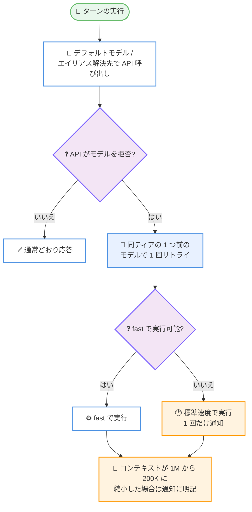

# Claude Code v2.1.286: モデル拒否時の自動フォールバック、シークレットマスキングの強化、API リトライ上限の一本化

## メタデータ

| 項目 | 内容 |
|------|------|
| 発表日 | 2026-09-30 |
| ソース | Claude Code Changelog |
| カテゴリ | Claude Code / CLI アップデート |
| 公式リンク | https://github.com/anthropics/claude-code/blob/main/CHANGELOG.md |

## 概要

Claude Code v2.1.286 がリリースされた。約 88 項目の変更を含み、新機能よりも信頼性とセキュリティの修正に重心を置いたリリースである。注目すべき挙動変更として、デフォルトモデルやモデルエイリアスの解決先を Anthropic API が拒否した場合に、毎ターン失敗する代わりに同じティアの 1 つ前のモデルで 1 回リトライするようになった。また、失敗した API リクエストのリトライが 1 つのモデル呼び出し全体で 1 つの上限を共有するようになり、デフォルト設定では失敗し続ける呼び出しが送信するリクエストは最大 14 回に抑えられる。

セキュリティ面では、エラーメッセージ・ログ・transcript における資格情報のマスキング漏れが集中的に修正された。「Bearer」や「Basic」がキー名の前に付く資格情報、パーセントエンコードされた Bearer トークン、ゼロ幅スペースを含むキー名のシークレット、記号を含む URL パスワードなどが対象である。あわせて、プラグインのインストールが git リポジトリやフォルダーを指す npm ソースを拒否するようになり、依存関係もレジストリパッケージからのみインストールされる。

このほか、権限リクエストが複数たまった際の「2 of 5」といった件数表示の追加、`verify` という名前のスキルがある場合にコミット直前の実行を Claude に指示するコミットガイダンスの改善、`--bare` の動作の厳格化、`/hooks` やテーマピッカーなどの UI 刷新、VSCode 拡張のブックマーク機能の追加などが含まれる。

## 詳細

### 背景

Claude Code v2.1.286 は、136 項目の変更を含んだ 2026-09-29 の v2.1.285 に続くリリースである。v2.1.284 以降続いている「失敗した API リクエストのリトライ予算の共有」の取り組みは本バージョンで一区切りとなり、1 つのモデル呼び出し全体を 1 つの上限がカバーする形に整理された。また、v2.1.285 の Bedrock / Vertex AI でのモデルフォールバックに続き、本バージョンでは Anthropic API がモデルを拒否した場合のフォールバックが追加され、モデル提供側の変更に対する耐性が一段と高まっている。

セキュリティ面でも、v2.1.285 で修正された URL パスワードの redaction 漏れに続き、本バージョンではマスキング・redaction 関連の修正が 5 件含まれており、ログや transcript に資格情報が露出する経路を体系的に塞ぐ流れが続いている。

### 主な変更点

#### 1. モデル拒否・フォールバック時の信頼性向上

モデルの利用可否に関する修正が複数含まれる。

- **モデル拒否時の自動リトライ**: デフォルトモデルまたはモデルエイリアスの解決先を Anthropic API が拒否した場合、従来はすべてのターンが失敗していたが、同じティアの 1 つ前のモデルで 1 回リトライするようになった
- **フォールバックモデルと fast モード**: refusal および `--fallback-model` によるリトライが、フォールバックモデルが fast で実行できない場合に失敗していた問題を修正。標準速度で実行され、対話型セッションでは 1 回だけ通知が表示される
- **コンテキストウィンドウ縮小の通知**: モデルフォールバックの通知と autocompact スラッシングのエラーが、フォールバックによってコンテキストウィンドウが 1M から 200K トークンに縮小した場合にその旨を伝えるようになった

#### 2. API リトライ上限の一本化

失敗した API リクエストのリトライ方法が変更され、1 つの上限がモデル呼び出し全体をカバーするようになった。デフォルトのリトライ設定では、失敗し続ける呼び出しが送信するリクエストは最大 14 回となる。

v2.1.285 では「ストリーミング失敗時の非ストリーミングフォールバックが最大 21 回リトライする」問題がリトライ予算の共有で修正されており、本バージョンの変更はその考え方をモデル呼び出し全体へ拡張したものである。失敗し続けるリクエストが長時間リトライを繰り返して待ち時間を発生させる問題への対処がこれで完結した形となる。

#### 3. シークレットマスキング・redaction の強化

エラーメッセージ、ログ、transcript に資格情報が露出する問題が集中的に修正された。

- MCP のエラーメッセージが、キー名の前に「Bearer」または「Basic」が付く資格情報の値を表示していた問題
- パーセントエンコードされた Bearer トークンがエラーメッセージで部分的にしかマスクされていなかった問題
- キー名の内部にゼロ幅スペースなどの不可視文字を含むシークレットが、redact 済みのログと transcript に表示されていた問題
- `)` や引用符、`]`、`&`、2 つ目の `@` などの記号を含む URL パスワードの一部、または ssh URL で `/` を越えて `[::1]` のようなブラケット付きホストまで続く部分が、ログと transcript に表示されていた問題
- `/feedback` がディスクに保存する zip 内のセッション transcript が、シークレットの redaction 後に不正な JSON 行を含んでいた問題

いずれも実際にシークレットが露出し得た問題の修正であり、ログや transcript を共有・保存する運用をしている場合は本バージョンへの更新が推奨される。

#### 4. プラグインインストールのソース制限

プラグインのインストールが、git リポジトリまたはフォルダーを指す npm ソースを拒否するようになった。また、プラグインの依存関係はレジストリパッケージからのみインストールされる。npm の git / フォルダー依存は任意のスクリプト実行につながりやすく、サプライチェーン攻撃の経路となり得るため、プラグインを利用する組織にとって重要なセキュリティ強化である。

#### 5. Remote Control のポリシー準拠

組織のポリシーで Remote Control がオフにされた後も、`claude remote-control` を含む Remote Control セッションが接続されたままになっていた問題が修正された。該当セッションは通知を表示して切断されるようになり、管理者のポリシー変更が既存セッションにも確実に反映される。

Remote Control ではこのほか、メッセージに添付されたファイルが届かなかったことが Claude に伝えられていなかった問題、ファイルの最後のダウンロード試行に 10 秒しか与えられないことがあった問題、Claude Code の終了中に届いたメッセージが配信済みと記録されたまま回答されない問題 (次回の実行までキューに保持されるようになった) も修正された。

#### 6. verify スキルによるコミット前検証

コミットガイダンスが改善され、プロジェクトまたはユーザーのスキルに `verify` という名前のスキルが含まれている場合、Claude はコミットの直前にそれを実行するよう指示されるようになった。ドキュメントのみ・テストのみのコミットは対象外である。

ビルドやテスト、lint をまとめた検証手順を `verify` スキルとして定義しておけば、Claude がコミットするたびに自動的に実行されるため、壊れた状態でのコミットを防ぐ仕組みをプロジェクト側で宣言的に用意できる。

#### 7. 権限プロンプトと UI の改善

- **権限リクエストの件数表示**: 複数の権限リクエストがたまった場合に、権限プロンプトへ「2 of 5」のような件数が表示されるようになった
- **権限プロンプトの外観統一**: fetch、スキル、ファイル読み取り、サンドボックスネットワーク、Claude in Chrome、ワークフロースクリプト、ノートブック編集の各権限プロンプトがファイル編集プロンプトの外観に統一された。Bash / PowerShell / Monitor のプロンプトもコマンドを破線の間に表示する形式に揃えられた
- **フルスクリーンモードのリスト操作**: 「N more」行のマウスクリックでリストの端へジャンプできるようになり、スクロールバーにはクリックまたは長押しでスクロールできる ↑/↓ 矢印が付いた。オーバーフロー行の表記も「↑ N more」/「↓ N more」に変更された
- **`/hooks` の刷新**: 設定済みフックをイベントごとにグループ化した 1 つのリストで開くようになり、フックの詳細表示が 3 回の Enter から 1 回になった
- **テーマピッカーと出力スタイルピッカー**: テーマピッカーはプレビューを画面外へ押し出さないスクロールリストになり、出力スタイルピッカーは現在のスタイルを選択した状態で開き、各スタイルの説明が名前の下に表示されるようになった。いずれも数字キーによる選択は廃止された
- **外部エディター**: Ctrl+G で開く外部エディターが、行番号を受け取れるエディターではプロンプト内のカーソル行で開くようになった
- **スラッシュコマンド補完**: 多数のスキルやプラグインコマンドがインストールされている場合の入力中の応答性が改善され、コマンドの説明は単語の前方一致でマッチするようになった

#### 8. --bare の厳格化

`--bare` の動作が変更され、コマンドラインで名前を指定した MCP サーバーのみを接続し、モデルにシステムリマインダーを送信せず、バックグラウンドタスクを開始しないようになった。また、`--bare` 下ではタイムアウトに達したシェルコマンドがバックグラウンドへ移行せず停止する。スクリプトやベンチマークなど、余計な介入のない素の実行環境が必要な用途での予測可能性が高まった。

#### 9. 認証・セッション周りの修正 (抜粋)

- gcpAuthRefresh または awsAuthRefresh の資格情報が期限切れになった際に、複数の Claude Code プロセスと IDE 拡張がそれぞれログインブラウザを開いていた問題を修正
- 別の Claude Code ウィンドウで `/login` が成功した後も、残留した `~/.claude/.credentials.json` がある macOS セッションで「Not logged in」や「Login expired」と表示され続ける問題を修正
- `claude auth status` が Console サインインの保存済み API キーを `claude.ai` と報告していた問題を修正。`api_key` と報告されるようになり、VS Code 拡張もそのセッションを API キーセッションとして扱う
- `/status` が API キーと並ぶ Anthropic プロファイルを両方有効であるかのように表示していた問題を修正。使用されていないプロファイルはその旨が明示される
- `claude --resume` と `--continue` が、以前のセッションがクラッシュまたは強制終了していた場合に、並列ツール呼び出しの後のターンをすべて失うことがあった問題を修正
- ツールまたはフックがテキストの代わりにオブジェクト・数値・真偽値を返した後に API 400 エラーが発生していた問題 (再開セッションを含む) を修正
- Claude apps gateway のスペンドメーターが、1 時間プロンプトキャッシュの書き込みを安価な 5 分レートで計算し、web 検索などのサーバーサイドツールを実行するストリーム化されたターンで最初のモデル呼び出しの入力トークンしか数えていなかった問題を修正

#### 10. サブエージェント・MCP・その他の修正 (抜粋)

- **サブエージェント**: 実行中のサブエージェントに入力したメッセージが transcript に二重表示される問題、ハンドバックメッセージが名前未登録のサブエージェントで生の task id を表示する問題、フォアグラウンドサブエージェントでタスク管理ツールが欠落することがある問題、worktree 分離で起動したサブエージェントが CLAUDE.md とそのインポートを二重に読み込む問題などを修正。送信 (ctrl+enter) はサブエージェントの実行中コマンドをバックグラウンドへ移してメッセージを即座に読ませるようになった
- **MCP**: サーバーが古い MCP ハンドシェイクを廃止した後、コネクタが最大 1 日ツールを表示しない問題、Claude からの再サインイン要求が保留中のサインインリンクを置き換えて無効化し得る問題、`/usage` が接続直後のツール呼び出しをサーバーにクレジットしない問題を修正
- **誤操作防止**: バックグラウンドエージェントやチームメイトの transcript を表示中に入力した `/compact`、`/clear`、`/rewind` が、メインの会話に黙って作用していた問題を修正。対象を名前で示すダイアログが先に確認するようになった
- **その他**: 承認待ちのバックグラウンドジョブが完了と表示される問題、非常に長い名前のファイルがクラウドセッションに届かない問題、ロードを拒否されたマーケットプレイスのプラグインエラーが理由と対処を表示するようになった件などが含まれる

#### 11. VSCode 拡張の変更 (10 項目)

**追加:**

- **ブックマーク**: Claude の応答を保存し、Bookmarks サイドパネルに表示し続けられるようになった
- **質問の履歴**: 質問カードに回答した後、Questions 行に各質問と選択内容が会話内に表示されるようになった
- **選択肢のプレビュー**: チャットパネルの質問カードで、ハイライト中の選択肢のモックアップやスニペットが選択肢の横または下に表示される
- メッセージの下に、そのメッセージと一緒に送信されたターミナル出力、ブラウザタブ、ブラウザ指示、選択コードを開ける行が追加された

**修正・改善・変更:**

- サイドバーで開いている会話がタブで二重に開く問題と、Claude Code が 1 MB を超える出力を出した際に設定ダイアログが保存失敗を誤報告する問題、拡張が応答しなくなった際の「Teleporting session…」スピナーが終わらない問題を修正
- Manage plugins ダイアログが、オフにしたプラグインが他の設定で有効なままである場合やプラグインフォルダーの衝突を説明するようになった
- Stop と Escape は現在のターンのみを終了するようになり、バックグラウンドエージェントは実行を継続して agent map から個別に停止できる。「✻ Claude Code」ステータスバー項目はすべてのウィンドウに表示され、ファイルを開いていなくても Claude を開けるようになった

#### 12. Cloud sessions / Claude Tag / Windows

- **Cloud sessions**: 非常に大きな履歴を持つセッションが transcript のロード中にコンテナを停止され、起動しなくなる問題を修正。クラウドセッションが開始しなかったルーチン実行が Succeeded と表示されていた問題も修正され、Failed と表示されるようになった。このほか、アイドル後の質問カードやツール承認に返答が来ない問題、組織環境のセットアップスクリプトをクリアしても古いスクリプトが実行され続ける問題などを修正
- **Claude Tag (Slack)**: 管理設定のスペンド制限ページに Add channel ボタンが追加され、チャンネル ID や Slack リンクからプライベートチャンネルを含む任意のチャンネルに制限を設定できるようになった。デフォルトの Sonnet モデルを使用できない組織でメモリ recall が何も見つけられない問題、Enterprise Grid でのチャンネル移動により Claude 設定が失われる問題なども修正された
- **Windows**: `claude --bg` とエージェントビューが、trust 記録の大文字小文字の違いにより信頼済みフォルダーを拒否する問題を修正

### 技術的な詳細

#### API リトライの上限

| 項目 | 変更前 | 変更後 |
|------|--------|--------|
| リトライの単位 | リクエストごと (フォールバックで新しいリトライセットを取得し得る) | モデル呼び出し全体で 1 つの上限 |
| デフォルト設定での最大リクエスト数 | 最大 21 回 (v2.1.284 以前) | 最大 14 回 |

#### モデル拒否時のフォールバック

Anthropic API がデフォルトモデルまたはエイリアスの解決先を拒否した場合の動作は以下のとおり。

1. API がモデルを拒否する
2. Claude Code が同じティアの 1 つ前のモデルで 1 回リトライする
3. フォールバックモデルが fast で実行できない場合は標準速度で実行する (対話型セッションでは 1 回だけ通知)
4. フォールバックでコンテキストウィンドウが 1M から 200K に縮小した場合は通知にその旨が含まれる

#### --bare の動作

| 項目 | `--bare` 下の動作 |
|------|------------------|
| MCP サーバー | コマンドラインで名前を指定したもののみ接続 |
| システムリマインダー | モデルへ送信しない |
| バックグラウンドタスク | 開始しない |
| タイムアウトしたシェルコマンド | バックグラウンドへ移行せず停止 |

## 開発者への影響

### 対象

- ログや transcript を共有・保存しているすべてのユーザー (シークレットマスキングの修正)
- モデルエイリアスやデフォルトモデルを利用しているユーザー (モデル拒否時の自動フォールバック)
- 不安定なネットワークやゲートウェイ経由で利用しているユーザー (リトライ上限の一本化)
- プラグインを導入している開発者・組織 (npm ソースの制限)
- Remote Control を利用している組織 (ポリシーによる切断)
- コミット品質を自動検証したいプロジェクト (`verify` スキル)
- `--bare` をスクリプトや検証に利用している開発者
- VSCode 拡張、Cloud sessions、Claude Tag (Slack) の利用者

### 必要なアクション

- **早期の更新を推奨**: シークレットマスキングの修正が複数含まれるため、ログや transcript を外部と共有する運用では早めの更新が望ましい
- **プラグインソースの確認**: git リポジトリやフォルダーを指す npm ソースからプラグインをインストールしている場合、インストールが拒否されるようになる。レジストリパッケージへの移行が必要である
- **`verify` スキルの導入検討**: コミット前にビルドやテストを必ず実行させたいプロジェクトは、検証手順を `verify` という名前のスキルとして定義する
- **`--bare` 利用スクリプトの確認**: `--bare` では指定した MCP サーバー以外が接続されず、タイムアウトしたシェルコマンドが停止するようになる。従来の動作に依存しているスクリプトは見直す
- **Remote Control のポリシー確認**: 組織ポリシーで Remote Control をオフにしている場合、既存セッションも通知付きで切断されるようになる

### 移行ガイド (該当する場合)

破壊的変更は限定的だが、以下の挙動変更に注意が必要である。

- 失敗した API リクエストのリトライは、デフォルト設定でモデル呼び出しあたり最大 14 リクエストに制限される
- プラグインのインストールは git リポジトリ・フォルダーの npm ソースを拒否し、依存関係はレジストリパッケージからのみ取得される
- `--bare` は指定された MCP サーバーのみを接続し、システムリマインダーとバックグラウンドタスクを無効化し、タイムアウトしたシェルコマンドを停止する
- 送信キー (ctrl+enter) は、スキル自身のシェルコマンドを終了させる代わりにバックグラウンドへ移動する
- テーマピッカーと出力スタイルピッカーで数字キーによる選択が廃止された
- `/ultrareview` と `claude ultrareview` の出力からブラウザリンクが削除された

## コード例

コミット前の検証を自動化する `verify` スキルの例を示す。プロジェクトの `.claude/skills/verify/SKILL.md` に検証手順を定義すると、Claude はコミットの直前にこのスキルを実行するよう指示される (ドキュメントのみ・テストのみのコミットを除く)。

```markdown
---
name: verify
description: コミット前にビルドとテストを実行して検証する
---

以下を順に実行し、すべて成功することを確認する。

1. `npm run lint` で lint エラーがないことを確認する
2. `npm run build` でビルドが成功することを確認する
3. `npm test` でテストがすべて通ることを確認する

いずれかが失敗した場合は、コミットせずに問題を修正する。
```

## アーキテクチャ図 (該当する場合)

Anthropic API がモデルを拒否した場合のフォールバック動作を示す。



## 関連リンク

- [Claude Code Changelog (v2.1.286)](https://github.com/anthropics/claude-code/blob/main/CHANGELOG.md)
- [Claude Code v2.1.285 のレポート](./2026-09-29-claude-code-v2-1-285.md)
- [Claude Code 公式ドキュメント](https://code.claude.com/docs)
- [Claude Code のスキル](https://code.claude.com/docs/en/skills)
- [Claude Code のプラグイン](https://code.claude.com/docs/en/plugins)

## まとめ

Claude Code v2.1.286 は、約 88 項目の変更を通じて信頼性とセキュリティを底上げするリリースである。モデル拒否時の同ティア前モデルへの自動フォールバックと API リトライ上限の一本化 (最大 14 リクエスト) により、モデルや API 側の問題がセッション全体の失敗や長時間の待ちにつながりにくくなった。セキュリティ面では、Bearer / Basic 付き資格情報、パーセントエンコードされたトークン、不可視文字を含むキー名、記号を含む URL パスワードといったマスキング漏れが一括で修正され、プラグインインストールの npm ソース制限と Remote Control のポリシー準拠切断がガバナンスを補強する。

新機能としては、権限プロンプトの件数表示や `verify` スキルによるコミット前検証の自動指示が実務に直結する改善であり、VSCode 拡張のブックマークや質問履歴の表示も日常的な使い勝手を高める。派手な新機能こそ少ないものの、更新する価値の高いメンテナンスリリースといえる。
