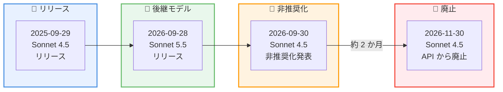
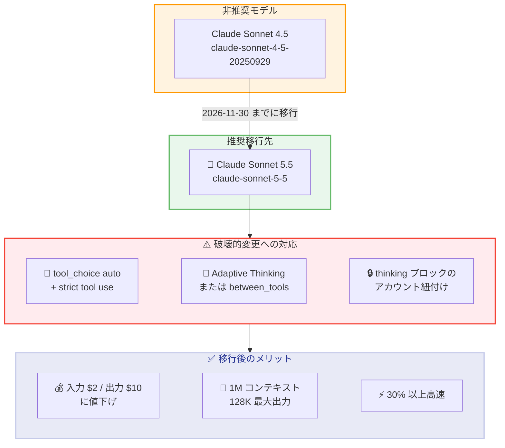

# Claude Sonnet 4.5 の非推奨化を発表 -- 2026 年 11 月 30 日に廃止、Claude Sonnet 5.5 への移行を推奨

## メタデータ

| 項目 | 内容 |
|------|------|
| 発表日 | 2026-09-30 |
| ソース | Claude Developer Platform Release Notes |
| カテゴリ | API モデル非推奨化 |
| 公式リンク | [Model Deprecations](https://platform.claude.com/docs/en/about-claude/model-deprecations) |

## 概要

Anthropic は 2026 年 9 月 30 日、Claude Sonnet 4.5 (`claude-sonnet-4-5-20250929`) の非推奨化 (deprecation) を発表しました。同モデルは 2026 年 11 月 30 日に Claude API から廃止 (retirement) される予定です。移行先として、2026 年 9 月 28 日にリリースされたばかりの Claude Sonnet 5.5 (`claude-sonnet-5-5`) が公式に推奨されています。

発表から廃止までは約 61 日間であり、「公開モデルの廃止には少なくとも 60 日前に通知する」という Anthropic のポリシーに準拠したスケジュールです。ただし、移行先の Sonnet 5.5 には強制ツール使用の廃止や thinking ブロックのアカウント紐付けなど複数の破壊的変更が含まれるため、単純なモデル ID の差し替えでは移行が完了しない点に注意が必要です。

## 詳細

### 背景

Claude Sonnet 4.5 は 2025 年 9 月 29 日にリリースされたモデルで、約 1 年の稼働期間を経て非推奨となります。非推奨化発表の 2 日前にあたる 2026 年 9 月 28 日には、後継として推奨される Claude Sonnet 5.5 がリリースされており、新モデルのリリース直後に旧世代を非推奨化するという従来のパターン (Sonnet 4 / Opus 4 → 4.6 世代、Opus 4.1 → Opus 4.8 など) を踏襲しています。

Model Deprecations ドキュメントによると、Anthropic はモデルのライフサイクルを以下の 4 段階で管理しています。

- **Active**: 完全にサポートされ、利用が推奨される状態
- **Legacy**: 更新が行われなくなり、将来非推奨化される可能性がある状態
- **Deprecated**: 引き続き動作するが推奨されない状態。推奨移行先と廃止日が指定される
- **Retired**: 利用不可の状態。リクエストは失敗する

今回の発表により、`claude-sonnet-4-5-20250929` は Deprecated ステータスとなりました。なお、このスケジュールが適用されるのは Anthropic が運営するプラットフォーム (Claude API、Claude Platform on AWS、Microsoft Foundry) であり、パートナー運営の Amazon Bedrock と Google Cloud は独自の廃止スケジュールを設定します。

### 主な変更点

1. **Claude Sonnet 4.5 の非推奨化**: `claude-sonnet-4-5-20250929` が Deprecated ステータスに変更。2026 年 11 月 30 日以降、このモデル ID へのリクエストは失敗します
2. **推奨移行先の指定**: 移行先として `claude-sonnet-5-5` が公式に推奨されています
3. **移行ガイドの提供**: Sonnet 4.5 からの移行手順をまとめた [Sonnet 5.5 移行ガイド](https://platform.claude.com/docs/en/models/sonnet-5-5/migration-guide#migrating-from-sonnet-45)が公開されています

### 技術的な詳細

#### 非推奨化スケジュール

| 廃止日 | 非推奨モデル | 推奨移行先 |
|--------|-------------|-----------|
| 2026 年 11 月 30 日 | `claude-sonnet-4-5-20250929` | `claude-sonnet-5-5` |

#### 移行先: Claude Sonnet 5.5 の概要

Claude Sonnet 5.5 は「速度と知性の最適な組み合わせ」と位置付けられたモデルで、以下の特徴を持ちます。

| 項目 | Claude Sonnet 4.5 | Claude Sonnet 5.5 |
|------|------------------|------------------|
| モデル ID | `claude-sonnet-4-5-20250929` | `claude-sonnet-5-5` |
| ステータス | Deprecated | Active |
| 入力価格 | $3 / 100 万トークン | $2 / 100 万トークン |
| 出力価格 | $15 / 100 万トークン | $10 / 100 万トークン |
| コンテキストウィンドウ | 200K トークン (1M はベータ) | 1M トークン (標準) |
| 最大出力 | 64K トークン | 128K トークン |
| thinking | Extended Thinking (budget_tokens) | Adaptive Thinking / `between_tools` |
| キャッシュ最小プロンプト長 | 1,024 トークン | 512 トークン |
| 廃止予定 | 2026 年 11 月 30 日 | 2027 年 9 月 28 日より前には実施しない |

Sonnet 5.5 は Sonnet 5 比で出力生成が 30% 以上高速であり、必要トークン数の削減によりタスクあたりのコストは最大 30% 低くなります。Sonnet 4.5 からの移行では定価自体も下がる ($3 / $15 → $2 / $10) ため、コスト面でのメリットは大きい一方、後述の破壊的変更への対応が必要です。

#### Sonnet 5.5 の破壊的変更への注意

移行先の Sonnet 5.5 には、旧世代向けのコードが動作しなくなる複数の破壊的変更があります。Sonnet 4.5 からの移行では特に以下に注意が必要です。

1. **強制ツール使用の廃止**: `tool_choice` の `any` および `tool` は 400 エラーを返します。`tool_choice: {"type": "auto"}` と strict tool use (`strict: true`) の組み合わせに移行する必要があります
2. **thinking ブロックのモデル・会話・アカウント紐付け**: Sonnet 5.5 の thinking ブロックは生成元のモデルと会話に紐付き、さらに生成元アカウント (または紐付いたアカウント) でのみ有効です。別アカウントが送信したブロックはエラーにならず静かに破棄されるため、推論の連続性が失われる点に注意が必要です。2026 年 8 月 31 日 00:00 UTC 以降に作成されたアカウントでは会話全体への署名検証が適用されるため、会話履歴は追記のみ (append-only) に保つ必要があります
3. **thinking の無効化方法の変更**: `thinking: {"type": "disabled"}` は使用できず、`thinking: {"type": "between_tools"}` を指定します (`high` effort 以下でのみ利用可能)。Sonnet 4.5 で使用していた Extended Thinking (`budget_tokens`) からの移行も必要です
4. **computer use ツールの更新**: Sonnet 4.5 で使用していた `computer_20250124` は受け付けられません。Claude API と Google Cloud では `computer_toolset_20260801` へ、Amazon Bedrock では `computer_20251124` へ移行します
5. **サンプリングパラメータの廃止**: `temperature`、`top_p`、`top_k` にデフォルト以外の値を設定すると 400 エラーとなります。プロンプトによる挙動制御に移行します

#### 最近の非推奨化履歴

Anthropic は継続的に旧モデルの非推奨化を進めています。

| 発表日 | 対象モデル | 廃止日 | 状態 |
|--------|-----------|--------|------|
| 2026-02-19 | Claude Haiku 3 | 2026-04-20 | 廃止済み |
| 2026-04-14 | Claude Sonnet 4 / Opus 4 | 2026-06-15 | 廃止済み |
| 2026-06-05 | Claude Opus 4.1 | 2026-08-05 | 廃止済み |
| **2026-09-30** | **Claude Sonnet 4.5** | **2026-11-30** | **非推奨** |

## 開発者への影響

### 対象

- Claude Sonnet 4.5 (`claude-sonnet-4-5-20250929`) を使用しているすべてのアプリケーション
- Claude API、Claude Platform on AWS、Microsoft Foundry 経由で同モデルを利用している開発者 (Amazon Bedrock と Google Cloud は独自スケジュールのため、各プラットフォームのモデルテーブルを確認)
- Sonnet 4.5 で強制ツール使用 (`tool_choice` の `any` / `tool`)、Extended Thinking、computer use を利用しているコードベース

### 必要なアクション

**2026 年 11 月 30 日までに以下の対応が必要です。**

1. **モデル ID の更新**: コードベース内の `claude-sonnet-4-5-20250929` を `claude-sonnet-5-5` に変更
2. **強制ツール使用の置き換え**: `tool_choice` の `any` / `tool` を `auto` + strict tool use に移行。Amazon Bedrock では structured outputs が未提供のため `auto` のみを送り、ツール入力はコード側で検証
3. **thinking 設定の移行**: Extended Thinking (`budget_tokens`) から Adaptive Thinking (`thinking: {"type": "adaptive"}` + `output_config.effort`) へ移行。無効化が必要な場合は `between_tools` を使用
4. **会話履歴の設計見直し**: 会話を追記のみに保ち、thinking ブロックを未変更のまま返す。アカウントをまたいだ thinking ブロックの再利用は静かに破棄される点を考慮
5. **computer use の更新**: `computer_20250124` を `computer_toolset_20260801` (Claude API / Google Cloud) または `computer_20251124` (Amazon Bedrock) に変更
6. **サンプリングパラメータの削除**: `temperature`、`top_p`、`top_k` の指定を削除し、プロンプトで挙動を制御
7. **使用状況の監査**: Claude Console の [Usage](https://platform.claude.com/usage) ページから CSV をエクスポートし、API キー・モデル別の使用状況を確認して非推奨モデルの利用箇所を特定
8. **新モデルでのテスト**: effort レベルは再調整されているため、本番適用前に開発環境で effort スイープとコストベースラインの再測定を実施

### 移行ガイド

#### モデル ID の変更

| 変更前 | 変更後 |
|--------|--------|
| `claude-sonnet-4-5-20250929` | `claude-sonnet-5-5` |

詳細な手順は公式の [Migrating to Claude Sonnet 5.5](https://platform.claude.com/docs/en/models/sonnet-5-5/migration-guide#migrating-from-sonnet-45) を参照してください。

#### 破壊的変更のまとめ

| 変更内容 | 影響度 | 対応 |
|----------|--------|------|
| `tool_choice` の `any` / `tool` が 400 エラー | 高 | `auto` + strict tool use に移行 |
| thinking ブロックのモデル・会話・アカウント紐付け | 高 | 会話を追記のみに保ち、アカウント間でブロックを再利用しない |
| `thinking: {"type": "disabled"}` 非対応 | 中 | `between_tools` (`high` effort 以下) に移行 |
| `computer_20250124` 非対応 | 中 | `computer_toolset_20260801` に移行 |
| `temperature` / `top_p` / `top_k` が 400 エラー | 中 | パラメータを削除し、プロンプトで制御 |

## コード例

### Python: Sonnet 4.5 から Sonnet 5.5 への移行

**変更前 (Sonnet 4.5)**:

```python
import anthropic

client = anthropic.Anthropic()

message = client.messages.create(
    model="claude-sonnet-4-5-20250929",
    max_tokens=8192,
    # Extended Thinking: budget_tokens で思考量を指定
    thinking={"type": "enabled", "budget_tokens": 4096},
    tools=tools,
    # 強制ツール使用: Sonnet 5.5 では 400 エラー
    tool_choice={"type": "tool", "name": "get_weather"},
    messages=[
        {
            "role": "user",
            "content": "パリの天気を調べてください。"
        }
    ]
)
```

**変更後 (Sonnet 5.5)**:

```python
import anthropic

client = anthropic.Anthropic()

message = client.messages.create(
    model="claude-sonnet-5-5",
    max_tokens=8192,
    # Adaptive Thinking + effort パラメータに移行
    thinking={"type": "adaptive"},
    output_config={"effort": "medium"},
    # strict tool use: 強制ツール使用の代替
    tools=[{**tool, "strict": True} for tool in tools],
    tool_choice={"type": "auto"},
    messages=[
        {
            "role": "user",
            "content": "パリの天気を get_weather ツールで調べてください。"
        }
    ]
)
```

## アーキテクチャ図

### 非推奨化タイムライン



### 移行パス



## 関連リンク

- [Claude Model Deprecations](https://platform.claude.com/docs/en/about-claude/model-deprecations)
- [Claude Developer Platform Release Notes](https://platform.claude.com/docs/en/release-notes/overview)
- [Migrating to Claude Sonnet 5.5](https://platform.claude.com/docs/en/models/sonnet-5-5/migration-guide#migrating-from-sonnet-45)
- [Claude Sonnet 5.5 モデルページ](https://platform.claude.com/docs/en/models/sonnet-5-5/overview)
- [What's new in Claude Sonnet 5.5](https://platform.claude.com/docs/en/models/sonnet-5-5/whats-new-sonnet-5-5)
- [Preserved thinking](https://platform.claude.com/docs/en/build-with-claude/preserved-thinking)
- [Claude Models Overview](https://platform.claude.com/docs/en/about-claude/models/overview)

## まとめ

Claude Sonnet 4.5 の非推奨化は、Sonnet 5.5 のリリースからわずか 2 日後に発表されました。2026 年 11 月 30 日の廃止日までに約 2 か月の移行期間が設けられており、開発者はこの間にモデル ID の更新と破壊的変更への対応を完了する必要があります。

移行先の Sonnet 5.5 は、入力 $2 / 出力 $10 への値下げ、1M トークンの標準コンテキスト、30% 以上の高速化など、Sonnet 4.5 からの移行メリットが大きいモデルです。一方で、強制ツール使用 (`tool_choice` の `any` / `tool`) の 400 エラー化や thinking ブロックのアカウント紐付けなど、単純なモデル ID の差し替えでは対応できない破壊的変更が含まれます。Claude Console の Usage ページで非推奨モデルの利用箇所を特定し、早期にテスト環境での検証を開始して、廃止日に余裕を持って移行を完了することを推奨します。
