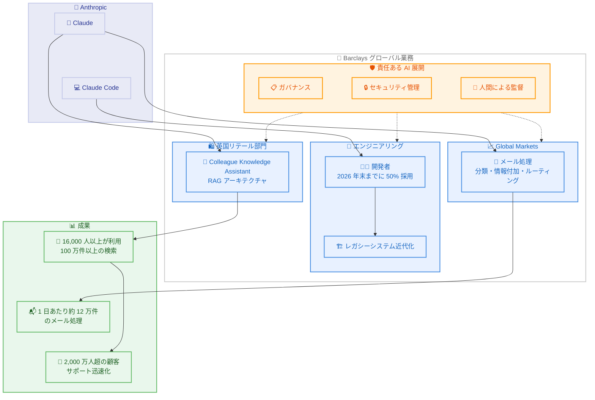

# Barclays が Claude を全社規模に拡大 - 業務変革と顧客体験向上を推進

## メタデータ

| 項目 | 内容 |
|------|------|
| 発表日 | 2026-10-01 |
| ソース | Anthropic News |
| カテゴリ | パートナーシップ / エンタープライズ / 金融 |
| 公式リンク | https://www.anthropic.com/news/barclays-scales-claude |

## 概要

英国のユニバーサルバンクである Barclays は、Anthropic との戦略的協業を拡大し、セキュアなエンタープライズ級 AI をグローバル業務全体に統合すると発表した。Claude Code は 2026 年末までに開発者の 50% が採用する見込みであり、2027 年にはソフトウェアエンジニアの過半数への展開を予定している。

既に本番環境では、英国リテール部門の「Colleague Knowledge Assistant」が 16,000 人以上の従業員によって利用され、100 万件以上の検索を処理し、2,000 万人を超える英国リテール顧客へのサポートを迅速化している。また、Global Markets 業務では 1 日あたり約 12 万件のメール処理に Claude を活用しており、規制の厳しい大規模金融機関における AI の実用化事例として重要なマイルストーンとなっている。

## 詳細

### 背景

Barclays は 2,000 万人超の英国リテール顧客を抱える世界最大級の金融機関であり、規制の厳しい金融業界において AI 導入には技術力と規律あるガバナンスの両方が求められる。本発表は、2025 年から稼働している既存のユースケースでの実績を基盤に、Anthropic との協業を全社規模へと拡大するものである。

Barclays グループ共同 COO の Anne Marie Darling 氏は、AI 導入は単なる技術採用ではなく業務変革であると位置づけ、プロセスの再構築と顧客・クライアント体験の向上を目指すと述べている。定型業務の削減により、従業員はより複雑な問題解決に注力できるようになる。

### 主な変更点

#### 1. Claude Code の大規模展開

**ソフトウェア開発の加速:**

- 2026 年末までに開発者の 50% が Claude Code を採用する見込み
- 2027 年にはソフトウェアエンジニアの過半数へ拡大予定
- レガシーシステムの近代化、ソフトウェア品質向上、業務効率の改善を目的とする

Barclays グループ共同 COO の Craig Bright 氏は、ソフトウェアエンジニアリングとサイバーセキュリティが AI によって再編されつつあると指摘し、AI は今後ますますエージェント型の能力になっていくと述べている。

#### 2. Colleague Knowledge Assistant (英国リテール部門)

**従業員向けナレッジ検索基盤:**

- 2025 年から本番稼働中。Claude を用いた RAG (検索拡張生成) アーキテクチャを採用
- 16,000 人以上の従業員が利用
- 100 万件以上の検索を処理
- 2,000 万人超の英国リテール顧客へのサポートを迅速化

#### 3. Global Markets 業務でのメール処理

**大量メールのインテリジェント処理:**

- 受信メールの分類、情報付加、最適な処理ルートの判定に Claude を活用
- 1 日あたり約 12 万件のメールを処理
- 手作業の削減と関連情報の迅速な特定を実現

#### 4. 責任ある AI 展開

- 堅牢なガバナンス、セキュリティ管理、人間による監督を適用
- 規制の厳しい大規模組織での導入には、技術力と規律あるガバナンスの両方が必要との認識を両社で共有

Anthropic 最高商務責任者の Paul Smith 氏は、この提携を英国における重要なマイルストーンと位置づけ、「これほど高い基準で AI に向き合う機関はほとんどない」とコメントしている。

### 技術的な詳細

#### 本番環境での Claude 活用実績

| 領域 | 内容 | 規模・効果 |
|------|------|-----------|
| Colleague Knowledge Assistant | RAG アーキテクチャによるナレッジ検索 | 16,000 人以上が利用、100 万件以上の検索 |
| Global Markets メール処理 | 分類・情報付加・ルーティング | 1 日あたり約 12 万件 |
| Claude Code | 開発加速、レガシー近代化 | 2026 年末までに開発者の 50% が採用見込み |
| 顧客サポート | 英国リテール顧客への対応迅速化 | 2,000 万人超の顧客基盤 |

#### 今後の計画

- 生産性向上、レジリエンス強化、顧客・クライアント成果の改善に向けた長期的な AI 活用
- Anthropic のフロンティア AI 能力と Barclays の責任あるイノベーション重視を組み合わせ、世界最大級の金融機関全体で実用的な AI アプリケーションを拡大

## 開発者への影響

### 対象

- Barclays のソフトウェアエンジニア・開発者 (Claude Code 展開対象)
- 金融業界向けエンタープライズ AI ソリューションを設計するアーキテクト
- 規制産業における AI ガバナンス・セキュリティ担当者
- RAG アーキテクチャやメール自動処理などのエージェント型ワークフローを構築する開発チーム

### 必要なアクション

1. **金融機関の開発チーム**: 規制の厳しい環境での Claude 導入事例として、Barclays のガバナンス・人間による監督のアプローチを参考にする
2. **エンタープライズアーキテクト**: RAG アーキテクチャによるナレッジ検索基盤や、大量メール処理のユースケース設計パターンを検討する
3. **Claude Code 導入検討者**: レガシーシステム近代化やソフトウェア品質向上の適用例として、段階的な展開計画 (開発者の 50% → 過半数) を参考にする

### 移行ガイド

本発表はビジネスパートナーシップの拡大であり、一般の開発者に技術的な移行作業は不要である。金融業界で同様の導入を検討する場合は、以下のステップが参考になる。

1. 特定部門での限定的なユースケースから開始 (例: ナレッジ検索、メール処理)
2. ガバナンス、セキュリティ管理、人間による監督の体制を整備
3. 実績を基に Claude Code などの開発者向けツールを段階的に展開
4. 全社規模への拡大と長期的な業務変革ロードマップの策定

## アーキテクチャ図

## 関連リンク

- [Barclays が Claude を拡大導入 (公式発表)](https://www.anthropic.com/news/barclays-scales-claude)
- [Claude Code ドキュメント](https://docs.anthropic.com/en/docs/claude-code)
- [Anthropic Enterprise](https://www.anthropic.com/enterprise)
- [Anthropic News](https://www.anthropic.com/news)

## まとめ

Barclays と Anthropic の協業拡大は、規制の厳しい金融業界におけるエンタープライズ AI 導入の成熟を示す発表である。以下の 3 つの観点で特に重要な意義を持つ。

1. **実証済みのユースケースを基盤とした拡大**: 2025 年から稼働する Colleague Knowledge Assistant (16,000 人以上が利用、100 万件以上の検索) や、1 日あたり約 12 万件のメール処理という具体的な実績を基に全社展開へ進んでおり、パイロット段階を超えた本番運用の成功事例となっている
2. **開発者組織への段階的展開**: Claude Code を 2026 年末までに開発者の 50%、2027 年にはソフトウェアエンジニアの過半数へ展開するという明確なロードマップは、大規模金融機関における AI 支援開発の普及モデルを示している
3. **責任ある AI 展開の枠組み**: 堅牢なガバナンス、セキュリティ管理、人間による監督を組み合わせたアプローチは、規制産業で AI を大規模導入する際のベストプラクティスとして、他の金融機関にとっても参考になる

Anthropic にとって本提携は英国市場における重要なマイルストーンであり、フロンティア AI 能力と責任あるイノベーションの組み合わせが、世界最大級の金融機関の業務変革を支える段階に到達したことを示している。
