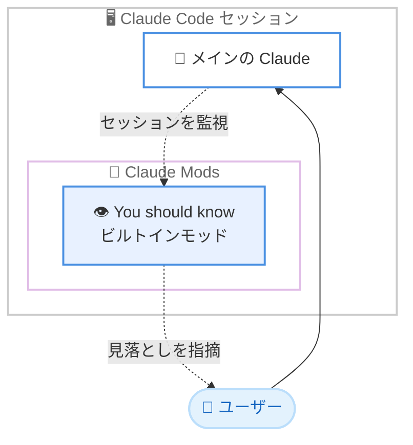

# Claude Code v2.1.287: Claude Mods の導入、ビルトインモッド「You should know」、Bedrock / Vertex などで 1M コンテキストがデフォルトに

## メタデータ

| 項目 | 内容 |
|------|------|
| 発表日 | 2026-10-01 |
| ソース | Claude Code Changelog |
| カテゴリ | Claude Code / CLI アップデート |
| 公式リンク | https://github.com/anthropics/claude-code/blob/main/CHANGELOG.md |

## 概要

Claude Code v2.1.287 がリリースされた。106 項目の変更を含む大型リリースであり、最大の目玉は **Claude Mods** の導入である。プラグインが Claude Code のより深い挙動を変更できるようになり、その第 1 弾となるビルトインモッド「**You should know**」も同時に提供された。これはサイドエージェントがセッションを見守り、ユーザーや Claude が見落としそうな点を指摘してくれる機能で、`/plugin enable cc-plugin-you-should-know@builtin` で有効化できる (テレメトリが有効なファーストパーティセッションが対象)。

挙動変更として大きいのは、Bedrock、Vertex、Foundry、Claude apps gateway 上の Opus 4.7 以降と Fable が、`[1m]` サフィックスなしでデフォルトで 1M コンテキストウィンドウを使用するようになった点である。従来の 200K を維持したい場合は `CLAUDE_CODE_DISABLE_1M_CONTEXT=1` を設定する。

このほか、2025-11-25 プロトコルの MCP サーバーからの URL プロンプト (サインインなど) への対応、エージェントビューの `n:<text>` フィルター、セルフホストランナー向けのビルトイン `gh api`、スクリーンリーダーモードの大規模な修正 (10 件以上)、危険な `rm` の安全確認が特定の条件で失われる問題の修正などが含まれる。

## 詳細

### 背景

Claude Code v2.1.287 は、信頼性とセキュリティの修正を中心とした 2026-09-30 の v2.1.286 に続くリリースである。v2.1.286 までのメンテナンス中心の流れから一転し、本バージョンではプラグインの拡張性を大きく広げる Claude Mods という新しい仕組みが導入された。従来のプラグイン (スキル、フック、MCP サーバーなどの組み合わせ) では届かなかった、Claude Code 本体のより深い挙動の変更がプラグインから可能になる。

また、エンタープライズ向けプラットフォーム (Bedrock、Vertex、Foundry、Claude apps gateway) でのコンテキストウィンドウのデフォルトが 1M に拡大され、ファーストパーティ API との体験差が縮小された。

### 主な変更点

#### 1. Claude Mods の導入

プラグインが Claude Code のより深い挙動を変更できる仕組みとして **Claude Mods** が追加された。changelog では「plugins may now modify deeper behavior」と簡潔に述べられており、ライブペインやステータス表示などを含むプラグインの拡張ポイントが広がったことを意味する。

#### 2. ビルトインモッド「You should know」

Claude Mods の仕組みを使った最初のビルトインモッドとして「**You should know**」が追加された。

- **機能**: サイドエージェントがセッションを見守り、ユーザーや Claude が見落としそうな点を指摘する
- **有効化**: `/plugin enable cc-plugin-you-should-know@builtin`
- **対象**: テレメトリが有効なファーストパーティセッション

メインの会話とは別のエージェントが「背中を見守る」形で動作するため、作業に集中しながら見落としの指摘を受け取れる。

#### 3. 1M コンテキストウィンドウがデフォルトに (Bedrock / Vertex / Foundry / Claude apps gateway)

Opus 4.7 以降と Fable が、Bedrock、Vertex、Foundry、Claude apps gateway 上でデフォルトで 1M コンテキストウィンドウを使用するようになった。従来必要だった `[1m]` サフィックスは不要である。

| 項目 | 変更前 | 変更後 |
|------|--------|--------|
| デフォルトのコンテキストウィンドウ | 200K | 1M |
| 1M の指定方法 | `[1m]` サフィックス | 不要 (デフォルト) |
| 200K を維持する方法 | デフォルト | `CLAUDE_CODE_DISABLE_1M_CONTEXT=1` |

#### 4. MCP サーバーからの URL プロンプト対応

2025-11-25 プロトコルの MCP サーバーからの URL プロンプト (サインインなど) に対応した。注意点として、この更新後にサーバーが接続できなくなった場合は、MCP 設定エントリに `"bareElicitationCapability": true` を追加する必要がある。

あわせて MCP 関連では以下も変更された。

- MCP サーバーの `alwaysLoad: false` が、そのサーバーのすべてのツールをツール検索の背後に遅延させるようになった
- 大きな MCP ツール結果の処理が改善され、メモリ使用量とセッションファイルのサイズが削減された。上限を大きく超える結果に対するトークンカウント用の余分なアップロードも廃止された
- MCP コネクタのツール呼び出しが、サーバーの対応 MCP プロトコルバージョンが変わった際に 2 回実行されたり、再起動まで失敗し続けたりすることがある問題を修正
- ヘッドレスモードの MCP 起動で、最初の接続が一時的に失敗したリモートサーバーが、最も遅いサーバーの接続完了を待たずにリトライされるようになった

#### 5. エージェントビューとバックグラウンドセッションの改善

- **`n:<text>` フィルター**: エージェントビューにセッション名とタスクにマッチする `n:<text>` フィルターが追加された。フィルターは折りたたまれたセクション内のマッチも表示し、Enter で最初のマッチを開ける
- **返信のキュー化**: `claude agents` からの返信がキューされたメッセージとして届くようになった。ターン実行中に送られた `/stop` 以外のスラッシュコマンドは、ターン終了時に実行される
- エージェントの終了とともにセッション開始時の worktree が削除され、`claude agents` からバックグラウンドセッションを再び開けなくなる問題を修正
- バックグラウンドセッションが待機している権限プロンプトが `claude agents` に表示されないことがある問題を修正
- スクリーンリーダーモードで `claude agents` の時刻表示が毎秒変化していた問題を修正。最大 10 秒ごとの変化になった

#### 6. セキュリティ・権限まわりの修正と変更

- **危険な `rm` の安全確認**: `/` やホームディレクトリに対する危険な `rm` で、同じコマンドが `~` やワイルドカードパスへの出力リダイレクトも行っていた場合に、常に確認する安全確認が失われていた問題を修正
- **シンボリックリンク経由の書き込み**: リポジトリにコミットされたシンボリックリンクを通じた、センシティブなファイルや作業ツリー外への書き込みが、書き込み先を明示して人の確認を待つようになった。`~` ターゲットの行も対象である
- **ツール全体の許可ルールの制限**: `Bash` ツール全体の allow ルールやフックによる許可があっても、Claude Code のファイルツールが完全に拒否するファイル (Anthropic プロファイルストア、ホストの資格情報ファイル) へのシェル書き込みは、実行せずにプロンプトを表示するようになった
- **組織の権限上限**: `__proto__` という名前の MCP ツールに対して、組織のツールごとの権限上限が黙って無視されていた問題を修正
- **OpenTelemetry**: `user_prompt` イベントに `prompt` のコピーである `prompt_text` が追加された。ドット付きキーをネストするバックエンド向けであり、`prompt` をドロップまたはマスクしている場所では `prompt_text` も同様に扱う必要がある

#### 7. モデル・プラットフォーム関連の修正

- **Bedrock / Vertex の起動時モデルチェック**: 強制された `availableModels` リストを無視し、`/model` が 1 つの Opus 行に縮退することがあった問題を修正
- **Bedrock Guardrails**: 応答の途中で届いたブロックが、返信が thinking で始まっていた場合に guardrail のメッセージではなく API エラーでターンを終了させていた問題を修正
- **モデルフォールバックの繰り返し**: `claude -p` と SDK セッションで、返信の実行中にモデルが切り替えられた後、以降のすべてのメッセージでモデルフォールバックが繰り返されていた問題を修正
- **`/model` での Fable 選択**: claude.ai ログインで Fable を選ぶと現在のバージョンの id が保存されていた問題を修正。保存されたデフォルトが Opus や Sonnet と同様に最新の Fable へ追従するようになった
- **effort レベルの維持**: フラグされたメッセージ後の自動モデル切り替えが、新しいモデルのデフォルトではなく現在の effort レベルを維持するようになった
- **認証ヘッダーの一貫性**: Bedrock、Vertex、Mantle で `CLAUDE_CODE_SKIP_*_AUTH` 下のモデル可用性チェックが、`ANTHROPIC_CUSTOM_HEADERS` で `Authorization` が重複している場合に実リクエストと異なるヘッダーを送っていた問題を修正

#### 8. スクリーンリーダーモードの大規模修正

アクセシビリティ関連の修正が 10 件以上含まれる。主なものは以下のとおり。

- 検索ボックス (/resume、/permissions など) やサインインコード欄で、カーソルが入力テキストから離れた位置に残る問題を修正
- ファイル編集の承認プロンプトやその他の diff で、変更行が読み上げから抜けていた問題を修正
- `claude --teleport` の進行画面やチェック中の MCP フォームフィールドが、スピナーのフレームごとに繰り返し読み上げられていた問題を修正
- 前の画面がターミナルウィンドウより高かった場合に、2 つ目の承認プロンプトの先頭行などが読み上げから抜けていた問題を修正
- 承認プロンプトで何もしない Tab キーの「Tab to amend」ヒントや、/permissions と /mcp で機能しない矢印キーの案内が表示されていた問題を修正
- 新しい行や変更された行を、行頭にカーソルを置いて一時停止せずに書き出すようになった。従来の一時停止は `CLAUDE_AX_PREPARK_MS=50` で復元できる

このほか、「Reduce motion」設定が有効でも実行中ツールのドットとスピナーが動き続ける問題も修正された。

#### 9. Windows・セルフホストランナー

- **Windows の起動時警告**: Bash ツールの拒否が PowerShell ツールも無効化し、Claude がシェルツールを持たなくなる場合に、起動時に警告が表示されるようになった
- **Windows の Bash 高速化**: すべてのコマンドの前に実行されていたサブシェルが削除され、Bash ツールが高速化された
- **Windows の raw mode エラー**: 入力がパイプまたはリダイレクトされた対話型 `claude` が「Raw mode is not supported」でハングまたはクラッシュしていた問題を修正。理由を表示して終了するようになった (パイプ入力には `-p` を使用)
- **セルフホストランナー**: GitHub CLI がインストールされていない macOS / Linux マシンで、Anthropic 管理の git を使うセッション向けにビルトインの `gh api` (REST のみ) が追加された

#### 10. リモートセッション・クラウドセッションの修正 (抜粋)

- ユーザーアカウントを持たないエージェントが所有するリモートセッションで、組織が許可していても fast モードがオフのままだった問題を修正
- Remote Control が再接続要求への応答がない場合に数分間メッセージを受信できなかった問題を修正。30 秒で諦めてリトライするようになった
- コンパクション中にセッションが再起動した際に、クラウドセッションが以前の会話を失うことがあった問題を修正
- 一辺 8,000 ピクセルを超える PNG、JPEG、WebP 画像がリモートセッションから送信できなかった問題を修正。縮小したコピーが送信されるようになった
- Claude apps から 17〜20 個のファイルを添付したメッセージが最初の 16 個しか届かなかった問題を修正
- クラウド / Remote Control セッションからのファイル送信で、タイムアウト・ネットワークエラー・502 / 503 / 504 での失敗が 1 回リトライされるようになり、大きなファイルはメモリに読み込まずディスクからストリームされるようになった
- macOS で、`claude remote-control` で開始した Remote Control セッションが Mac のアイドルスリープでターンの途中に停止する問題を修正

#### 11. SDK・ヘッドレス関連の修正 (抜粋)

- モデルの応答ストリームがデータなしで停止している間、ツールのハートビートが SDK ホストに届かなかった問題を修正
- `--include-partial-messages` が、途中で切れた返信の `message_stop` を遅延または欠落させ、アプリが返信を実行中のまま表示し得た問題を修正
- `--output-format stream-json` と SDK が、`/<skill>` をプロンプトとして入力した `context: fork` スキル実行のターンをストリームしなかった問題を修正
- `CLAUDE_CODE_DISABLE_EXPERIMENTAL_BETAS` が、セッションタイトルとプロンプトフックのリクエストから structured-output フォーマットを除去せず、Bedrock バックエンドのゲートウェイが拒否していた問題を修正
- SDK セッションで priority「now」のメッセージが実行中の web fetch / web search をキャンセルしなくなり、バックグラウンドで読み込みが継続されるようになった
- `asyncRewake` が設定されたフックのスクリプトファイルが存在しない場合に、「found issues」通知で Claude を何度も起こしていた問題を修正。壊れたフックは 1 回だけ報告される

#### 12. UI・UX の改善 (抜粋)

- **`/config` の改善**: 循環する設定に ‹ › が表示され ←/→ で両方向に変更でき、狭いターミナルでは値がラベルの下に積まれ、PgUp / PgDn でリストをページ送りできるようになった
- **`/memory` の改善**: Auto-memory などのオン / オフ設定を左右矢印キーで切り替えられるようになった
- **権限プロンプトの統一**: MCP などのツール権限プロンプトと、他セッションからの保留メッセージのプロンプトが、ファイル編集プロンプトと同様にツール呼び出しやメッセージを破線の間に表示するようになった
- **プロンプトの表示順**: 待機中の権限プロンプトが古い順に表示され、読んでいる最中のプロンプトが新しいプロンプトに覆われなくなった (カウントダウン付きプロンプトは引き続き最前面)
- **ライトテーマのコントラスト**: プロンプト入力欄のボーダーと、過去メッセージの前の ❯ のコントラストが改善された
- **ペースト動作の変更**: Windows / Linux の右クリックペーストと Linux のミドルクリックペーストが、ボタンを離した時点で実行されるようになった。離す前にポインターを移動するとキャンセルされる
- **Bash 権限プロンプトの説明**: 「Contains simple_expansion」のような内部パーサー名ではなく、平易な説明が表示されるようになった
- **プラグイン関連**: マーケットプレイスが無視・拒否された理由と対処を平易な言葉で説明するようになり、依存関係が未インストールのプラグインはリストにその旨が表示され、更新時には未完了のインストールがリトライされる

#### 13. VSCode 拡張の変更 (14 項目)

**追加:**

- 実行中のコマンドやサブエージェントをバックグラウンドへ移して作業を継続できる「Run in background」が追加された
- バックグラウンドシェルと Monitor の出力が、agent map のカードに表示されるようになった

**修正・改善・変更:**

- サイドバーが既にこのマシンに持ってきたクラウドセッションを再び開くと新しいタブで二重に開く問題、リロード後に復元されたタブが同じ会話に 2 つ目の Claude プロセスを起動する問題を修正
- サイドバーの Web タブがウィンドウ読み込み後に開始されたクラウドセッションを表示しない問題を修正。読み込み失敗時は「Remote server is not connected」と表示される
- プラン プレビュータブ内のファイルリンクがクリックしても何も起きなかった問題を修正
- ユーザー自身の `/usage` や `/context` コマンドが、コマンドメニューから選ぶと実行されずに拡張のダイアログを開いていた問題を修正
- バックグラウンドエージェントの実行中コマンドが、メインターンの終了時に失敗と表示される問題を修正
- WSL などのリモートホストでツールの入出力をエディタータブで開くとタイムアウトすることがある問題を修正
- Claude in Chrome の「Enabled by default」スイッチが、エディター自身のセッションも接続するようになった (ブラウザ操作の前には引き続き確認がある)

#### 14. Cloud sessions / Claude Tag / Code Review

- **Cloud sessions**: GitHub が発行直後のアクセストークンを一時的に拒否した際の fetch / push の失敗を修正
- **Claude Tag (Slack)**: GitHub アクティビティなどのバックグラウンドイベントで起動した際に、誰も返信を待っていない Slack スレッドへスペンド制限通知などの失敗警告を投稿していた問題を修正。管理設定のスペンド制限ページが、チャンネル数の多い組織で最近作成されたチャンネルやプライベートチャンネルを表示しない問題も修正された。長いスレッドでタスクリストが独立したメッセージとして再投稿され、フォロワーに通知が飛ぶ問題も解消された
- **Code Review**: 指摘コメントと「Why this was flagged」が文の途中で切れる問題と、前のコミットでレビューが 2 回失敗した後の新しいプッシュがスキップされる問題を修正。会話がロックされたプルリクエストでは、失敗カードがロックが原因であることと、何も投稿・課金されていないことを明示するようになった

### 技術的な詳細

#### Claude Mods と You should know の構成



#### 1M コンテキストウィンドウの対象

| プラットフォーム | 対象モデル | デフォルト | 無効化 |
|----------------|-----------|-----------|--------|
| Amazon Bedrock | Opus 4.7+、Fable | 1M | `CLAUDE_CODE_DISABLE_1M_CONTEXT=1` |
| Google Vertex AI | Opus 4.7+、Fable | 1M | 同上 |
| Microsoft Foundry | Opus 4.7+、Fable | 1M | 同上 |
| Claude apps gateway | Opus 4.7+、Fable | 1M | 同上 |

#### 更新後に影響し得る設定

| 設定 | 影響 | 対処 |
|------|------|------|
| MCP サーバー (2025-11-25 プロトコル) | 更新後に接続できなくなることがある | MCP 設定エントリに `"bareElicitationCapability": true` を追加 |
| OpenTelemetry の `user_prompt` | `prompt_text` フィールドが追加される | `prompt` をドロップ / マスクしている場所で `prompt_text` も同様に処理 |
| MCP サーバーの `alwaysLoad: false` | すべてのツールがツール検索の背後に遅延される | 即時ロードが必要なら設定を見直す |
| スクリーンリーダーの行書き出し | 行頭での一時停止が廃止 | 従来動作は `CLAUDE_AX_PREPARK_MS=50` |

## 開発者への影響

### 対象

- プラグイン開発者 (Claude Mods による拡張ポイントの追加)
- テレメトリ有効なファーストパーティセッションの利用者 (You should know モッド)
- Bedrock / Vertex / Foundry / Claude apps gateway の利用者 (1M コンテキストのデフォルト化、起動時モデルチェックの修正)
- MCP サーバーの開発者・利用者 (URL プロンプト対応、`alwaysLoad` の挙動変更)
- OpenTelemetry でプロンプトをマスクしている組織 (`prompt_text` の追加)
- スクリーンリーダーを使用する開発者 (多数のアクセシビリティ修正)
- SDK / ヘッドレスモードでアプリを構築している開発者
- VSCode 拡張、Cloud sessions、Claude Tag (Slack)、Code Review の利用者

### 必要なアクション

- **You should know の試用**: 見落とし指摘のサイドエージェントを使いたい場合は `/plugin enable cc-plugin-you-should-know@builtin` を実行する (テレメトリ有効なファーストパーティセッションが対象)
- **1M コンテキストの確認**: Bedrock / Vertex / Foundry / Claude apps gateway で Opus 4.7 以降または Fable を使用している場合、デフォルトが 1M になる。コストやレイテンシの観点で 200K を維持したい場合は `CLAUDE_CODE_DISABLE_1M_CONTEXT=1` を設定する
- **MCP サーバーの接続確認**: 更新後に MCP サーバーが接続できなくなった場合は、設定エントリに `"bareElicitationCapability": true` を追加する
- **OTel パイプラインの確認**: `user_prompt` イベントの `prompt` をドロップまたはマスクしている場合は、新しい `prompt_text` フィールドにも同じ処理を適用する
- **Windows でのシェル設定確認**: Bash ツールを拒否すると PowerShell ツールも無効になり、Claude がシェルツールを持たなくなる。起動時警告が表示された場合は権限設定を見直す

### 移行ガイド (該当する場合)

破壊的変更は限定的だが、以下の挙動変更に注意が必要である。

- Bedrock / Vertex / Foundry / Claude apps gateway 上の Opus 4.7 以降と Fable は、デフォルトで 1M コンテキストウィンドウを使用する
- MCP サーバーの `alwaysLoad: false` は、そのサーバーのすべてのツールをツール検索の背後に遅延させる
- `claude agents` からの返信はキューされたメッセージとして届き、ターン実行中に送った `/stop` 以外のスラッシュコマンドはターン終了時に実行される
- `Bash` ツール全体の allow ルールやフックによる許可があっても、ファイルツールが完全拒否するファイルへのシェル書き込みはプロンプトが表示される
- Windows / Linux の右クリックペーストと Linux のミドルクリックペーストは、ボタンを離した時点で実行される
- フラグされたメッセージ後の自動モデル切り替えは、現在の effort レベルを維持する

## コード例

MCP サーバーが本バージョンの更新後に接続できなくなった場合の設定例を示す。

```json
{
  "mcpServers": {
    "my-server": {
      "type": "http",
      "url": "https://example.com/mcp",
      "bareElicitationCapability": true
    }
  }
}
```

You should know ビルトインモッドの有効化は以下のコマンドで行う。

```
/plugin enable cc-plugin-you-should-know@builtin
```

## 関連リンク

- [Claude Code Changelog (v2.1.287)](https://github.com/anthropics/claude-code/blob/main/CHANGELOG.md)
- [Claude Code v2.1.286 のレポート](./2026-09-30-claude-code-v2-1-286.md)
- [Claude Code 公式ドキュメント](https://code.claude.com/docs)
- [Claude Code のプラグイン](https://code.claude.com/docs/en/plugins)
- [Claude Code のフック](https://code.claude.com/docs/en/hooks)

## まとめ

Claude Code v2.1.287 は、106 項目の変更を含む機能追加と信頼性向上の両面で充実したリリースである。最大のトピックは Claude Mods の導入であり、プラグインが Claude Code のより深い挙動を変更できるようになったことで、エコシステムの拡張性が一段と広がった。その実例となるビルトインモッド「You should know」は、サイドエージェントが見落としを指摘するという新しい協働の形を提示している。

エンタープライズ利用の観点では、Bedrock / Vertex / Foundry / Claude apps gateway での 1M コンテキストのデフォルト化が大きく、`availableModels` の無視や Guardrails ブロックの扱いなどプラットフォーム固有の修正も揃った。スクリーンリーダーモードの 10 件を超える修正はアクセシビリティへの継続的な投資を示しており、危険な `rm` の安全確認やシンボリックリンク経由の書き込み確認などのセキュリティ修正も含め、幅広いユーザーにとって更新する価値の高いリリースといえる。
