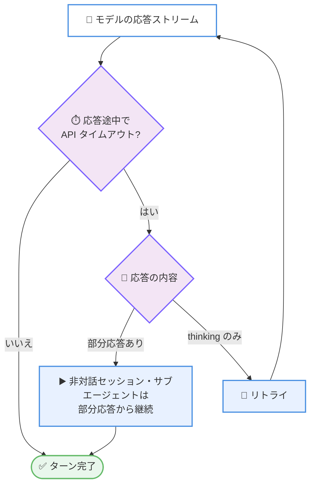

# Claude Code v2.1.288: モッド向け `$.ui.selection()`、Ctrl+C で消したプロンプトの復元、/code-review の `--max-findings`、タイムアウト・レジュームの信頼性修正多数

## メタデータ

| 項目 | 内容 |
|------|------|
| 発表日 | 2026-10-02 (npm 公開日時: 2026-10-02T18:30:40Z) |
| ソース | Claude Code Changelog |
| カテゴリ | Claude Code / CLI アップデート |
| 公式リンク | https://github.com/anthropics/claude-code/blob/main/CHANGELOG.md |

## 概要

Claude Code v2.1.288 がリリースされた。89 項目の変更を含むリリースであり、内訳は追加 (Added) 7 件、修正 (Fixed) 64 件、改善 (Improved) 12 件、変更 (Changed) 6 件である。前日の v2.1.287 で導入された Claude Mods を早速拡張する **`$.ui.selection()`** API が追加されたほか、**Ctrl+C で消してしまったプロンプトの下書きを Up キーで復元**できるようになり、**/code-review に `--max-findings` オプション**が加わるなど、日常の操作性を高める追加が目立つ。

修正面では信頼性の改善が中心である。応答の途中で API がタイムアウトした場合に、非対話セッションとサブエージェントが**部分応答から継続**するようになり、thinking のみの応答はリトライされる。`--resume` やコンパクション周辺の不具合 (復元直後のコンテキスト喪失、最後の応答の未保存、途中で切れたトランスクリプトの読み込みなど) も複数修正された。セキュリティ面では、bypassPermissions モードやシェル許可ルール下で `bash -c` スクリプト内の危険な `rm` が確認なしに実行される問題 (anthropics/claude-code#96300) が修正されている。

挙動変更としては、バックグラウンドコマンドの時間制限が無人セッション (`-p`、Agent SDK、CI、クラウド) のみに適用されるようになり、ターミナル・デスクトップアプリ・VS Code セッションでは無制限になった点が大きい。また `claude project purge` は `claude purge` に改名された (旧名も引き続き動作する)。

## 詳細

### 背景

Claude Code v2.1.288 は、Claude Mods の導入と 1M コンテキストのデフォルト化を含む大型リリースだった 2026-10-01 の v2.1.287 の翌日にリリースされた。本バージョンは前日に導入された Mods の API 拡張 (`$.ui.selection()`) と `claude plugin test` の修正で新機能を早速フォローしつつ、タイムアウト・レジューム・コンパクション・ゲートウェイ環境といった信頼性領域の修正を 64 件積み上げた、品質改善色の強いリリースである。

### 主な変更点

#### 1. 追加機能 (Added: 7 件)

- **モッド向け `$.ui.selection()`**: フルスクリーンモードで最後に選択したテキストを返す API が追加された。選択範囲が 1 つのトランスクリプト行内に収まる場合は、その行も返される。前日の v2.1.287 で導入された Claude Mods の拡張ポイントが早速広がった形である
- **クラウドセッションのビルトイン `gh api`**: イメージに GitHub CLI が含まれないクラウドセッションにもビルトインの `gh api` が追加された。あわせて、ファイル名、jq フィルター、GitHub エラーに含まれる制御文字がターミナルに送られる問題も修正された
- **Ctrl+C で消したプロンプトの復元**: Ctrl+C でクリアしたプロンプトは、空のプロンプトで Up キーを押すと下書きとして復元される。ペーストしたテキストや画像も含めて戻る
- **MCP OAuth スコープの再認証プロンプト**: ツール呼び出し中に MCP サーバーが追加の OAuth スコープを要求した場合、再認証を促すプロンプトが表示されるようになった
- **/code-review の `--max-findings <n>|all`**: 通常の上限より多く、または少なく指摘を報告できる。指定した値は `--max-findings default` を渡すまで再利用される
- **エージェントビューのキーボード操作**: Ctrl+F で名前からセッションを検索でき、Alt+↑/↓ でグループ間をジャンプできるようになった。両操作と rename は keybindings.json でリバインドできる
- **スクリーンリーダーモードの権限モード読み上げ**: プランを承認した際 (Shift+Tab での切り替えを含む)、新しい権限モードが読み上げられるようになった

#### 2. タイムアウト・レジューム・コンパクションの信頼性修正

本バージョンで最も厚いのが、長時間セッションの信頼性に関わる修正群である。

- **応答途中の API タイムアウト**: ターン全体が失敗する代わりに、非対話セッションとサブエージェントは部分応答から継続するようになった。thinking のみの応答はリトライされる
- **"Prompt is too long" エラー**: 最後の返信がトークン使用量ゼロと報告した場合に、長い会話が自動コンパクトされずにこのエラーで失敗していた問題を修正
- **`--resume` とコンパクションの競合**: コンパクションが復元した直後のファイルやその他のコンテキストを、`--resume` が落とすことがあった問題を修正
- **最後の応答の未保存**: 再開したセッションがターンの最後の応答を保存しないことがあり、次の `--resume` でプロンプトが未回答のまま表示される問題を修正
- **途中で切れたトランスクリプト**: 同じセッションが読み込み中にファイルを書き換えた場合に、resume が途中で切れたトランスクリプトを読み込むことがあった問題を修正
- **旧バージョンからの再開**: v2.1.286 以前に開始した会話を再開すると、モデルの以前の thinking が失われていた問題を修正
- **無人セッションのリトライ暴走**: `CLAUDE_CODE_RETRY_WATCHDOG` を使う無人セッションが、非常に長い応答ストリームの失敗後に何時間もリトライし続けていた問題を修正。再度ストリーミングし、タイムアウト 3 回で諦めるようになった

#### 3. ゲートウェイ・エンタープライズプラットフォームの修正

- **structured outputs の互換性**: Mantle や structured outputs を拒否するゲートウェイで、セッションタイトル、メモリリコール、プロンプトフックが失敗していた問題を修正。あわせて structured outputs を無効化する `CLAUDE_CODE_DISABLE_STRUCTURED_OUTPUTS` 環境変数が追加された
- **auto モードのクラシファイア**: Bedrock と Mantle で、古いモデルへのリクエスト (WebFetch の要約や `sonnet` サブエージェントなど) をきっかけに、セッションの残りがローカルクラシファイアに切り替わっていた問題を修正
- **auto モードの拒否メッセージ**: ブロックされたツールが Bash でないのに、Bash の権限ルールを示していた問題を修正
- **Bedrock 資格情報ルックアップ中の Stop**: リクエストを終了する代わりにフォールバックモデルへ移動することがあった問題を修正
- **スリープ復帰時の二重サインイン**: 別の Claude Code プロセスがサインイン中にラップトップがスリープから復帰すると、`gcpAuthRefresh` / `awsAuthRefresh` のブラウザサインインが 2 つ目として開く問題を修正
- **サーバー側の制限値の尊重**: 新しい環境での最初のリクエスト、またはモデル切り替え後のリクエストが、サーバーの出力上限と自動コンパクトウィンドウではなくビルトインの値を使っていた問題を修正。そのリクエストは最大 1.5 秒待つ場合がある
- **クラウドセッションのモデル復元**: 組織の強制モデルリストが拒否するモデルを、再起動したクラウドセッションが復元していた問題と、サーバーが拒否した新規選択モデルでそのまま返信していた問題を修正
- **Claude 3 系モデルの PDF**: PDF 全体が会話に入った後、Claude 3 Opus と Claude 3 Sonnet のセッションが毎ターン失敗していた問題を修正

#### 4. セキュリティ・権限まわりの修正

- **`bash -c` 内の危険な `rm`**: `/` やホームディレクトリに対する危険な `rm` が、`bash -c` や `sh -c` のスクリプト内にある場合に、bypassPermissions モードやシェル許可ルール下で確認なしに実行されていた問題を修正 (anthropics/claude-code#96300)
- **`BASHPID` の算術評価**: シェルが算術として評価する値を持つ `BASHPID` 代入が、黙って許可される代わりに事前にプロンプトを表示するようになった
- **サンドボックスのヒアドキュメント**: 引用符なしデリミタのヒアドキュメント (`python3 <<EOF`) が、本文がプレーンテキストと単純な `$VAR` 参照のみの場合でも、サンドボックス自動許可下で毎回承認を求めていた問題を修正
- **フックの失敗時の扱い**: PreToolUse と PermissionRequest フックのマッチングが失敗した場合や、ツールの入力を JSON にシリアライズできない場合に、フックがスキップされていた問題を修正。該当する呼び出しはブロックされるようになった
- **ルールの読み込みタイミング**: パススコープの `.claude/rules` とネストした CLAUDE.md が、Write や Edit によるファイル作成・変更時に読み込まれない問題を修正 (従来は Read のみ)
- **サンドボックスの資格情報設定**: `permissions.blockReadsOutsideWorkingDirectories` が有効な間、git 設定ファイルに対する `sandbox.credentials.files` エントリが効かない問題を修正
- **/login の失敗通知**: 資格情報をセキュアストレージに保存できなかった場合でも「Login successful」と報告していた問題を修正。失敗が表示され、新しいログインが反映されなかった場合はリトライが提案される (anthropics/claude-code#73861)

#### 5. プラグイン・モッド関連の修正

- モッドのボタンが、Claude Code 再起動前に描画されたビューで押されると別のボタンのアクションを実行することがあった問題を修正
- 1 つの `Code` 要素にパースできない diff が含まれると、プラグインのペインに何も表示されない問題を修正。プレーンなコードとして描画されるようになった
- プラグインの LSP サーバーが、`initializationOptions` と `settings` で `${user_config.*}` や `${CLAUDE_PLUGIN_ROOT}` のプレースホルダーをそのまま受け取っていた問題を修正
- プラグインの `tool.call` フックが、worktree で動くサブエージェントで Bash を失敗させ、ファイル検索に誤ったフォルダーを読ませていた問題を修正
- 古い git (2.39 未満、例: Ubuntu 22.04 の 2.34) で `git-subdir` プラグインのインストールが失敗、または不完全なプラグインをキャッシュする問題を修正
- `--plugin-dir` で読み込んだプラグインに `/plugin` の「Configure options」が表示されない問題を修正
- プラグインのタイマーや読み込みが実行中にリロード・無効化されると、バックグラウンドセッションが終了する問題を修正
- GitHub SSH キーのない macOS / Linux マシンで `claude plugin install` が失敗する問題を修正。クローンが HTTPS にフォールバックし、通知が表示される
- `owner/repo` 形式のプラグインマーケットプレイスで、SSH と HTTPS の両方のフェッチが失敗した際に 2 回目のエラーしか表示されなかった問題を修正。両方のエラーが表示される
- `claude plugin test` が、古い保存設定を読んだだけでモッドがリモートで無効化されていると報告する問題を修正

#### 6. MCP・SDK・ヘッドレス関連の修正

- リモート MCP サーバーの結果が 16 MB を超える場合やパースできない場合に、MCP ツール呼び出しが 2 回実行されることがあった問題を修正
- Claude Desktop の Code タブのサブエージェントが、ユーザー設定の `memory` という名前の MCP サーバーのツールを一切取得できない問題を修正
- `claude mcp serve` の Agent ツールが常に「利用可能なエージェントなし」と報告し、すべての subagent_type を拒否していた問題を修正
- ヘッドレス (`-p` / SDK) セッションが、`timeout` や systemd などのスーパーバイザーが SIGTERM と SIGCONT を同時に送ると、SIGTERM を無視することがあった問題を修正
- OpenTelemetry の `claude_code.tool.blocked_on_user` スパンが、`-p` / SDK セッションや PreToolUse フックの承認で `unknown` の source / decision を報告していた問題を修正
- `-p` モードや中断されたターンで未回答のまま終わった権限要求が、`tool_decision` イベントを発行しない問題を修正
- エージェントチーム: 名前で起動されたプラグイン定義のエージェントが、デフォルトではなく自身の prompt、tools、disallowedTools、effort で実行されるようになった
- `tools:` に非常に多くの `Agent(...)` エントリを列挙したエージェントの起動時に発生していたストールを修正
- LSP ツール呼び出しが、言語サーバーが動的ケイパビリティ登録を使う場合や応答を停止した場合に無期限にハングする問題を修正。リクエストは 60 秒でタイムアウトする (サーバーごとの `requestTimeout` で調整可能)
- バックグラウンドエージェントの実行中に `idle_prompt` 通知フックが発火する問題を修正 (anthropics/claude-code#93672)

#### 7. クラウドセッション・リモート関連の修正

- Cowork クラウドセッションで、未承認 URL への WebFetch 権限プロンプトが 5 分間未回答のままだと、入力待ちとしてマークされ続ける問題を修正
- 別デバイスで開始した Cowork クラウドセッションにスマートフォンから参加すると、プロンプト候補が表示されない問題を修正
- Cowork クラウドセッションの Edit と Retry が、履歴が保存されているにもかかわらず `/compact` 前に送信したメッセージを拒否する問題を修正
- Remote Control のクリーンアップが、接続中または別の Claude Code プロセスが再アタッチしたばかりのセッションをアーカイブする問題を修正
- 別セッション宛てのメッセージが保留されたまま「配信済み」と報告される問題を修正。配信されなかったことと対象セッション名が通知され、SDK セッションでは Claude がターンの途中で知ることができるようになった
- [Cloud sessions] 無関係なセキュリティ設定の読み込み中または失敗中に、管理設定の Cloud sessions スイッチがロックされたままになる問題を修正
- [Cloud sessions] セルフホストランナーの起動中に Stop を押しても、キューされたメッセージがキャンセルされず、ランナー起動後に実行されることがあった問題を修正

#### 8. 改善 (Improved: 12 件)

- **auto モードのコンパクション**: 会話がクライアントサイドの安全クラシファイアで確認できないほど長くなった場合、ツール呼び出しごとにプロンプトを出したり失敗したりする代わりに、コンパクトされるようになった
- **スクリーンリーダーモード**: 削除された単語などの短い読み上げが、次のキー押下か画面上部の変化まで画面に残るようになった。質問ダイアログでは回答済みの質問に「answered」と表示される
- **ビルトイン `gh api` の強化 (セルフホストランナー)**: 拒否された gh コマンドが `gh api` での同等コマンドを表示し、`--paginate` がリポジトリのリストの全ページを辿り、ネストした `claude` がビルトインを削除しなくなった
- **「You should know」の表現**: 判断の責任者に応じて「we」「the main agent」「you」を使い分けるようになった
- **Remote Control の資格情報更新**: 期限切れのサーバー資格情報の更新中もセッションが接続を維持し、サーバー障害後に更新を断念した場合もセッションが保持されるようになった
- **クラウドセッションの初回ターン**: `alwaysLoad: false` を設定した stdio MCP サーバーを、新しい会話の最初のターンが待たなくなった
- **その他**: `/usage-credits` のメッセージ (利用クレジット申請を無効化した組織の Team / Enterprise メンバー向け)、アーティファクトデータベースのサイズ上限エラー (上限と空き容量の作り方を明示)、Bash 権限プロンプトの理由表示 (実行前に確認できない部分の説明を簡潔化) が改善された
- **[Claude Tag]**: 読み取りのみ行った別チャンネルの関連 Slack スレッドもフォローするようになり、チャンネルの Configure ページの保存エラーが具体的になった (長すぎる指示には短縮を促し、アクセス喪失による拒否には「再試行」と言わない)

#### 9. 変更 (Changed: 6 件)

- **バックグラウンドコマンドの時間制限**: 無人セッション (`-p`、Agent SDK、CI、クラウド) のみに適用されるようになった。ターミナル、デスクトップアプリ、VS Code のセッションには制限がない
- **`claude project purge` の改名**: `claude purge` に変更された。旧名も引き続き動作し、通知が表示される
- **auto モードクラシファイアのモデル選択**: `ANTHROPIC_DEFAULT_SONNET_MODEL` のピンが Claude Sonnet 5.5 または Opus 5.5 を指す場合は無視し、Claude Sonnet 5 を使うようになった
- **エージェントビューの `n:` フィルター**: Enter が先頭行ではなく、名前が最もよくマッチするセッションを開くようになった (Ctrl+F 検索も同様)
- **/autocompact のモデル別保存**: 自動コンパクトウィンドウがモデルごとに保存され、モデルを切り替えても各モデルの設定が維持されるようになった
- **MCP URL プロンプトの待機**: 完了を報告できないサーバーからの URL プロンプトは、「I'm done, continue」の入力を待ってからツール呼び出しを継続するようになった。ブラウザでの作業を先に完了できる

#### 10. VSCode 拡張・Claude Tag・UI の修正

- [VSCode] claude.ai コネクタが認可後も「Needs authentication」のまま残る問題を修正。MCP サーバーダイアログに Check connection が追加された
- [VSCode] オプトインの New Conversation ショートカット (Cmd/Ctrl+N) が、表示中のすべての Claude ビューで会話を開始していた問題を修正
- [VSCode] チャットビューが、表示中のセッションをアーカイブすると次の保存済みセッションを再開していた問題を修正。新しい会話を開始するようになった
- [Claude Tag] 自動作成されたチャンネル設定に、常に失敗する「Remove this scope」オプションが表示されていた問題を修正
- Claude in Chrome で、許可済みサイトでも auto モードが利用できない場合 (`disableAutoMode` や古いモデル) に、スクリーンショットとページ読み取りのたびに確認を求めていた問題を修正。入力、ナビゲーション、JavaScript は引き続き確認される
- Windows で Claude Code が自身を再起動した後 (Claude apps ゲートウェイへの初回サインイン、プロバイダー設定、`/tui`)、キーボードが効かなくなる問題を修正
- npm 自動アップデーターが、プラットフォームネイティブバイナリのダウンロードに失敗しプレースホルダーの `claude` スタブしか入っていないのに成功と報告する問題を修正
- Team / Enterprise プランや管理設定のあるマシンで、Artifact ツールによるスライドやデザインの開始時に組織のデザインシステムが除外されていた問題を修正
- このほか、フルスクリーンのトランスクリプトビューアー検索と `/theme` のカスタムカラー検索でカーソルが入力に追従しない問題、スクリーンリーダーモードの `/permissions` で番号入力が検索ボックスを開いてしまう問題、ctrl+enter でキュー送信した後の Interrupted 行に不要なヒントが表示される問題、`--bare` セッションの `/login` が保存済みログインを置き換え得る問題などが修正された

### 技術的な詳細

#### 応答途中の API タイムアウトからの継続



#### 更新後に影響し得る設定・挙動

| 設定 / 挙動 | 影響 | 対処 |
|------------|------|------|
| structured outputs を拒否するゲートウェイ | セッションタイトルなどの失敗は修正済み | 必要なら `CLAUDE_CODE_DISABLE_STRUCTURED_OUTPUTS` で無効化 |
| バックグラウンドコマンドの時間制限 | 対話セッションでは無制限になった | 無人セッションでは従来どおり制限あり |
| `claude project purge` | `claude purge` に改名 | 旧名も動作するが、スクリプトは新名への更新を推奨 |
| `/autocompact` | モデルごとに保存される | モデル切り替え後の設定値を確認 |
| `--max-findings` (/code-review) | 指定値が以降も再利用される | 既定に戻すには `--max-findings default` |
| フックのマッチング失敗 | 該当ツール呼び出しがブロックされる | PreToolUse / PermissionRequest フックの設定とツール入力を確認 |
| LSP リクエスト | 60 秒でタイムアウト | 必要に応じてサーバーごとの `requestTimeout` を調整 |

## 開発者への影響

### 対象

- モッド・プラグイン開発者 (`$.ui.selection()` の追加、LSP プレースホルダー・`tool.call` フック・リロード時の修正)
- 非対話セッション・サブエージェント・CI / SDK でアプリを構築している開発者 (タイムアウト継続、SIGTERM、OTel イベントの修正)
- 長時間セッションや `--resume` を多用する利用者 (レジューム・コンパクション関連の修正)
- Mantle やゲートウェイ経由で利用する組織 (structured outputs、auto モードクラシファイアの修正)
- Bedrock 利用者 (資格情報ルックアップ、auto モード、二重サインインの修正)
- クラウドセッション・Remote Control・Cowork・VSCode 拡張・Claude Tag の利用者
- スクリーンリーダーを使用する開発者 (読み上げの保持、権限モードの読み上げなど)
- bypassPermissions モードやシェル許可ルールを使う利用者 (危険な `rm` の安全確認の修正)

### 必要なアクション

- **ゲートウェイ利用組織**: セッションタイトルやプロンプトフックが structured outputs の拒否で失敗していた場合は本バージョンで解消される。それでも問題がある場合は `CLAUDE_CODE_DISABLE_STRUCTURED_OUTPUTS` を設定する
- **スクリプトの更新**: `claude project purge` を使っているスクリプトは `claude purge` への更新を推奨する (旧名も当面動作する)
- **フック設定の確認**: マッチングに失敗する PreToolUse / PermissionRequest フックはツール呼び出しをブロックするようになった。フックが原因でツールが動かない場合は設定を見直す
- **/code-review の利用者**: 指摘件数を調整したい場合は `--max-findings <n>|all` を試す。設定は再利用されるため、既定に戻すには `--max-findings default` を実行する
- **LSP プラグインの利用者**: 応答しない言語サーバーへのリクエストは 60 秒でタイムアウトする。長時間かかる処理がある場合はサーバーごとの `requestTimeout` を設定する

### 移行ガイド (該当する場合)

破壊的変更はないが、以下の挙動変更に注意が必要である。

- バックグラウンドコマンドの時間制限は無人セッション (`-p`、Agent SDK、CI、クラウド) のみに適用される
- auto モードのクラシファイアは、`ANTHROPIC_DEFAULT_SONNET_MODEL` が Claude Sonnet 5.5 / Opus 5.5 を指す場合にそれを無視し、Claude Sonnet 5 を使用する
- エージェントビューの `n:` フィルターと Ctrl+F 検索で、Enter は名前が最もよくマッチするセッションを開く
- 完了を報告できない MCP サーバーの URL プロンプトは、「I'm done, continue」の入力を待ってから継続する
- マッチングに失敗した PreToolUse / PermissionRequest フックは、ツール呼び出しをスキップではなくブロックする

## コード例

Ctrl+C で消したプロンプトの復元と、/code-review の指摘件数の調整は以下のように行う。

```
# 空のプロンプトで Up キーを押すと、Ctrl+C で消した下書きが
# ペーストしたテキストや画像ごと復元される

# /code-review の指摘件数を調整する
/code-review --max-findings 20
/code-review --max-findings all

# 既定の件数に戻す
/code-review --max-findings default
```

モッドからの選択テキストの取得には、新しい `$.ui.selection()` を使用する。

```javascript
// フルスクリーンモードで最後に選択したテキストと、
// 選択が 1 つのトランスクリプト行内にある場合はその行を返す
const selection = $.ui.selection();
```

## 関連リンク

- [Claude Code Changelog (v2.1.288)](https://github.com/anthropics/claude-code/blob/main/CHANGELOG.md)
- [Claude Code v2.1.287 のレポート](./2026-10-01-claude-code-v2-1-287.md)
- [Claude Code 公式ドキュメント](https://code.claude.com/docs)
- [Claude Code のプラグイン](https://code.claude.com/docs/en/plugins)
- [Claude Code のフック](https://code.claude.com/docs/en/hooks)

## まとめ

Claude Code v2.1.288 は、89 項目 (追加 7 件、修正 64 件、改善 12 件、変更 6 件) からなる品質改善色の強いリリースである。前日の v2.1.287 で導入された Claude Mods を `$.ui.selection()` で早速拡張しつつ、Ctrl+C で消したプロンプトの復元や /code-review の `--max-findings`、エージェントビューの Ctrl+F 検索など、日常の操作性を高める追加が揃った。

修正の中心は信頼性であり、応答途中の API タイムアウトからの継続、`--resume` とコンパクション周辺の複数の不具合解消、ゲートウェイ環境での structured outputs 互換性 (と無効化用の環境変数) は、長時間セッションや CI / SDK での利用の安定性を大きく高める。`bash -c` 内の危険な `rm` の安全確認やフック失敗時のブロックといったセキュリティ修正も含まれており、v2.1.287 の新機能を本番で使い始める前の土台固めとして、すべてのユーザーに更新を推奨できるリリースといえる。
