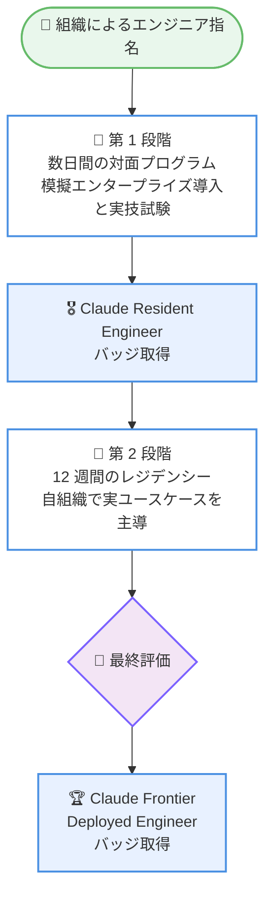

# Anthropic、1 億ドルを投じて 1 万人のエンジニアを育成する Claude Frontier Academy を発表

## メタデータ

| 項目 | 内容 |
|------|------|
| 発表日 | 2026-10-02 |
| ソース | Anthropic News |
| カテゴリ | 企業発表 / 人材育成 / エンタープライズ |
| 公式リンク | https://www.anthropic.com/news/claude-frontier-academy |

## 概要

Anthropic は 2026 年 10 月 2 日、エンタープライズ AI 導入における最大の課題の一つである人材不足に取り組むため、Claude Frontier Academy の立ち上げを発表した。1 億ドルを投資し、2027 年末までに 1 万人の Frontier Deployed Engineer (FDE) を育成する計画である。

Claude Frontier Academy は AI 企業として初の試みとなる人材育成アカデミーであり、Anthropic 自身が世界最大級の企業やプロフェッショナルサービス組織に Claude を導入してきた経験をもとに構築されている。参加者は Anthropic の自社エンジニアと同じ水準のスキルで訓練される。

## 詳細

### 背景

あらゆる企業が AI 導入を急ぐ中、実際のビジネスの中で AI を機能させるスキルを持つ人材が最も見つけにくい存在になっている。Anthropic が協働する企業では、少数の高スキル人材が AI の成果の大部分を牽引しているという実態がある。

Anthropic はこれまでも Claude Partner Network を通じて人材育成に取り組んでおり、以下の実績がある。

- 46,000 社のプロフェッショナルが 175,000 以上の Claude 認定を取得
- 約 4,000 人が「Basecamp」(Anthropic の Applied AI チームのオンボーディングと同じカリキュラムを教える集中プログラム) を修了

### プログラムの構成 (FDE Residency)

プログラムは医師の研修制度 (メディカルモデル) を参考に設計されており、実践者から学び、現実的なケースで訓練し、修了前に評価を受けるという流れになっている。

1. **第 1 段階**: Anthropic のエンジニアと認定インストラクターによる数日間の対面プログラム。模擬的なエンタープライズ導入 (ユースケース選定、セキュリティレビュー、引き渡し) を実施し、新シナリオでの実技試験で修了する
2. **第 1 段階合格者**: 「Claude Resident Engineer」バッジを取得
3. **第 2 段階**: 12 週間のレジデンシー。自組織で実際の Claude ユースケースを主導し、Anthropic エンジニアの支援とコホート内での相互学習を受ける
4. **最終評価合格者**: 「Claude Frontier Deployed Engineer」バッジを取得 (最初の取得者は 2027 年初頭見込み)

### 対象者の条件

参加者には以下の条件が求められる。

- 強固な基礎力を持つハンズオンのソフトウェアエンジニアであること
- LLM での構築実績や、他者の AI 導入を支援した経験があること
- 組織が最優秀エンジニアを指名し、各参加者は帰任後に主導する具体的な Claude プロジェクトを持って参加すること

なお、AI エージェント構築の事前経験は不要とされている。

### パートナー企業と開催地

初回コホートには以下の企業が参加している。

- Accenture
- Bain
- Capgemini
- Commonwealth Bank of Australia
- Deloitte
- McKinsey
- Morgan Stanley
- Novo Nordisk

コホートは既に実施中であり、開催地はサンフランシスコ、ニューヨーク、ロンドンの 3 都市である。

### 関係者のコメント (要旨)

- **Steve Corfield 氏 (Anthropic、Global Head of Business Development and Partnerships)**: 適切なスキルと Claude へのアクセス、自社ビジネスへの深い理解を持つ少数の高主体性チームが企業全体を変革できると述べ、修了者が「ビジネスの中で AI を構築する際の標準を定める存在」になることを期待すると語った
- **Ram Ramalingam 氏 (Accenture)**: レジデンシーが技術スキル単体ではなく、模擬エンタープライズ導入で判断力を試す設計であると評価
- **Michael Blake 氏 (Bain)**: 実験から大規模なインパクトへ移行するにはハンズオンの AI エンジニアリング能力が重要と指摘
- **Geoffroy Pajot 氏 (Capgemini)**: 顧客が求めるのは認定の数ではなく、実課題を解決する力だと強調
- **Rodrigo Castillo 氏 (Commonwealth Bank of Australia)**: 同行のチームは過去 1 年で最大 3 倍のコード変更を生産したと紹介
- **Loic Giraud 氏 (Novo Nordisk)**: Claude Science の R&D ワークフロー活用や創薬での「lab in the loop」研究など、既に AI が医薬品開発を変えつつあると述べた

## 開発者への影響

### 対象

- エンタープライズ環境で Claude の導入を主導するソフトウェアエンジニア
- AI 導入を推進するプロフェッショナルサービス企業や大企業の技術チーム
- Claude Partner Network に参加するパートナー企業

### 必要なアクション

- 参加は指名制 (ノミネーション制) であり、個人による直接応募ではなく組織がエンジニアを指名する
- 参加資格については、各組織が Anthropic のアカウントチームまたは Partner Account Manager に問い合わせる
- 参加を検討する組織は、参加者が帰任後に主導する具体的な Claude プロジェクトを事前に用意する必要がある

## プログラムの流れ

## 関連リンク

- [公式発表: Claude Frontier Academy](https://www.anthropic.com/news/claude-frontier-academy)
- [Anthropic News](https://www.anthropic.com/news)

## まとめ

Claude Frontier Academy は、エンタープライズ AI 導入のボトルネックとなっている人材不足に対し、Anthropic が 1 億ドルを投じて正面から取り組む大規模な人材育成プログラムである。医師の研修制度を参考にした 2 段階構成と実技評価により、認定の数ではなく実課題を解決できるエンジニアの育成を重視している点が特徴である。2027 年末までに 1 万人の Frontier Deployed Engineer を育成するという目標が達成されれば、企業内での AI 導入の標準的な進め方そのものに影響を与える可能性がある。
