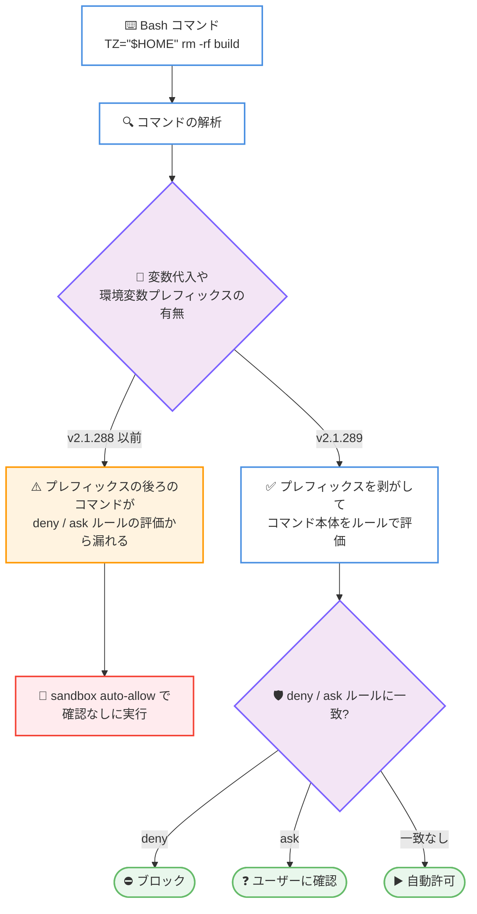

# Claude Code v2.1.289: sandbox auto-allow 下の Bash deny/ask ルールバイパス修正などセキュリティ強化、`agent.spawn` の追加、プラグイン・モッド描画の安定性修正多数

## メタデータ

| 項目 | 内容 |
|------|------|
| 発表日 | 2026-10-03 (npm 公開日時: 2026-10-03T20:12:02Z) |
| ソース | Claude Code Changelog |
| カテゴリ | Claude Code / CLI アップデート |
| 公式リンク | https://github.com/anthropics/claude-code/blob/main/CHANGELOG.md |

## 概要

Claude Code v2.1.289 がリリースされた。28 項目の変更を含むリリースであり、内訳は追加 (Added) 1 件、修正 (Fixed) 24 件、改善 (Improved) 2 件、取り消し (Reverted) 1 件である。前日の v2.1.288 に続く品質改善中心のリリースだが、特に**権限ルールのバイパスに関わるセキュリティ修正**が目立つ。sandbox auto-allow 下で環境変数プレフィックス付きコマンド (例: `TZ="$HOME" rm -rf build`) や、コマンドの前に裸の変数代入が置かれた場合に **Bash の deny / ask ルールがスキップされていた問題**、シンボリックリンク経由で IDE から参照されたファイルに **`Read` の deny ルールが適用されない問題**、管理対象マシンで複合シェルコマンドのネスト部分に対する deny / ask ルールが**ユーザーインストールのモッドの承認に優先しない問題**などが修正された。

新機能としては、プラグイン API にチームメイト用の **`agent.spawn`** が追加され、プラグインフックイベント間でエージェント ID が統一されたほか、`$.agent.list()` に idle と waiting の状態が加わった。このほか、未閉鎖の `<script>` タグや深くネストした `${` 置換を含むコードブロックによる**ターミナルや公開アーティファクトページのフリーズ**、モッドの描画失敗がセッション全体を終了させる問題など、プラグイン・モッドまわりの描画安定性に関する修正が多数含まれる。

## 詳細

### 背景

Claude Code v2.1.289 は、89 項目の大規模な品質改善リリースだった 2026-10-02 の v2.1.288 の翌日にリリースされた。v2.1.287 で導入された Claude Mods とプラグイン実行基盤がユーザー環境で広く使われ始めたことを受け、本バージョンではモッド・プラグインの描画失敗がセッション全体を道連れにしないようにする**フォールトアイソレーション (障害の分離)** の修正が集中的に行われている。また、サンドボックスの自動許可 (auto-allow) と権限ルールの相互作用に起因する deny / ask ルールのバイパスという、セキュリティ上重要な問題への修正も複数含まれる。

### 主な変更点

#### 1. セキュリティ・権限まわりの修正

本バージョンで最も注目すべき領域である。権限ルール (deny / ask) が特定の条件下で効かなくなるバイパス経路が複数修正された。

- **環境変数プレフィックス付きコマンドのルールスキップ**: サンドボックスがコマンドを自動許可 (auto-allow) する際、展開された値を持つ環境変数プレフィックスの後ろにあるコマンド (例: `TZ="$HOME" rm -rf build`) に対して、Bash の deny / ask ルールが見逃されていた問題を修正
- **裸の変数代入によるルールスキップ**: sandbox auto-allow 下で、コマンドの前に裸の変数代入が置かれていると、Bash の deny / ask ルールがスキップされていた問題を修正
- **シンボリックリンク経由の `Read` deny ルール**: IDE で @ メンション、変更、または選択されたファイルがシンボリックリンク経由で参照されている場合に、`Read` の deny ルールが適用されない問題を修正
- **複合シェルコマンドとモッド承認の優先順位**: 管理対象 (managed) マシンで、複合シェルコマンドのネストした部分に対する deny / ask ルールが、ユーザーインストールのモッドによる承認に優先して適用されない問題を修正
- **組織管理 MCP サーバーのツール説明の保護**: ユーザーインストールのプラグインが、組織管理の MCP サーバーのサインインツールの説明 (description) を書き換えられてしまう問題を修正

#### 2. 新機能: プラグインエージェント API の拡張 (Added: 1 件)

- **チームメイト用 `agent.spawn`**: プラグインからチームメイト (teammates) を起動する `agent.spawn` が追加された。あわせて、プラグインフックイベント間で 1 つのエージェント ID が共有されるようになり、`$.agent.list()` に idle (アイドル) と waiting (待機中) の状態が加わった。プラグインからエージェントチームを編成・監視するための基盤が強化された形である

#### 3. ターミナル・描画エンジンの安定性修正

- **未閉鎖 `<script>` タグ等によるフリーズ**: 未閉鎖の `<script>` タグが多数含まれる短いコードブロックや、深くネストした `${` 置換によって、ターミナルがフリーズする問題を修正
- **公開アーティファクトページのフリーズ**: 同様に、未閉鎖の `<script>` タグが多数含まれる短いコードブロックで、公開されたアーティファクトページが閲覧者のブラウザタブをフリーズ・クラッシュさせる問題を修正
- **制御文字を含むテキストの描画崩れ**: タブ・迷子のエスケープ・C1 制御文字を含むテキストや、タブと CRLF 改行を含む短いテキストが、下の行の上に重なって描画される問題を修正

#### 4. プラグイン・モッドのフォールトアイソレーション

モッドやプラグインの描画失敗が、セッション全体や周囲の UI を道連れにしないようにする修正が多数含まれる。

- **起動時のフリーズ・強制終了**: プラグインがターミナルの知らない境界スタイルの Box を描画した際に、起動時にフリーズまたは強制終了する問題を修正
- **非同期例外によるセッション終了**: プラグインのオンスクリーンハンドラーが非同期に例外を投げた場合に、監視下 (supervised) セッションとバックグラウンドセッションが終了する問題を修正
- **高さゼロの領域の増殖**: 高さのないプラグイン領域が増え続けた場合に、セッションがインターフェイスエラーで終了する問題を修正
- **`ui.render` フックの値による行の例外**: モッドの `ui.render` フックが書き込んだ値によって描画中の行が例外を投げた場合に、「unrecoverable interface error」でセッションが終了する問題を修正。エンジンが代わりに自身の行を描画するようになった
- **`Client` の単独失敗化**: 描画中に失敗したモッドの `Client` が、モッドが周囲に描画したすべてを道連れにしていた問題を修正。単独で失敗し、`ui.fault` を発生させるようになった
- **失敗した `Client` 領域の復帰**: ターミナルが描画中に例外を投げた後、モッドの `Client` 領域がセッション全体にわたって失敗状態のままになる問題を修正
- **バンドの描画失敗時のレイアウト**: 描画に失敗したモッドのバンドが、その下のカードに一時的に場所を空けるよう指示してしまう問題を修正
- **失敗理由の表示**: 失敗したプラグインコンポーネントが、失敗にメッセージがない場合に理由として `Error` と表示するか何も表示しない問題を修正
- **作者向けエラーメッセージの改善**: モッドのバンドやペインが描画に失敗した際に作者に表示される行が改善され、モッド名が示され、何も描画されなかったことが明示されるようになった

#### 5. プラグイン UI・リンク・読み込みの修正

- **リンクによる描画不能**: リンクが localhost アドレス、パスに `@` を含む URL、大文字のホスト名、または `file:` パスを使っている場合に、プラグインのペインに何も描画されない問題を修正
- **右寄せコンテンツと閉じるマークの重なり**: モッドのペインやバンドの右寄せコンテンツが、閉じるマークや `[-]` の下に描画される問題を修正。これらのマークはターミナルの端から 1 列内側に保たれるようになった
- **フルスクリーン時の古い行の表示**: フルスクリーンで Background tasks ダイアログを開いている間、プロンプト上部のプラグインの行が古い状態のまま表示される問題を修正
- **アップグレード後のモッド未読み込み**: アップグレード後の最初のセッションで、インストール済みのモッドが読み込まれない問題を修正
- **大きなファイルの表示高速化**: プラグインのコードペインで大きなファイルを開く速度が改善された。ハイライト済みビューを最終的な幅で一度だけレイアウトするようになった

#### 6. プラグイン CLI の修正

- **ローカルフォルダーマーケットプレイスの古いコピー**: `plugin list`、`plugin eval`、`plugin update` が、ローカルフォルダーマーケットプレイスからインストールしたプラグインの古いコピーを表示する問題と、シンボリックリンクされた `--plugin-dir` のホットリロードを修正
- **マーケットプレイスマニフェスト併置時のスキップ**: フォルダーにマーケットプレイスマニフェストも含まれている場合に、`claude plugin validate` がプラグインの検証をスキップする問題を修正
- **Anthropic マーケットプレイス自身のプラグインの検証失敗**: `claude plugin validate` が Anthropic マーケットプレイス自身のプラグインを失敗と判定し、`--json` で問題のない `plugin.json` を列挙する問題を修正

#### 7. VSCode 拡張の変更

- **`claude auth status` の変更の取り消し**: v2.1.288 で行われた `claude auth status` への変更が、サインアウトを頻発させる可能性があったため取り消された (Reverted)

### 技術的な詳細

#### sandbox auto-allow 下での Bash deny / ask ルール評価の修正

v2.1.289 では、サンドボックスがコマンドを自動許可する経路で、deny / ask ルールの評価対象からコマンド本体が漏れる 2 つのパターンが塞がれた。



#### モッド・プラグインのフォールトアイソレーションの考え方

本バージョンの修正群により、モッドやプラグインの描画コンポーネントの失敗は、以下のように局所化される。

| 失敗の種類 | v2.1.288 以前の挙動 | v2.1.289 の挙動 |
|-----------|-------------------|----------------|
| `ui.render` フックの値で行が例外 | 「unrecoverable interface error」でセッション終了 | エンジンが自身の行を描画して継続 |
| 描画中の `Client` の失敗 | モッドが描画したすべてが道連れ | `Client` が単独で失敗し `ui.fault` を発生 |
| 未知の境界スタイルの Box | 起動時にフリーズ・強制終了 | 修正済み |
| オンスクリーンハンドラーの非同期例外 | 監視下・バックグラウンドセッションが終了 | 修正済み |
| 高さゼロの領域の増殖 | インターフェイスエラーでセッション終了 | 修正済み |
| ターミナル例外後の `Client` 領域 | セッション全体で失敗状態のまま | 復帰可能 |

## 開発者への影響

### 対象

- 権限ルール (deny / ask) やサンドボックスの auto-allow を使って Claude Code を運用している組織・個人 (ルールバイパスの修正)
- 管理対象マシンで組織ポリシーを適用している管理者 (複合コマンドのルール優先、組織管理 MCP サーバーのツール説明保護)
- モッド・プラグイン開発者 (`agent.spawn` の追加、エージェント ID の統一、`$.agent.list()` の状態追加、`ui.fault`、作者向けエラーメッセージの改善)
- ローカルフォルダーマーケットプレイスや `--plugin-dir` でプラグインを開発している開発者 (古いコピー・ホットリロード・validate の修正)
- 監視下セッションやバックグラウンドセッションを運用している利用者 (プラグイン起因のセッション終了の修正)
- 公開アーティファクトページを共有している利用者 (ブラウザタブのフリーズ修正)
- VSCode 拡張の利用者 (`claude auth status` 変更の取り消し)

### 必要なアクション

- **権限ルールを運用している組織**: 環境変数プレフィックスや変数代入を使ったコマンドが deny / ask ルールを迂回できていた問題が修正された。ルールで保護しているつもりだったコマンドパターンがある場合は、本バージョンへの更新を優先することを推奨する
- **シンボリックリンクを含むリポジトリの利用者**: IDE から @ メンション・選択したファイルにも `Read` の deny ルールが正しく適用されるようになったため、意図した保護が効いているかを確認する
- **プラグイン・モッド開発者**: `agent.spawn` と `$.agent.list()` の idle / waiting 状態を使うと、プラグインからエージェントチームの起動と状態監視ができる。また、`Client` の失敗は `ui.fault` で検知できるようになったため、エラーハンドリングの実装を見直すとよい
- **ローカルマーケットプレイスでの開発者**: `plugin list` / `plugin eval` / `plugin update` が最新のコピーを参照するようになったため、更新が反映されない問題へのワークアラウンド (再インストールなど) は不要になる
- **VSCode 拡張の利用者**: v2.1.288 でサインアウトが頻発していた場合は、本バージョンで解消される見込みである

### 移行ガイド (該当する場合)

破壊的変更はない。ただし、以下の挙動変更に注意が必要である。

- これまで sandbox auto-allow 下で実行されていた環境変数プレフィックス付きコマンドや、変数代入を伴うコマンドが、deny / ask ルールに一致する場合はブロックまたは確認の対象になる。CI スクリプトなどで想定外のブロックが発生した場合は、権限ルールの設定を確認する
- 失敗したモッドの `Client` は周囲を道連れにせず、`ui.fault` を発生させる。モッド側で `Client` の失敗時の挙動に依存していた場合は、`ui.fault` のハンドリングに移行する

## コード例

プラグインからのエージェント操作には、新しい `agent.spawn` と拡張された `$.agent.list()` を使用する。

```javascript
// チームメイトを起動する
agent.spawn({ /* teammate の設定 */ });

// エージェントの一覧と状態を取得する
// v2.1.289 から idle と waiting の状態が含まれる
const agents = $.agent.list();
for (const a of agents) {
  // a.id はプラグインフックイベント間で共通のエージェント ID
  console.log(a.id, a.state); // 例: "idle", "waiting"
}
```

## 関連リンク

- [Claude Code Changelog (v2.1.289)](https://github.com/anthropics/claude-code/blob/main/CHANGELOG.md)
- [Claude Code v2.1.288 のレポート](./2026-10-02-claude-code-v2-1-288.md)
- [Claude Code 公式ドキュメント](https://code.claude.com/docs)
- [Claude Code のプラグイン](https://code.claude.com/docs/en/plugins)
- [Claude Code の権限設定](https://code.claude.com/docs/en/iam)

## まとめ

Claude Code v2.1.289 は、28 項目 (追加 1 件、修正 24 件、改善 2 件、取り消し 1 件) からなる、セキュリティと安定性に焦点を当てたリリースである。最大の注目点は権限ルールのバイパス修正群であり、sandbox auto-allow 下での環境変数プレフィックスや変数代入による Bash deny / ask ルールのスキップ、シンボリックリンク経由の `Read` deny ルールの不適用、管理対象マシンでのモッド承認とルールの優先順位といった、組織の権限ポリシーの実効性に直結する問題が塞がれた。

機能面では、チームメイト用 `agent.spawn` の追加とエージェント ID の統一、`$.agent.list()` の idle / waiting 状態により、プラグインからエージェントチームを扱う API が一歩前進した。また、モッド・プラグインの描画失敗を単独の失敗に局所化し `ui.fault` で通知するフォールトアイソレーションの強化は、v2.1.287 以降のモッドエコシステムを本番環境で安心して使うための重要な土台である。権限ルールで Claude Code を統制している組織を中心に、早期の更新を推奨できるリリースといえる。
