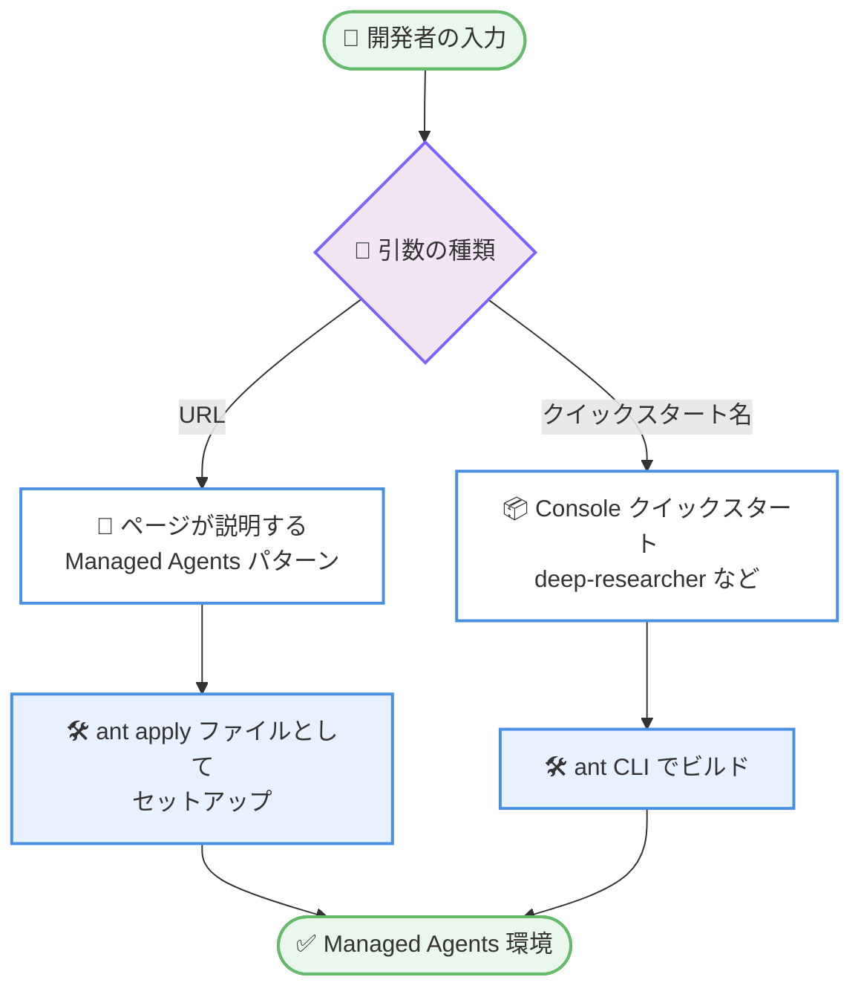

# Claude Code v2.1.290: 190 項目の大型リリース — モッドフックの拡張、Managed Agents オンボーディングコマンド、権限・サンドボックスの修正多数、Slack の `!fast` モード

## メタデータ

| 項目 | 内容 |
|------|------|
| 発表日 | 2026-10-05 (npm 公開日時: 2026-10-05T18:12:44Z) |
| ソース | Claude Code Changelog |
| カテゴリ | Claude Code / CLI アップデート |
| 公式リンク | https://github.com/anthropics/claude-code/blob/main/CHANGELOG.md |

## 概要

Claude Code v2.1.290 がリリースされた。全 190 項目という大型リリースであり、内訳は追加 (Added) 15 件、修正 (Fixed) 131 件、改善 (Improved) 19 件、変更 (Changed) 25 件である (VSCode 11 件、Cloud sessions 4 件、Remote Control 1 件、Claude Tag 9 件、Code Review 2 件のプラットフォーム別変更を含む)。追加機能では、モッドの `turn.step` フックに API 自身が実行したツール呼び出しを伝える **`serverToolUses`**、`tool.check` にサブエージェントを識別する **`agentId`** と組織の承認要件を示す **`ceiling`** が加わるなど、プラグイン / モッド開発者向けの拡張ポイントが大きく広がった。また、**`/claude-api managed-agents-onboard`** コマンドにより、ページの説明や Console のクイックスタートテンプレートから Managed Agents パターンのセットアップを始められるようになった。

修正の中心は権限・サンドボックス領域である。シェルがワイルドカード展開する引数を持つ読み取り専用コマンドの自動承認、ヒアドキュメントをパイプするサンドボックスコマンドの毎回承認、シンボリックリンク経由の読み取りブロック回避、PreToolUse フックが入力を書き換えた後の権限ルール未適用など、安全性と使い勝手の両面に関わる修正が多数積み上がった。プラットフォーム面では、VSCode 拡張のバックグラウンドプロセスやフォーカスの問題、Cloud sessions のインジケーター、Claude Tag の Slack 向け **`!fast` モード**の追加、Code Review の重大度ラベルの修正など、周辺ツールの改善も幅広い。

## 詳細

### 背景

Claude Code v2.1.290 は、2026-10-03 の v2.1.289 に続くリリースである。2026-10-01 の v2.1.287 で導入された Claude Mods の拡張が本バージョンでも継続しており、フックが受け取る情報の充実 (`serverToolUses`、`agentId`、`ceiling`)、型定義の追加 (`ThemeKey` / `Color`)、`claude plugin validate` の検証強化と、モッドのエコシステムを本格的に育てる方向性が鮮明である。同時に、権限チェックの抜け道を塞ぐ修正と誤検知の解消を大量に含み、新機能と土台固めを両立させた大型リリースとなっている。

### 主な変更点

#### 1. 追加機能 (Added: コア 11 件)

**プラグイン / モッド関連:**

- **`turn.step` フックの `serverToolUses`**: API 自身が実行したツール呼び出し (アドバイザー) が、それぞれ id、name、input、開始・終了時刻付きで結果に含まれるようになった
- **`tool.check` イベントの `agentId`**: プラグインフックが、サブエージェントの権限チェックとメインセッションのチェックを区別できるようになった
- **`tool.check` フックの `ceiling`**: モッドが読む question と verdict に、組織がツールに要求する承認レベルの名前が含まれるようになった
- **プラグインフック型定義の `ThemeKey` / `Color`**: エディタがモッドの描画で指定できるテーマカラーを列挙できるようになった
- **`claude plugin validate` の強化**: モッドがゲートサイトに登録する各フックについて、`.catch` の有無が一覧表示されるようになった (`--json` では `gatingHooks`)

**Managed Agents / CLI:**

- **`/claude-api managed-agents-onboard <url>`**: ページが説明する Managed Agents パターンを `ant apply` ファイルとしてセットアップする
- **`/claude-api managed-agents-onboard <quickstart-name>`**: `deep-researcher` などの Console クイックスタートテンプレートを `ant` CLI でビルドする
- **`claude attach <name>` / `claude logs <name>`**: セッション ID の代わりに、セッション名の一部で指定できるようになった

**その他:**

- **Claude apps ゲートウェイのサインイン承認ページに Deny ボタン**: 保留中のサインインを終了させ、待機中のターミナルが数秒以内に停止する
- **管理設定の警告**: 管理設定ファイルがフォルダー外へのリンクである場合の警告と、管理設定がユーザー設定のサンドボックス allowRead パスや許可ドメインを無視している場合の /status / doctor 警告が追加された

#### 2. 権限・サンドボックス関連の修正

本バージョンで最も厚い領域であり、自動承認の抜け道を塞ぐ修正と、過剰な承認要求を減らす修正の両方が含まれる。

**自動承認の抜け道を塞ぐ修正:**

- シェルがワイルドカードとして展開する引数を持つ読み取り専用コマンド (`rg` や `git grep` など) が自動承認されていた問題を修正。承認を求めるようになった
- zsh が bash と異なる読み方をする変数名を持つコマンドの自動承認を修正
- `declare` / `typeset` / `export` / `readonly` のプレフィックスで設定された変数由来のコマンドやパスに、deny / ask ルールが適用されない問題を修正
- サンドボックス自動許可下で Monitor ツールのコマンドが権限プロンプトをスキップしていた問題を修正
- PreToolUse フックがツール入力を書き換えた後、一部の権限ルールと安全チェックが適用されない問題を修正
- `git clone` オプションの短縮形が `sandbox.excludedCommands` の `git *` パターンのサンドボックス除外を維持していた問題を修正
- `pyright` が読み取り専用コマンド扱いされなくなり、実行前に許可を求めるようになった (Changed)
- より多くの形式の `ps` コマンドが、確認なしに実行される代わりに承認を求めるようになった (Changed)

**読み取りブロック・リンク関連:**

- `permissions.blockReadsOutsideWorkingDirectories` や `Read` deny ルール下で、作業ディレクトリ外にシンボリックリンクされたプロジェクトの CLAUDE.md、ルール、AGENTS.md が読み込まれていた問題を修正
- macOS / Windows の画像読み取りが、読み取り中に差し替えられたリンクを通じて承認外のファイルを返せる問題を修正。`@`-メンションでも同様の問題を修正
- プロンプトにペースト・ドラッグされた画像パスや、@-メンションしたフォルダーのファイル一覧に Read deny ルールが適用されない問題を修正
- シンボリックリンクされた設定ファイルの参照先への編集が、設定ファイルの権限確認なしに実行される問題を修正

**過剰な承認要求の解消:**

- ヒアドキュメントを別コマンドにパイプするサンドボックスコマンド (`cat <<EOF | python3`) が毎回承認を求めていた問題を修正
- `claude agents` のマニュアル権限モードで、返信や新規エージェントのプロンプトにペーストした画像の読み取りに承認を求めていた問題を修正
- auto モードの拒否時に、クラシファイアをツール全体でスキップするルールや Claude Code が無視するルールを提案していた問題を修正

#### 3. プラグイン・モッド関連の修正

- ユーザーがインストールしたモッドが、組織のプラグインをアンロードさせたり、組織のガードのチェックをスキップさせたりできるケースを修正。いずれも当該モッドの方がアンロードされる
- `.catch` を持つプラグインフックが、プロンプトやツール呼び出しでフックワーカーを占有し続けた場合にアンロードされ、`.catch` もスキップされる問題を修正
- `next(e)` の呼び出し後にプロンプトを落とす `prompt.submit` フックが黙って無視されていた問題を修正。フック名付きで失敗として報告される
- モッドのペインやバンドが、描画のたびに高さが変わるツリーで無限に再描画される問題を修正 (インラインペインも同様)
- `turn.step` の結果に、応答途中のモデルフォールバックが破棄したツール呼び出しが載る問題を修正
- 失敗したリロードの後のリフレッシュでモッドがメッセージなしにアンロードされる問題を修正。以前のバージョンがアンロードされた旨が失敗行に表示される
- ゲートウェイ経由 (`ANTHROPIC_BASE_URL` + `ANTHROPIC_AUTH_TOKEN`) で Anthropic アカウントを持たないユーザーでモッドが無効のままだった問題を修正
- 非ラテン文字を含む長い複数行テキストの描画で、再描画のたびにプラグインフックが停止する問題を修正
- `claude plugin test` がアップグレード後に古い保存設定のせいで実行を拒否する問題を修正
- `.mcp.json`、プラグイン、エージェントで宣言された一部の MCP エントリに `disableClaudeAiConnectors` と `allowedMcpServers` の URL ルールが適用されない問題を修正

#### 4. 信頼性・セッション関連の修正

- **ゲートウェイ・プロキシ互換性**: Claude Code のベータヘッダーの 1 つを 400 以外のステータスで拒否するプロキシやゲートウェイの背後でリクエストが失敗する問題を修正
- **数百枚の画像を含む長いセッション**: 「Request rejected as unprocessable by the model」エラーで行き詰まる問題を修正
- **出力コンテンツフィルター**: thinking 中に API のフィルターが応答を止めた場合、エラー表示の前に 1 回リトライされるようになった
- **再開したサブエージェント・チームメイト**: 実行中にメッセージを受け取った後、以前の thinking とプロンプトキャッシュを失う問題を修正
- **WebFetch の 100,000 文字制限**: 超過分を黙って切り捨てる代わりに、未読量を伝え、続きを読む `offset` を受け付けるようになった
- **スケジュールタスク (`/loop` やリマインダー)**: コンパクション後の resume で復元されない問題、フォアグラウンドで設定したタスクが `/background` 後に発火しない問題、繰り返しタスクが resume / respawn / fork のたびに余分に実行される問題を修正
- **プランモード**: `--continue` / `--resume <session-id>` での再開時にプランモードが復元されない問題と、プラン提示前にコンテナが再起動した Cloud sessions でプランが失われる問題を修正
- **スリープ復帰**: Mac のスリープ復帰時に「Agent stalled」で失敗するバックグラウンドエージェント、Bedrock / Vertex / Foundry / カスタムゲートウェイでストールと誤判定される応答、自動コンパクションの「Prompt is too long」失敗を修正
- **ヘッドレス / SDK**: `--json-schema` 実行が、構造化出力の配信後に接続が切れた場合に `is_error: true` で非ゼロ終了する問題、`--include-partial-messages` でターン終了後も応答が開いたままになる問題を修正
- **WebSearch 予算の変更**: 対話セッションの WebSearch が 200 回で終了する方式から、時間とともに回復する方式 (100 回/時、`CLAUDE_CODE_WEB_SEARCH_REFILLS_PER_HOUR` でレート調整、0 で無効) に変更された

#### 5. エージェントビュー・バックグラウンドセッションの修正

- Esc が「Press enter again to restart this session」の確認を承諾してしまう問題を修正。Esc はセッションを開き直すだけになった
- `n:` や Ctrl+F 検索後の Esc がセクションヘッダーにフォーカスを移し、Ctrl+X 2 回でセクション内の全セッションが削除され得る問題を修正
- `claude respawn` や「restart this session fresh」が、空の会話で始める代わりに以前のメッセージを再送する問題を修正
- 配信できなかったスラッシュコマンドや選択式の回答が保存され、セッションの次回再起動時に勝手に実行される問題を修正
- バックグラウンドセッションのクラッシュ直後の返信が 2 秒で拒否されていた問題を修正。再起動中は最大 12 秒リトライされる
- Homebrew アップグレード後に `claude agents` が「Couldn't restart the background service」で失敗する問題を修正 (次回以降のアップグレードから有効)
- アイドル中にバックグラウンドへ移したセッションが、再起動後に「no saved transcript」になる問題を修正
- バックグラウンドサブエージェントが、メインセッションの worktree 出入り後に書き込みと Bash アクセスを失う問題を修正
- `/loop` の実行カウントとカウントダウンに関する複数の表示問題を修正。スケジュールされた wakeup を待つセッションは、更新や低メモリ時にも実行されたままになり、wakeup の消失を防ぐ (Changed)

#### 6. 改善 (Improved: コア 15 件) と主な変更 (Changed: コア 23 件)

**改善 (抜粋):**

- プロキシがブロックする MCP サーバー (HTTP 403) の 3 回リトライを廃止し、起動を高速化
- 大きなセッションの再開中も、タイマー・入力・描画が動き続けるようになった
- / と @ の候補リストで選択行に ❯ ポインターが付き、色なしでも選択位置が分かるようになった
- バックグラウンドエージェントの権限プロンプトに、全エージェントを停止する Ctrl+X Ctrl+K ショートカットが表示されるようになった
- `plugin-authoring` スキルが、作成したモッドを他者がインストールするためのコマンドを README に書くようになった
- Read ツールがバイナリファイルに対して、そのフォーマットを読めるスキルやシェルコマンドを案内するようになった
- `/ultrareview` のエラーメッセージが大幅に改善された (原因別のメッセージと修正方法の提示)

**主な変更 (抜粋):**

- **Claude in Chrome**: プロジェクトの設定ファイルからは有効化できなくなった。`--chrome`、`/chrome`、またはユーザー設定を使用する
- **`CLAUDE_CODE_DISABLE_NONESSENTIAL_TRAFFIC`**: 起動時の接続ウォームアップもスキップするようになった
- **`CLAUDE_CODE_DISABLE_ATTACHMENTS`**: リポジトリの `.claude/settings.json` / `settings.local.json` からは設定できなくなった (シェル、ユーザー、管理設定は引き続き可能)
- **`/code-review` の medium effort**: Opus 5.5 や Sonnet 5.5 など、チューニング済みレビュー設定のないモデルでもクリーンアップと CLAUDE.md 規約の指摘を報告するようになった
- **スキル・カスタムコマンドの `!` シェルコマンド**: タブと改行以外の生の制御文字を含む場合は拒否され、位置が表示される
- **Cloud sessions のビルトイン `gh api`**: `GH_HOST` / `GH_REPO` で github.com 以外のホストを指定すると拒否されるようになった (`--hostname` または完全な URL を使用)
- **Claude apps ゲートウェイ**: サポートする PostgreSQL の最小バージョンが 14 から 11 に引き下げられた
- **`/model`、`/effort`、`/rename`**: `claude agents` からビジー状態のバックグラウンドセッションに送ると、ターン終了を待たず即座に適用される

#### 7. プラットフォーム別の変更

**VSCode 拡張 (11 件):**

- メッセージ送信時のスクリーンリーダー読み上げ「Message queued.」と、Manage plugins ダイアログからマーケットプレイスのインストール / 更新コマンドを確認・実行する機能が追加された
- 一度も入力していない空のチャットがバックグラウンドの Claude プロセスを保持し続ける問題、ダイアログの背後に届いた権限プロンプトがキーボードフォーカスを奪う問題、エージェントマップでネストしたサブエージェントが「Tool calls (0)」と表示される問題などを修正
- Continue After Reload が、VS Code の拡張再起動で中断されたステップも完了するようになった。メッセージのタイムスタンプがデフォルトで表示される

**Cloud sessions (4 件):**

- 環境変数によるプロンプト候補の無効化が新しいセッションに効かない問題、返信完了後も作業インジケーターが数秒回り続ける問題、Run now 押下後も History が「No runs yet」のままになる問題、アーカイブ解除したセッションが作業中に見え続ける問題を修正

**Remote Control (1 件):**

- Remote Control を開始したばかりのコンピューターが、新しいセッションのメニューに表示されるまで最大 1 分かかっていた問題を修正。数秒以内に表示される

**Claude Tag (9 件):**

- **Slack の `!fast` モード追加**: Claude へのメンションに `!fast` を付けるとスレッドが高速モードに切り替わり、必要に応じて Opus に移行する。`!fast off` で戻せる。有効中の返信には (fast) と表示される
- アクセスバンドルのカスタム接続に Path prefixes フィールドが追加され、許可ルールをホスト全体ではなく特定パスに限定できるようになった
- Claude Tag Admin 権限のメンバーが Activity ページの Memory タブでエラーになる問題、Slack チャンネルのスケジュールルーティンがチャンネルのデフォルト以外のモデルで実行される問題などを修正
- チャンネル指示の上限がバイト数から 8,192 文字に変更され、非英語テキストでも同じ余裕が確保された

**Code Review (2 件):**

- ブロッキングのレビューコメントが重大度と矛盾する「nit」ラベル付きで表示されることがあった問題と、Code Review を無効化した組織のフォーク / Manual モードのプルリクエストに「@claude review」のヒントが投稿される問題を修正

### 技術的な詳細

#### Managed Agents オンボーディングの流れ



#### 更新後に影響し得る設定・挙動

| 設定 / 挙動 | 影響 | 対処 |
|------------|------|------|
| Claude in Chrome | プロジェクト設定ファイルからは有効化不可 | `--chrome`、`/chrome`、またはユーザー設定を使用 |
| `pyright` / 一部の `ps` | 読み取り専用扱いが外れ、承認を求める | 必要なら許可ルールを追加 |
| WebSearch 予算 | 200 回で終了から 100 回/時の回復式に変更 | `CLAUDE_CODE_WEB_SEARCH_REFILLS_PER_HOUR` でレート調整 (0 で無効) |
| ワイルドカード展開・zsh 変数名を含むコマンド | 自動承認されず、承認を求める | 意図したコマンドなら承認、または明示的な許可ルールを検討 |
| `CLAUDE_CODE_DISABLE_ATTACHMENTS` | リポジトリ設定からは設定不可 | シェル、ユーザー、管理設定で設定 |
| スキル / コマンドの `!` シェルコマンド | 生の制御文字 (タブ・改行以外) は拒否 | 表示された位置の制御文字を除去 |
| Cloud sessions の `gh api` | github.com 以外の `GH_HOST` / `GH_REPO` は拒否 | `--hostname` または完全な URL を使用 |
| `CLAUDE_CODE_USER_DIALOG_TIMEOUT_MS` | 単位付きの値 (例: `5m`) は `dialogExpiry` にフォールバック | ミリ秒の数値で指定 |

## 開発者への影響

### 対象

- モッド・プラグイン開発者 (`serverToolUses`、`agentId`、`ceiling`、`ThemeKey` / `Color` 型、`plugin validate` の強化、多数のフック修正)
- Managed Agents / Claude API を利用する開発者 (`/claude-api managed-agents-onboard` の追加、`claude-api` スキルの例の更新)
- 権限ルール・サンドボックス・`--restricted` を利用する組織とユーザー (自動承認の抜け道の修正、読み取りブロックの強化)
- バックグラウンドセッション・`claude agents`・`/loop`・スケジュールタスクを多用する利用者
- ヘッドレス / SDK・ゲートウェイ・プロキシ経由で利用する組織 (ベータヘッダー互換性、`--json-schema`、ストリーミングの修正)
- VSCode 拡張、Cloud sessions、Remote Control、Claude Tag (Slack)、Code Review の利用者
- Claude apps ゲートウェイを運用する管理者 (Deny ボタン、PostgreSQL 11 サポート、ログ・証明書警告の改善)

### 必要なアクション

- **Managed Agents を試す開発者**: `/claude-api managed-agents-onboard deep-researcher` などで Console クイックスタートからのセットアップを試せる
- **モッド開発者**: `claude plugin validate` でゲートサイトのフックに `.catch` があるかを確認する。`.catch` のないフックや `next(e)` 後にプロンプトを落とすフックの挙動が変わっている
- **権限ルールを管理する組織**: `pyright` や一部の `ps`、ワイルドカード展開を伴うコマンドが承認を求めるようになったため、CI や自動化で影響がないか確認し、必要なら許可ルールを追加する
- **Claude in Chrome をプロジェクト設定で有効化していたチーム**: ユーザー設定または `--chrome` / `/chrome` への移行が必要である
- **WebSearch を多用するセッション**: 予算が回復式に変わったため、長時間セッションでは従来より多く検索できる。レートは `CLAUDE_CODE_WEB_SEARCH_REFILLS_PER_HOUR` で調整する
- **Slack で Claude Tag を使うチーム**: 急ぎのスレッドでは `!fast` で高速モードを試せる

### 移行ガイド (該当する場合)

破壊的変更はないが、以下の挙動変更に注意が必要である。

- `pyright` と一部の `ps` コマンドは読み取り専用扱いではなくなり、実行前に承認を求める
- Claude in Chrome はプロジェクトの設定ファイルから有効化できない
- 対話セッションの WebSearch 予算は 100 回/時で回復する方式に変わった
- スキルとカスタムコマンドの `!` シェルコマンドは、タブ・改行以外の生の制御文字を含むと拒否される
- Cloud sessions のビルトイン `gh api` は、github.com 以外のホスト指定を `GH_HOST` / `GH_REPO` 経由では受け付けない
- `claude --environment <id>` (セルフホストランナー) は現行の Sessions API 経由でセッションを作成する

## コード例

Managed Agents のオンボーディングと、セッション名によるアタッチは以下のように行う。

```
# Console クイックスタートテンプレートからセットアップ
/claude-api managed-agents-onboard deep-researcher

# ページが説明するパターンを ant apply ファイルとしてセットアップ
/claude-api managed-agents-onboard https://example.com/managed-agents-pattern

# セッション ID の代わりに名前の一部でアタッチ・ログ表示
claude attach my-session
claude logs my-session
```

Slack の Claude Tag では、`!fast` でスレッドを高速モードに切り替えられる。

```
@Claude !fast このビルド失敗の原因を調べて
# 返信には (fast) と表示される。戻すには:
@Claude !fast off
```

## 関連リンク

- [Claude Code Changelog (v2.1.290)](https://github.com/anthropics/claude-code/blob/main/CHANGELOG.md)
- [Claude Code v2.1.289 のレポート](./2026-10-03-claude-code-v2-1-289.md)
- [Claude Code v2.1.288 のレポート](./2026-10-02-claude-code-v2-1-288.md)
- [Claude Code 公式ドキュメント](https://code.claude.com/docs)
- [Claude Code のプラグイン](https://code.claude.com/docs/en/plugins)
- [Claude Code のフック](https://code.claude.com/docs/en/hooks)

## まとめ

Claude Code v2.1.290 は、全 190 項目 (追加 15 件、修正 131 件、改善 19 件、変更 25 件) からなる大型リリースである。モッドフックへの `serverToolUses` / `agentId` / `ceiling` の追加と型定義・検証の強化はプラグインエコシステムの成熟を進め、`/claude-api managed-agents-onboard` は Managed Agents パターンの導入を 1 コマンドに短縮した。

修正面では、権限・サンドボックスの自動承認の抜け道 (ワイルドカード展開、zsh の変数名、シンボリックリンク経由の読み取りなど) を塞ぐ修正と、過剰な承認要求の解消が同時に進み、スケジュールタスクやバックグラウンドセッションの信頼性も大きく改善された。VSCode、Cloud sessions、Remote Control、Claude Tag (`!fast` モード)、Code Review とプラットフォーム全体に手が入っており、組織の権限管理者からモッド開発者、Slack 利用者まで、幅広いユーザーに更新を推奨できるリリースである。
