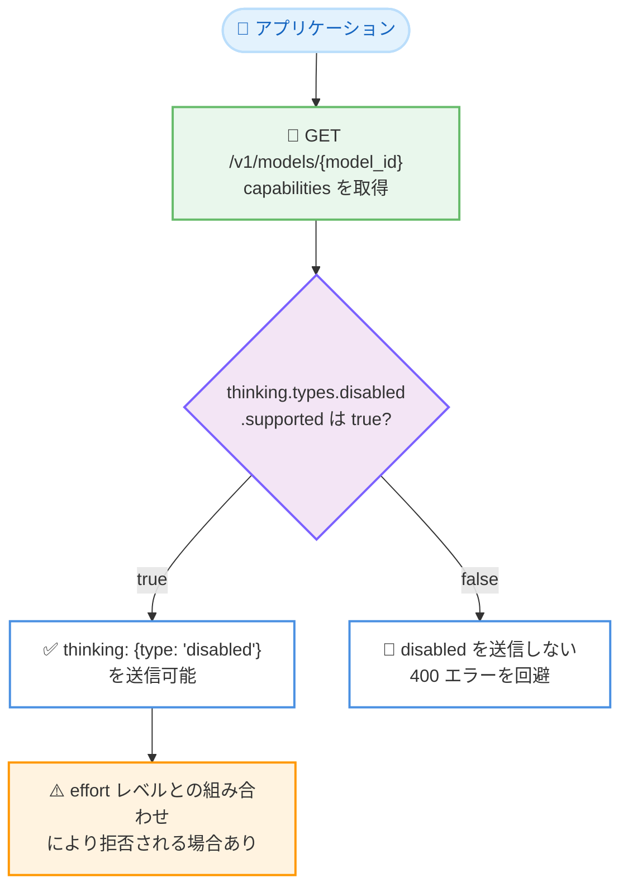

# Models API に `capabilities.thinking.types.disabled` を追加: 思考無効化の可否をプログラムから判別可能に

## メタデータ

| 項目 | 内容 |
|------|------|
| 発表日 | 2026-10-05 |
| ソース | Claude Developer Platform Release Notes |
| カテゴリ | API アップデート |
| 公式リンク | https://platform.claude.com/docs/en/release-notes/overview |

## 概要

Claude API の Models API に `capabilities.thinking.types.disabled` フィールドが追加された。`GET /v1/models` および `GET /v1/models/{model_id}` のレスポンスで、各モデルが思考 (thinking) をオフにする設定 `thinking: {type: "disabled"}` を受け付けるかどうかを確認できるようになった。

公式ドキュメントによると、`supported` はモデルが `"disabled"` を 400 エラーで拒否する場合に `false` となり、そもそも思考をサポートしないモデルでは `true` となる。思考を無効化できないモデルが増えるなか、モデル ID をハードコードせずに思考無効化の可否をプログラムから判別できるようになる、開発者にとって実用的なアップデートである。

## 詳細

### 背景

リリースノートの過去エントリによると、近年のモデルでは思考無効化の扱いがモデルごとに異なっている。

- **Claude Fable 5 / Mythos 5 (2026-06-09)**: adaptive thinking が唯一の思考モードであり、`thinking: {"type": "disabled"}` はサポートされない
- **Claude Opus 5.5 (2026-09-22)**: 思考を無効化できず、`thinking: {"type": "disabled"}` も `thinking: {"type": "enabled", ...}` も 400 エラーを返す
- **Claude Sonnet 5.5 (2026-09-28)**: 冒頭の思考をオフにするには `"disabled"` ではなく `thinking: {"type": "between_tools"}` を `high` 以下の effort で送信する

このようにモデルによって `"disabled"` の受け付け可否が異なるため、アプリケーション側でモデル ID ごとの挙動をハードコードする必要があった。今回の変更により、Models API への問い合わせだけで可否を判定できるようになった。

なお、2026-10-01 には Models API に `line` フィールド (モデル系列を示すフィールド) も追加されており、Models API のメタデータをプログラムから活用する流れが続いている。

### 主な変更点

- **`capabilities.thinking.types.disabled` の追加**: 各モデルの `capabilities` オブジェクトに、`thinking: {type: "disabled"}` を受け付けるかどうかを示すフィールドが追加された
- **対象エンドポイント**: `GET /v1/models` (一覧) と `GET /v1/models/{model_id}` (個別取得) の両方で返される
- **判定の意味**: `supported` が `false` の場合、そのモデルは `"disabled"` を 400 エラーで拒否する。思考をサポートしないモデルでは `true` となる

### 技術的な詳細

**`capabilities.thinking` の構造**: Models API のレスポンスでは、`capabilities.thinking` に `supported` (思考機能自体のサポート有無) と `types` (サポートされる思考タイプ構成) が含まれる。API リファレンスによると、`types` には `adaptive` (自動) や `enabled` の各 `CapabilitySupport` オブジェクト (`supported` ブール値を持つ) が含まれており、今回ここに `disabled` が加わった。

**`supported: true` でも拒否されるケースがある**: 公式ドキュメントは、`supported` が `true` であっても、別の理由で `"disabled"` リクエストが拒否される可能性があると明記している。その一例として、思考オフとの組み合わせをモデルが許可していない [effort](https://platform.claude.com/docs/en/build-with-claude/effort) レベルの指定が挙げられている。つまり、このフィールドは必要条件の確認には使えるが、リクエスト成功の十分条件ではない点に注意が必要である。

**思考をサポートしないモデルの扱い**: 思考機能自体をサポートしないモデルでは `disabled` の `supported` が `true` となる。「思考が無効の状態を受け付けるか」という観点で一貫した判定ができる設計といえる。

## 開発者への影響

### 対象

- 複数の Claude モデルを切り替えて利用するアプリケーションの開発者
- `thinking: {type: "disabled"}` を指定してレイテンシやコストを調整している開発者
- モデルセレクタやルーティング層など、モデルの機能差を抽象化する基盤を実装している開発者

### 必要なアクション

- **即時の対応は不要**: 既存のリクエストの挙動を変更するものではなく、Models API のレスポンスにフィールドが追加されたのみである
- **ハードコードの置き換え**: モデル ID ごとに思考無効化の可否を分岐しているコードは、`capabilities.thinking.types.disabled.supported` の参照に置き換えることで、新モデル追加時の保守コストを削減できる
- **エラーハンドリングの維持**: `supported: true` でも effort レベルとの組み合わせなどで 400 エラーが返る可能性があるため、エラーハンドリングは引き続き必要である

### 移行ガイド (該当する場合)

1. モデル選択時に `GET /v1/models/{model_id}` で対象モデルの `capabilities` を取得する
2. `capabilities.thinking.types.disabled.supported` を確認し、`false` の場合は `thinking: {type: "disabled"}` を送信しない
3. `true` の場合でも、effort レベルとの組み合わせによっては拒否される可能性があるため、400 エラーへのフォールバック処理を維持する

## コード例

`GET /v1/models/{model_id}` でモデルの capabilities を確認する例。

```bash
curl "https://api.anthropic.com/v1/models/claude-opus-5-5" \
  -H "x-api-key: $ANTHROPIC_API_KEY" \
  -H "anthropic-version: 2023-06-01"
```

レスポンスの `capabilities.thinking` には、`types` 配下に各思考タイプのサポート状況が含まれる (以下はフィールド構造を示す抜粋イメージ)。

```json
{
  "capabilities": {
    "thinking": {
      "supported": true,
      "types": {
        "adaptive": { "supported": true },
        "enabled": { "supported": false },
        "disabled": { "supported": false }
      }
    }
  }
}
```

`disabled.supported` が `false` のモデルに `thinking: {"type": "disabled"}` を送信すると 400 エラーが返る。

## アーキテクチャ図

Models API を利用した思考無効化可否の判定フロー。



## 関連リンク

- [Claude Developer Platform Release Notes](https://platform.claude.com/docs/en/release-notes/overview)
- [Models API - List Models](https://platform.claude.com/docs/en/api/models/list)
- [Models overview - Using the Models API](https://platform.claude.com/docs/en/models/overview#using-the-models-api)
- [Thinking - Turning thinking off](https://platform.claude.com/docs/en/build-with-claude/thinking#turning-thinking-off)
- [Effort](https://platform.claude.com/docs/en/build-with-claude/effort)

## まとめ

Models API への `capabilities.thinking.types.disabled` の追加により、各モデルが `thinking: {type: "disabled"}` を受け付けるかどうかを `GET /v1/models` および `GET /v1/models/{model_id}` から判別できるようになった。Claude Opus 5.5 や Claude Fable 5 など思考を無効化できないモデルが増えるなか、モデル ID ごとの挙動をハードコードせずに済む点は、複数モデルを扱うアプリケーションの保守性向上に直結する。一方、`supported: true` であっても effort レベルとの組み合わせなどでリクエストが拒否される可能性はあるため、エラーハンドリングは引き続き維持する必要がある。2026-10-01 の `line` フィールド追加と合わせ、Models API をモデル機能のディスカバリに活用できる範囲が着実に広がっている。
