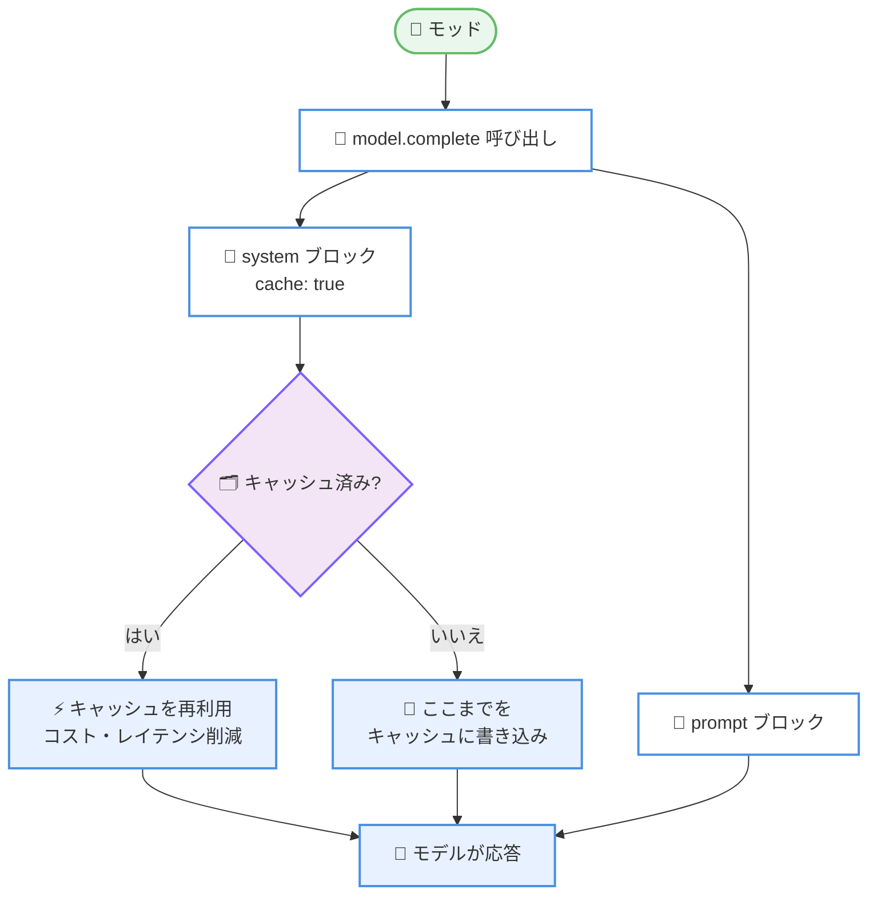

# Claude Code v2.1.292: Agent ツールの `effort` パラメータ、`plugin install --marketplace`、モッド向けプロンプトキャッシュ、サンドボックス・権限のセキュリティ修正多数

## メタデータ

| 項目 | 内容 |
|------|------|
| 発表日 | 2026-10-06 (npm 公開日時: 2026-10-06T17:10:31Z) |
| ソース | Claude Code Changelog |
| カテゴリ | Claude Code / CLI アップデート |
| 公式リンク | https://github.com/anthropics/claude-code/blob/main/CHANGELOG.md |

## 概要

Claude Code v2.1.292 がリリースされた。92 項目の変更を含む大型リリースであり、内訳は追加 (Added) 8 件、修正 (Fixed) 64 件、改善 (Improved) 13 件、変更 (Changed) 7 件である。同日未明のホットフィックス v2.1.291 に続く、機能追加と品質改善をまとめた本編といえるリリースである。

追加面では、**Agent ツールに `effort` パラメータ**が加わり、サブエージェントを指定した effort レベルで実行できるようになった。また **`claude plugin install` に `--marketplace <source>` オプション**が追加され、マーケットプレイスの追加とプラグインのインストールを 1 コマンドで行える。モッド開発者向けには、**`$.model.complete` のプロンプトキャッシュ対応** (`cache: true` を付けたブロックまでのリクエストをキャッシュ)、プロンプト入力欄の補完候補に行を追加できる **`prompt.autocomplete` イベント**、`agent.spawn` フックへのワークフローエージェント情報の提供が揃った。

修正面では、サンドボックスと権限まわりのセキュリティ修正が目立つ。サンドボックス化されたコマンドによる `/ultrareview` アップロードのステージングコピーの読み取り、macOS / Windows でのノートブック・PDF 読み取り中のリンク差し替えによる承認外ファイルの返却、改ざんされたサーバー管理設定のディスクキャッシュによるポリシープラグインの無効化、ネットワーク (UNC) パスの読み取りが権限プロンプトを迂回する問題などが解消された。このほか、プラグインフックワーカーの再起動時の挙動を中心としたモッド・プラグイン基盤の修正が 15 件規模で積み上げられ、`claude -p`・スケジュールタスク・クラウドセッションの信頼性修正も多数含まれる。

挙動変更としては、ローカル (stdio) MCP サーバーの接続が **Bedrock、Vertex、Foundry を含むすべてのインストールでプロトコルバージョン 2026-07-28 をデフォルトでネゴシエート**するようになった点が大きい (`MCP_PROTOCOL_NEGOTIATION=legacy` でオプトアウト可能)。

## 詳細

### 背景

Claude Code は 2026-10-06 の早朝にリグレッション修正のみのホットフィックス v2.1.291 をリリースしており、本バージョンは同日午後に続けて公開された。v2.1.287 (2026-10-01) で導入された Claude Mods 以降、モッド・プラグイン基盤の拡張と堅牢化が続いており、本バージョンでもモッド向け API の追加 3 件に加え、フックワーカーの再起動やフックの失敗時の扱いを中心とした基盤修正が厚い。あわせて、サンドボックス・権限システムの抜け道をふさぐセキュリティ修正群が含まれる。

### 主な変更点

#### 1. 追加機能 (Added: 8 件)

- **Agent ツールの `effort` パラメータ**: Claude がサブエージェントを起動する際、要求された effort レベルで実行できるようになった。タスクの難易度に応じてサブエージェントの推論の深さを調整できる
- **`claude plugin install --marketplace <source>`**: 必要に応じてマーケットプレイスを追加してから、そこからプラグインをインストールする。マーケットプレイスの追加には `claude plugin marketplace add` と同じポリシーチェックが適用される
- **`CLAUDE_CODE_OVERLOADED_RETRY_BASE_DELAY_MS` 環境変数**: 過負荷 (529) リクエストをリトライする際のバックオフのベース遅延を長く設定できる
- **モッド向け `prompt.autocomplete` イベント**: モッドがフックして、プロンプト入力欄の補完リストに独自の行を追加できる
- **`$.model.complete` のプロンプトキャッシュ**: `prompt` と `system` がテキストブロックの配列を受け取り、ブロックに `cache: true` を付けると、そのブロックまでのリクエストがキャッシュされる。モッドが繰り返し行うモデル呼び出しのコストとレイテンシを下げられる
- **`agent.spawn` フックへのワークフローエージェントの提供**: ワークフローのエージェントが run とインデックスとともにモッドの `agent.spawn` フックに渡されるようになり、モッドがそれらを拒否できる
- **[Claude Tag] Allowed domains カードの Edit ボタン**: チャンネルの Configure ページから、Enterprise 管理者がチャンネルのドメインを設定するアクセスバンドルを開けるようになった
- **[Code Review] PRs reviewed チャートの拡充**: 期間合計と前期間からの変化、リポジトリ別の内訳が Code Review アナリティクスに追加された

#### 2. サンドボックス・権限のセキュリティ修正

本バージョンで特に重要なのが、権限システムの迂回につながる問題の修正群である。

- **`/ultrareview` アップロードの読み取り**: サンドボックス化されたコマンドが、`~/.claude/seed-admin` 配下にある `/ultrareview` アップロードのステージングコピーを読み取れていた問題を修正
- **セッション途中の read-deny パス**: 管理設定のサンドボックス read-deny パス (およびその横のユーザー設定のパス) がセッション途中に出現・変更された場合に、その内側のプロジェクト許可が取り消されず、カバーされるファイルからの資格情報注入も止まらなかった問題を修正
- **読み取り中のリンク差し替え**: macOS と Windows で、ノートブックや PDF の読み取りが、読み取り中に差し替えられたリンクを通じて承認範囲外のファイルを返せていた問題を修正
- **サーバー管理設定キャッシュの改ざん**: 設定のフェッチが失敗している間、改ざんされたディスク上のキャッシュがビルトインのポリシープラグインを無効化・置換できていた問題を修正
- **Windows の別名表記による削除**: ホームフォルダーやドライブの 8.3 短縮名などの別表記に対する `rm -rf` が、それらの削除として扱われていなかった問題を修正
- **UNC パスの読み取り**: PreToolUse フックの承認と auto モードが、ネットワーク (UNC) パスからのファイル読み取りで権限プロンプトを迂回していた問題を修正
- **`allowed-tools` ルールの再出現**: スキルやスラッシュコマンドの `allowed-tools` ルールが、そのターンの途中で auto モードやプランモードを抜けた後のターンで復活していた問題を修正
- **ユーザー専用スキルの起動**: `/name` を繰り返したコンパクション要約によって、ユーザー専用に予約されたスキルを Claude が起動できていた問題を修正

#### 3. ヘッドレス・スケジュールタスク・セッションの信頼性修正

- **`claude -p` / Agent SDK のワンショット実行**: 最終結果の 5 秒後にバックグラウンドコマンドを停止していた問題と、`claude -p` がスケジュールされた wakeup を落としていた問題を修正。どちらも待機されるようになった
- **スケジュールタスク**: `/resume`、`/branch`、`/clear` の後に作成した保存済みタスクが発火しない問題と、タスクファイルへの数ミリ秒差の 2 回の書き込み後に作成・削除が無視される問題を修正
- **`/loop` の停止**: バックグラウンドセッションのプロセス再起動 (クラッシュ後など) で保留中の wakeup が失われ、`/loop` が静かに止まる問題を修正
- **プランモードの復元**: `claude --resume` のセッションピッカーや `/resume` でセッションを再開した際に、プランモードが復元されない問題を修正
- **Grep / Glob の誤報告**: 与えられたファイルやフォルダーを読めなかった場合に「マッチなし」と報告していた問題を修正。Claude は 1 回リトライするか、読めなかったことを伝える
- **Read ツールの PDF ページ指定**: `pages` に "6,9,15" のようなリストを渡すと、エラーなしで最初のエントリだけを返していた問題を修正。ページや範囲を個別に読むよう促すエラーを返す
- **大きな @-メンションファイル**: 256KB を超えるテキストファイルが黙って除外されていた問題を修正。ファイルサイズと分割読み込みの指示が Claude に伝えられる
- **使用量上限アラートの重複**: メイン会話をすでに停止させた上限でバックグラウンドエージェントが失敗するたびに、アラートが繰り返されていた問題を修正

#### 4. モッド・プラグイン基盤の修正

フックワーカーの再起動時とフックの失敗時の挙動を中心に、15 件規模の修正が行われた。

- **フックワーカー再起動時の素通り**: ワーカーの再起動中に行われたツール呼び出しがプラグインの権限フックなしに回答されていた問題と、プラグインインターフェース呼び出しが他のプラグインのフックなしに実行されていた問題を修正
- **`next(e)` の意味論**: `next(e)` を呼んだ後に拒否するフックが「拒絶」として回答されていた問題を修正 (フック名とともに「失敗」として報告される)。また `next(e)` を呼んだ後にターン中断中に失敗したフックが呼び出しを素通りさせていた問題も修正され、呼び出しは拒否される
- **`tool.check` の allow による対話の省略**: プラグインの `tool.check` フックが allow と答えると、質問やプラン承認などユーザーの回答を要するツールがダイアログを表示せずに実行されていた問題を修正
- **長い拒否理由の無視**: 理由が 4,096 文字を超えると、プラグインのプロンプト破棄や設定拒否が無視されていた問題を修正
- **拒否理由の非表示**: Write、Edit、NotebookEdit、LSP の行と、単独の Read、Grep、Glob の行が、モッドが呼び出しを拒否した理由を隠していた問題を修正
- **`claude plugin validate`**: エンジンが別の場所から読む hooks モジュールの matcher や state 値を列挙する問題と、再宣言・再代入されたトップレベル `var` 越しの `$.state` 読み取りを列挙する問題を修正 (後者のモジュールは拒否される)
- **読み込みパフォーマンス**: 1 つの const を通じて多数の `$.state` 呼び出しを行う hooks モジュールの読み込み・検証に数分かかっていた問題を修正
- **その他**: 提供した `$` メソッドがフックの起点を再起動し `.catch` 付きガードフックを際限なく再実行し得る問題、組織のプラグインがユーザーインストールのモッドと同名の `$` を返した際に自分がアンロードされる問題 (モッド側がアンロードされるようになった)、テーマ保存がプラグインの `config.set` フックより先に行われる問題、ワーカー交換時にモッドの起動プロンプトなどが二重にキューされる問題、別のモッドのフックが `$` 呼び出しの下で行う呼び出しでガードの `.catch` が黙ってスキップされる問題、`tool.call` フックがパラメータ名の修復前の引数を見ていた問題などが修正された

#### 5. UI・入力まわりの修正

- **vim モード**: カーソルが行末を越える、`j`/`k` が短い行で列を失う、`f`/`t`/`F`/`T`/`;`/`,` がプロンプトの別の行のマッチへジャンプ・削除する問題を修正
- **ペーストの混在**: 1 つのプロンプトで複数のペーストが重なった際に、一部のテキストがタイプ入力として Claude に届く問題を修正
- **iTerm2 のスクロールバック**: iTerm2 検出時に、フルスクリーンモードがウィンドウリサイズや Ctrl+L のたびに全画面クリアを送信していた問題を修正 (スクロールバックが古いページで埋まる原因だった可能性がある)
- **`/bug`、`/share`、`/feedback`**: レポート送信中の Ctrl+O や Ctrl+Z でやり直しになる問題と、送信後にキャンセル扱いで閉じる問題を修正
- **`/remote-env`**: すぐに Enter を押すと保存済みデフォルト環境が置き換えられる問題を修正。リストはデフォルトを選択した状態で開き、デフォルトがない場合はどの行にもチェックが付かない
- **`/add-dir`**: パス入力欄で Shift+Enter やペーストが改行を追加し、素早くタイプした "tab"、"up"、"down" がキーとして扱われる問題を修正
- **その他**: プロンプトフッター行の選択中に高速タイピング・IME テキスト・分解されたアクセントが落ちる問題、Read の deny ルールとシンリンク配下の作業ディレクトリで @-ワードに偽の「could not be examined」が付く問題、`/cd` や権限変更後に「instruction file not loaded」行が古いまま・欠落する問題などが修正された

#### 6. 改善 (Improved: 13 件)

- **`claude -p` / SDK セッションの起動**: 最初のターンが HTTP・SSE MCP サーバーの `resources/list` の応答を待たなくなり、起動が速くなった
- **長い箇条書きの描画速度**: 長い箇条書き・番号付きリストの返信のストリーミング、リサイズ、トランスクリプト (Ctrl+O) での再表示が大幅に高速化された
- **Ctrl+C の下書き復元**: スラッシュコマンドやメッセージ送信の後でも、クリアしたプロンプトに Up キーで到達できるようになった
- **フック出力の扱い**: フックの出力に書かれた `<system-reminder>` タグは、Claude に届く前にエスケープされる
- **ツール入力の寛容化**: Grep が `path` の代わりに `file_path` を受け付け、Write、WebFetch、Read はいくつかの余分なパラメータで呼び出しを失敗させずに無視する
- **サンドボックス自動許可**: ユーザー・管理・`--settings` 設定で厳格サンドボックスモードが設定されている場合、`FOO=bar python3 app.py` のような環境変数プレフィックス付きインタープリターコマンドがプロンプトなしで実行される
- **Artifact ツールのリスト**: 公開済みアーティファクトの件数が Claude に見えるようになり、一度に最大 200 件 (従来 50 件) をリストできる
- **stdio MCP サーバーの起動**: 新しいプロトコルチェックを無視するローカル (stdio) MCP サーバーは、一度の遅い接続の後 7 日間記憶され、待ちなしで旧方式で接続される
- **その他**: 設定ファイルで宣言されたマーケットプレイスの名前が公式 Anthropic マーケットプレイスに似ている場合の手順表示、再起動後のクラウドセッションで再開可能な停止済みバックグラウンドエージェントの id 通知、claude.ai クラウドセッションでブラウザに到達できない場合の Claude in Chrome メッセージ、`/focus` のヒント、[Claude Tag] `@Claude !status` の説明 (タグなしメッセージの読み取り停止の理由と再開方法) が改善された

#### 7. 変更 (Changed: 7 件)

- **stdio MCP のプロトコルネゴシエーション**: ローカル (stdio) MCP サーバーの接続が、Bedrock、Vertex、Foundry を含むすべてのインストールで、デフォルトでプロトコルバージョン 2026-07-28 をネゴシエートするようになった。`MCP_PROTOCOL_NEGOTIATION=legacy` でオプトアウトできる
- **`claude plugin test` の厳格化**: テストが登録したフック内での `expect` の失敗や、エンジンが拒否するスタブ回答が、黙って成功する代わりにテストを失敗させるようになった
- **ルーチン実行のアーティファクト公開**: スケジュール実行と Run now のルーチン実行は、本人のみ閲覧できる新しいアーティファクトを承認なしで公開するようになった。コネクタなどのアクセスを要求するアーティファクトは引き続き承認を求める
- **エージェント名の上限**: エージェント名は最大 256 文字となり、それより長い名前は拒否される。スキルやプラグインファイルの `name` が超過する場合は無視される
- **使用量上限メッセージのリンク**: claude.ai 設定へのリンクが `https://` 付きで書かれ、ターミナルやアプリでクリック可能になった
- **[Claude Tag] `!fork` の起点カード**: `!fork` で継続した Slack スレッドの最初のメッセージが、元スレッドへのリンク付きで出所・リクエスト・依頼者を示すカードになった
- **[Claude Tag] スペンド上限の保存**: 管理設定のスペンド上限ページで、組織全体とデフォルトの上限ボックスは Save か Enter を押したときのみ保存される (クリックで離れたときには保存されない)

#### 8. クラウドセッション・Remote Control・Claude Tag・Code Review の修正

- **[Cloud sessions]**: ルーチン実行が完了後も何時間も「実行中」のまま表示される問題、通知設定を保存していないルーチンの編集・複製でプッシュ通知がオフになる問題、SVG・HEIC・TIFF などの画像が添付に失敗する問題 (通常ファイルとして添付される)、組織が承認必須と設定したコネクタツールに効果のない「Always allow」が表示される問題を修正
- **[Remote Control]**: claude.ai/code から開始した新規セッションの最初のメッセージが画像しか受け付けなかった問題を修正 (PDF などのファイルも受け付ける)。また、デスクトップアプリや IDE がホストするセッションで、バックグラウンドサブエージェントのペインが空に見える問題も修正された
- **[Claude Tag]**: 最初のリクエスト処理中にスレッドへ送られた返信が保留・取りこぼされる問題、GitHub PR アクティビティやルーチンでのみ起こされたスレッドが管理者のモデル変更後も元のモデルのままになる問題、使用クレジット切れが原因なのにスペンド上限の通知を投稿する問題、Slack から回答できない権限プロンプトが自動拒否された際にセッションがハングする問題を修正
- **[Code Review]**: プルリクエストのベースブランチが変更され旧ブランチが削除された際にキュー済みレビューが失敗する問題 (コミットが再キューされる) と、プルリクエストが CLAUDE.md を編集している場合にそのルールが無視される問題 (ベースブランチ版が使われる) を修正

### 技術的な詳細

#### モッド向け `$.model.complete` のプロンプトキャッシュ

モッドの `$.model.complete` で、`prompt` と `system` はテキストブロックの配列を受け取るようになり、ブロックに `cache: true` を付けると、そのブロックまでのリクエストがキャッシュされる。長いシステムプロンプトを使い回すモッドでは、2 回目以降の呼び出しのコストとレイテンシを抑えられる。



#### 更新後に影響し得る設定・挙動

| 設定 / 挙動 | 影響 | 対処 |
|------------|------|------|
| stdio MCP のプロトコルバージョン | すべてのインストールで 2026-07-28 をデフォルトでネゴシエート | 問題がある場合は `MCP_PROTOCOL_NEGOTIATION=legacy` を設定 |
| `claude plugin test` | フック内の `expect` 失敗や拒否されたスタブ回答がテストを失敗させる | 黙って成功していたテストは修正が必要になる場合がある |
| エージェント名 | 最大 256 文字。超過する名前は拒否、スキル・プラグインの `name` は無視 | 長い名前を使っている場合は短縮する |
| ルーチン実行のアーティファクト | 本人のみ閲覧可能なアーティファクトは承認なしで公開される | コネクタなどのアクセス要求時は従来どおり承認を求める |
| 529 リトライのバックオフ | ベース遅延を環境変数で延長可能 | 必要に応じて `CLAUDE_CODE_OVERLOADED_RETRY_BASE_DELAY_MS` を設定 |
| 厳格サンドボックスモード | 環境変数プレフィックス付きインタープリターコマンドが自動許可 | 挙動は strict sandbox 設定下でのみ変わる |
| `$.state` を再宣言・再代入された `var` 越しに読むモジュール | `claude plugin validate` が拒否する | 該当モジュールは書き換えが必要 |

## 開発者への影響

### 対象

- モッド・プラグイン開発者 (`$.model.complete` のプロンプトキャッシュ、`prompt.autocomplete`、`agent.spawn` のワークフローエージェント、フックワーカー再起動時・`next(e)`・`tool.check` の挙動修正、`claude plugin validate` / `test` の厳格化)
- サブエージェントを多用する利用者 (Agent ツールの `effort` パラメータ)
- プラグインを配布・導入する組織 (`plugin install --marketplace`、公式に似たマーケットプレイス名の手順表示、管理設定ロード前の `claude plugin` コマンド実行の修正)
- セキュリティ・権限設定を運用する組織 (UNC パス、read-deny パス、サーバー管理設定キャッシュ、`/ultrareview` ステージングコピーなどの修正)
- `claude -p`・Agent SDK・CI で自動化を構築している開発者 (バックグラウンドコマンドと wakeup の待機、MCP `resources/list` を待たない起動)
- スケジュールタスク・`/loop`・バックグラウンドセッションの利用者
- stdio MCP サーバーの利用者 (プロトコルネゴシエーションのデフォルト変更、遅いサーバーの 7 日間記憶)
- クラウドセッション・Remote Control・Claude Tag・Code Review の利用者

### 必要なアクション

- **アップデートの実施**: 権限プロンプトの迂回やサンドボックスの読み取り範囲に関わるセキュリティ修正が複数含まれるため、すべてのユーザーに更新を推奨する
- **モッド開発者**: 繰り返しのモデル呼び出しがある場合は `$.model.complete` の `cache: true` によるキャッシュを検討する。また、`next(e)` 後に拒否するフックは「失敗」として報告されるようになったため、エラーハンドリングの前提を見直す
- **プラグインのテスト**: `claude plugin test` で黙って成功していたテストが失敗するようになる可能性があるため、CI でのテスト結果を確認する
- **MCP サーバー運用者**: stdio サーバーがプロトコルバージョン 2026-07-28 のネゴシエーションで問題を起こす場合は `MCP_PROTOCOL_NEGOTIATION=legacy` でオプトアウトしつつ、サーバー側の対応を進める
- **エージェント・スキル名の確認**: 256 文字を超えるエージェント名やスキル・プラグインの `name` は拒否・無視されるため、該当する場合は短縮する

### 移行ガイド (該当する場合)

破壊的変更はないが、以下の挙動変更に注意が必要である。

- stdio MCP サーバーは、Bedrock、Vertex、Foundry を含むすべてのインストールでプロトコルバージョン 2026-07-28 をデフォルトでネゴシエートする
- `claude plugin test` は、フック内の `expect` の失敗とエンジンが拒否するスタブ回答をテストの失敗として扱う
- エージェント名は最大 256 文字に制限される
- スケジュール実行と Run now のルーチン実行は、本人のみ閲覧できるアーティファクトを承認なしで公開する

## コード例

マーケットプレイスの追加とプラグインのインストールは 1 コマンドで行える。

```bash
# マーケットプレイスを (必要なら) 追加してからプラグインをインストール
claude plugin install my-plugin --marketplace owner/repo

# 過負荷 (529) リトライのベース遅延を延長する
export CLAUDE_CODE_OVERLOADED_RETRY_BASE_DELAY_MS=5000

# stdio MCP のプロトコルネゴシエーションを旧方式に戻す
export MCP_PROTOCOL_NEGOTIATION=legacy
```

モッドからのモデル呼び出しでは、ブロック単位のプロンプトキャッシュを利用できる (Changelog の記載に基づく概形)。

```javascript
// prompt と system はテキストブロックの配列を受け取り、
// cache: true を付けたブロックまでのリクエストがキャッシュされる
const result = await $.model.complete({
  system: [{ text: longSystemPrompt, cache: true }],
  prompt: [{ text: userInput }],
});
```

## 関連リンク

- [Claude Code Changelog (v2.1.292)](https://github.com/anthropics/claude-code/blob/main/CHANGELOG.md)
- [Claude Code v2.1.291 のレポート](./2026-10-06-claude-code-v2-1-291.md)
- [Claude Code v2.1.288 のレポート](./2026-10-02-claude-code-v2-1-288.md)
- [Claude Code 公式ドキュメント](https://code.claude.com/docs)
- [Claude Code のプラグイン](https://code.claude.com/docs/en/plugins)
- [Claude Code のフック](https://code.claude.com/docs/en/hooks)

## まとめ

Claude Code v2.1.292 は、92 項目 (追加 8 件、修正 64 件、改善 13 件、変更 7 件) からなる大型リリースである。Agent ツールの `effort` パラメータ、`claude plugin install --marketplace`、モッド向けの `$.model.complete` プロンプトキャッシュと `prompt.autocomplete` など、サブエージェントとプラグインエコシステムを広げる追加が揃った。

修正の柱は 2 つある。1 つはサンドボックス・権限システムのセキュリティ修正群であり、UNC パスやリンク差し替えによる承認範囲外アクセス、改ざんされた設定キャッシュによるポリシープラグインの無効化といった迂回経路がふさがれた。もう 1 つはモッド・プラグイン基盤の堅牢化であり、フックワーカーの再起動時にフックが素通りする問題や `next(e)` の意味論など、権限フックの信頼性に直結する修正が積み上げられた。stdio MCP のプロトコルネゴシエーションのデフォルト変更という足回りの更新も含め、セキュリティ修正の重要性からすべてのユーザーに更新を推奨できるリリースである。
