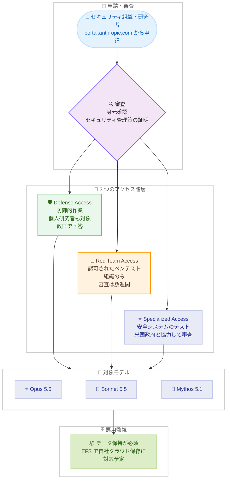

# サイバー検証プログラム (CVP) の拡大: 3 つのアクセス階層で防御側に信頼されたモデルアクセスを提供

## メタデータ

| 項目 | 内容 |
|------|------|
| 発表日 | 2026-10-06 |
| ソース | Anthropic News |
| カテゴリ | 公式発表 / サイバーセキュリティ / 安全性 |
| 公式リンク | https://www.anthropic.com/news/cyber-verification-program |

## 概要

Anthropic は 2026 年 10 月 6 日、サイバーセキュリティ分野の検証済み組織・個人を対象とした「Cyber Verification Program (CVP)」の拡大を発表した。過去 6 か月間運用してきた 2 つのプログラム、すなわち最重要ソフトウェアを守る組織グループに Claude Mythos へのアクセスを提供する「Project Glasswing」と、審査済みセキュリティチームに Opus / Sonnet のセーフガード緩和を提供する従来の CVP を統合し、Defense Access、Red Team Access、Specialized Access の 3 つのアクセス階層からなる拡大版 CVP として再編するものである。

各階層では Claude Opus 5.5、Claude Sonnet 5.5、Claude Mythos 5.1 および今後の新モデルへのアクセスが提供される。先行する Project Glasswing では、パートナーが 2026 年 4 月から 7 月にかけて少なくとも 129,000 件の検証済み脆弱性を発見するなど、具体的な成果も報告されている。申請は Anthropic のポータル (portal.anthropic.com/programs/cvp) から受け付けられる。

## 詳細

### 背景

サイバーセキュリティは本質的にデュアルユース (両用) の分野であり、脆弱性の発見・修正に役立つ能力は、悪意ある攻撃者による悪用にもつながりうる。このため Anthropic は、一般提供モデル (Claude Opus 5.5、Claude Fable 5.1、Claude Sonnet 5.5) に保守的なサイバーセーフガードを設けており、多くのサイバー関連タスクがブロックされる。

一方で、防御側こそ最高のツールを必要とする。Anthropic は過去 6 か月間、Project Glasswing と従来の CVP という 2 つのプログラムを通じて信頼されたアクセスを提供してきた。今回の発表は、これらを統合・拡大し、より広範な防御側コミュニティに階層的なアクセスを提供するものである。なお、一般提供モデルでも、コードレビュー、既知問題のパッチ適用、自己所有ソースコードの脆弱性探索、セキュリティアラートのトリアージなどは引き続き実行可能である。

### 主な内容

#### 3 つのアクセス階層

拡大版 CVP では、利用目的と組織の性質に応じて 3 つのアクセス階層が提供される。

| 項目 | Defense Access | Red Team Access | Specialized Access |
|------|----------------|-----------------|---------------------|
| 対象業務 | SOC・インシデント対応、マルウェアのリバースエンジニアリング、脆弱性の分析・検証などの防御的作業 | 防御用途に加え、認可されたペネトレーションテストとレッドチーミング | 人命や市場に影響しうる安全システムのテスト |
| 対象者 | 企業・非営利団体・大学・政府機関のセキュリティチーム、重要インフラ運営者、小規模セキュリティ企業、オープンソースメンテナ、脆弱性報告実績のある個人研究者 | 社内レッドチーム、政府レッドチーム、セキュリティ・ペンテスト企業 (組織のみ、個人は対象外) | 米国政府と協力して詳細審査を受けた限定的な検証済み組織 |
| 審査期間 | 数日以内の回答を目標 | 数週間 (審査中は Defense Access 階層に登録) | 全組織を詳細審査 |

- **Defense Access**: 地域病院や自治体の公益事業など、あらゆる規模の重要インフラ運営者を含む幅広い対象に開かれている
- **Red Team Access**: テスト権限を持つシステムのみが対象。ランサムウェアの展開、物理システムの破壊、高リスク安全システムのペネトレーションテストなど、物理的被害や大規模な混乱を招く行為はリアルタイムでブロックされる
- **Specialized Access**: 最もブロックが少ない階層。航空機運航システム、電力網、通信網、銀行間送金インフラ、政府行政ネットワークなどの安全システムのテストを認可された組織が対象。Project Glasswing の既存メンバーはこの階層に移行し、現行モデルについての再承認は不要

#### 対象モデル

各階層とも、Claude Opus 5.5、Claude Sonnet 5.5、Claude Mythos 5.1 および今後の新モデルへのアクセスを含む。

#### データ保持とプライバシー

- 悪用監視のため、参加組織にはデータ保持が必須となる
- 2026 年秋後半に提供予定の **Enterprise Frontier Safeguards (EFS)** により、適格組織はゼロデータ保持のプライバシーと堅牢なセーフガードを両立し、自社管理のクラウドにデータを保存できるようになる
- EFS 提供前でも、ゼロデータ保持で Claude Fable 5.1 または Mythos 5.1 にアクセスできる組織は、ゼロデータ保持で CVP を利用可能

#### 効果検証: CyScenarioBench 評価

Anthropic は、多段階サイバー作戦の計画・実行能力を測る評価「CyScenarioBench」(10 課題 x 各 5 回 = 50 試行) を用いて、Claude Opus 5.5 に各階層のセーフガードを適用した場合の挙動を検証した。

| 設定 | 結果 |
|------|------|
| CVP なし (一般提供) | 全タスクが最初のプロンプトでブロック |
| Defense Access | 50 試行中 46 がブロック、4 タスクが成功 |
| Red Team Access | ブロックなし、50 試行中 34 タスクが成功 |

Red Team Access の成功率は、セーフガードなし (Specialized Access 相当) の成功率 67.6% と実質的に同等であり、認可されたレッドチーム業務を妨げないことが示されている。

#### Project Glasswing の成果

- パートナーは 2026 年 4 月から 7 月にかけて、少なくとも **129,000 件**の検証済み脆弱性を発見
- Anthropic 自身のオープンソーススキャンでは、2026 年 4 月から 10 月にかけて追加で **5,500 件**を発見
- うち **33,000 件以上**がクリティカルまたは高深刻度と評価
- これらの数値は 33 のパートナー報告に基づく部分的データであり、真の影響は少なくとも 5 倍と推定される。パッチ適用数を開示したパートナーは 50% 未満 (修正作業中のため) で、パッチ率は大幅な過小計上となっている
- 複数のパートナーが、Mythos モデルにより脆弱性発見速度が数か月から数年分加速したと回答。Booz Allen と Comcast の事例も紹介されている

#### 申請方法と提供プラットフォーム

- 申請は Anthropic のポータル (https://portal.anthropic.com/programs/cvp) から行う
- 全申請者に身元確認と、該当階層に必要なセキュリティ管理策の証明が求められる
- 既存の CVP メンバーは従来モデルの設定を維持しつつ、新モデルへのアクセスが自動的に審査される。管理者はワークスペースへのアクセス割り当てが必要
- 提供先: Claude Platform、Google Cloud の Vertex AI、Microsoft Foundry。Amazon Bedrock では EFS 適格顧客のみ
- 階層で許可されるはずの作業がブロックされた場合は、誤検知報告フォームから報告できる

### 技術的な詳細

CVP の設計は、ライフサイエンス分野の LSVP と同様に「検証されたユーザーには広いアクセスを、未検証のユーザーには強い制限を」という階層的アプローチに基づく。CyScenarioBench の評価結果が示すように、階層別の分類器は、Defense Access では攻撃的な多段階作戦をほぼ全てブロックしつつ、Red Team Access では認可されたテスト業務をセーフガードなしと同等の成功率で実行可能にしており、用途に応じた細やかな制御が実現されている。Anthropic は防御側に恒久的な優位性を与えることを目指し、階層別分類器の改善を継続するとしている。

## アーキテクチャ図

## 開発者への影響

### 対象

- **防御的セキュリティ業務を行う組織・個人**: 企業・非営利団体・大学・政府機関のセキュリティチーム、重要インフラ運営者、小規模セキュリティ企業、オープンソースメンテナ、脆弱性報告実績のある個人研究者。SOC 運用、マルウェア解析、脆弱性分析などで一般提供モデルのブロックを受けていた場合、Defense Access への申請により解除できる
- **レッドチーム・ペネトレーションテスト組織**: 社内レッドチーム、政府レッドチーム、ペンテスト企業は Red Team Access を申請できる。個人は対象外である点に注意
- **安全システムのテストを担う組織**: 電力網、通信網、金融インフラなどのテストを認可された組織は Specialized Access の対象。Project Glasswing 既存メンバーは自動的にこの階層に移行する
- **既存 CVP メンバー**: 従来モデルの設定を維持しつつ、新モデルへのアクセスが自動審査される
- **一般ユーザー**: コードレビュー、既知問題のパッチ適用、自己所有コードの脆弱性探索、アラートのトリアージなどは引き続き一般提供モデルで実行可能であり、影響はない

### 必要なアクション

一般ユーザーに必須のアクションはない。サイバーセキュリティ業務を行う組織・個人には以下が推奨される。

- 自身の業務が Defense Access、Red Team Access、Specialized Access のどの階層に該当するかを確認し、ポータル (https://portal.anthropic.com/programs/cvp) から申請する
- 身元確認と、該当階層に必要なセキュリティ管理策の証明を準備する
- データ保持要件を確認する。ゼロデータ保持が必要な組織は、EFS の提供 (2026 年秋後半予定) または既存のゼロデータ保持アクセスの適用可否を確認する
- 既存 CVP メンバーの管理者は、新モデルへのワークスペースのアクセス割り当てを行う
- 階層で許可されるはずの作業がブロックされた場合は、誤検知報告フォームから報告する

### 移行ガイド (該当する場合)

- **Project Glasswing 既存メンバー**: Specialized Access 階層に移行する。現行モデルについての再承認は不要
- **既存 CVP メンバー**: 従来モデルの設定は維持され、新モデルへのアクセスが自動的に審査される

## 関連リンク

- [公式発表: Expanding the Cyber Verification Program](https://www.anthropic.com/news/cyber-verification-program)
- [CVP 申請ポータル](https://portal.anthropic.com/programs/cvp)
- [Anthropic News](https://www.anthropic.com/news)
- [Anthropic 利用規約 (Usage Policy)](https://www.anthropic.com/legal/aup)

## まとめ

拡大版 CVP は、ライフサイエンス分野の LSVP に続き、デュアルユース領域における「検証に基づく階層的アクセス」という Anthropic のアプローチをサイバーセキュリティ分野で本格展開するものである。Project Glasswing と従来の CVP の統合により、個人研究者からレッドチーム企業、安全システムのテスト組織まで、防御側の多様なニーズに応じた 3 階層のアクセスが整備された。

特に注目すべきは、CyScenarioBench 評価による効果の定量的な裏付けと、Project Glasswing で実証された 129,000 件以上の脆弱性発見という具体的な成果である。Red Team Access がセーフガードなしと実質同等の成功率を達成しつつ、Defense Access では攻撃的作戦をほぼ全てブロックするという結果は、階層別分類器による細やかな制御の有効性を示している。Specialized Access の審査に米国政府が関与する点は、LSVP の High-risk Use と同様、フロンティア AI の能力管理が政府連携を前提とした段階に入ったことを改めて示すものである。数週間以内にオープンソースソフトウェアと重要インフラの保護に関する詳細と学びが共有される予定であり、継続的な注視が推奨される。
