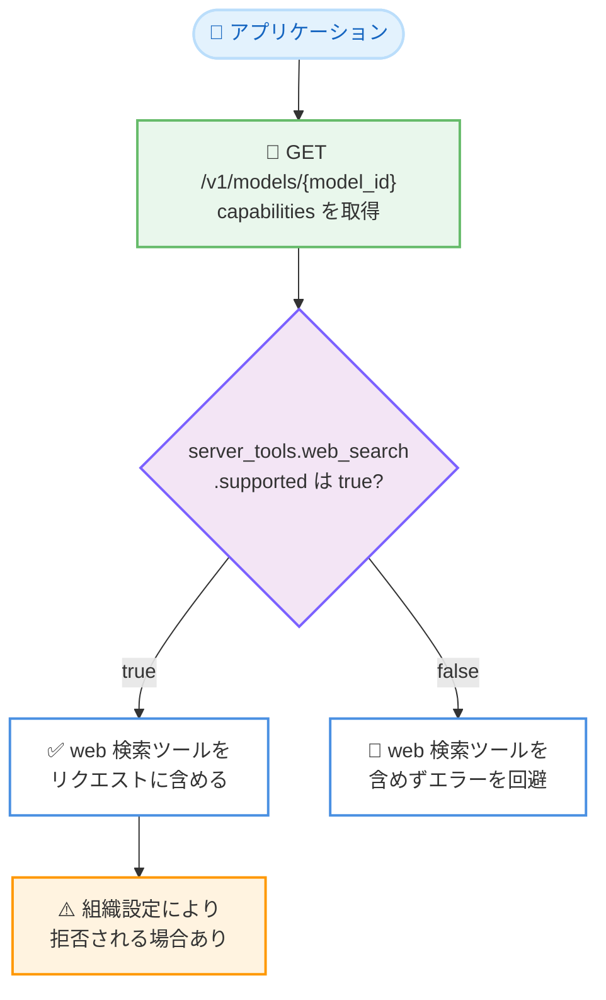

# Models API に `capabilities.server_tools` を追加: web 検索・コード実行ツールの対応可否をプログラムから判別可能に

## メタデータ

| 項目 | 内容 |
|------|------|
| 発表日 | 2026-10-06 |
| ソース | Claude Developer Platform Release Notes |
| カテゴリ | API アップデート |
| 公式リンク | https://platform.claude.com/docs/en/release-notes/overview |

## 概要

Claude API の Models API に `capabilities.server_tools` フィールドが追加された。`GET /v1/models` および `GET /v1/models/{model_id}` のレスポンスで、各モデルが web 検索 (web search) ツールとコード実行 (code execution) ツールを受け付けるかどうかを確認できるようになった。

コード実行ツールの対応可否は `capabilities.server_tools.code_execution` で確認する。公式ドキュメントによると、トップレベルの `capabilities.code_execution` は「コード実行ツール内で実行されるコードがリクエスト内の他のツールを呼び出せるか」(プログラマティックツールコーリングなど) を示すフィールドであり、両者は意味が異なる点に注意が必要である。

## 詳細

### 背景

web 検索ツールやコード実行ツールは、Anthropic のサーバー側で実行されるサーバーツールであり、対応状況はモデルによって異なる。これまでアプリケーション側では、どのモデルがこれらのツールを受け付けるかをモデル ID ごとにハードコードして管理する必要があった。今回の変更により、Models API への問い合わせだけで対応可否を判定できるようになった。

このアップデートは、Models API のメタデータ拡充の流れの一部である。

- **2026-10-01**: モデル系列を示す `line` フィールドを追加
- **2026-10-05**: 思考無効化の可否を示す `capabilities.thinking.types.disabled` を追加
- **2026-10-06**: サーバーツール対応可否を示す `capabilities.server_tools` を追加 (今回)

### 主な変更点

- **`capabilities.server_tools` の追加**: 各モデルの `capabilities` オブジェクトに、web 検索ツールとコード実行ツールの対応可否を示すフィールドが追加された
- **対象エンドポイント**: `GET /v1/models` (一覧) と `GET /v1/models/{model_id}` (個別取得) の両方で返される
- **サブフィールド**: `server_tools.web_search` と `server_tools.code_execution` がそれぞれ `supported` ブール値を持つ。`server_tools.supported` は、いずれか 1 つ以上のツールをサポートする場合に `true` となる

### 技術的な詳細

**`capabilities.server_tools` の構造**: API リファレンスによると、`server_tools` は `ServerToolsCapability` オブジェクトであり、以下のフィールドを持つ。

| フィールド | 意味 |
|-----------|------|
| `supported` | モデルが web 検索・コード実行の少なくとも 1 つをサポートするか |
| `web_search.supported` | web 検索ツールをサポートするか |
| `code_execution.supported` | コード実行ツールをサポートするか |

**「少なくとも 1 バージョン」の意味**: 公式ドキュメントは、`web_search` および `code_execution` の `supported` について「モデルがツールの少なくとも 1 つのバージョンをサポートする場合に `true` となり、必ずしもすべてのバージョンをサポートするとは限らない」と明記している。特定のツールバージョンを指定する場合は、引き続きエラーハンドリングが必要である。

**組織設定による拒否**: `supported` が `true` であっても、組織の設定によってリクエストが拒否される場合がある。公式ドキュメントは、管理者が web 検索をオフにしている場合を例として挙げている。つまり、このフィールドはモデル側の対応可否を示すものであり、リクエスト成功の十分条件ではない。

**トップレベル `code_execution` との違い**: `capabilities` 直下にも `code_execution` フィールドが存在するが、こちらは「コード実行ツール内で実行されるコードが、リクエストの他のツールを呼び出せるか」(プログラマティックツールコーリングや、web 検索・web フェッチの動的フィルタリング) を示す。コード実行ツール自体の対応可否は `server_tools.code_execution` を参照する。

## 開発者への影響

### 対象

- web 検索ツールやコード実行ツールを利用するアプリケーションの開発者
- 複数の Claude モデルを切り替えて利用するアプリケーションの開発者
- モデルセレクタやルーティング層など、モデルの機能差を抽象化する基盤を実装している開発者

### 必要なアクション

- **即時の対応は不要**: 既存のリクエストの挙動を変更するものではなく、Models API のレスポンスにフィールドが追加されたのみである
- **ハードコードの置き換え**: モデル ID ごとにサーバーツールの対応可否を分岐しているコードは、`capabilities.server_tools` の参照に置き換えることで、新モデル追加時の保守コストを削減できる
- **参照先の確認**: コード実行ツールの対応可否の判定にトップレベルの `capabilities.code_execution` を使用しないよう注意する。正しい参照先は `capabilities.server_tools.code_execution` である
- **エラーハンドリングの維持**: `supported: true` でも、組織設定やツールバージョンによってはリクエストが拒否される可能性があるため、エラーハンドリングは引き続き必要である

### 移行ガイド (該当する場合)

1. モデル選択時に `GET /v1/models/{model_id}` で対象モデルの `capabilities` を取得する
2. web 検索ツールを使う場合は `capabilities.server_tools.web_search.supported`、コード実行ツールを使う場合は `capabilities.server_tools.code_execution.supported` を確認する
3. `false` の場合は該当ツールをリクエストに含めない。`true` の場合でも、組織設定などで拒否される可能性があるため、エラーへのフォールバック処理を維持する

## コード例

`GET /v1/models/{model_id}` でモデルの capabilities を確認する例。

```bash
curl "https://api.anthropic.com/v1/models/claude-haiku-5-5" \
  -H "x-api-key: $ANTHROPIC_API_KEY" \
  -H "anthropic-version: 2023-06-01"
```

レスポンスの `capabilities` には、`server_tools` 配下に各サーバーツールのサポート状況が含まれる (以下は API リファレンスのレスポンス例に基づくフィールド構造の抜粋)。

```json
{
  "capabilities": {
    "code_execution": {
      "supported": true
    },
    "server_tools": {
      "supported": true,
      "web_search": {
        "supported": true
      },
      "code_execution": {
        "supported": true
      }
    }
  }
}
```

`server_tools.code_execution.supported` がコード実行ツール自体の対応可否、トップレベルの `code_execution.supported` がコード実行ツール内から他のツールを呼び出せるか (プログラマティックツールコーリング) を示す。

## アーキテクチャ図

Models API を利用したサーバーツール対応可否の判定フロー。



## 関連リンク

- [Claude Developer Platform Release Notes](https://platform.claude.com/docs/en/release-notes/overview)
- [Models API - List Models](https://platform.claude.com/docs/en/api/models/list)
- [Models overview - Using the Models API](https://platform.claude.com/docs/en/models/overview#using-the-models-api)
- [Web search tool](https://platform.claude.com/docs/en/agents-and-tools/tool-use/web-search-tool)
- [Code execution tool](https://platform.claude.com/docs/en/agents-and-tools/tool-use/code-execution-tool)

## まとめ

Models API への `capabilities.server_tools` の追加により、各モデルが web 検索ツールとコード実行ツールを受け付けるかどうかを `GET /v1/models` および `GET /v1/models/{model_id}` から判別できるようになった。モデル ID ごとの対応状況をハードコードせずに済むため、複数モデルを扱うアプリケーションの保守性向上に直結する。コード実行ツール自体の対応可否は `server_tools.code_execution` を参照し、トップレベルの `capabilities.code_execution` (コードから他のツールを呼び出せるか) と混同しないことが重要である。2026-10-01 の `line` フィールド、2026-10-05 の `thinking.types.disabled` に続くアップデートであり、Models API をモデル機能のディスカバリに活用できる範囲が着実に広がっている。
