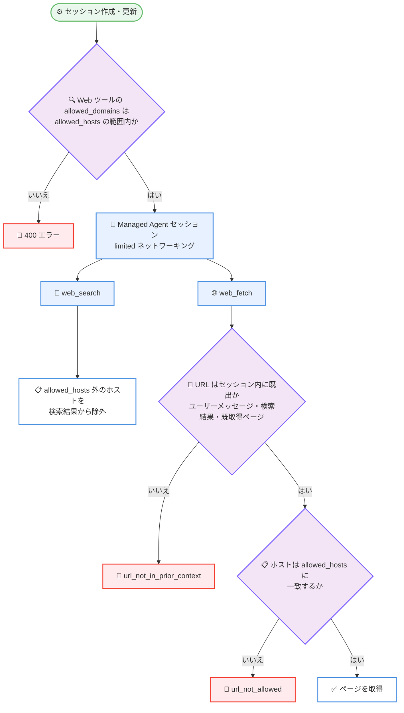

# Claude API プラットフォーム更新: Sonnet 5.5 キャッシュ読み取り半額、SDK にブラウザ・コンピュータ使用クラス、Managed Agents の Web ツール制限強化

## メタデータ

| 項目 | 内容 |
|------|------|
| 発表日 | 2026-10-07 |
| ソース | Claude API リリースノート |
| カテゴリ | 料金改定 / SDK 更新 / Managed Agents / セキュリティ |
| 公式リンク | https://platform.claude.com/docs/en/release-notes/overview |

## 概要

2026 年 10 月 7 日、Claude Developer Platform リリースノートで、料金・SDK・プラン特典・Claude Managed Agents にまたがる複数のプラットフォーム更新が発表されました。

1. **Claude Sonnet 5.5 のプロンプトキャッシュ読み取り価格を半額に**: 100 万トークンあたり $0.20 から $0.10 に値下げ。ベース入力価格の 0.1 倍から 0.05 倍になりました
2. **Python/TypeScript SDK にブラウザ使用・コンピュータ使用ツール用クラスをベータ追加**: サブクラス化してツールごとに 1 メソッドを実装すると、SDK がツールループやポリシーの実行を担います
3. **Claude Max/Team プランに月次 API クレジットが付属**
4. **Managed Agents の limited ネットワーキング強化**: `allowed_hosts` が `web_search`/`web_fetch` ツールにも適用されます
5. **設定不整合の早期検出**: Web ツールの `allowed_domains` に `allowed_hosts` 外のエントリがあると、セッション作成・更新が 400 エラーになります
6. **`web_fetch` の既出 URL 制限**: セッション内に既出の URL のみフェッチ可能になり、データ流出リスクが低減されます

なお、同日に発表された Claude Haiku 5.5 本体のリリースは別レポートで扱います。

## 詳細

### 背景

今回の更新は大きく 3 つの方向性に整理できます。第一に、プロンプトキャッシュ読み取りの値下げによるコスト削減です。第二に、これまで自前でツールループを実装する必要があったブラウザ使用・コンピュータ使用ツールの SDK サポートで、エージェント開発の定型コードを減らします。第三に、Claude Managed Agents の Web ツールに対するネットワーク制御の一貫性強化で、プロンプトインジェクション経由のデータ流出といったリスクへの対策です。

### 主な変更点

#### 1. Claude Sonnet 5.5 のプロンプトキャッシュ読み取り価格を値下げ

Claude Sonnet 5.5 のプロンプトキャッシュ読み取り価格が、100 万トークンあたり $0.20 から $0.10 に値下げされました。

- **変更前**: ベース入力価格の 0.1 倍
- **変更後**: ベース入力価格の 0.05 倍
- **キャッシュ書き込みおよびその他の価格**: 変更なし

長いシステムプロンプトやツール定義をキャッシュして繰り返し利用するエージェントワークフローでは、入力コストの大部分がキャッシュ読み取りで占められるため、実質的なコスト削減効果が大きい更新です。

#### 2. SDK のブラウザ使用・コンピュータ使用ツールクラス (ベータ)

Python および TypeScript SDK に、[ブラウザ使用ツール](https://platform.claude.com/docs/en/agents-and-tools/tool-use/browser-use-tool)と[コンピュータ使用ツール](https://platform.claude.com/docs/en/agents-and-tools/tool-use/computer-use-tool)用のクラスがベータとして追加されました。

公式ドキュメントによると、仕組みは以下のとおりです。

- **クラス名**: ブラウザ用は `BetaAbstractBrowserToolset20260801`、コンピュータ用は `BetaAbstractComputerToolset20260801`
- **実装方法**: クラスをサブクラス化し、`navigate` や `left_click` などメンバーツールごとに 1 メソッドを、自前のブラウザ・デスクトップ自動化に対して実装します
- **SDK が担う処理**: 各呼び出しのルーティング、設定した URL ポリシー・ファイルポリシーの実行、承認コールバックの問い合わせ、`tool_result` の構築
- **実行方法**: ツールランナー (`tool_runner`) と組み合わせるか、自前のループでも実行できます
- **含まれないもの**: SDK にはブラウザ、デスクトップ、既製ドライバ、URL ポリシーは含まれません。CDP (ブラウザ) や VNC (デスクトップ) を使った最小サンプルが claude-quickstarts リポジトリで公開されています

#### 3. Claude Max/Team プランに月次 API クレジット

Claude Max および Team プランに、月次の API クレジットが付属するようになりました。受け取り方法は公式ドキュメント [API credits for Max and Team plans](https://platform.claude.com/docs/en/about-claude/api-credits-for-subscribers) に記載されています。サブスクリプションユーザーが追加費用なしで Claude API を試せるようになります。

#### 4. Managed Agents: limited ネットワーキングの allowed_hosts が Web ツールにも適用

Claude Managed Agents で、`limited` ネットワーキングのクラウド環境の `allowed_hosts` が、`web_search` と `web_fetch` ツールにも適用されるようになりました。

- **`web_fetch`**: `allowed_hosts` に一致しないホストの URL をフェッチすると、エージェントに `url_not_allowed` エラー結果が返ります
- **`web_search`**: `allowed_hosts` に一致しないホストの結果は検索結果から除外されます
- **`allowed_hosts` が空の場合**: どちらのツールもページ・検索結果を返しません
- **`allow_package_managers` と `allow_mcp_servers`**: これらの設定は Web ツールにホストを追加しません
- **ホストを許可する方法**: `allowed_hosts` に追加します。追加したホストはサンドボックスからもアクセス可能になります
- **対象外**: `unrestricted` ネットワーキングとセルフホスト環境では、これらのツールは制限されません

#### 5. allowed_domains と allowed_hosts の不整合は 400 エラー

`limited` ネットワーキングでは、有効化された Web ツールの `allowed_domains` に `allowed_hosts` の範囲外のエントリがあると、セッション作成が 400 エラーで失敗します。そのようなエントリを追加するセッション更新も同様です。

注意すべきマッチングルールは以下のとおりです。

- `allowed_hosts` のエントリは、`*.` で始まらない限り**単一の完全一致ホスト**にのみマッチします
- たとえば `docs.example.com` は `["example.com"]` の範囲内ではありません
- エラーを解消するには、対象ホストを `allowed_hosts` に追加するか、`allowed_domains` から該当エントリを削除します

#### 6. web_fetch は既出 URL のみフェッチ可能に

Managed Agents の `web_fetch` ツールは、**セッション内にすでに登場した URL のみ**をフェッチするようになりました。これはデータ流出リスクを低減するための変更です。

- **既出と見なされる例**: ユーザーメッセージのテキスト、`web_search` の結果、以前に `web_fetch` が返したページ
- **既出と見なされない例**: Claude 自身の出力、エージェントのシステムプロンプト、添付ドキュメント、`bash`・`read`・MCP ツールなどのツール出力にのみ登場した URL
- **未出 URL のフェッチ**: エージェントに `url_not_in_prior_context` エラー結果が返ります
- **URL を許可する方法**: `user.message` イベントのテキストで URL を送信します

この変更により、たとえば機密データを埋め込んだ URL をエージェント自身が組み立てて外部に送信するような流出経路が遮断されます。

### 技術的な詳細

Managed Agents のネットワーキング変更 (4〜6) は、「サンドボックスのネットワーク制御と Web ツールの制御を `allowed_hosts` に一元化する」設計です。従来はサンドボックスにのみ適用されていた `allowed_hosts` が Web ツールにも波及し、`allowed_domains` との整合性もセッション作成時点で検証されるため、設定ミスを実行時ではなく構成時に検出できます。



## 開発者への影響

### 対象

- Claude Sonnet 5.5 でプロンプトキャッシュを利用しているすべての開発者 (自動的に値下げが適用)
- ブラウザ自動化・デスクトップ自動化エージェントを Python/TypeScript で構築する開発者
- Claude Max/Team プランのサブスクリプションユーザー
- Claude Managed Agents を `limited` ネットワーキングで運用している開発者

### 必要なアクション

1. **キャッシュ値下げ**: アクションは不要です。Sonnet 5.5 のキャッシュ読み取りは自動的に新価格が適用されます
2. **SDK ツールセットクラス**: 自前のツールループでブラウザ使用・コンピュータ使用ツールを実装している場合、ベータクラスへの移行で定型コードを削減できます
3. **API クレジット**: Max/Team プランのユーザーは、公式ドキュメントの手順に従ってクレジットを受け取れます
4. **Managed Agents (重要)**: `limited` ネットワーキングで Web ツールを使っている場合、以下を確認してください
   - `web_search`/`web_fetch` でアクセスしたいホストが `allowed_hosts` に含まれているか
   - `allowed_domains` のエントリがすべて `allowed_hosts` の範囲内か (範囲外があるとセッション作成・更新が 400 エラー)
   - サブドメインを使う場合、完全一致または `*.` プレフィックスで指定しているか
   - エージェントにフェッチさせたい URL は `user.message` イベントのテキストで渡しているか

### 移行ガイド (該当する場合)

Managed Agents の既存セッション構成で `allowed_domains` と `allowed_hosts` が不整合の場合、次回のセッション作成・更新時に 400 エラーが発生します。デプロイ前に両設定の整合性を確認してください。また、システムプロンプトやツール出力の URL を `web_fetch` に渡していたワークフローは、`url_not_in_prior_context` エラーになるため、URL をユーザーメッセージ経由で渡す形への変更が必要です。

## コード例

SDK のブラウザツールセットクラスを使う Python の例です (公式ドキュメントのサンプルを抜粋・短縮)。`backend` は Playwright などのブラウザ自動化ライブラリの自前ラッパーを表します。

```python
from anthropic import Anthropic
from anthropic.tools import ToolError
from anthropic.tools.browser import (
    BetaAbstractBrowserToolset20260801,
    BetaBrowserNavigateResult,
    BetaScreenshotResult,
    BetaToolsetCallContext,
    BetaURLContext,
)


class MyBrowser(BetaAbstractBrowserToolset20260801):
    def __init__(self, backend, **options):
        super().__init__(**options)
        self.backend = backend

    def navigate(self, context, input) -> BetaBrowserNavigateResult:
        page = self.backend.goto(input.url, input.tab_id)
        return BetaBrowserNavigateResult(
            url=page.url, status=page.status, title=page.title
        )

    def screenshot(self, context, input) -> BetaScreenshotResult:
        data = self.backend.png_base64(input.tab_id)
        return BetaScreenshotResult(data=data, media_type="image/png")

    # left_click など他のメンバーツールと、状態レポート _browser_state も実装する


def url_policy(context: BetaURLContext, url: str) -> None:
    if not is_allowed(url):  # 自前の URL 判定ロジック
        raise ToolError(f"blocked: {url} is not on an allowed host")


client = Anthropic()
with MyBrowser(backend, url_policy=url_policy) as browser:
    runner = client.beta.messages.tool_runner(
        model="claude-opus-5-5",
        max_tokens=1024,
        tools=[browser],
        messages=[
            {"role": "user", "content": "Open example.com and tell me the page heading."}
        ],
        stream=True,
        run_tools_eagerly=True,
    )
    for stream in runner:
        print(stream.get_final_message())
```

SDK がツールループ・URL ポリシーの適用・`tool_result` の構築を担うため、開発者はブラウザ操作のメソッド実装に集中できます。コンピュータ使用ツールの場合は `BetaAbstractComputerToolset20260801` を同様にサブクラス化します (URL ポリシー・ファイルポリシー・状態レポートはブラウザ専用のため不要です)。

## 関連リンク

- [Claude API リリースノート](https://platform.claude.com/docs/en/release-notes/overview)
- [Prompt caching pricing](https://platform.claude.com/docs/en/about-claude/pricing#prompt-caching)
- [Browser and computer use with the SDK toolsets](https://platform.claude.com/docs/en/agents-and-tools/tool-use/browser-use-sdk)
- [API credits for Max and Team plans](https://platform.claude.com/docs/en/about-claude/api-credits-for-subscribers)
- [Managed Agents: Environment networking](https://platform.claude.com/docs/en/managed-agents/environments#networking)
- [Restrict web search and web fetch domains](https://platform.claude.com/docs/en/managed-agents/tools-web-restrictions)
- [Managed Agents: Available tools](https://platform.claude.com/docs/en/managed-agents/tools#available-tools)

## まとめ

2026 年 10 月 7 日のプラットフォーム更新は、コスト (Sonnet 5.5 のキャッシュ読み取り半額、Max/Team プランの API クレジット)、開発体験 (SDK のブラウザ・コンピュータ使用ツールクラス)、セキュリティ (Managed Agents の Web ツール制限強化) の 3 領域にまたがります。特に Managed Agents の変更は既存ワークフローの挙動を変える可能性があるため、`limited` ネットワーキングを利用中の開発者は `allowed_hosts`/`allowed_domains` の整合性と `web_fetch` への URL の渡し方を確認してください。SDK ツールセットクラスはベータ機能のため、仕様は変更される可能性があります。最新情報は公式ドキュメントを参照してください。
