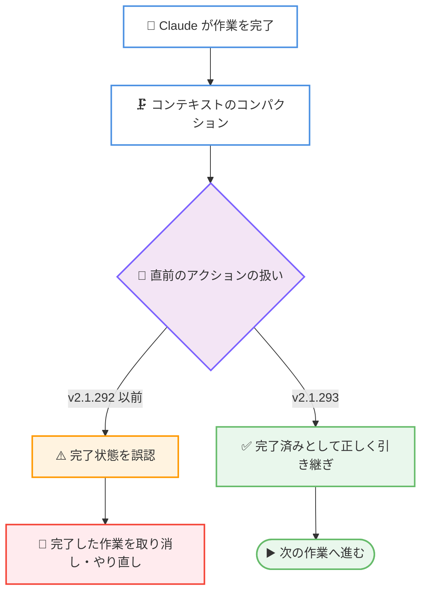

# Claude Code v2.1.293: Claude Haiku 5.5 がデフォルト Haiku モデルに、コンパクション後の作業取り消し問題の修正、MCP メモリリーク修正など 56 件の変更

## メタデータ

| 項目 | 内容 |
|------|------|
| 発表日 | 2026-10-07 (npm 公開日) |
| ソース | Claude Code Changelog |
| カテゴリ | Claude Code / CLI アップデート |
| 公式リンク | https://github.com/anthropics/claude-code/blob/main/CHANGELOG.md |

## 概要

Claude Code v2.1.293 がリリースされた。56 件の変更を含むリリースであり、内訳は追加 (Added) 7 件、修正 (Fixed) 36 件、変更・改善 (Changed / Improved) 13 件 (うち取り消し 2 件) である。

最大のトピックは、新モデル **Claude Haiku 5.5 (`claude-haiku-5-5`) の追加**である。Anthropic API のデフォルト Haiku モデルとなり、**1M トークンのコンテキスト**をサポートし、価格は入力 $0.10 / 出力 $0.50 (100 万トークンあたり、100K トークン超のプロンプトは $0.50 / $2.50) に設定された。

品質面では、**コンテキストのコンパクション後に Claude が自身の直前の作業を「完了済み」と誤認し、完了した作業を取り消したりやり直したりする問題**の修正、HTTP MCP 接続が送信済みリクエストを保持し続ける**メモリリーク**の修正、Bash ツールの単一ファイル閲覧コマンド (cat、head、tail など) で**パススコープのルールとネストした CLAUDE.md が読み込まれない問題**の修正など、エージェントの動作の信頼性に直結する修正が多数含まれる。モッド開発者向けには `subagentStatusLine` への `agentType` の追加や `$.tool.register` の `isDeferred` オプションの追加が行われた。

## 詳細

### 背景

Claude Code v2.1.293 は、92 件の大規模リリースだった 2026-10-06 の v2.1.292 の翌日にリリースされた。新モデル Claude Haiku 5.5 の提供開始にあわせたリリースであると同時に、コンパクション後の作業認識やセッションのバックグラウンド移動 (`←` キー) まわりなど、長時間セッション・マルチセッション運用での信頼性を高める修正が中心となっている。また、Claude in Slack (Claude Tag) と Code Review に関する修正・改善も 9 件含まれる。

### 主な変更点

#### 1. 新モデル: Claude Haiku 5.5 の追加

- **Claude Haiku 5.5 (`claude-haiku-5-5`)** が追加され、Anthropic API のデフォルト Haiku モデルとなった
- **1M トークンのコンテキストウィンドウ**をサポート
- 価格は以下のとおり (100 万トークンあたり)。

| プロンプトサイズ | 入力 | 出力 |
|----------------|------|------|
| 100K トークン以下 | $0.10 | $0.50 |
| 100K トークン超 | $0.50 | $2.50 |

軽量・低価格でありながら 1M コンテキストを持つため、サブエージェントでの大量のファイル読み込みや探索タスク、バックグラウンドの定型処理などに適した選択肢となる。

#### 2. エージェント動作の信頼性修正

- **コンパクション後の作業取り消し問題**: コンテキストのコンパクション直前に Claude 自身が行った最後のアクションを、コンパクション後に「完了済み」と誤って扱い、完了済みの作業を取り消したりやり直したりすることがある問題を修正。長時間セッションでの作業の一貫性に直結する重要な修正である
- **HTTP MCP 接続のメモリリーク**: HTTP MCP 接続が、クローズされるまで送信したすべてのリクエストを保持し続けるメモリリークを修正
- **Bash 経由のファイル閲覧時のルール読み込み**: Claude が Read ツールではなく Bash ツールの単一ファイル向け `cat`、`head`、`tail`、`sed -n`、`grep` コマンドでファイルを閲覧した場合に、パススコープのルールとネストした CLAUDE.md ファイルが読み込まれない問題を修正
- **`SendMessage` ツールの誤案内**: ホスト、権限ルール、`--tools` リストで `SendMessage` ツールが削除されたセッション (再開セッションを含む) で、Claude がサブエージェントへの継続指示やメッセージ送信を促されていた問題を修正
- **サブエージェントのツール可用性の誤案内**: サブエージェントと `--agent` セッションが、自身のツールリストから外れているだけの組み込みツールを「セッション全体で無効」と案内されていた問題を修正

#### 3. モッド・プラグイン開発者向けの追加と修正

- **`subagentStatusLine` に `agentType` を追加**: ステータスラインスクリプトがカスタムサブエージェントの種類を判別できるようになった
- **`$.tool.register` に `isDeferred` を追加**: `false` を指定すると、ツールのスキーマがツール検索の背後ではなく最初からプロンプトに記載される
- **`claude plugin test` と `$.session.append`**: `$.session.append` を呼ぶモッドで `claude plugin test` が失敗する問題を修正。テストは新しい `mock.session` で追記された行を読み戻せる
- **`classic.*` イベントのフックのスキップ**: プラグインフックワーカーの再起動中に、モッドの `classic.*` イベントのフックがスキップされ、settings のフックだけで応答されていた問題を修正
- **`claude plugin eval` の Docker Desktop 問題**: Docker Desktop 導入済みの Mac (`~/.docker/bin` 配下のリンク) で、Bash を許可するすべての実行が拒否される問題を修正。拒否時には資格情報ストアのどの部分がリンクを保持しているかを示すようになった

#### 4. セッション操作・UI の修正

- **`←` によるバックグラウンド移動の改善**: Claude の作業中に送信したメッセージが、`←` でセッションをバックグラウンドへ移動した際に失われる問題を修正。キュー済みメッセージを移動できない場合は、移動せずその旨を表示する。また、プロンプトに未送信テキストがある場合や質問への回答待ちの場合に 10 秒後にバックグラウンド化してしまう問題、`←` 直後の権限プロンプトで Esc や No がターンを停止しない問題も修正
- **`/model` の effort 設定**: ←/→ キーが最高・最低レベルを超えて循環し、誤って Low がモデルのデフォルト effort として保存されることがある問題を修正
- **`claude agents` の bypass permissions**: 同意が `.claude/settings.local.json` や `--settings` ファイルにのみ保存されている場合に、バックグラウンドセッションが bypass permissions を無視する問題を修正。先に同意を求め、bypass を無視するセッションには常設の通知を表示する
- **ペースト処理の修正**: 同じ語で始まり同じ語で終わるペーストテキストが入力扱いで送信される問題、ペースト直後のアクセント入力でスキル名が入力扱いになる問題を修正
- **vim モードの修正**: スペースのみの行での `>>`・`<<` のカーソル位置、Visual mode での行削除後のカーソル位置と `.` の動作を修正
- **`claude purge` の改善**: ファイルやフォルダーを削除できない場合に黙って停止 (exit 0 またはハング) する問題を修正。残りを削除し、削除できなかったものを列挙して exit 1 で終了する

#### 5. 取り消し (Reverted)

- **auto モード拒否メッセージの取り消し**: v2.1.281 で導入された、「拒否は正確なコマンドだけでなく結果 (outcome) に及ぶ」と Claude に伝える変更が取り消された
- **クラウドセッションのウェイクアップ修正の取り消し**: v2.1.290 で導入された、コンテナ再起動で `/loop` のウェイクアップやスケジュールタスクが失われた際に Claude に通知する修正が取り消された。Claude には通知されず、セッションはスリープしたままとなる

#### 6. その他の修正・改善 (抜粋)

- `/tui` が `--chrome` で開始したセッションの Chrome 接続を切断し、`--no-chrome` を無視する問題を修正
- `claude logs` / `stop` / `kill` / `rm` と `claude daemon` 系コマンドが、ログインの期限切れ時にサインアウトさせることがある問題を修正
- 非常に長い Remote Control・クラウドセッションで返信がストリーミングされずブロック単位で表示される問題、資格情報回復のたびに開始履歴が再アップロードされる問題を修正
- `/ultrareview` のアップロードが Linux で一部リポジトリを誤って拒否する問題と、split-index に関する危険なアドバイスを修正
- Windows でステータスライン・フック・シェルコマンドの停止が、同じプロセス ID を持つ無関係なプロセスを終了させることがある問題を修正
- Team / Enterprise 組織の起動改善: ポリシーと管理対象設定の取得が早まり、停滞したリクエストは 3 秒後に再試行される
- Claude in Chrome の改善: ブラウザのタブ報告が遅い場合のページ操作の拒否が減少。クラウドセッションで到達できない場合のメッセージも改善
- アーティファクトの改善: ライブラリを公開から 2 週間以上経過した正確なバージョンに固定するようになった
- claude.ai スキル同期の変更: セッション未使用時のチェック間隔が 10 分から約 40 分に変更
- OpenTelemetry の `claude_code.at_mention` ログがプロンプト読み込みごとにエージェント・MCP リソースイベントを各 100 件までに制限
- **Claude Tag (Claude in Slack)**: Enterprise Grid の共有チャンネルでの誤った未設定表示、管理者によるチャンネル設定変更時の中断、ルーティンの手動実行が別スレッドで実行される問題などを修正。チャンネルルールの上限が 20 から 50 に拡大、アナウンスチャンネルへの参加時にイントロを投稿しないよう変更
- **Code Review**: Add a repository ダイアログが、追加できなかったリポジトリとその理由 (GitHub の書き込み権限不足など) を列挙するよう改善

### 技術的な詳細

#### コンパクション後の作業認識の修正

長時間セッションではコンテキストが上限に近づくと会話が自動的にコンパクション (要約・圧縮) される。v2.1.292 以前は、コンパクション直前の Claude 自身のアクションの完了状態が要約に正しく反映されず、完了済みの作業を未完了と見なして取り消す、あるいはやり直すことがあった。



#### Bash 経由のファイル閲覧とルール読み込み

Claude Code は、Read ツールでファイルを閲覧した際にパススコープのルール (path-scoped rules) やネストした CLAUDE.md を文脈として読み込む。v2.1.292 以前は、Claude が Read ツールの代わりに Bash ツールの `cat`、`head`、`tail`、`sed -n`、`grep` といった単一ファイル向けコマンドでファイルを閲覧すると、この読み込みが行われなかった。v2.1.293 からは、どちらの経路でも同じようにルールが適用されるため、ディレクトリごとの規約やガイドラインの実効性が向上する。

## 開発者への影響

### 対象

- Anthropic API・Claude Code で Haiku モデルを利用しているすべての開発者 (デフォルト Haiku モデルが Claude Haiku 5.5 に変更)
- 長時間セッションでコンパクションが発生する規模の作業を行っている利用者 (作業取り消し問題の修正)
- HTTP MCP サーバーを長時間接続で利用している開発者 (メモリリークの修正)
- パススコープのルールやネストした CLAUDE.md で規約を管理しているチーム (Bash 閲覧時のルール読み込み修正)
- ステータスラインスクリプトやモッドを開発している開発者 (`agentType`、`isDeferred`、`mock.session` の追加)
- `claude agents` やバックグラウンドセッション、`←` でのセッション切り替えを多用する利用者
- Claude in Slack (Claude Tag) と Code Review を利用している組織

### 必要なアクション

- **Haiku モデルの利用者**: デフォルト Haiku モデルが Claude Haiku 5.5 になった。100K トークン超のプロンプトでは価格が $0.50 / $2.50 に上がる 2 段階価格のため、1M コンテキストを活用する場合はコストへの影響を確認する
- **長時間セッションの利用者**: コンパクション後に完了済みの作業が取り消される事象に遭遇していた場合、本バージョンへの更新で解消される見込みである
- **ステータスライン・モッド開発者**: `subagentStatusLine` の `agentType` でカスタムサブエージェントの種類を判別できる。常に利用させたいツールには `$.tool.register` で `isDeferred: false` を指定し、ツール検索を介さず最初からスキーマを提示できる
- **クラウドセッションで `/loop` やスケジュールタスクを使う利用者**: v2.1.290 の修正が取り消され、コンテナ再起動でウェイクアップが失われるとセッションはスリープしたままになる。重要な定期処理には別の監視手段を検討する

### 移行ガイド (該当する場合)

破壊的変更はない。ただし、以下の挙動変更に注意が必要である。

- デフォルトの Haiku モデルが Claude Haiku 5.5 に変わるため、Haiku を明示的なバージョン指定なしで使っている場合は応答特性とコストが変わる
- claude.ai スキル同期のチェック間隔が、セッション未使用時は 10 分から約 40 分に延びた。スキルの編集を素早く反映したい場合はセッションを開く
- エージェントリストと MCP サーバーのモデルへの通知順が変わり、非 ASCII 文字を含む名前は ASCII 名の後にソートされる

## コード例

モッドからツールを登録する際、`isDeferred: false` を指定するとツール検索の背後に置かれず、最初からプロンプトにスキーマが記載される。

```javascript
// モッドのフックモジュールでのツール登録
$.tool.register({
  name: "my_tool",
  description: "常に利用可能にしたいツール",
  // false: ツール検索の背後ではなく、最初からスキーマをプロンプトに記載する
  isDeferred: false,
  /* input schema, handler など */
});
```

`claude plugin test` では、`$.session.append` で追記した行を新しい `mock.session` で読み戻してテストできる。

## 関連リンク

- [Claude Code Changelog (v2.1.293)](https://github.com/anthropics/claude-code/blob/main/CHANGELOG.md)
- [Claude Code v2.1.292 のレポート](./2026-10-06-claude-code-v2-1-292.md)
- [Claude Code 公式ドキュメント](https://code.claude.com/docs)
- [Claude API モデル概要](https://platform.claude.com/docs/en/docs/about-claude/models/overview)
- [Claude Code のプラグイン](https://code.claude.com/docs/en/plugins)

## まとめ

Claude Code v2.1.293 は、56 件 (追加 7 件、修正 36 件、変更・改善 13 件、うち取り消し 2 件) からなるリリースである。最大のトピックは Claude Haiku 5.5 の追加で、1M コンテキストと入力 $0.10 / 出力 $0.50 (100 万トークンあたり) という低価格により、サブエージェントやバックグラウンド処理での軽量モデル活用の幅が広がる。

品質面では、コンパクション後に完了済みの作業を取り消す問題の修正が長時間セッションの信頼性を大きく改善するほか、HTTP MCP のメモリリーク修正、Bash 経由のファイル閲覧でもパススコープのルールと CLAUDE.md が読み込まれる修正など、エージェントの実運用に効く修正が揃った。モッド開発者には `agentType`・`isDeferred`・`mock.session` の追加が、Slack 連携を使う組織には Claude Tag の修正群が、それぞれ着実な改善となる。Haiku 5.5 の 2 段階価格とクラウドセッションのウェイクアップ修正の取り消しには注意しつつ、幅広い利用者に更新を推奨できるリリースといえる。
