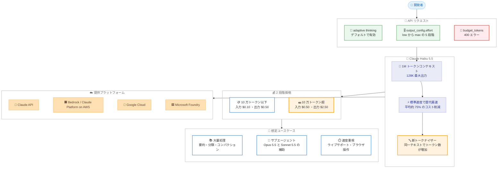

# Claude Haiku 5.5 発表: 最速・最安の小型モデルが平均約 75% のコスト削減と大幅な性能向上を実現

## メタデータ

| 項目 | 内容 |
|------|------|
| 発表日 | 2026-10-07 |
| ソース | Anthropic News / Claude API Release Notes |
| カテゴリ | 新モデル |
| 公式リンク | https://www.anthropic.com/claude-haiku-5-5 |

## 概要

Anthropic は 2026 年 10 月 7 日、Claude 5.5 ファミリー 3 番目のモデルとなる **Claude Haiku 5.5** (モデル ID: `claude-haiku-5-5`) を発表した。公式発表では「最も安く、最速で、最も高性能な小型モデル」と位置付けられ、要約・分類・コンパクションといった大量処理や、ライブカスタマーサポートなどレイテンシ重視の用途向けに設計されている。コンテキストウィンドウは 1M トークン、最大出力は 128K トークンで、adaptive thinking と effort パラメータに対応する。Claude API、Amazon Bedrock、Claude Platform on AWS、Google Cloud、Microsoft Foundry で利用できる。

価格は 2 段階制で、10 万トークン以下のリクエストは入力 $0.10 / 出力 $0.50 per MTok と Haiku 4.5 比で 90% 安く、超過分も 50% 安い。公式発表によると、平均で Haiku 4.5 比約 75% のコスト削減になる。ベンチマークでも GDPval-AA v2.1 で 1620 (Haiku 4.5 は 735)、Terminal-Bench 4.0 で 39.2% (同 0.0%) と、小型モデルとしては大幅な性能向上を示している。

一方で、Claude API リリースノートは「Claude Haiku 4.5 向けに書かれたコードは Claude Haiku 5.5 で壊れる可能性がある」と明記しており、`budget_tokens` による手動 extended thinking の廃止 (400 エラー) など、移行時には破壊的変更への対応が必要となる。

## 詳細

### 背景

Haiku 5.5 は、2026 年 9 月 22 日の Claude Opus 5.5、9 月 28 日の Claude Sonnet 5.5 に続く Claude 5.5 ファミリーの 3 番目のモデルである。Sonnet 5.5 発表時に「数週間以内に公開予定」と案内されていたモデルが、約 1 週間半で提供開始された形となる。

公式発表では、想定用途として以下が挙げられている。

- **大量・コスト重視のタスク**: 要約、コンパクション、データベースクエリ、分類
- **サブエージェント**: Opus 5.5 / Sonnet 5.5 によるコーディング作業の補助役
- **速度重視のタスク**: ライブカスタマーサポート、ブラウザ操作

なお、複雑なエージェント型コーディングには引き続き Sonnet 5.5 / Opus 5.5 が推奨されている。

### 主な変更点

**ベンチマーク結果**: 以下は公式発表ページに掲載された数値である。

| ベンチマーク | Haiku 5.5 | Haiku 4.5 | GPT-6 Luna | Sonnet 5.5 |
|--------------|-----------|-----------|------------|------------|
| GDPval-AA v2.1 (Elo、知識労働) | 1620 | 735 | 1437 | 1840 |
| AA-Briefcase v1.1 (Elo) | 1578 | 614 | 1336 | 1824 |
| OSWorld 2.1 (オフライン) | 72.4% | 15.7% | 48.9% | 83.9% |
| Humanity's Last Exam (ツールなし) | 45.9% | 10.2% | — | 56.9% |
| Humanity's Last Exam (ツールあり) | 57.4% | 18.7% | — | 64.5% |
| Terminal-Bench 4.0 | 39.2% | 0.0% | 16.4% | 70.6% |
| FrontierCode 1.1 Main | 46.4% | — | 42.4% | 52.1% |
| Chartography (ツールなし) | 46.4% | 6.4% | 29.1% | 61.6% |

Sonnet 5.5 の FrontierCode スコアは `xhigh` effort での測定値である。

**速度**: 標準速度では Anthropic のモデル中で歴代最速とされる (脚注によると Opus の Fast Mode には及ばない)。顧客からの報告として以下が紹介されている。

- **Asana**: レイテンシを 30% 超削減し、エージェントターンあたりの推論を最大 2.5 倍高速化
- **Box**: Haiku 4.5 比で約半分のレイテンシを達成しつつ、スコアが 11 ポイント向上

**価格**: 100 万トークンあたりの単価は 2 段階制で、リクエストサイズにより異なる。

| 項目 | Haiku 5.5 (10 万トークン以下) | Haiku 5.5 (10 万トークン超) | Haiku 4.5 | Sonnet 5.5 |
|------|------------------------------|----------------------------|-----------|------------|
| 入力 | $0.10 | $0.50 | $1.00 | $2.00 |
| 出力 | $0.50 | $2.50 | $5.00 | $10.00 |
| キャッシュ書き込み | $0.125 | $0.625 | $1.25 | $2.50 |
| キャッシュ読み取り | $0.01 | $0.05 | $0.10 | $0.10 |

公式発表によると、Haiku 4.5 での全リクエストの 90% は 10 万トークン以下に該当するため、大半のワークロードは 90% のコスト削減となり、平均では約 75% の削減になる。ただし、Sonnet 5.5 / Opus 5.5 と類似した新トークナイザーの採用により、タスクあたりのトークン使用量はわずかに増加する点に注意が必要である。

**新機能**: 主な項目は以下のとおり。

- **1M トークンコンテキストと 128K 最大出力**: Haiku 4.5 の 200K コンテキスト / 64K 出力から大幅に拡張
- **adaptive thinking**: デフォルトで有効となり、応答が `thinking` ブロックから始まる場合がある
- **effort パラメータ**: Haiku クラスで初の調整可能な effort に対応。`low` / `medium` / `high` / `xhigh` / `max` の 5 段階でコストと知能のバランスを選択できる
- **SDK 更新**: Python / TypeScript SDK に computer use / browser use のベータサポートが追加

**顧客の評価例**: 公式発表に掲載された事例は以下のとおり。

- **HubSpot**: CRM 評価スイートで 92.8% (3 回平均) という過去最高スコアを記録
- **AlphaSense**: 400 クエリで 0.84 を記録し、Haiku 4.5 の 0.76 から統計的に有意に改善
- **Cognition**: Devin Fusion のサイドキックとして FrontierCode 66.2 を維持しつつコストとレイテンシを削減

**安全性**: 公式発表に記載された評価結果は以下のとおり。

- アライメント評価のほぼ全項目で Haiku 4.5 から大幅に改善し、不整合行動が減少、悪用への協力度も低下
- サイバーセキュリティのセーフガードは Haiku 4.5 より厳格だが、Sonnet 5.5 より防御的タスクを広く許可する。ペネトレーションテストなどはブロックされる
- 生物学関連のセーフガードは Sonnet 5 / Sonnet 5.5 / Opus 5 と同じ

**同日のその他の発表**: Haiku 5.5 と併せて以下が発表された。

- **Sonnet 5.5 のキャッシュ読み取り値下げ**: $0.20 から $0.10 per MTok へ 50% 値下げ。エージェントタスクで約 20% のコスト削減になる
- **月次 API クレジット**: Max 5x プランは $100/月、Max 20x プランは $200/月、Team プランは最大 $500 (ユーザー間でプール) の API クレジットを付与
- **Claude Managed Agents のネットワーク制限強化**: `limited` ネットワーキング環境の `allowed_hosts` が `web_search` / `web_fetch` にも適用される

### 技術的な詳細

**破壊的変更**: Claude API リリースノートは、Haiku 4.5 向けのコードが Haiku 5.5 で壊れるパターンを次のように挙げている。

1. **手動 extended thinking の廃止**: `budget_tokens` を使った手動 extended thinking は 400 エラーを返す
2. **adaptive thinking がデフォルトで有効**: 応答が `thinking` ブロックから始まる可能性があるため、`text` ブロックのみを前提とした応答処理コードが影響を受ける
3. **トークン数の増加**: トークナイザーの変更により、同一のテキストでもより多くのトークンとしてカウントされる

リリースノートの原文は以下のとおり。

```text
Code written for Claude Haiku 4.5 can break on Claude Haiku 5.5.
Manual extended thinking (budget_tokens) returns a 400 error,
and adaptive thinking is on by default, so a response can begin
with thinking blocks. The same text also counts as more tokens.
```

トークン数の増加は、プロンプトキャッシュのヒット判定、`max_tokens` の設定値、コンテキスト使用量の見積もりなど、トークン数に依存する処理全般に影響する。コスト見積もりやレート制限まわりの計算は再測定が推奨される。

## 開発者への影響

### 対象

- Claude API、Amazon Bedrock、Claude Platform on AWS、Google Cloud、Microsoft Foundry で Haiku 系モデルを利用している開発者
- 要約、分類、データ抽出などの大量処理をコスト重視で運用しているチーム
- Opus 5.5 / Sonnet 5.5 のマルチエージェント構成でサブエージェント用モデルを探しているチーム
- Haiku 4.5 で `thinking: {"type": "enabled", "budget_tokens": ...}` による extended thinking を利用しているコードベース

### 必要なアクション

1. モデル ID を `claude-haiku-5-5` に更新する
2. `budget_tokens` による手動 extended thinking の指定を削除し、adaptive thinking と effort パラメータに移行する
3. 応答をブロックの `type` で判別し、先頭に `thinking` ブロックが来るケースを処理する
4. トークナイザー変更によるトークン数増加を踏まえ、コスト見積もりと `max_tokens` 設定を再確認する
5. effort スイープを実行し、ワークロードごとに最適な effort レベル (`low` から `max`) を特定する
6. 10 万トークン超のリクエストは単価が上がるため、プロンプト設計やキャッシュ戦略でリクエストサイズを最適化する

### 移行ガイド (該当する場合)

**全体の対応表**: 主な差分は以下のとおり。

| 項目 | Haiku 4.5 | Haiku 5.5 |
|------|-----------|-----------|
| モデル ID | `claude-haiku-4-5` | `claude-haiku-5-5` |
| コンテキストウィンドウ | 200K トークン | 1M トークン |
| 最大出力 | 64K トークン | 128K トークン |
| thinking | Extended (手動、`budget_tokens`) | Adaptive (デフォルトで有効) |
| effort パラメータ | 非対応 | `low` / `medium` / `high` / `xhigh` / `max` |
| 入力 / 出力単価 (per MTok) | $1.00 / $5.00 | $0.10 / $0.50 (10 万トークン以下) |
| トークナイザー | 旧世代 | Sonnet 5.5 / Opus 5.5 と類似 (トークン数は増加) |

**破壊的変更への対応: `budget_tokens` を effort に置き換える**

変更前 (Haiku 4.5) は `budget_tokens` で thinking 量を手動制御していた。

```python
client.messages.create(
    model="claude-haiku-4-5",
    max_tokens=16000,
    thinking={"type": "enabled", "budget_tokens": 8000},
    messages=[{"role": "user", "content": "..."}],
)
```

変更後 (Haiku 5.5) では同じ指定が 400 エラーとなるため、adaptive thinking と effort で制御する。

```python
client.messages.create(
    model="claude-haiku-5-5",
    max_tokens=16000,
    # thinking を省略すると adaptive thinking がデフォルトで有効になる
    output_config={"effort": "medium"},
    messages=[{"role": "user", "content": "..."}],
)
```

詳細な移行手順は公式の [移行ガイド](https://platform.claude.com/docs/en/models/haiku-5-5/migration-guide) を参照のこと。

## コード例

```python
import anthropic

client = anthropic.Anthropic()

# 大量処理向け: 低 effort で高速・低コストに分類タスクを実行する
message = client.messages.create(
    model="claude-haiku-5-5",
    max_tokens=1024,
    # budget_tokens は 400 エラーになるため指定しない。
    # adaptive thinking はデフォルトで有効となる。
    output_config={"effort": "low"},
    messages=[
        {
            "role": "user",
            "content": "次の問い合わせを categories のいずれかに分類してください: ...",
        }
    ],
)

# 応答は thinking ブロックから始まる場合があるため、type で判別する
for block in message.content:
    if block.type == "text":
        print(block.text)
    elif block.type == "thinking":
        print("[thinking]", block.thinking)
```

## アーキテクチャ図 (該当する場合)



## 関連リンク

- [Claude Haiku 5.5 発表 (Anthropic News)](https://www.anthropic.com/claude-haiku-5-5)
- [What's new in Claude Haiku 5.5](https://platform.claude.com/docs/en/models/haiku-5-5/whats-new-haiku-5-5)
- [Migrating to Claude Haiku 5.5](https://platform.claude.com/docs/en/models/haiku-5-5/migration-guide)
- [Prompting Claude Haiku 5.5](https://platform.claude.com/docs/en/build-with-claude/prompt-engineering/prompting-claude-haiku-5-5)
- [Thinking](https://platform.claude.com/docs/en/build-with-claude/thinking)
- [Effort](https://platform.claude.com/docs/en/build-with-claude/effort)
- [API credits for Max and Team plans](https://platform.claude.com/docs/en/about-claude/api-credits-for-subscribers)
- [Claude API Release Notes](https://platform.claude.com/docs/en/release-notes/overview)

## まとめ

Claude Haiku 5.5 は、10 万トークン以下のリクエストで入力 $0.10 / 出力 $0.50 per MTok という Haiku 4.5 比 90% 安い価格 (平均では約 75% のコスト削減) を実現しながら、GDPval-AA v2.1 で 1620、OSWorld 2.1 で 72.4% と前世代を大きく上回る性能を示した小型モデルである。1M トークンコンテキスト、128K 最大出力、Haiku クラス初の effort パラメータにより、大量処理からサブエージェント、レイテンシ重視のアプリケーションまで幅広い用途に対応する。

一方、Haiku 4.5 からの移行では破壊的変更への対応が必要となる。`budget_tokens` による手動 extended thinking は 400 エラーとなるため adaptive thinking と effort への移行が必須であり、応答が `thinking` ブロックから始まるケースへの対応も求められる。さらに新トークナイザーにより同一テキストのトークン数が増加するため、コスト見積もりやキャッシュ戦略の再検証を行ったうえで移行することが推奨される。
