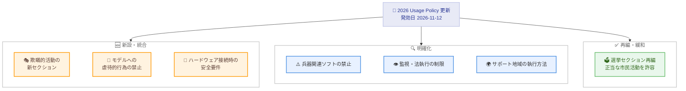

# 2026 年版 Usage Policy (利用ポリシー) の更新

## メタデータ

| 項目 | 内容 |
|------|------|
| 発表日 | 2026-10-08 |
| ソース | Anthropic News |
| カテゴリ | ポリシー / 利用規約 |
| 公式リンク | https://www.anthropic.com/news/2026-usage-policy-update |

## 概要

Anthropic は 2026 年 10 月 8 日、Usage Policy (利用ポリシー) の 2026 年版更新を発表した。新しいポリシーは **2026 年 11 月 12 日に発効**する。今回の更新は、Claude がより長時間かつ自律的な作業を担うようになったことや、2026 年 9 月の脅威インテリジェンス報告書で確認された新たな悪用パターン (影響工作、兵器開発、監視分野) を反映したものであり、更新の大半は既存ルールの明確化を目的としている。

主な変更点として、欺瞞的活動に関する新セクションの追加、選挙関連規定の再編、兵器禁止規定の明確化、監視・法執行に関する明確化、高リスクユースケース要件の明確化 (ハードウェア接続時の新要件を含む)、モデルへの虐待的行為に対する禁止規定の新設、サポート地域ポリシーの執行方法の明確化が含まれる。

## 詳細

### 背景

発表記事によると、今回の更新の背景は以下のとおり。

- Anthropic は毎年、モデルの能力進化と顧客からのフィードバックに応じて利用ポリシーを更新している
- この 1 年で Claude はより長時間かつ自律的な作業を担うようになった
- 2026 年 9 月の脅威インテリジェンス報告書で、影響工作、兵器開発、監視分野での新たな悪用パターンが確認された
- 更新の大半は、新たな規制強化ではなく既存ルールの明確化が目的である

### 主な変更点

#### 1. 欺瞞的活動に関する新セクション

国営メディア、政府のプロパガンダ機関、商業企業が Claude を使って偽アカウント網や捏造ニュースサイトを運営する事例が確認されたことを受け、従来は選挙、詐欺、プライバシー、偽情報の各セクションに分散していた規則を「Do Not Engage in Deceptive Campaigns or Artificial Activity」という新セクションに統合した。政治的・商業的を問わず、発信者の隠蔽、偽アカウントによる拡散、影響工作用のツールやインフラの構築を禁止する。

#### 2. 選挙セクションの再編

選挙関連のセクションは「Do Not Undermine Democratic Processes」に改称され、有権者の欺瞞や選挙妨害 (候補者や投票方法に関する虚偽情報の拡散、候補者・選挙管理者のなりすまし、投票抑制など) に焦点を絞った内容となった。

一方で緩和もある。個別化された投票・選挙運動ターゲティングの一律禁止は撤廃された。これは、非営利団体による多言語での有権者向け情報作成や、選挙管理者による投票是正通知の送付といった正当な市民活動が従来の規則で妨げられていたためである。ただし、欺瞞や個人データの悪用を伴うターゲティングは、欺瞞的キャンペーン、監視、プライバシーの各セクションで引き続き禁止される。

#### 3. 兵器禁止規定の明確化

兵器の誘導・制御ソフトウェアを構築しようとする試みが確認されたことを受け、兵器を機能させるソフトウェアやコンポーネントの開発、ドローンや自律走行体の武装化も禁止対象であることを明記した。これは従来の執行実務を反映したものであり、新たな規制強化ではないとされている。

#### 4. 監視・法執行に関する明確化

政治的反体制派の特定・追跡を目的とした監視システムの構築に AI が使われる傾向が報告されたことを受け、以下が明確化された。

- 同意なき人物追跡は、リアルタイムか収集済みデータの分析かを問わず禁止
- 法執行・刑事司法手続きにおいて、誰を捜査・逮捕・起訴するかの決定や推奨に Claude を使用することを禁止
- 監視用ツールの構築・改良も禁止

一方、本人が同意した追跡 (不正監視など)、コンテンツモデレーション、ジャーナリズム、法律調査は許容される用途として挙げられている。

#### 5. 高リスクユースケース要件の明確化

健康、法的権利、財務、生計、必須サービスへのアクセスに影響する用途では、以下が引き続き必要となる (要件自体に変更はない)。

- Claude の推奨内容を審査・変更する権限を持つ資格ある「人間の関与 (human in the loop)」
- 影響を受ける個人への AI 使用の告知

今回の更新では、対象となる推奨の種類と対象外のものがリスト化して明示された。

また、Model Hardware Standard (研究プレビュー) の開始に伴い、**負傷を引き起こしうる自律的な物理動作を行うハードウェアに Claude を接続する場合の要件**が新たに追加された。

- 資格ある操作者が機器を監視し、必要に応じて停止できること
- Claude が切断された場合も機器が安全状態を保持できること

#### 6. モデルへの虐待的行為への対応

持続的かつ無意味な虐待的・残酷な行為に対する禁止規定が新設された。これは目的なく繰り返し残酷に接する極端な場合のみに適用され、通常のユーザーの不満表明、反論、ダークな創作テーマ、モデルのテストや研究には適用されない。Claude.ai と Claude Code で持続的に虐待的なユーザーとの会話をモデルが終了できる既存の仕組みと整合しており、会話終了機能が引き続き主要な執行手段となる。

#### 7. サポート地域ポリシーの明確化

昨年導入された、非サポート地域に本社を置く主体に過半数所有される企業へのアクセス制限について、執行方法が明確化された。禁止対象は以下のとおり。

- 非サポート地域に物理的に所在する人
- 非サポート地域で法人設立または本社を置く主体
- 非サポート地域の個人・主体に過半数所有または支配される主体

### 変更点の全体像

## 開発者への影響

### 対象

- Claude API、Claude.ai、Claude Code を利用するすべてのユーザーと開発者
- 特に以下の分野に関わる開発者・組織。
  - 選挙・政治関連の情報提供サービス
  - 健康、法的権利、財務、生計、必須サービスなどの高リスク分野
  - 物理的なハードウェア (ロボット、ドローンなど) と Claude を接続するシステム
  - 法執行・公共安全分野のソリューション

### 必要なアクション

- **2026 年 11 月 12 日の発効日**までに、新しい利用ポリシーの全文を確認する
- 高リスクユースケースに該当する場合、「人間の関与 (human in the loop)」と AI 使用の告知が実装されているか確認する
- 負傷を引き起こしうる自律的物理動作を行うハードウェアに Claude を接続している場合、操作者による監視・停止機能と、切断時のフェイルセーフ (安全状態の保持) を実装する
- 選挙関連の正当な市民活動 (多言語での有権者向け情報作成など) を行う組織は、緩和された規定の下で利用可能かを再確認する

### 移行ガイド (該当する場合)

発表記事内に具体的な移行手順の記載はない。詳細な適用条件については、公式の利用ポリシー本文 (https://www.anthropic.com/legal/aup) での確認が必要。

## 関連リンク

- 公式発表: https://www.anthropic.com/news/2026-usage-policy-update
- Usage Policy 本文: https://www.anthropic.com/legal/aup
- サポート地域ポリシー: https://www.anthropic.com/supported-countries

## まとめ

2026 年版 Usage Policy の更新は、Claude の自律性向上と実際に確認された悪用パターンに対応するもので、大半は既存ルールの明確化である。注目すべき点は、(1) 欺瞞的活動を包括的に禁止する新セクションの導入、(2) 正当な市民活動を妨げないための選挙関連規定の緩和、(3) ハードウェア接続時の安全要件の新設、(4) モデルへの虐待的行為に関する禁止規定の新設である。新ポリシーは 2026 年 11 月 12 日に発効するため、該当するユースケースを持つ開発者・組織は発効日までにポリシー本文を確認し、必要な対応を行うことが推奨される。
