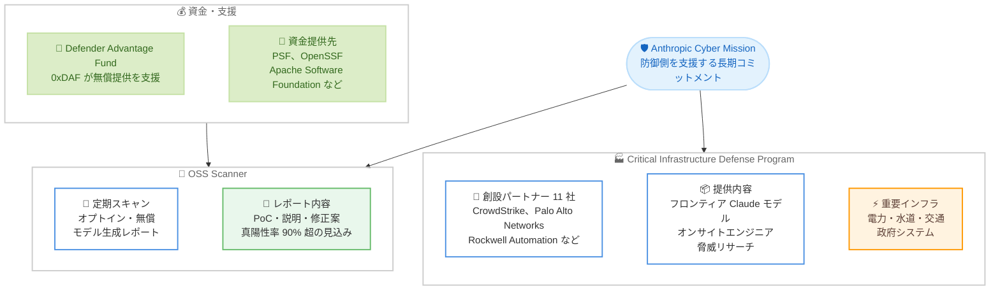

# Anthropic Cyber Mission の発表: 重要インフラとオープンソースソフトウェアを守る長期的取り組み

## メタデータ

| 項目 | 内容 |
|------|------|
| 発表日 | 2026-10-08 |
| ソース | Anthropic News |
| カテゴリ | 公式発表 / サイバーセキュリティ / 社会的インパクト |
| 公式リンク | https://www.anthropic.com/news/anthropic-cyber-mission |

## 概要

Anthropic は 2026 年 10 月 8 日、「Anthropic Cyber Mission」を発表した。これは「誰もが依存するシステムを守る」ための長期的なコミットメントであり、ツール・研究・リソースの提供を通じて防御側を支援するものである。初期の重点領域は 2 つで、電力網・水道・交通・政府システムなどの**重要インフラ**と、脆弱性の発見・パッチ適用・コード強化を対象とする**オープンソースソフトウェア (OSS)** である。

具体的な取り組みとして、Accenture、Booz Allen、CrowdStrike、Palo Alto Networks、Rockwell Automation など 11 社を創設パートナーとする「Critical Infrastructure Defense Program (CIDP)」と、登録した OSS プロジェクトに Anthropic の最も強力なモデルによる定期スキャンを無償提供する「OSS Scanner」が開始される。本発表は、同週に発表されたサイバー検証プログラム (CVP) の拡大 ([関連レポート](./2026-10-06-cyber-verification-program.md)) に続くものであり、Project Glasswing から得られた教訓を踏まえた防御支援の本格展開と位置づけられる。

## 詳細

### 背景

フロンティア AI モデルは、脆弱性の悪用やサイバー作戦に悪用されうる一方、多くのシステムは依然として無防備なままであり、国家支援型の攻撃者は各セクターで足場を築くために何年も費やしてきた。

Anthropic は先行プログラム「Project Glasswing」から重要な教訓を得たとしている。パートナーは多数の脆弱性を発見したものの、リスク低減は十分ではなかった。すなわち、**バグを見つけることは容易だが、検証・優先順位付け・修正は依然として困難**であり、発見から修正までに数か月を要することが多かった。Glasswing は同週に拡大版 Cyber Verification Program に統合され、防御側による最先端モデルへのアクセスが拡大されている。

Anthropic は「2 年以内に AI は防御側に有利に働く」と予測する一方、短期的には攻撃コストが低下する一方で修正作業は遅く人手に依存したままであると指摘する。一部の OT (運用技術) 系の修正には「数十年かかる可能性がある」とも述べており、この時間差を埋めるために防御側への集中的な支援が必要というのが本ミッションの動機である。

### 主な内容

#### プログラム 1: Critical Infrastructure Defense Program (CIDP)

重要インフラの運用技術 (OT) は、パッチ適用のためにオフラインにできないことが多く、機器はプロプライエタリで、ミスがプラント停止につながりうるという固有の難しさを持つ。CIDP は、フロンティア Claude モデル、オンサイトのエンジニア、脅威リサーチを信頼されたプロバイダーに提供するプログラムである。

- **創設パートナー 11 社**: Accenture、Booz Allen、CrowdStrike、Deloitte、Dragos、Hitachi、Insane Cyber、Nozomi Networks、Palo Alto Networks、PwC、Rockwell Automation
- 取り組みはすでに進行中で、第 1 フェーズでは小規模なコホートで効果的な戦略を学習する。関心のある企業は登録フォームから申し込める
- 2026 年 6 月に開始した州・地方・部族・準州政府向けプログラム以降、Anthropic は**米国の全州の半数以上**と主要な公共インフラ運営者を支援してきた (コードスキャン、パッチ適用、インシデント対応、レッドチーミング)

パートナーからは次のようなコメントが寄せられている。

- **Rockwell Automation (Tony Baker 氏)**: AI は「責任を持って適用され、厳格に検証され、安全性と信頼性を最優先に展開されるべき」
- **Palo Alto Networks (Sam Rubin 氏)**: 攻撃者は「マシンスピードでエクスポージャーを悪用する」。目標は「エクスポージャーが実害になる前に攻撃経路を閉じること」
- **CrowdStrike (Daniel Bernard 氏)**: 「マシンスピードの脅威にはマシンスピードの防御が必要」
- **Booz Allen (Andrew Turner 氏)**: OT は「自律型 AI による攻撃の次のフロンティア」
- **Insane Cyber (Dan Gunter 氏)**: Claude は「どのチームでも処理しきれない量のデータを、どのチームでも配置しきれない数のサイトで」扱える

#### プログラム 2: OSS Scanner

Google の OSS-Fuzz に着想を得た、**オプトイン方式の無償サービス**である。登録したオープンソースプロジェクトは、Anthropic の最も強力なモデルによる定期スキャンを受けられる。

- 各レポートには、概念実証 (PoC)、説明、および可能な場合は修正案が含まれる
- レポートは**人間のレビューを経ないモデル生成**であり、迅速な反面、深刻度の誤判定などの不正確さを含む可能性がある。真陽性率は **90% 超**が見込まれている
- 大量の報告を処理できるプロジェクト向けであり、それ以外のプロジェクトは引き続き CVD (協調的脆弱性開示) ポリシーに基づく人間による検証済みの報告を受け取る
- 今後の目標として、報告のより迅速な提供、トリアージとパッチ適用の自動化、セキュアなアーキテクチャとコード書き換えに関する研究が挙げられている

資金面では、Python Software Foundation、Alpha-Omega と OpenSSF (Linux Foundation 経由)、Apache Software Foundation に加え、脆弱性報告のコーディネーターである Akrites と Gold Eagle への資金提供が行われた。2026 年 8 月に発足した **Defender Advantage Fund (0xDAF)** がパイロットの資金を提供し、OSS Scanner の無償提供を支えている。また、OSS メンテナは「Claude for Open Source」を通じて無償の Claude Max サブスクリプションを申請できる。

### 技術的な詳細

本ミッションに関連するモデル・製品として、Claude のフロンティアモデル (記事中では Claude Mythos 5 への言及がある)、Claude Security、Cyber Verification Program、OSS Scanner、および Anthropic のプラットフォーム上でパートナーが構築する防御製品が挙げられている。

OSS Scanner のレポート生成は人間のレビューを介さない完全なモデル駆動型であり、スケーラビリティと引き換えに一定の誤りを許容する設計である点が特徴的である。真陽性率 90% 超という見込みは示されているものの、深刻度評価の誤りなどはありうるため、受け取り側のトリアージ能力が参加の前提となる。なお、OSS Scanner の登録ページは red.anthropic.com 上で提供されるとされているが、正確な URL は公式発表ページでの確認が必要である。CIDP の登録フォームの URL についても同様に確認が必要である。

Anthropic は成功の基準を「攻撃下でも水道・電力・交通・通信が稼働し続け、悪用可能な経路が減り、復旧が速くなること」と定義し、達成には数年を要するとの見通しを示している。今後は CIDP のパートナーとセクターの拡大、失敗事例を含む学びの共有、他の AI 開発者・セキュリティ企業・政府との協力、サプライチェーンセキュリティや新しいソフトウェア・防御研究への拡張が計画されている。

## アーキテクチャ図

## 開発者への影響

### 対象

- **重要インフラ運営者・OT セキュリティ企業**: CIDP の第 1 フェーズは小規模コホートで進行中だが、関心のある企業は登録フォームから参加希望を表明できる
- **オープンソースメンテナ**: 大量の脆弱性報告を処理できるプロジェクトは OSS Scanner に登録することで、フロンティアモデルによる定期スキャンを無償で受けられる。処理能力が限られるプロジェクトは、従来どおり CVD ポリシーに基づく人間による検証済みの報告を受け取る
- **米国の州・地方政府**: 2026 年 6 月開始の政府向けプログラムの延長として、コードスキャン、パッチ適用、インシデント対応、レッドチーミングの支援を受けられる
- **セキュリティ研究者・防御組織**: より広いモデルアクセスが必要な場合は、拡大版 Cyber Verification Program ([関連レポート](./2026-10-06-cyber-verification-program.md)) の各階層への申請が入口となる
- **一般の開発者**: 直接的な影響はないが、依存している OSS の脆弱性修正が加速することで、サプライチェーン全体のセキュリティ向上という間接的な恩恵が期待される

### 必要なアクション

一般ユーザーに必須のアクションはない。該当する組織には以下が推奨される。

- 重要インフラ関連企業は、公式発表ページに記載の登録フォームから CIDP への関心を登録する
- OSS プロジェクトのメンテナは、OSS Scanner への登録を検討する。その際、モデル生成レポート (人間のレビューなし) を自力でトリアージできる体制があるかを事前に評価する
- OSS メンテナは、Claude for Open Source を通じた無償の Claude Max サブスクリプションの申請を検討する
- セーフガードの緩和が必要な防御的業務を行う組織は、Cyber Verification Program への申請を検討する

### 移行ガイド (該当する場合)

本発表は新規プログラムの開始であり、既存ユーザーに移行作業は発生しない。なお、Project Glasswing はすでに拡大版 CVP に統合済みであり、既存メンバーの扱いは [CVP 拡大のレポート](./2026-10-06-cyber-verification-program.md)を参照のこと。

## 関連リンク

- [公式発表: Introducing the Anthropic Cyber Mission](https://www.anthropic.com/news/anthropic-cyber-mission)
- [関連発表: Expanding the Cyber Verification Program](https://www.anthropic.com/news/cyber-verification-program)
- [関連レポート: サイバー検証プログラム (CVP) の拡大](./2026-10-06-cyber-verification-program.md)
- [Anthropic Red Team (OSS Scanner 登録ページの掲載元)](https://red.anthropic.com)
- [Anthropic News](https://www.anthropic.com/news)

## まとめ

Anthropic Cyber Mission は、同週の CVP 拡大が「誰にどのモデルアクセスを許可するか」という能力管理の枠組みだったのに対し、「防御側が実際にシステムを守り切るための実行支援」に踏み込んだ点に意義がある。Project Glasswing で明らかになった「発見は容易だが修正は困難」というボトルネックに対し、CIDP はオンサイトエンジニアと脅威リサーチを組み合わせた伴走型支援で OT 環境特有の制約に対応し、OSS Scanner は人間のレビューを介さないモデル生成レポートによって修正サイクルの高速化を狙う。

11 社の大手セキュリティ・インフラ企業を創設パートナーに迎えた体制や、米国の全州の半数以上への支援実績は、本ミッションが構想段階ではなくすでに運用フェーズにあることを示している。一方で、Anthropic 自身が成功には数年を要すると認めており、OSS Scanner の真陽性率 90% 超という見込みが実運用でどこまで維持されるか、CIDP の小規模コホートがどのように拡大されるかなど、今後の進捗報告が注目される。失敗事例を含む学びの共有や他の AI 開発者との協力も計画されており、業界全体の防御力向上への波及効果が期待される。
