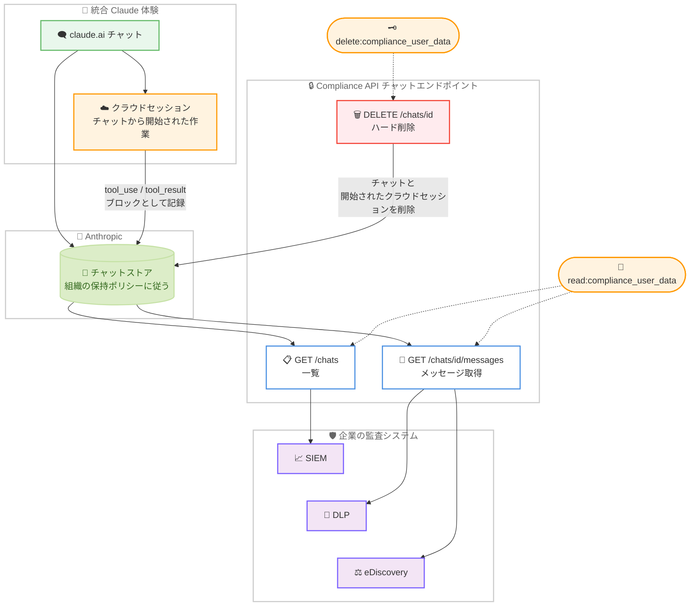

# Compliance API のチャットエンドポイントが統合 Claude 体験のチャットに対応 (ベータ)

## メタデータ

| 項目 | 内容 |
|------|------|
| 発表日 | 2026-10-08 |
| ソース | Claude Developer Platform Release Notes |
| カテゴリ | Claude API / エンタープライズ / コンプライアンス |
| 公式リンク | https://platform.claude.com/docs/en/release-notes/overview |

## 概要

Anthropic は 2026 年 10 月 8 日、Claude Developer Platform のリリースノートで、Compliance API のチャットエンドポイントが統合 Claude 体験 (unified Claude experience) のチャットも返すようになったことを発表した。この機能は Claude Enterprise 組織向けのベータとして提供され、既存の Compliance Access Key でそのまま利用できる。

公式ドキュメントによると、統合 Claude 体験のチャットは他のチャットと同じ形式で返され、クラウド上のセッションに引き継がれたチャットも 1 つのチャットとして取得できる。クラウドセッションで Claude が実行した作業は、各メッセージの `content` 内の `tool_use` ブロックと `tool_result` ブロックとして現れる。

これまで Compliance API は、claude.ai のチャット (チャットエンドポイント) と、Cowork や Claude Code などアプリのセッション (セッションエンドポイント) を別々の経路でカバーしてきた。今回の対応により、チャットから始まりクラウドセッションに続く「統合 Claude 体験」のやり取りが、チャットエンドポイント側の監査カバレッジに含まれた。

## 詳細

### 背景

Compliance API は、Claude Enterprise 組織のコンプライアンス担当者向けに、eDiscovery エクスポート、DLP (データ損失防止) 連携、アカウント削除対応のためのデータアクセスを提供する API である。大きく分けて以下の 2 系統のエンドポイントがある。

| 系統 | 対象 | 主なエンドポイント |
|------|------|------------------|
| チャットエンドポイント | claude.ai のチャット、ファイル、プロジェクト | `/v1/compliance/apps/chats` 系 |
| セッションエンドポイント | Cowork、Claude Code などのセッショントランスクリプト | `/v1/compliance/apps/sessions` 系 |

セッションエンドポイント側は 2026 年 8 月以降、Cowork / Claude Code (安定)、Claude Science / Claude for Microsoft 365 / Claude in Chrome (ベータ) へと段階的にカバレッジを拡大してきた。経緯は以下の関連レポートを参照。

- [Compliance API ローカルセッション対応 (2026-08-11)](2026-08-11-compliance-api-local-sessions.md)
- [Compliance API セッションエンドポイント GA (2026-08-26)](2026-08-26-compliance-api-sessions-ga.md)
- [Compliance API の Claude in Chrome 対応 (2026-09-18)](2026-09-18-compliance-api-claude-in-chrome.md)

今回の発表はチャットエンドポイント側の拡張である。統合 Claude 体験では、ユーザーが claude.ai のチャットから作業を開始し、その作業がクラウド上のセッションに引き継がれる。このようなチャットが、従来の claude.ai チャットと同様にチャットエンドポイントから取得できるようになった。

### 主な変更点

#### 統合 Claude 体験のチャット取得 (ベータ)

公式ドキュメントは次のように記述している。

> Chats in the unified Claude experience are returned by these endpoints like any other chat: a chat that continues in a session in the cloud comes back as one chat. The work Claude does there appears in each message's `content` as `tool_use` blocks (the tool's `name` and `input`) and `tool_result` blocks (its output, matched by `tool_use_id`). Coverage of these chats is in beta.

ポイントは以下の 3 点である。

1. **1 つのチャットとして返る**: クラウドセッションに続くチャットも、分割されずに 1 つのチャットオブジェクトとして取得できる
2. **作業内容はツールブロックで表現される**: クラウドセッションで Claude が行った作業は、メッセージの `content` 内の `tool_use` ブロック (ツールの `name` と `input`) と `tool_result` ブロック (`tool_use_id` で対応付けられた出力) として現れる
3. **ベータ提供**: このカバレッジは Claude Enterprise 組織向けのベータであり、仕様が変わる可能性がある

対象となる既存のチャットエンドポイントは以下のとおり。

| エンドポイント | 役割 |
|---------------|------|
| `GET /v1/compliance/apps/chats` | チャットメタデータの一覧 |
| `GET /v1/compliance/apps/chats/{chat_id}/messages` | 単一チャットの全メッセージ取得 |
| `DELETE /v1/compliance/apps/chats/{chat_id}` | チャットのハード削除 |

#### 追加設定は不要

リリースノートは「with your existing Compliance Access Key」と明記している。既存の Compliance Access Key (`sk-ant-api01-...`) と `read:compliance_user_data` スコープを使ったインテグレーションであれば、統合 Claude 体験のチャットは一覧とメッセージ取得に自動的に現れる。新しいキー、スコープ、設定は不要である。

#### 削除時の挙動: クラウドセッションも削除される

削除については、公式ドキュメントが統合 Claude 体験のチャット固有の挙動を明記している。

> For a chat in the unified Claude experience, Delete chat also deletes the sessions in the cloud that were started for the chat. It does not delete sessions that those sessions started.

- Delete chat エンドポイントでチャットを削除すると、そのチャットのために開始されたクラウド上のセッションも削除される
- ただし、それらのセッションがさらに開始したセッションは削除されない
- 削除は即時かつ永久であり、復元はできない。削除には `delete:compliance_user_data` スコープが別途必要である

### 技術的な詳細

#### チャットオブジェクトとメッセージの形式

統合 Claude 体験のチャットは、他のチャットと同じ `claude_chat_` 接頭辞のオブジェクトとして返る。メッセージ取得エンドポイントは、チャットのメタデータと `created_at` でソートされた `chat_messages` 配列を返す。各メッセージには以下が含まれ得る。

- `content`: テキストブロックに加え、クラウドセッションでの作業を表す `tool_use` / `tool_result` ブロック
- `files`: ユーザーが添付したファイル (主にユーザーメッセージ)
- `generated_files`: ツール使用により Claude が生成したバイナリファイル (主にアシスタントメッセージ)
- `artifacts`: Claude が生成または更新したバージョン管理付きドキュメント

ファイルやアーティファクトの実体は、各エントリの `id` (アーティファクトは `version_id`) を対応するコンテンツエンドポイントに渡してダウンロードする。

#### エクスポートのベストプラクティス (変更なし)

一覧エンドポイントの仕様に変更はない。公式ドキュメントが推奨するエクスポート方法は従来どおりである。

- `user_ids[]` を付けない組織全体スコープで `order_by=updated_at` を指定し、1 つのページネーションループで新規チャット、新しいメッセージが付いたチャット、claude.ai で削除されたチャットをまとめて取得する
- 最終ページの `last_id` を保存し、次回実行時に `after_id` として渡して差分を取得する
- チャットが更新されるとカーソルより先に再出現するため、チャット `id` をキーとした冪等な処理を実装する
- `updated_at.*` の時間フィルターは `order_by=updated_at` と、`created_at.*` は既定の `order_by=created_at` と組み合わせる必要がある

#### ユーザーが claude.ai で削除したチャットの扱い (変更なし)

ユーザーが claude.ai 上でチャットを削除した場合、メッセージ内容、添付ファイル、生成ファイル、アーティファクトは削除される。Compliance API は該当チャットを `deleted_at` が設定された状態 (名前は空) で一覧に返し、メッセージは内容なしで返す。Compliance API 経由または保持期間満了によりハード削除されたチャットは取得できない。

#### 認証とスコープ (変更なし)

- 取得には Compliance Access Key の `read:compliance_user_data` スコープが必要
- 削除エンドポイントには `delete:compliance_user_data` スコープが追加で必要
- チャット、ファイル、プロジェクト系のエンドポイントは Admin API キー (`sk-ant-admin01-...`) では利用できず、403 Forbidden が返る

## 管理者・コンプライアンス担当者への影響

### 対象

- **コンプライアンス / eDiscovery 担当者**: 統合 Claude 体験でのやり取り (チャットとクラウドセッションでの作業) を証跡として取得する必要がある担当者
- **セキュリティチーム**: SIEM や DLP にチャット内容を取り込み、機微情報を扱うやり取りを監視する担当者
- **Compliance API のインテグレーション実装者**: チャットエクスポートパイプラインを保守する開発者
- **Claude Enterprise 管理者**: 統合 Claude 体験の組織展開に際して、監査カバレッジを整理する管理者

### 必要なアクション

1. **既存インテグレーションの確認**: 追加設定は不要だが、既存のチャットエクスポートに統合 Claude 体験のチャットが流入し始める。`tool_use` / `tool_result` ブロックを含むメッセージを正しく処理できるか、パーサーや表示系を確認する
2. **ツールブロックの監査上の位置づけの整理**: クラウドセッションでの作業はツールブロックを通じて見える範囲に限られる。何がトランスクリプトに現れ、何が現れないかを監査要件の関係者と確認する
3. **削除運用の見直し**: 統合 Claude 体験のチャットを Delete chat で削除すると、そのチャットのために開始されたクラウドセッションも削除される一方、それらのセッションが開始したセッションは残る。削除手順書にこの挙動を反映する
4. **ベータであることの考慮**: 本番の監査要件に組み込む場合は、ベータ提供であり仕様が変わる可能性があるという前提を明示する

### 移行ガイド (該当する場合)

既存のチャットエンドポイントインテグレーションへの破壊的変更はない。エンドポイント URL、認証、フィルター、ページング、レスポンス形式はすべて従来どおりで、統合 Claude 体験のチャットが結果に加わるのみである。メッセージの `content` に `tool_use` / `tool_result` ブロックが含まれる点だけ、処理系の対応状況を確認しておく。

## コード例

### チャット一覧の増分エクスポート (組織全体、更新日時順)

```bash
# 組織全体のチャットを updated_at 順で取得する。統合 Claude 体験の
# チャットも同じ一覧に自動的に含まれる
curl --fail-with-body -sS -G \
  "https://api.anthropic.com/v1/compliance/apps/chats" \
  --header "x-api-key: $ANTHROPIC_COMPLIANCE_ACCESS_KEY" \
  --header "anthropic-version: 2023-06-01" \
  --data-urlencode "order_by=updated_at" \
  --data-urlencode "updated_at.gte=2026-10-08T00:00:00Z" \
  --data-urlencode "limit=100"
```

### チャットメッセージの取得 (ツールブロックを含む)

```bash
# 統合 Claude 体験のチャットでは、クラウドセッションでの作業が
# content 内の tool_use / tool_result ブロックとして返る
chat_id="claude_chat_01H5CWunD7RpVJ5bHa8RCkja"

curl --fail-with-body -sS \
  "https://api.anthropic.com/v1/compliance/apps/chats/$chat_id/messages" \
  --header "x-api-key: $ANTHROPIC_COMPLIANCE_ACCESS_KEY" \
  --header "anthropic-version: 2023-06-01"
```

### ツールブロックの処理例

```python
# メッセージの content からテキストとツールの作業内容を振り分ける。
# 未知のブロックタイプは落とさずに通過させる (前方互換)
def extract_blocks(message: dict) -> dict:
    texts, tool_uses, tool_results, unknown = [], [], [], []
    for block in message.get("content", []):
        block_type = block.get("type")
        if block_type == "text":
            texts.append(block["text"])
        elif block_type == "tool_use":
            # クラウドセッションで実行されたツール呼び出し (name と input)
            tool_uses.append({"name": block.get("name"), "input": block.get("input")})
        elif block_type == "tool_result":
            # tool_use_id で対応するツール呼び出しに紐づく出力
            tool_results.append({"tool_use_id": block.get("tool_use_id")})
        else:
            unknown.append(block_type)
    return {
        "texts": texts,
        "tool_uses": tool_uses,
        "tool_results": tool_results,
        "unknown": unknown,
    }
```

## アーキテクチャ図



## 関連リンク

- [Claude Developer Platform Release Notes](https://platform.claude.com/docs/en/release-notes/overview)
- [Compliance API](https://platform.claude.com/docs/en/manage-claude/compliance-api)
- [Retrieve and delete chats, files, and projects](https://platform.claude.com/docs/en/manage-claude/compliance-content-data)
- [List chats (API リファレンス)](https://platform.claude.com/docs/en/api/compliance/apps/chats/list)
- [Get chat messages (API リファレンス)](https://platform.claude.com/docs/en/api/compliance/apps/chats/messages/list)
- [Delete chat (API リファレンス)](https://platform.claude.com/docs/en/api/compliance/apps/chats/delete)
- [Set up the Compliance API](https://platform.claude.com/docs/en/manage-claude/compliance-api-access)
- [Compliance API reference](https://platform.claude.com/docs/en/api/compliance/apps)
- [関連レポート: Compliance API ローカルセッション対応 (2026-08-11)](2026-08-11-compliance-api-local-sessions.md)
- [関連レポート: Compliance API セッションエンドポイント GA (2026-08-26)](2026-08-26-compliance-api-sessions-ga.md)
- [関連レポート: Compliance API の Claude in Chrome 対応 (2026-09-18)](2026-09-18-compliance-api-claude-in-chrome.md)

## まとめ

2026 年 10 月 8 日の発表は、Compliance API のチャットエンドポイントのカバレッジを統合 Claude 体験のチャットに広げるものである。

- **統合 Claude 体験のチャットが監査カバレッジに加わった**: クラウド上のセッションに続くチャットも 1 つのチャットとして取得でき、クラウドセッションでの作業はメッセージ内の `tool_use` / `tool_result` ブロックとして現れる。Claude Enterprise 組織向けのベータ提供である
- **追加設定は一切不要である**: 既存の Compliance Access Key と `read:compliance_user_data` スコープでそのまま利用でき、新しいチャットは既存のエクスポートループに自動的に流入する
- **削除はクラウドセッションにも及ぶ**: Delete chat は、そのチャットのために開始されたクラウドセッションも削除する。ただし、それらのセッションが開始したセッションは削除されないため、削除運用ではこの境界を把握しておく必要がある
- **チャットとセッションの両系統でカバレッジ拡大が続いている**: セッションエンドポイント側は 8 月以降 5 プロダクトへ拡大しており、今回はチャットエンドポイント側が統合 Claude 体験へ拡張された。ベータの位置づけを踏まえつつ、パイプラインの前方互換な実装を維持することが引き続き要点となる
