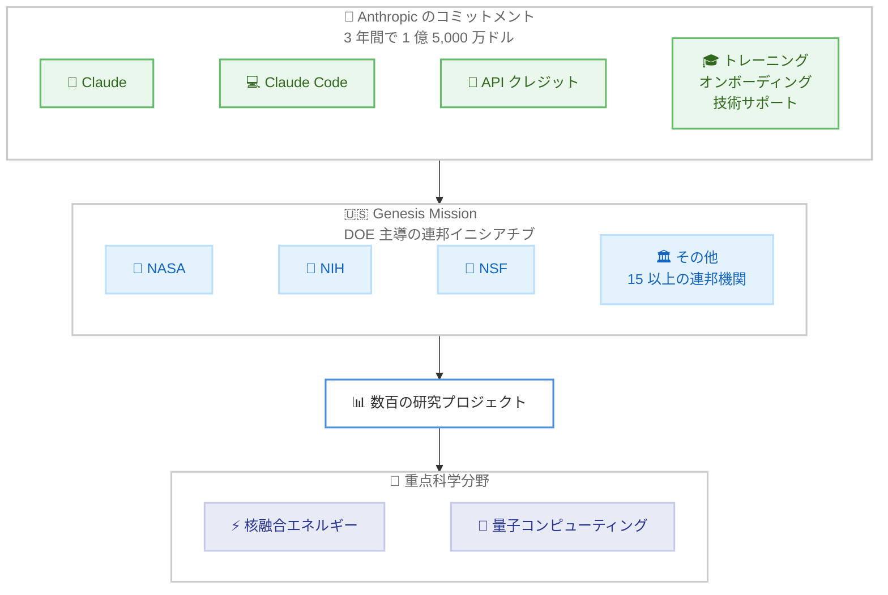

# 米国の科学的発見への貢献を拡大: Genesis Mission に 3 年間で 1 億 5,000 万ドルをコミット

## メタデータ

| 項目 | 内容 |
|------|------|
| 発表日 | 2026-10-08 |
| ソース | Anthropic News |
| カテゴリ | 公式発表 / 政府連携 / 科学研究支援 |
| 公式リンク | https://www.anthropic.com/news/genesis-mission-commitment |

## 概要

Anthropic は 2026 年 10 月 8 日、ワシントン DC でホワイトハウス科学技術政策局 (OSTP) が主催した「Science: A New Golden Age Summit」において、米国エネルギー省 (DOE) 主導の連邦イニシアチブ「Genesis Mission」への新たなコミットメントを発表した。3 年間で 1 億 5,000 万ドルを拠出し、NASA、国立衛生研究所 (NIH)、国立科学財団 (NSF) を含む、Genesis Mission に参加する 15 以上の連邦機関に Claude を提供する。

このコミットメントには、数百の Genesis Mission 研究プロジェクトへの Claude、Claude Code、API クレジットの提供に加え、核融合エネルギーや量子コンピューティングといった重点科学分野での各機関・国立研究所との緊密な連携、科学者向けのトレーニング・オンボーディング・技術サポートが含まれる。

## 詳細

### 背景

Genesis Mission は、AI を活用して科学的・技術的発見を加速することを目的とした、米国エネルギー省 (DOE) 主導の連邦政府イニシアチブである。Anthropic と DOE および Genesis Mission とのパートナーシップは 2025 年 12 月に初めて発表されており、それ以降、Anthropic は DOE と協力して国立研究所の科学者への Claude 展開を進めてきた。具体例として、ローレンス・リバモア国立研究所 (Lawrence Livermore National Laboratory) における Claude for Enterprise の拡大が挙げられる。

今回の発表は、このパートナーシップを土台として、支援の対象を DOE 以外の連邦機関にも広げるものである。Anthropic は、AI が科学的発見に深く前向きな影響を与えうるという、ホワイトハウスの「Science: A New Golden Age」で示された見解に賛同する立場を表明している。

### 主な内容

#### コミットメントの概要

| 項目 | 内容 |
|------|------|
| 拠出額 | 3 年間で 1 億 5,000 万ドル ($150 million over three years) |
| 対象機関 | NASA、NIH、NSF を含む、Genesis Mission 参加の 15 以上の連邦機関 |
| 提供内容 | Claude、Claude Code、API クレジット |
| 重点分野 | 核融合エネルギー、量子コンピューティングなど |

#### 3 年間の具体的な取り組み

記事では、今後 3 年間の取り組みとして以下が挙げられている。

- 数百の Genesis Mission 研究プロジェクトに Claude、Claude Code、API クレジットを提供する
- 核融合エネルギーや量子コンピューティングなど、政権の最重要科学分野において、各連邦機関および国立研究所と緊密に連携する
- 科学者向けのトレーニング、オンボーディング、技術サポートを提供し、新規参加機関が最初のプロジェクトを立ち上げる支援を行う

#### 科学研究支援に関する関連の取り組み

Anthropic は今回のコミットメントを、あらゆる場所の研究者を支援する広範な取り組みの次のステップと位置づけており、記事では以下の既存の取り組みが言及されている。

- **Claude Science**: 研究者が最もよく使うツールやパッケージを統合した AI ワークベンチ。2026 年初めに公開
- **学術研究者向けシートの開放**: 学術研究者向けに 10,000 件の無料・割引 Claude シートを提供
- **AI for Science プログラム**: 影響力の大きいプロジェクトの研究者に API クレジットを提供するプログラムを拡大
- **Model Hardware Standard**: AI エージェントが実験機器を安全に操作するための共通仕様。リサーチプレビューとして開始

### 技術的な詳細

本発表は政府連携に関するものであり、API や SDK の技術的な変更は含まれていない。研究プロジェクトへの提供物として Claude (アプリケーション)、Claude Code (コーディングエージェント)、API クレジットの 3 点が明示されている点が、研究現場での利用形態を示す手がかりとなる。なお、各機関への具体的な展開スケジュールや、対象プロジェクトの選定方法は記事では確認できなかったため、詳細は今後の続報の確認が必要である。

## アーキテクチャ図

## 開発者への影響

### 対象

- **連邦機関・国立研究所の研究者**: Genesis Mission に参加する 15 以上の連邦機関に所属する科学者が直接の対象。Claude、Claude Code、API クレジットの提供に加え、トレーニングや技術サポートを受けられる
- **学術研究者**: 本発表の直接の対象ではないが、関連の取り組みとして 10,000 件の無料・割引 Claude シートや AI for Science プログラムによるクレジット提供が継続している
- **一般の開発者**: API や SDK への技術的な変更はなく、直接的な影響はない

### 必要なアクション

一般の開発者に必須のアクションはない。研究者には以下が参考になる。

- Genesis Mission 参加機関に所属する研究者は、所属機関を通じた Claude 展開に関する案内を確認する
- 学術研究者は、Claude Science や AI for Science プログラムなどの既存の支援プログラムの利用を検討する
- 実験機器と AI エージェントの連携に関心がある場合は、Model Hardware Standard のリサーチプレビューを確認する

### 移行ガイド (該当する場合)

本発表に移行作業は発生しない。

## 関連リンク

- [公式発表: Building on our commitment to American scientific discovery](https://www.anthropic.com/news/genesis-mission-commitment)
- [DOE: Genesis Mission](https://www.energy.gov/undersecretaryforscience/genesis-mission/genesis-mission)
- [2025 年 12 月の DOE パートナーシップ発表](https://www.anthropic.com/news/genesis-mission-partnership)
- [ローレンス・リバモア国立研究所での Claude for Enterprise 拡大](https://www.anthropic.com/news/lawrence-livermore-national-laboratory-expands-claude-for-enterprise-to-empower-scientists-and)
- [Claude Science](https://claude.com/product/claude-science)
- [学術研究者向け支援の拡大](https://www.anthropic.com/news/expanding-support-for-scientists)
- [AI for Science プログラム](https://www.anthropic.com/news/ai-for-science-program)
- [Model Hardware Standard リサーチプレビュー](https://www.anthropic.com/news/model-hardware-standard-research-preview)
- [ホワイトハウス: Science](https://www.whitehouse.gov/science/)

## まとめ

今回の発表は、2025 年 12 月に始まった DOE とのパートナーシップを、NASA、NIH、NSF を含む 15 以上の連邦機関へと大きく拡大するものである。3 年間で 1 億 5,000 万ドルという具体的な拠出額と、数百の研究プロジェクトへの Claude・Claude Code・API クレジットの提供、さらにトレーニングと技術サポートまで含む包括的な内容であり、Anthropic が米国の科学研究エコシステムへの関与を本格化させていることを示している。

Claude Science、学術研究者向けシート開放、AI for Science プログラム、Model Hardware Standard といった一連の取り組みと合わせて見ると、Anthropic は商用利用だけでなく、科学的発見の加速を AI の主要な応用領域として明確に位置づけていることがわかる。核融合エネルギーや量子コンピューティングといった重点分野での具体的な成果や、各機関への展開状況については、今後の続報を注視したい。
