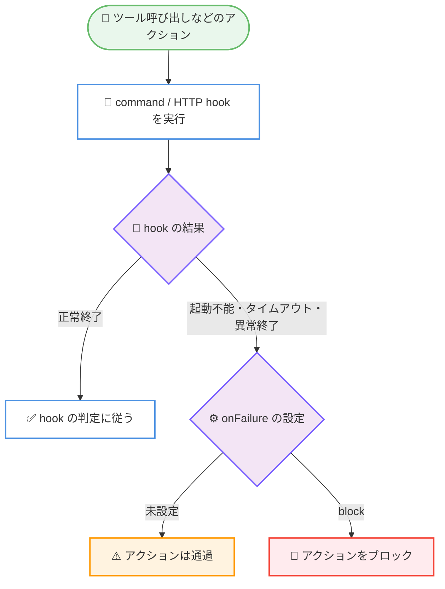
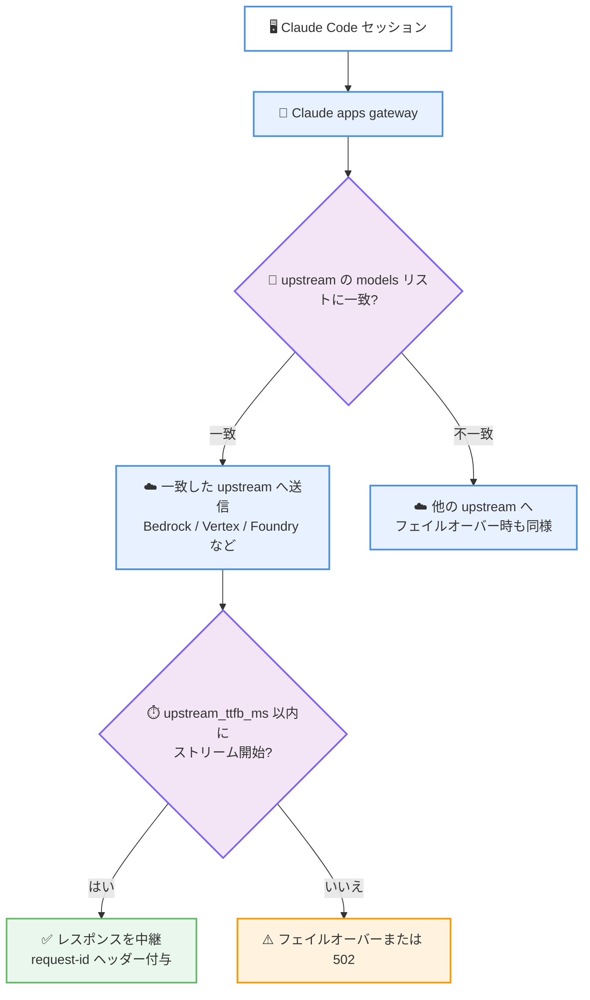

# Claude Code v2.1.294 / v2.1.295: hook の `onFailure: "block"` 追加、Program Status Protocol (OSC 7501) 対応、Claude apps gateway の大幅強化など 2 バージョンで 145 件の変更

## メタデータ

| 項目 | 内容 |
|------|------|
| 発表日 | 2026-10-09 (本日検出。changelog に日付記載なし) |
| ソース | Claude Code Changelog |
| カテゴリ | Claude Code / CLI アップデート |
| 公式リンク | https://github.com/anthropics/claude-code/blob/main/CHANGELOG.md |

## 概要

Claude Code v2.1.294 と v2.1.295 がリリースされた。v2.1.294 は instructions 形式 (自然言語で書く) の `prompt`/`agent` hook の判定を改善する 2 件のみの小規模リリース、v2.1.295 は 143 件 (追加 17 件、修正 97 件、改善 13 件、変更 16 件) を含む大規模リリースである。2 バージョン合計の変更件数は 145 件に上る。

v2.1.295 の最大のトピックは 3 つある。第一に、command hook と HTTP hook に **`onFailure: "block"`** が追加され、hook が起動できない・タイムアウトする・予期しない終了コードで終わる場合に、アクションを素通りさせるのではなくブロックできるようになった。ガードレールとして hook を使う場合の信頼性が大きく向上する。第二に、**Program Status Protocol (OSC 7501)** への対応が追加され、対応するターミナルは Claude Code が「作業中」「ユーザー待ち」「完了」のいずれの状態かを表示できるようになった。第三に、**Claude apps gateway 関連の多数の強化**が行われ、`timeouts.upstream_ttfb_ms` によるストリーム開始時間の制限、upstream ごとの `models` リストによるモデルの振り分け、監査イベントへの `upstream_request_id` の追加などが含まれる。

修正面では、ゲートウェイや Bedrock、Vertex、Foundry が context-1m ベータを拒否した際に `[1m]` モデルの全リクエストが失敗する問題や、`claude -p` のテキスト出力が以前のレスポンスを失う問題、リモート MCP サーバーの再接続まわりの複数の問題など、実運用に直結する修正が多数含まれる。

## 詳細

### 背景

v2.1.294 と v2.1.295 は、Claude Haiku 5.5 を追加した 2026-10-07 の v2.1.293 に続くリリースである。v2.1.294 は instructions 形式 hook の判定精度に絞った修正リリースであり、v2.1.295 はエンタープライズ向けの Claude apps gateway、モッド開発、MCP、ターミナル描画など広い範囲に及ぶ大規模リリースとなっている。changelog 自体に日付の記載はなく、2026-10-09 に検出された。

### 主な変更点

#### 1. v2.1.294: instructions 形式 hook の判定改善 (2 件)

- **`prompt`/`agent` hook のブロック判定の修正**: 「〜するコマンドをブロックする」のような instructions 形式で書かれた `prompt`/`agent` hook が、本来ブロックすべきものを許可してしまう問題を修正
- **Stop / SubagentStop での判定改善**: 「ビルドが壊れていたら続行する」のような instructions 形式で書かれた Stop / SubagentStop の `prompt` hook の判定が改善され、Claude が早期に停止しにくくなった

自然言語で hook を記述するスタイルを使っているチームにとって、ガードレールと停止判定の両面で実効性が高まる修正である。

#### 2. v2.1.295: hook の `onFailure: "block"` の追加

command hook と HTTP hook に `onFailure: "block"` オプションが追加された。これを指定した hook は、以下の場合にアクションを通過させず**ブロック**する。

- hook が起動できない場合
- hook がタイムアウトした場合
- hook が予期しない終了コードで終わった場合

従来は hook 自体の失敗時にアクションが素通りしていたため、セキュリティやポリシーの強制を hook に依存する構成では「hook が壊れたら無防備になる」という弱点があった。fail-close な運用が可能になったことで、ガードレール用途での hook の信頼性が大きく向上する。

#### 3. v2.1.295: Program Status Protocol (OSC 7501) 対応

Program Status Protocol (OSC 7501) のサポートが追加された。このプロトコルを実装するターミナルは、Claude Code が以下のいずれの状態にあるかを表示できる。

- 作業中 (working)
- ユーザーの入力待ち (waiting on you)
- 完了 (done)

複数のセッションやウィンドウを並行運用する場合に、ターミナル側の UI だけで各セッションの状態を把握できるようになる。

#### 4. v2.1.295: Claude apps gateway の強化

エンタープライズ向けの Claude apps gateway に多数の追加・修正・改善が行われた。

**追加:**

- **`timeouts.upstream_ttfb_ms`**: Bedrock、Vertex、Foundry などのクラウド upstream で、ストリームの開始 (最初のバイト到達) までの時間を制限できる。超過した場合はフェイルオーバーするか 502 を返す
- **upstream ごとの `models` リスト**: 各 upstream にオプションの `models` リストを設定でき、リストにあるモデルのみがその upstream に送られる (フェイルオーバー時も適用)。エントリ内の `*` 1 つはワイルドカードとして機能する
- **`upstream_request_id`**: `inference` 監査イベントに、Amazon Bedrock や Anthropic API など upstream 側のリクエスト ID が追加され、サポートケースでの突き合わせが容易になった
- **`request-id` ヘッダー**: 成功した推論レスポンスに `request-id` ヘッダーが付与され、Claude Code テレメトリの `request_id` とゲートウェイの監査ログを一致させられる
- **ユーザー設定での `forceLoginMethod: "gateway"` と `forceLoginGatewayUrl`**: 管理対象設定がないマシンでも、自身のユーザー設定で `/login` を特定のゲートウェイに向けられる

**修正・改善 (抜粋):**

- Bedrock 上のトークンカウントが 1 トークンのモデルリクエストではなく AWS の CountTokens API から取得されるようになった (`/context` や大きなファイル読み込みで使用。利用には `bedrock:CountTokens` の権限付与が必要)
- バックグラウンドリクエストがセッションのモデルではなく Haiku 4.5 を使うようになった (ゲートウェイが Haiku 4.5 を提供しない場合はセッションのモデルにフォールバック)
- AWS の米国地域外の Bedrock リージョンで `models:` に未記載のモデルを自身のリージョンで試行し、拒否時には追加すべきモデル名を表示するようになった
- `availableModels` に記載された Fable モデルが `/model` ピッカーに表示されない問題、管理者の支出ビューが古いグループ情報を表示する問題、`CLAUDE_CODE_DISABLE_NONESSENTIAL_TRAFFIC` が支出上限表示を隠す問題などを修正
- PostgreSQL データベースが読み取り専用の間、30 秒ごとに警告ログを出し、何が失敗しどう復旧するかを示すようになった

#### 5. v2.1.295: モッド・プラグイン開発者向けの追加と修正

- **`$.ui.notify` の追加**: モッドからユーザー自身の通知設定を通じてネイティブ通知を発行できる。どのチャンネルが送信したかも表示される
- **`Button` の子要素**: モッドの `Button` に文字列と `Text` の子要素を持たせられるようになり、リストの 1 行をチップや薄い詳細テキストを内包した 1 つの押下可能要素にできる
- **guard hook のバイパス修正**: モッドの hook に深くネストしたツール入力がエラーなしで切り詰められて渡され、guard が見ていない内容を通過させうる問題を修正。また、プラグインフックワーカーの再起動中にリロード中のモッドが行う呼び出しが、`.catch` を持つ別モッドの guard hook をすり抜ける問題も修正
- **`config.set` hook の尊重**: `/model`、`/fast`、`/output-style` や `/config` での自動更新チャンネル変更が、プラグインの `config.set` hook に確認せず設定を保存していた問題を修正
- **ホットリロードの信頼性**: リロード中やリロード直後数ミリ秒以内の保存が反映されない問題、`constructor` や `prototype` という名前のプラグインオプションが常にデフォルト値になる問題などを修正

#### 6. v2.1.295: その他の主要な修正 (抜粋)

- **`[1m]` モデルの全リクエスト失敗の修正**: ゲートウェイ、Bedrock、Vertex、Foundry が context-1m ベータを拒否した際に `[1m]` モデルの全リクエストが失敗していた問題を修正。拒否された場合はベータなしで再送する
- **`claude -p` の出力欠落の修正**: バックグラウンド作業が別のターンを開始した際に、以前のレスポンスがテキスト出力から失われる問題を修正。各ターンのレスポンスはターン終了時に出力される。あわせて、最後のターン後も `claude -p` が開いたままの場合に、何を待っているかを stderr (ターミナルの場合) に表示する行が追加された
- **リモート MCP の再接続改善**: headless / SDK セッションで 15 秒超の障害後に切断されたままになる問題や、接続直後に切断するサーバーへタイトループで再接続する問題を修正 (繰り返しの切断は最大 30 秒までバックオフ)。エラー応答にネットワークエラー名が含まれていると切断される問題、ページネーションカーソルを繰り返すサーバーに同じページを最大 20 回要求する問題も修正
- **MCP ツールの返すファイルの拡張子**: CSS、JavaScript、XML ファイルが Read ツールの拒否する .bin として保存される問題を修正。フォントやアイコンファイルも固有の拡張子を持つようになった
- **ターミナルのフリーズ修正**: 数万行に及ぶレスポンスで ctrl+c が効かずフリーズする問題、引用のネストが深い返信で数秒のフリーズとギガバイト単位のメモリ消費が起きる問題、非常に長い行や未閉鎖の文字列を含むコードのシンタックスハイライトで数秒〜数分フリーズする問題を修正
- **`CLAUDE_CODE_RETRY_WATCHDOG_MAX_WAIT_MS` の追加**: 無人リトライモード (`CLAUDE_CODE_RETRY_WATCHDOG`) が 429 / 529 エラーを待つ時間の上限を設定できるようになった
- **`/copy` ピッカーに引用テキストを追加**: 下書きメッセージを `>` マーカーなしでコピーできるようになった
- **plugin コマンドの改善**: `claude plugin install` / `enable` / `disable` / `marketplace add` が、書き込み先の設定ファイルが読み込まれない場合に警告するようになった。`claude plugin validate` は README にインストール行がないプラグインに貼り付けるべき行を提示する (終了コードは変更しない)

#### 7. v2.1.295: 動作変更 (Changed) の主なもの

- ツール検索経由で読み込む MCP ツールの説明の上限が 2,048 文字から 16,384 文字に拡大
- サブエージェントが `skills` フィールドからプリロードするスキルは最大 32 個 (各 1 回) に変更。Skill ツールを持つサブエージェントは残りも呼び出せる
- claude.ai コネクタが MCP プロトコルバージョン 2026-07-28 をデフォルトで交渉するようになった (`MCP_PROTOCOL_NEGOTIATION=legacy` でオプトアウト)
- WebSocket (`ws`) MCP サーバーで 16 MiB を超えるメッセージはパースされず接続を閉じるようになった (他のトランスポートと同じ上限)
- モッドがツール実行後にツール呼び出しを拒否した場合、「ツールは実行されたがプラグインが結果を保留した」と表示されるようになった

#### 8. v2.1.295: VSCode・クラウドセッション・Claude Tag・Code Review

- **[VSCode]**: Claude が送るファイルのチャット行が追加され、ファイル名のクリックでエディターに開ける。会話のフォークや Rewind の失敗、ショートカットキーが権限モードまで切り替える問題、2 つの Claude ビュー間でフォーカスが行き来する問題を修正
- **[Cloud sessions]**: アーカイブ解除直後のメッセージに返信がないことがある問題、古いルーティンが保存されたプロンプトを渡さず実行される問題を修正。接続断からの復帰時にアクティビティが一括表示されるようになり、セットアップスクリプト欄もリサイズ可能になった
- **[Claude Tag]**: Slack の設定確認カードの表示時間が 10 分から 30 分に延長。フォークされたスレッドのカードでのリンク表示、`!restart` 後も回り続ける Working ステータスなどを修正
- **[Code Review]**: 再レビューが未解決の指摘が残っているのに「問題なし」と報告する問題を修正し、未解決件数を表示するようになった。プルリクエストが大きな CLAUDE.md 自体を編集している場合にそのルールがスキップされる問題も修正

### 技術的な詳細

#### `onFailure: "block"` による fail-close な hook 運用

従来の command / HTTP hook は、hook 自体が失敗した場合 (起動不能、タイムアウト、予期しない終了コード) にアクションを通過させる fail-open の挙動だった。`onFailure: "block"` を指定すると、hook の失敗時にアクションがブロックされる fail-close の挙動になる。



#### Claude apps gateway のモデルルーティング

upstream ごとの `models` リストと `timeouts.upstream_ttfb_ms` により、ゲートウェイ管理者はモデル単位のルーティングと応答開始時間の SLA をポリシーとして記述できるようになった。



また、`inference` 監査イベントの `upstream_request_id` とレスポンスの `request-id` ヘッダーにより、「Claude Code テレメトリ → ゲートウェイ監査ログ → upstream (Bedrock / Anthropic API) のリクエスト ID」という 3 層のトレーサビリティが揃った。

## 開発者への影響

### 対象

- hook をガードレールやポリシー強制に使っているチーム (`onFailure: "block"` の追加、instructions 形式 hook の判定改善)
- Claude apps gateway を運用するエンタープライズ管理者 (`timeouts.upstream_ttfb_ms`、`models` リスト、`upstream_request_id`、CountTokens API など)
- Bedrock、Vertex、Foundry やゲートウェイ経由で `[1m]` モデルを使う開発者 (context-1m ベータ拒否時の再送修正)
- `claude -p` や SDK で headless 運用をしている開発者 (出力欠落の修正、リモート MCP 再接続の改善、待機理由の表示)
- モッド・プラグイン開発者 (`$.ui.notify`、`Button` の子要素、guard hook のバイパス修正、ホットリロードの信頼性向上)
- OSC 7501 対応ターミナルの利用者 (セッション状態のターミナル表示)
- VSCode 拡張、クラウドセッション、Claude in Slack (Claude Tag)、Code Review の利用者

### 必要なアクション

- **hook でポリシーを強制しているチーム**: セキュリティ上重要な command / HTTP hook には `onFailure: "block"` の指定を検討する。従来は hook の失敗時にアクションが素通りしていた
- **ゲートウェイ管理者**: upstream に `models` リストと `timeouts.upstream_ttfb_ms` を設定し、モデルルーティングと応答開始時間を明示的に管理できる。Bedrock でのトークンカウント改善を使うには `bedrock:CountTokens` を付与する
- **無人運用の利用者**: `CLAUDE_CODE_RETRY_WATCHDOG_MAX_WAIT_MS` で 429 / 529 エラーの待機時間に上限を設けられる
- **モッド開発者**: guard hook が切り詰められた入力を見ていた問題が修正されたため、深くネストした入力を扱う guard の挙動を再確認する。通知には `$.ui.notify` を利用できる

### 移行ガイド (該当する場合)

破壊的変更はない。ただし、以下の挙動変更に注意が必要である。

- claude.ai コネクタの MCP プロトコル交渉がデフォルトで 2026-07-28 になった。問題がある場合は `MCP_PROTOCOL_NEGOTIATION=legacy` で以前の挙動に戻せる
- サブエージェントのスキルのプリロードが最大 32 個に制限された。多数のスキルを指定している場合は、Skill ツール経由の呼び出しに切り替わる
- WebSocket MCP サーバーで 16 MiB 超のメッセージは接続が閉じられるようになった
- ゲートウェイ経由のバックグラウンドリクエストが Haiku 4.5 を使うようになったため、ゲートウェイで Haiku 4.5 を提供しているか確認する (未提供の場合はセッションのモデルにフォールバック)

## コード例

command hook に `onFailure: "block"` を指定する settings.json の例。hook が起動できない、タイムアウトする、または予期しない終了コードで終わった場合に、アクションは通過せずブロックされる。

```json
{
  "hooks": {
    "PreToolUse": [
      {
        "matcher": "Bash",
        "hooks": [
          {
            "type": "command",
            "command": "/path/to/guard-script.sh",
            "onFailure": "block"
          }
        ]
      }
    ]
  }
}
```

## 関連リンク

- [Claude Code Changelog (v2.1.294 / v2.1.295)](https://github.com/anthropics/claude-code/blob/main/CHANGELOG.md)
- [Claude Code v2.1.293 のレポート](./2026-10-07-claude-code-v2-1-293.md)
- [Claude Code 公式ドキュメント](https://code.claude.com/docs)
- [Claude Code の hooks](https://code.claude.com/docs/en/hooks)
- [Claude Code のプラグイン](https://code.claude.com/docs/en/plugins)

## まとめ

Claude Code v2.1.294 と v2.1.295 は、合計 145 件の変更からなるリリース群である。v2.1.294 は instructions 形式の `prompt`/`agent` hook の判定を改善する 2 件に絞ったリリースで、自然言語で書いたガードレールの実効性と Stop 判定の精度を高めた。

v2.1.295 は 143 件の大規模リリースで、hook の `onFailure: "block"` による fail-close なガードレール運用、Program Status Protocol (OSC 7501) によるターミナルでのセッション状態表示、そして `timeouts.upstream_ttfb_ms`・upstream ごとの `models` リスト・`upstream_request_id` を中心とする Claude apps gateway の大幅強化が柱となる。修正面でも、context-1m ベータ拒否時の `[1m]` モデル全リクエスト失敗、`claude -p` の出力欠落、リモート MCP の再接続、ターミナルのフリーズといった実運用に効く問題が多数解消された。hook によるポリシー強制やゲートウェイ運用を行うエンタープライズ環境を中心に、幅広い利用者に更新を推奨できるリリースである。
