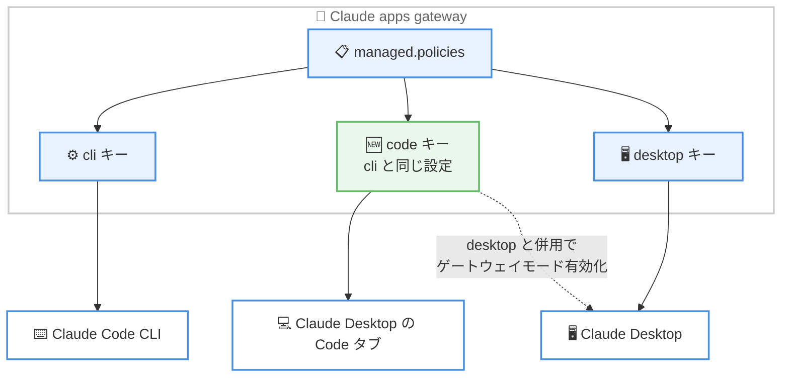

# Claude Code v2.1.296: Claude apps gateway の `code` ポリシーキー、サブエージェントの `autoCompactWindow`、Read ツールの `allow_large` 追加など 79 件の変更

## メタデータ

| 項目 | 内容 |
|------|------|
| 発表日 | 2026-10-09 (GitHub Releases によるリリース日) |
| ソース | Claude Code Changelog |
| カテゴリ | Claude Code / CLI アップデート |
| 公式リンク | https://github.com/anthropics/claude-code/blob/main/CHANGELOG.md |

## 概要

Claude Code v2.1.296 がリリースされた。本バージョンは全 79 件 (追加 8 件、修正 56 件、改善 9 件、更新 2 件、変更 4 件) の変更を含み、同日の v2.1.294 / v2.1.295 に続くリリースである。

追加面では、Claude apps gateway の `managed.policies[]` に **`code` キー**が加わり、Claude Desktop の Code タブにも CLI と同じ設定を適用できるようになったほか、サブエージェントのコンテキスト圧縮タイミングを個別に制御する **`autoCompactWindow`**、ワークフローエージェントのモデルを一括指定する **`CLAUDE_CODE_WORKFLOW_SUBAGENT_MODEL`**、Read ツールが大きなテキストファイルを 1 回で読み切れる **`allow_large`** オプションが追加された。修正面では、`BASH_ARGV0` シェル変数を使った Bash 権限チェックのバイパスを塞ぐセキュリティ修正や、UTF-8 でないファイル (Shift-JIS など) を Edit が壊す問題の修正が重要である。また、Sonnet 5.5 のキャッシュ読み取り価格が $0.20 から **$0.10 (100 万トークンあたり)** に更新され、`/cost` や `--max-budget-usd` の計算に反映された。

## 詳細

### 背景

v2.1.296 は、hook の `onFailure: "block"` や Program Status Protocol 対応を含む大規模リリース v2.1.295 の直後に出たリリースである。本バージョンは新機能の追加よりも修正が中心 (全体の約 7 割) で、エンタープライズ向けの Claude apps gateway と Claude Desktop の統合、サブエージェント制御の細分化、セキュリティと文字エンコーディングまわりの堅牢化が主なテーマとなっている。

### 主な変更点

#### 1. Claude apps gateway の `code` ポリシーキー

Claude apps gateway の `managed.policies[]` に `code` キーが追加された。

- `cli` と同じ設定内容を持ち、**Claude Desktop の Code タブにも適用**される
- `desktop` キーと並べて設定すると、Claude Desktop のゲートウェイモードが有効になる

これまで CLI 向けに整備してきたゲートウェイポリシーを、Claude Desktop 上のコーディング環境にもそのまま展開できるようになり、エンタープライズでの一元管理が進む。あわせて改善として、ゲートウェイ配下の Code タブでセッションを開始できない場合 (マシンがゲートウェイの `code` 設定に対応していない場合を含む)、その理由が返信として表示されるようになった。

#### 2. サブエージェント制御の強化: `autoCompactWindow` と `CLAUDE_CODE_WORKFLOW_SUBAGENT_MODEL`

- **`autoCompactWindow`**: サブエージェントのフロントマターと `--agents` 定義に追加され、サブエージェントがメイン会話のウィンドウよりも**早いタイミングで自動コンパクト (コンテキスト圧縮)** を行えるようになった。大量のファイルを読むサブエージェントのコンテキスト溢れを個別に防げる
- **`CLAUDE_CODE_WORKFLOW_SUBAGENT_MODEL`**: すべてのワークフローエージェントを 1 つのモデルで実行する環境変数。ワークフロー以外のサブエージェントは各自のモデル設定を維持する

このほか、529 (overloaded) エラーのリトライ時のバックオフ最大待機時間を延ばす `CLAUDE_CODE_OVERLOADED_RETRY_MAX_DELAY_MS` も追加された。

#### 3. Read ツールの `allow_large` オプション

Read ツールに `allow_large` オプションが追加された。ファイル全体が必要で、かつコンテキストに余裕がある場合に、通常のサイズ制限を超えるテキストファイルを **1 回の呼び出しで読み切れる**。従来は offset / limit を使った分割読み込みが必要だったケースで、往復回数を減らせる。

#### 4. セキュリティ関連の修正

本バージョンには権限チェックとデータ保護に関する複数の修正が含まれる。

- **Bash 権限バイパスの修正**: `BASH_ARGV0` シェル変数に代入してから利用するコマンドの一部が自動承認されていた問題を修正。該当コマンドは承認を求めるようになった
- **シークレットのマスキング漏れの修正**: 共有トランスクリプトとデバッグログで、値を持たないキーの後に続く値 (シェル文字列内に書かれた JSON を含む) がマスキングされないケースがあった問題を修正
- **Windows: bypass permissions モードでの確認漏れの修正**: Git Bash での `rm -rf /c/Users/<name>` が確認なしで実行されていた問題を修正
- **managed settings の hook の強制力の修正**: `"continue": false` でツール呼び出しを拒否する `PreToolUse` hook と、呼び出しをブロックする managed な `prompt` hook が、呼び出しは拒否するもののターンを終了させていなかった問題を修正。`updatedMCPToolOutput` が一部セッションで適用されない問題も修正

#### 5. ファイル編集とエンコーディングの修正

- **非 UTF-8 ファイルの破壊防止**: Edit と NotebookEdit が、UTF-8 として不正なファイル (Windows-1252、Shift-JIS、GBK) のすべての非 ASCII 文字を置き換えてしまう問題を修正。このようなファイルへの編集は拒否されるようになった。日本語環境で Shift-JIS のレガシーファイルを扱うユーザーには特に重要な修正である
- U+2028 / U+2029 (Unicode の行・段落区切り文字) を含むメッセージが `CLAUDE_CODE_TRANSCRIPT_LOCAL_GC` で保存トランスクリプトから欠落する問題と、`claude purge` が履歴ファイルに残す問題も修正された

#### 6. 価格情報の更新: Sonnet 5.5 のキャッシュ読み取りが $0.10 に

`/cost`、ステータスライン、`--max-budget-usd`、SDK のコスト計算が、**Sonnet 5.5 のキャッシュ読み取りを 100 万トークンあたり $0.10** (従来 $0.20) で計算するようになった。キャッシュ読み取りはコーディングセッションのトークンの大半を占めることが多く、Sonnet 5.5 利用時の表示コストと予算判定が実態に合わせて下がる。

#### 7. その他の修正・改善 (抜粋)

修正は 56 件に及ぶ。上記以外の主なものを挙げる。

- **headless / SDK**: フォルダーで無効化された `.mcp.json` やプラグイン MCP サーバーが、ディレクトリ変更やプラグインリロード後に起動してしまう問題、`/clear` 後に遅延ロードされたプラグインの SessionStart hook 出力が新しい会話に届く問題、`UserPromptSubmit` hook 中の Esc / 割り込みが headless セッションを終了させる問題などを修正
- **ゲートウェイとログイン**: `allowedProviders` に `"gateway"` を含むゲートウェイが、そのゲートウェイをユーザー設定で指定したマシンを締め出す問題、`forceLoginMethod: gateway` で `forceLoginGatewayUrl` がない場合に保存済みサインインが無視される問題 (v2.1.295 のリグレッション) を修正
- **モデルとトークン**: Haiku 5.5 など adaptive thinking のみを受け付けるモデルのトークンカウントが、一部ゲートウェイで失敗し他では budget thinking として数えられていた問題を修正
- **セルフホストランナー**: 登録拒否時に誤解を招くエラーを表示する問題、`--capacity` が 1 を超えるランナーで同一リポジトリの別セッション開始中に git fetch / pull / push が失敗する問題を修正
- **プラグイン・モッド**: `constructor` / `prototype` という名前のマーケットプレイスやシークレットの取り扱い、served `$` メソッドの作業ディレクトリ、リロード後の `$.agent.register` 拒否などを修正
- **Windows**: 約 1 KB を超える PowerShell コマンドが常に許可を求めていた問題を修正し、allow ルールと読み取り専用検出が 32 KB まで適用されるようになった。stdio MCP サーバーのシャットダウン手順も改善 (stdin を先に閉じ、300 ms 待ってから強制終了)
- **改善**: ctrl+o のトランスクリプト表示がコードの多い会話で高速化、`--debug` 出力が hook の所要時間やエージェントファイルの不明なフロントマターフィールドを表示、フルスクリーンモードでマウス下のリンクに下線を表示など

#### 8. 動作変更 (Changed)

- MCP ツール説明 (事前送信分) と MCP サーバー instructions のデフォルト上限が **2,048 文字から 4,096 文字**に拡大
- `←` でセッションをバックグラウンドに移す際、進行中のターンや `!` コマンドは見えないまま完了するのではなく**停止**されるようになった

#### 9. VSCode・Cloud sessions・Claude Tag・Code Review

- **[VSCode] (5 件)**: Claude in Chrome がすべてのセッションでブラウザー操作前に確認するようになった (`@browser` 接続時を含む。サイトをセッションで許可すれば再確認は不要)。`claudeCode.spinnerVerbs` の設定補完、Windows のフルパス形式リンクが開けない問題、reduced motion 設定の尊重、プロンプトキャッシュ時計の表示などを修正
- **[Cloud sessions] (3 件)**: 管理設定の Activity タブにセッション / ランナーのステータスフィルターを追加 (複数選択可)。セルフホストランナー待ちのセッションがすべて同じ待ち順を表示する問題、返信中に送ったメッセージが返信の上に跳ねる問題を修正
- **[Claude Tag] (7 件)**: Claude Tag Admin 権限を持つメンバーが Activity ページの Memory タブでワークスペース / チャンネルのメモリファイルを作成・編集・削除できるようになった。Slack でのフッター表示がスレッド内の最新返信のみに変更。括弧を含む URL のリンク切れ、6 桁の PR 番号を hex カラーと誤認する色見本表示、ランナー移動時の返信消失などを修正
- **[Code Review] (2 件)**: レビュー完了後もプルリクエストのチェックが「in progress」のまま残ることがある問題を修正。管理設定で保存に失敗した理由 (ポリシー制限など) を表示するよう改善

### 技術的な詳細

#### Claude apps gateway のポリシーと Claude Desktop の Code タブ

`managed.policies[]` の `code` キーにより、ゲートウェイ管理者は CLI と Claude Desktop の Code タブに同一のポリシーを配布できる。



#### `autoCompactWindow` によるサブエージェントの早期コンパクト

メイン会話とサブエージェントは従来同じウィンドウ設定で自動コンパクトが発動していた。`autoCompactWindow` をサブエージェント定義に指定すると、そのサブエージェントだけメイン会話より早いタイミングでコンパクトを発動できる。大量のログ解析やコードベース探索など、コンテキスト消費の激しいサブエージェントが途中で破綻するのを防ぎつつ、メイン会話の設定には影響を与えない。

## 開発者への影響

### 対象

- Claude apps gateway を運用し、Claude Desktop の Code タブも管理したいエンタープライズ管理者 (`code` ポリシーキー)
- コンテキスト消費の大きいサブエージェントやワークフローを定義している開発者 (`autoCompactWindow`、`CLAUDE_CODE_WORKFLOW_SUBAGENT_MODEL`)
- 大きなテキストファイルを扱うセッションの利用者 (Read ツールの `allow_large`)
- Bash の権限ルールや bypass permissions モードを使うチーム (`BASH_ARGV0` バイパス修正、Git Bash の `rm -rf` 確認漏れ修正)
- Shift-JIS など非 UTF-8 のレガシーファイルを含むリポジトリで作業する開発者 (Edit の破壊防止)
- Sonnet 5.5 を利用し `/cost` や `--max-budget-usd` でコスト管理している利用者 (キャッシュ読み取り $0.10 への更新)
- headless / SDK 運用、セルフホストランナー、Windows、VSCode 拡張、Cloud sessions、Claude in Slack (Claude Tag)、Code Review の利用者

### 必要なアクション

- **ゲートウェイ管理者**: Claude Desktop の Code タブにもポリシーを適用する場合は、`managed.policies[]` に `code` キーを追加する。`desktop` と併せて設定するとゲートウェイモードが有効になる
- **サブエージェント定義者**: コンテキスト溢れが起きやすいサブエージェントには `autoCompactWindow` の指定を検討する。ワークフローのモデルを統一したい場合は `CLAUDE_CODE_WORKFLOW_SUBAGENT_MODEL` を設定する
- **権限ルールを管理するチーム**: `BASH_ARGV0` を使うコマンドが自動承認されなくなったため、該当パターンを許可していた運用がある場合は承認プロンプトの増加に備える
- **非 UTF-8 ファイルを扱う開発者**: 該当ファイルへの Edit / NotebookEdit は拒否されるようになった。編集が必要な場合は事前に UTF-8 へ変換するか、別の手段を使う
- **529 エラーが頻発する環境の利用者**: `CLAUDE_CODE_OVERLOADED_RETRY_MAX_DELAY_MS` でリトライの最大待機時間を延ばせる

### 移行ガイド (該当する場合)

破壊的変更はないが、以下の挙動変更に注意が必要である。

- 非 UTF-8 ファイルへの Edit / NotebookEdit は成功しなくなった (従来は文字化けを起こしながら成功していた)
- `BASH_ARGV0` を利用する一部コマンドが自動承認から承認プロンプトに変わった
- `←` によるバックグラウンド移動時、進行中のターンや `!` コマンドは停止されるようになった
- MCP ツール説明の事前送信上限がデフォルト 4,096 文字に拡大されたため、説明の長い MCP サーバーではコンテキスト消費がわずかに増える可能性がある

## コード例

サブエージェントのフロントマターで `autoCompactWindow` を指定する例。このサブエージェントはメイン会話よりも早いタイミングで自動コンパクトを行う (値は例示であり、詳細は公式ドキュメントを参照)。

```markdown
---
name: log-analyzer
description: 大量のログファイルを解析するサブエージェント
autoCompactWindow: 100000
---

ログファイルを読み込み、エラーパターンを抽出して要約する。
```

ワークフローエージェントのモデルを一括指定する環境変数の例。

```bash
export CLAUDE_CODE_WORKFLOW_SUBAGENT_MODEL=haiku
```

## 関連リンク

- [Claude Code Changelog (v2.1.296)](https://github.com/anthropics/claude-code/blob/main/CHANGELOG.md)
- [Claude Code v2.1.294 / v2.1.295 のレポート](./2026-10-09-claude-code-v2-1-294-v2-1-295.md)
- [Claude Code 公式ドキュメント](https://code.claude.com/docs)
- [Claude Code のサブエージェント](https://code.claude.com/docs/en/sub-agents)
- [Claude Code の設定](https://code.claude.com/docs/en/settings)

## まとめ

Claude Code v2.1.296 は、全 79 件の変更からなる修正中心のリリースである。追加面では、Claude apps gateway の `code` ポリシーキーによる Claude Desktop の Code タブへのポリシー展開、サブエージェントの `autoCompactWindow` と `CLAUDE_CODE_WORKFLOW_SUBAGENT_MODEL` によるサブエージェント制御の細分化、Read ツールの `allow_large` による大きなファイルの一括読み込みが柱となる。

修正面では、`BASH_ARGV0` を使った Bash 権限チェックのバイパスやシークレットのマスキング漏れといったセキュリティ修正、非 UTF-8 ファイルを Edit が壊す問題の防止、managed settings の hook の強制力の修正など、安全性と堅牢性に直結する項目が多い。Sonnet 5.5 のキャッシュ読み取り価格が $0.10 に更新されたことで、コスト表示と予算判定も実態に合うようになった。ゲートウェイを運用するエンタープライズ環境と、サブエージェントを多用する開発者を中心に、更新を推奨できるリリースである。
