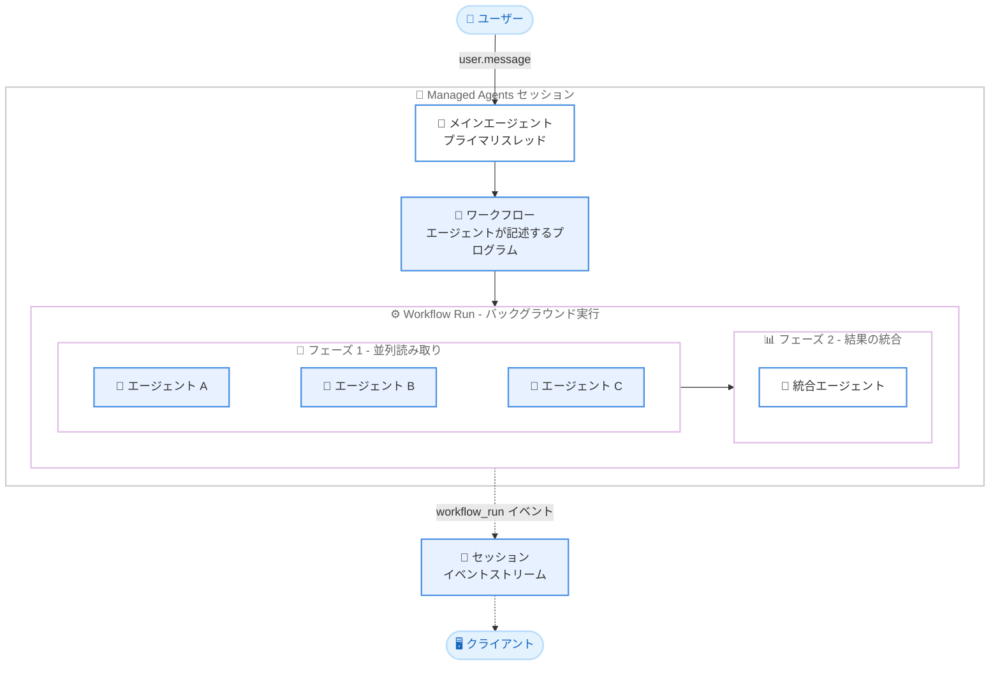

# Managed Agents のダイナミックワークフローがベータ提供開始

## メタデータ

| 項目 | 内容 |
|------|------|
| 発表日 | 2026-10-09 |
| ソース | Claude API リリースノート |
| カテゴリ | API 更新 / Managed Agents (ベータ) |
| 公式リンク | https://platform.claude.com/docs/en/release-notes/overview |

## 概要

2026 年 10 月 9 日、Claude Managed Agents にダイナミックワークフロー (dynamic workflows) 機能がベータとして追加された。エージェント自身が「ワークフロー」、すなわち多数のエージェントをフェーズ単位で実行し、その結果を統合するプログラムを記述できるようになる。サーバーはこのプログラムをバックグラウンドで「workflow run」として実行する。

この機能により、数百件のドキュメントレビューや多数のソースのクロスチェックなど、作業単位が多い大規模タスクを 1 つのエージェントセッションで処理できる。実行中もメインのエージェントは作業を継続したりターンを終了したりでき、進捗はセッションのイベントストリーム上の `workflow_run.*` イベントで追跡できる。

## 詳細

### 背景

Managed Agents はベータ機能 (ベータヘッダー: `managed-agents-2026-04-01`) として提供されており、これまでエージェントが他のエージェントに作業を渡す手段としては**サブエージェントへの委任**が中心だった。サブエージェントは委任が 1 階層までで、セッションあたりの子スレッド数も最大 25 に制限されるため、作業単位が非常に多いタスクには適していなかった。

公式ドキュメントによると、ダイナミックワークフローではエージェントが Claude の直接関与なしにエージェント群をオーケストレーションするプログラムを書き、コンテキストと結果はエージェント間でプログラム的に受け渡される。これによりメインセッションのスレッドは解放され、ユーザーとの対話や実行中ワークフローの進捗確認に専念できる。

### 主な変更点

リリースノートおよび公式ドキュメントに基づく変更点は以下のとおり。

- **ワークフローの記述と実行**: エージェントが多数のエージェントをフェーズ単位で実行し、結果を統合するワークフローを作成できる。サーバーはバックグラウンドで workflow run として実行する
- **有効化方法**: エージェント定義の `multiagent` フィールドに `{"type": "multiagent_20261001", "workflows": {"type": "enabled"}}` を設定する。`multiagent_20261001` タイプでは `subagents` と `workflows` はデフォルトで両方有効
- **実行開始の制御**: run の開始に追加の API 呼び出しは不要。エージェント自身がいつ run を開始するかを判断するため、システムプロンプトでその条件を指示する
- **進捗の追跡**: 各 run はセッションのイベントストリーム上の `workflow_run.*` イベントで追跡できる

### 技術的な詳細

**run の構造**: workflow run は以下の 3 層で構成される。

1. **Run**: 1 つのワークフローの実行全体
2. **フェーズ**: 「契約書を読む」のような名前付きステージ。フェーズイベントで進捗を追跡する
3. **エージェントスレッド**: フェーズ内で実行される各エージェントは、それぞれ独立したセッションスレッドで動作する

**ワークフローができること**: 複数エージェントの同時実行 (ファンアウト)、エージェント間での結果の受け渡し、フェーズ内での繰り返しや条件分岐 (例: レビューが通るまでドラフトを修正させる) をプログラムとして表現できる。

**使用するエージェント**: ワークフロー自身が定義するインラインエージェント、`workflows.predefined_agents` にリストした事前定義エージェント (最大 20 件)、またはその両方を使用できる。インラインエージェントはセッションを実行するエージェントと同じモデルを使用する。

**主なイベント**: `workflow_run.created` (run の開始、`phases` を含む)、`workflow_run.status_running`、`workflow_run.status_idle`、`workflow_run.phase_started` / `workflow_run.phase_ended`、`workflow_run.status_ended` (`result` を含む最後のイベント)、`workflow_run.error`。

**主な制限**: ドキュメントに記載されている制限は以下のとおり。

| 制限項目 | 値 |
|---------|-----|
| 1 つの run で同時に動作するスレッド数 | 64 |
| 1 つの run が起動できるエージェント総数 | 1,000 |
| run の有効期間 | デフォルト 24 時間 (エージェントが短縮可能) |
| セッションで同時にオープンできる run 数 | デフォルト 10 |

run 内のエージェントが使用するトークンはセッションの他のトークンと同様に各モデルの料金で課金され、セッションバジェットにカウントされる。バジェット到達時はオープン中のすべての run が一時停止する。

## 開発者への影響

### 対象

Managed Agents (ベータ) を利用して、大量の作業単位を持つタスク (監査、マイグレーション、ディープリサーチ、クロスチェックなど) を自動化したい開発者。

### 必要なアクション

以下のアクションが必要となる。

1. API リクエストに `anthropic-beta: managed-agents-2026-04-01` ヘッダーを付与する
2. エージェント定義の `multiagent` フィールドに `{"type": "multiagent_20261001", "workflows": {"type": "enabled"}}` を設定する。ダイナミックワークフローのみを使う場合は `"subagents": {"type": "disabled"}` を追加する
3. システムプロンプトに、いつワークフロー run を開始すべきかの指示を記述する
4. セッション作成時にセッションバジェットを設定し、run を含むセッション全体の支出に上限を設ける (既存セッションには後から追加できない)
5. クライアント側で `workflow_run.*` イベントを処理し、run の進捗と結果を追跡する

### 移行ガイド (該当する場合)

既存エージェントの `multiagent.type` を変更する場合は、公式ドキュメントの coordinator タイプからの移行手順を事前に確認する必要がある。また、`ant__` プレフィックスはシステム予約となるため、この名前で始まるカスタムツールを持つエージェントは、ダイナミックワークフローを有効化する同じ更新内でツールの名前変更または削除が必要となる (そうしないと 400 エラーで更新が失敗する)。

## コード例

公式ドキュメントに記載されている契約書レビューエージェントの作成例。

```bash
curl -fsS https://api.anthropic.com/v1/agents \
  -H "x-api-key: $ANTHROPIC_API_KEY" \
  -H "anthropic-version: 2023-06-01" \
  -H "anthropic-beta: managed-agents-2026-04-01" \
  -H "content-type: application/json" \
  -d @- <<'EOF'
{
  "name": "Contract Reviewer",
  "model": "claude-opus-5-5",
  "system": "You review contracts. When you're asked to review more than a few contracts, start a workflow run that reads them in parallel and combines the findings. Review one or two contracts yourself, without a run.",
  "tools": [{"type": "agent_toolset_20260401"}],
  "multiagent": {"type": "multiagent_20261001", "workflows": {"type": "enabled"}}
}
EOF
```

## アーキテクチャ図



## 関連リンク

- [Claude API リリースノート](https://platform.claude.com/docs/en/release-notes/overview)
- [Dynamic workflows (Multiagent orchestration)](https://platform.claude.com/docs/en/managed-agents/multiagent-orchestration#dynamic-workflows)
- [Turn on dynamic workflows](https://platform.claude.com/docs/en/managed-agents/multiagent-orchestration#turn-on-dynamic-workflows)
- [Workflow runs](https://platform.claude.com/docs/en/managed-agents/workflow-runs)
- [Session threads](https://platform.claude.com/docs/en/managed-agents/session-threads)
- [Budgets](https://platform.claude.com/docs/en/managed-agents/budgets)

## まとめ

ダイナミックワークフローの追加により、Managed Agents は「エージェントがエージェント群をプログラムとしてオーケストレーションする」段階に進んだ。サブエージェント委任との最大の違いは、エージェントが作業の分割・並列化・統合をワークフローとして一度に記述し、サーバーがバックグラウンドで実行する点にある。これにより、数百件規模の作業単位を含むタスクをメインスレッドを塞がずに処理できる。

一方で、run 内のすべてのエージェントがトークンを消費するため、セッションバジェットの設定が実質的に必須となる。また、ベータ機能であるため、同時スレッド数の上限 (64) などは今後変更される可能性がある点に留意が必要となる。
